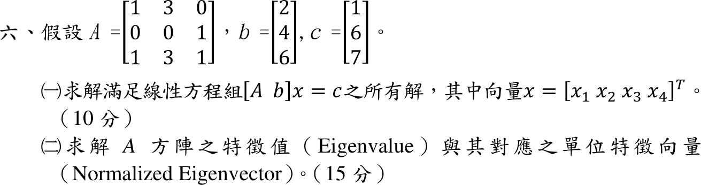

# 112 年第 6 題｜線性方程組與特徵值

## 已知與所求

\(A=\begin{bmatrix}1&3&0\\0&0&1\\1&3&1\end{bmatrix}\)、\(b=[2,4,6]^T\)、\(c=[1,6,7]^T\)。（一）求 \([A\ b]x=c\) 的所有解，\(x=[x_1\ x_2\ x_3\ x_4]^T\)；（二）求 \(A\) 的特徵值與單位特徵向量。

## 考場標準作答

### （一）所有解

\[
\left[\begin{array}{cccc|c}1&3&0&2&1\\0&0&1&4&6\\1&3&1&6&7\end{array}\right]
\xrightarrow{R_3-R_1-R_2}
\left[\begin{array}{cccc|c}1&3&0&2&1\\0&0&1&4&6\\0&0&0&0&0\end{array}\right]
\]
秩 2、相容，自由變數 \(x_2=t,\ x_4=s\)：\(x_3=6-4s\)、\(x_1=1-3t-2s\)。
\[
\boxed{x=(1-3t-2s,\ t,\ 6-4s,\ s)^T},\qquad t,s\in\mathbb R
\]

### （二）特徵值與單位特徵向量

\[
\det(\lambda I-A)=\lambda(\lambda^2-2\lambda-2)=0\Rightarrow\boxed{\lambda=0,\ 1-\sqrt3,\ 1+\sqrt3}
\]
解 \((A-\lambda I)v=0\)：\(\lambda\ne0\) 時取 \(v_3=1\)，第 2 列給 \(v_2=1/\lambda\)，第 1 列給 \(v_1=3v_2/(\lambda-1)\)；\(\lambda=0\) 時 \(v_3=0\)、\(v_1=-3v_2\)。正規化得
\[
\boxed{\begin{aligned}
\lambda=0&:\ \hat v_0=\tfrac{1}{\sqrt{10}}(-3,\ 1,\ 0)^T\\
\lambda=1-\sqrt3&:\ \hat v_-=\tfrac{1}{\sqrt{5+2\sqrt3}}\left(\tfrac{3+\sqrt3}{2},\ -\tfrac{1+\sqrt3}{2},\ 1\right)^T\\
\lambda=1+\sqrt3&:\ \hat v_+=\tfrac{1}{\sqrt{5-2\sqrt3}}\left(\tfrac{3-\sqrt3}{2},\ \tfrac{\sqrt3-1}{2},\ 1\right)^T
\end{aligned}}
\]
（各向量可差一個正負號。）

## 驗算

- （一）代回三列：\(1-3t-2s+3t+2s=1\)；\(6-4s+4s=6\)；第三列 \(=\) 前兩列和 \(=7\)。
- （二）\(\sum\lambda=0+2=2=\operatorname{tr}A\)，\(\prod\lambda=0=\det A\)（\(R_3=R_1+R_2\)）；例如 \(\lambda=1+\sqrt3\)：\(A v_+\) 第三分量 \(\tfrac{3-\sqrt3}{2}+\tfrac{3\sqrt3-3}{2}+1=1+\sqrt3=\lambda\cdot1\)。

## 失分點

- \([A\ b]\) 是 \(3\times4\) 增廣係數，\(b\) 是第 4 欄的係數而非右端；誤當成 \(Ax=b\) 會解錯題。
- 第三列與前兩列相依，只有兩條獨立方程，解集須含兩個自由參數。
- 單位特徵向量要除以範數 \(\sqrt{10}\)、\(\sqrt{5\pm2\sqrt3}\)，只給未正規化向量會扣分。
