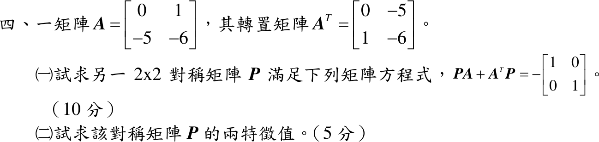

# 113 年第 4 題｜Lyapunov 矩陣方程

## 已知與所求

\(A=\begin{bmatrix}0&1\\-5&-6\end{bmatrix}\)，求對稱 \(P\) 使 \(PA+A^TP=-I\)（一）；求 \(P\) 的兩特徵值（二）。

## 考場標準作答

### （一）對稱矩陣 \(P\)

令 \(P=\begin{bmatrix}p_1&p_2\\p_2&p_3\end{bmatrix}\)：
\[
PA+A^TP=
\begin{bmatrix}
-10p_2&p_1-6p_2-5p_3\\
p_1-6p_2-5p_3&2p_2-12p_3
\end{bmatrix}=\begin{bmatrix}-1&0\\0&-1\end{bmatrix}.
\]
\(-10p_2=-1\Rightarrow p_2=\tfrac1{10}\)；\(2p_2-12p_3=-1\Rightarrow p_3=\tfrac1{10}\)；\(p_1=6p_2+5p_3=\tfrac{11}{10}\)：
\[
\boxed{P=\frac1{10}\begin{bmatrix}11&1\\1&1\end{bmatrix}}
\]

### （二）特徵值

\[
\det(P-\lambda I)=\lambda^2-\frac{6}{5}\lambda+\frac{1}{10}=0
\Rightarrow
\boxed{\lambda=\frac{6\pm\sqrt{26}}{10}\approx1.1099,\ 0.0901}
\]
兩者皆正，\(P\) 正定（與 \(A\) 的特徵值 \(-1,-5\) 皆在左半平面一致）。

## 驗算

- 回代：\(-10(0.1)=-1\)；\(1.1-0.6-0.5=0\)；\(0.2-1.2=-1\)，三元素皆符合 \(-I\)。
- 特徵值和 \(=1.2=\operatorname{tr}P=\tfrac{11+1}{10}\)，積 \(=\tfrac{36-26}{100}=0.1=\det P=\tfrac{11-1}{100}\)。

## 失分點

- 只算 \(PA\) 漏掉 \(A^TP\)，非對角元素會少一半而解出錯的 \(p_1\)。
- 右端是 \(-I\)：對角方程應為 \(-10p_2=-1\)，寫成 \(+1\) 會得 \(p_2<0\)。
