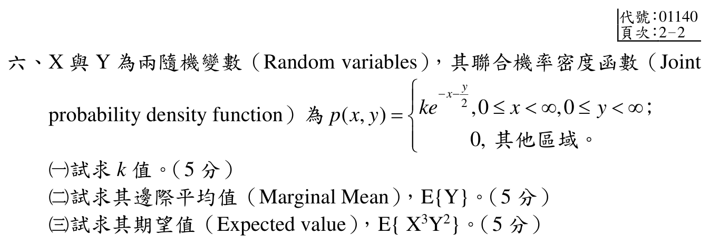

# 113 年第 6 題｜聯合機率密度

## 考場標準作答

\[
1=k\int_0^\infty e^{-x}\,dx\int_0^\infty e^{-y/2}\,dy=2k
\quad\Longrightarrow\quad
\boxed{k=\frac12}.
\]

因

\[
p_Y(y)=\int_0^\infty \frac12e^{-x-y/2}\,dx
=\frac12e^{-y/2},\qquad y\ge0,
\]

故 \(Y\sim\operatorname{Exp}(1/2)\)，

\[
\boxed{E[Y]=2}.
\]

另有 \(p_X(x)=\int_0^\infty \frac12e^{-x-y/2}\,dy=e^{-x}\)（\(x\ge0\)）。因此在 \(x,y\ge0\) 上 \(p(x,y)=p_X(x)p_Y(y)\)，所以 \(X,Y\) 獨立：

\[
E[X^3Y^2]=E[X^3]E[Y^2]
=\frac{3!}{1^3}\frac{2!}{(1/2)^2}
=\boxed{48}.
\]

## 得分點拆解

- （一，5 分）用總機率為 1 正規化，兩個積分上下限都必須是 \(0\) 到 \(\infty\)。
- （二，5 分）先積掉 \(x\) 得 \(p_Y(y)\)，再由指數分布平均值或直接積分求 \(E[Y]\)。
- （三，5 分）先明示聯合密度可分解，才能使用獨立性拆開混合動差；最後寫出階乘動差並得 48。

## 完整教學推導

官方 crop 的題目給出
\[
p(x,y)=
\begin{cases}
k e^{-x-y/2},&x\ge0,\ y\ge0,\\
0,&\text{其他區域},
\end{cases}
\]
並要求 \(k\)、邊際平均 \(E[Y]\) 與期望值 \(E[X^3Y^2]\)。

先由總機率為 1 求 \(k\)：
\[
1=k\int_0^\infty e^{-x}\,dx\int_0^\infty e^{-y/2}\,dy
=k(1)(2),
\]
故
\[
\boxed{k=\frac12}.
\]

代回後，邊際密度為
\[
p_X(x)=\int_0^\infty \frac12e^{-x-y/2}\,dy=e^{-x},\qquad x\ge0,
\]
\[
p_Y(y)=\int_0^\infty \frac12e^{-x-y/2}\,dx=\frac12e^{-y/2},\qquad y\ge0.
\]
因而 \(X\sim\operatorname{Exp}(1)\)、\(Y\sim\operatorname{Exp}(1/2)\)，且聯合密度可分解為 \(p_X(x)p_Y(y)\)。所以
\[
E[Y]=\frac{1}{1/2}=\boxed{2}.
\]

對指數分布 \(\operatorname{Exp}(\lambda)\)，有 \(E[X^n]=n!/\lambda^n\)。因此
\[
E[X^3]=\frac{3!}{1^3}=6,\qquad
E[Y^2]=\frac{2!}{(1/2)^2}=8.
\]
利用獨立性，
\[
E[X^3Y^2]=E[X^3]E[Y^2]=6\cdot8=\boxed{48}.
\]

## 獨立驗算

直接對聯合密度積分可得
\[
E[X^3Y^2]=\frac12
\left(\int_0^\infty x^3e^{-x}\,dx\right)
\left(\int_0^\infty y^2e^{-y/2}\,dy\right)
=\frac12(6)(16)=48,
\]
與邊際密度分解法一致；且 \(\int p_X=\int p_Y=1\)。

## 常見失分

- 把官方題目的 \(e^{-x-y/2}\) 誤讀成 \(e^{-x-2y}\)。
- 把「邊際平均值」誤作「只求邊際密度」，沒有繼續計算 \(E[Y]\)。
- 尚未證明 \(p(x,y)=p_X(x)p_Y(y)\) 就直接寫 \(E[X^3Y^2]=E[X^3]E[Y^2]\)。
- 指數分布使用 rate 參數；\(Y\) 的 rate 是 \(1/2\)，不是 2。
