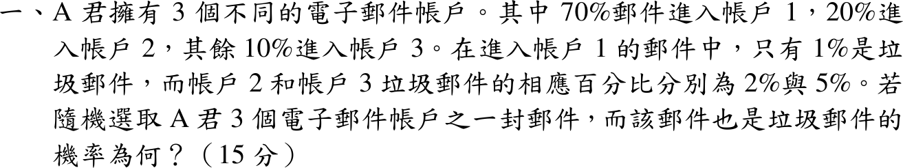

# 114 年第 1 題｜垃圾郵件的機率

## 考場標準作答

令 \(A_i\) 為郵件進入帳戶 \(i\)、\(S\) 為垃圾郵件。三帳戶互斥且涵蓋所有郵件，由全機率公式
\[
\begin{aligned}
P(S)&=\sum_{i=1}^{3}P(S\mid A_i)P(A_i)=(0.01)(0.70)+(0.02)(0.20)+(0.05)(0.10)\\
&=0.007+0.004+0.005=\boxed{0.016=1.6\%}
\end{aligned}
\]

## 驗算

每 1000 封郵件：帳戶 1 有 700 封含 7 封垃圾、帳戶 2 有 200 封含 4 封、帳戶 3 有 100 封含 5 封，共 16 封，即 \(16/1000\)；且 \(1.6\%\) 落在條件率 \(1\%\)–\(5\%\) 之間，符合加權平均。

## 失分點

- 三個條件率直接平均得 \((1+2+5)/3=2.67\%\)，漏乘帳戶比例 \(0.7,0.2,0.1\)。
