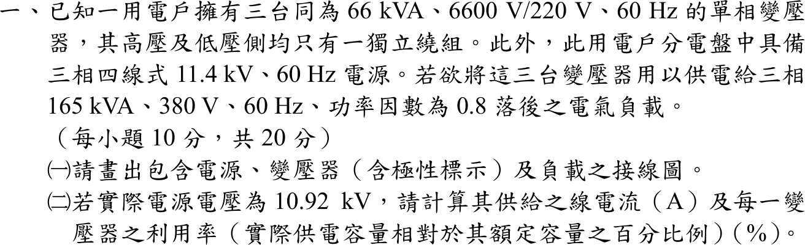

# 📝 107 年電機工程技師｜電機機械逐題詳解

> 本頁由題級 canonical 筆記組合；每題保留官方裁切圖、校驗狀態與可追溯的推導。

## 題目導覽
- [[#一、107 年電機機械第 1 題｜三相變壓器供電與利用率|第 1 題：三相變壓器供電與利用率]]
- [[#二、107 年電機機械第 2 題｜直流串激電動機工作點|第 2 題：直流串激電動機工作點]]
- [[#三、107 年電機機械第 3 題｜感應電動機戴維寧等效與轉矩|第 3 題：感應電動機戴維寧等效與轉矩]]
- [[#四、107 年電機機械第 4 題｜同步發電機無載電壓與滿載效率|第 4 題：同步發電機無載電壓與滿載效率]]
- [[#五、107 年電機機械第 5 題｜感應電動機 V/f 控制|第 5 題：感應電動機 V/f 控制]]

---

## 一、107 年電機機械第 1 題｜三相變壓器供電與利用率

> 題級識別：EE-107-04-1
> canonical 來源：[[canonical/EE-107-04-1.md]]
> 題級校驗狀態：needs_manual_review
> [!WARNING] 本題仍有官方資料缺口或事件定義歧義；請以 canonical 條件式解答為準。



### 已知與所求

三台單相 66 kVA、6600/220 V、60 Hz 變壓器（高低壓側各一獨立繞組），電源為三相四線 11.4 kV、60 Hz，負載為三相 165 kVA、380 V、PF 0.8 落後。求（一）含電源、變壓器（標極性）與負載的接線圖；（二）實際電源 10.92 kV 時的供給線電流及每台變壓器利用率。

### 考場標準作答

#### （一）接線圖

電源相電壓 \(11.4\,\mathrm{kV}/\sqrt3=6.58\ \mathrm{kV}\approx6600\ \mathrm V\)，負載相電壓 \(380/\sqrt3=219.4\ \mathrm V\approx220\ \mathrm V\)，三台均接 Y–Y，電源中性線接一次側中性點：
\[
\boxed{\text{一次側 Y（中性點接電源中性線）、二次側 Y，三台 H1、X1 同名端（\(\bullet\)）同側，三相 380 V 負載接 a、b、c}}
\]

```text
  電源 3φ4W 11.4 kV             一次側 Y                 二次側 Y             負載
  A ───────────────────●H1 [T1] H2─┐              ●X1 [T1] X2─┐      a ─┐
  B ───────────────────●H1 [T2] H2─┼── N（接電源 N）  ●X1 [T2] X2─┼─ n    b ─┤ 165 kVA
  C ───────────────────●H1 [T3] H2─┘              ●X1 [T3] X2─┘      c ─┘ 380 V
                                                   X1 端依序接 a、b、c
  （ ● 為極性點：每台一次 H1 與二次 X1 同向；每台額定 6600/220 V，變比 30）
```

#### （二）線電流與利用率

本題以「負載維持 165 kVA」計算（見條件與疑義）。實際線電壓 \(V_{LL}=10.92\ \mathrm{kV}\)：
\[
I_L=\frac{S_L}{\sqrt3V_{LL}}=\frac{165\times10^3}{\sqrt3(10.92\times10^3)}
\]
\[
\boxed{I_L=8.724\ \mathrm A}
\]
三台平均分擔，每台 \(165/3=55\ \mathrm{kVA}\)：
\[
\boxed{U=\frac{55}{66}=0.8333=83.33\%}
\]

### 驗算

以二次側反推（安匝平衡）：Y–Y 變比 30，二次線電壓 \(10\,920/30=364.0\ \mathrm V\)，二次線電流 \(165\,000/(\sqrt3\cdot364.0)=261.7\ \mathrm A\)，折回一次側 \(261.7/30=8.724\ \mathrm A\)，與主解相同；261.7 A 低於每台額定二次電流 \(66\,000/220=300\ \mathrm A\)，8.724 A 低於額定一次電流 10 A。總容量 \(3\times66=198\ \mathrm{kVA}\ge165\ \mathrm{kVA}\)。

### 失分點

- 接成 Δ 或 V–V：Y 一次側相電壓 6.58 kV 才對應 6600 V 繞組。
- 線電流用單相公式 \(S/V\) 或漏除 \(\sqrt3\)，得 15.1 A。
- 把功因 0.8 乘進視在功率：利用率以 kVA 計，應為 55/66，不是 44/66。

### 條件與疑義

題目沒有說明電壓降到 10.92 kV 時負載是定視在功率還是定阻抗。若負載為額定 165 kVA、380 V 的定阻抗，二次線電壓為 \(10\,920/30=364.0\ \mathrm V\)，負載實際只吃 \(S=165(364/380)^2=151.40\ \mathrm{kVA}\)，則 \(I_L=151.40\times10^3/(\sqrt3\cdot10\,920)=8.005\ \mathrm A\)，利用率 \(151.40/198=76.46\%\)。另外，「其供給之線電流」也可解讀為二次側供給負載的線電流：定 165 kVA 為 261.7 A，定阻抗為 \(151.40\times10^3/(\sqrt3\cdot364.0)=240.1\ \mathrm A\)。本解主答案採定 165 kVA 的一次側線電流；各模型答案不同，須依命題口徑擇一。

---

## 二、107 年電機機械第 2 題｜直流串激電動機工作點

> 題級識別：EE-107-04-2
> canonical 來源：[[canonical/EE-107-04-2.md]]
> 題級校驗狀態：verified


### 已知與所求

串激式直流電動機：額定電壓 \(V_t=50\ \mathrm V\)、電樞加串激場總電阻 \(R_{AS}=0.05\ \Omega\)、每極線圈 \(N_p=25\) 匝。端電壓維持額定，輕載與重載電樞電流分別為 10 A 與 200 A。由 1200 rpm 磁化曲線，這兩個電流下的內電勢（1200 rpm）分別為 \(E_{a0}=40\ \mathrm V\)、\(48\ \mathrm V\)。求兩種狀況的轉速與感應轉矩。

### 考場標準作答

工作點反電勢 \(E_a=V_t-I_aR_{AS}\)；磁化曲線給的是同一電流（同一磁通）在 1200 rpm 的 \(E_{a0}\)，因 \(E_a\propto n\)，\(n=1200\,E_a/E_{a0}\)；感應（電磁）轉矩 \(T=E_aI_a/\omega_m\)。題目問感應轉矩，不另扣題面未給的旋轉損失。\(N_p\) 在已有磁化曲線時不需使用。

#### 輕載 \(I_a=10\ \mathrm A\)

\[
E_a=50-10(0.05)=49.5\ \mathrm V,\qquad
\boxed{n=1200\frac{49.5}{40}=1485\,\mathrm{rpm}}
\]
\[
\omega_m=\frac{2\pi(1485)}{60}=155.51\ \mathrm{rad/s},\qquad
\boxed{T=\frac{49.5(10)}{155.51}=3.183\,\mathrm{N\cdot m}}
\]

#### 重載 \(I_a=200\ \mathrm A\)

\[
E_a=50-200(0.05)=40.0\ \mathrm V,\qquad
\boxed{n=1200\frac{40.0}{48}=1000\,\mathrm{rpm}}
\]
\[
\omega_m=\frac{2\pi(1000)}{60}=104.72\ \mathrm{rad/s},\qquad
\boxed{T=\frac{40.0(200)}{104.72}=76.394\,\mathrm{N\cdot m}}
\]

### 驗算

轉矩只與磁通和電流有關，可由磁化曲線直接算：\(T=E_{a0}I_a/\omega_0\)，\(\omega_0=2\pi(1200)/60=125.66\ \mathrm{rad/s}\)。輕載 \(40(10)/125.66=3.183\ \mathrm{N\cdot m}\)，重載 \(48(200)/125.66=76.394\ \mathrm{N\cdot m}\)，與上式相同。

### 失分點

- 把磁化曲線的 40 V、48 V 當成工作點反電勢，漏掉 \(V_t-I_aR_{AS}\) 的 0.5 V 與 10 V 壓降。
- 把兩工作點視為同一磁通（例如重載也用 40 V 曲線值），重載會得 \(n=1200(40/40)=1200\ \mathrm{rpm}\)，正確應用 48 V 曲線值得 1000 rpm。
- 以 rpm 直接除 \(P\) 求轉矩，漏 \(2\pi/60\)。

---

## 三、107 年電機機械第 3 題｜感應電動機戴維寧等效與轉矩

> 題級識別：EE-107-04-3
> canonical 來源：[[canonical/EE-107-04-3.md]]
> 題級校驗狀態：verified


### 已知與所求

三相、4 極、Y 接感應電動機，額定 380 V、60 Hz、1755 rpm。定子側單相戴維寧等效：\(V_{TH}=210\ \mathrm V\)、\(Z_{TH}=0.2+j4.0\ \Omega\)；轉子單相等效阻抗 \(Z_R=0.8/s+j4.0\ \Omega\)。求（一）\(s=5\%\) 的轉子轉速與感應轉矩；（二）完成起動並穩定運轉時所能帶動的最大負載轉矩（轉子摩擦忽略）。

### 考場標準作答

#### （一）\(s=5\%\)

\[
n_s=\frac{120(60)}{4}=1800\ \mathrm{rpm},\qquad
\boxed{n=(1-0.05)(1800)=1710\ \mathrm{rpm}},\qquad \omega_s=188.50\ \mathrm{rad/s}
\]
\[
I_2'=\frac{210}{|0.2+16+j8.0|}=\frac{210}{18.068}=11.623\ \mathrm A
\]
\[
\boxed{T_{ind}=\frac{3I_2'^2(0.8/s)}{\omega_s}=\frac{3(11.623)^2(16)}{188.50}=34.40\text{ N}\cdot\text{m}}
\]

#### （二）最大負載轉矩

穩定運轉的最大轉矩即崩潰轉矩（摩擦忽略，負載轉矩 ＝ 感應轉矩）：
\[
s_{max}=\frac{R_2'}{\sqrt{R_{TH}^2+(X_{TH}+X_2')^2}}=\frac{0.8}{\sqrt{0.2^2+8^2}}=0.0999
\]
\[
\boxed{T_{max}=\frac{3V_{TH}^2}{2\omega_s\left[R_{TH}+\sqrt{R_{TH}^2+(X_{TH}+X_2')^2}\right]}=\frac{3(210)^2}{2(188.50)(0.2+8.0025)}=42.78\text{ N}\cdot\text{m}}
\]

### 驗算

直接以電路在 \(s=0.0999\) 計算：\(R_2'/s=8.0025\ \Omega\)，\(|Z|=\sqrt{8.2025^2+8^2}=11.457\ \Omega\)，\(I_2'=18.33\ \mathrm A\)，\(T=3(18.33)^2(8.0025)/188.50=42.78\ \mathrm{N\cdot m}\)。在 \(0<s\le1\) 掃描 \(T(s)\)，最大值同在 \(s\approx0.10\)。堵轉（\(s=1\)）時 \(T=8.64\ \mathrm{N\cdot m}\)，說明「完成起動」後才可帶到 42.78 N·m。

### 失分點

- 同步轉速用 3600 rpm（忘記 4 極），或轉子轉速誤寫 1755 rpm（那是額定轉速，不是 5% 滑差）。
- 氣隙功率漏用 \(R_2'/s=16\ \Omega\)，改用 0.8 Ω。
- 最大轉矩把 \(R_{TH}\) 或 \(X_2'\) 漏掉；\(s_{max}\) 的分母要含 \(X_{TH}+X_2'=8\ \Omega\)。

---

## 四、107 年電機機械第 4 題｜同步發電機無載電壓與滿載效率

> 題級識別：EE-107-04-4
> canonical 來源：[[canonical/EE-107-04-4.md]]
> 題級校驗狀態：verified


### 已知與所求

三相 6 極 Y 接同步發電機：380 V、100 kVA、60 Hz，\(X_s=0.1\ \Omega\)，電阻不計；磨擦與風損合計 3 kW，鐵損 2 kW，其餘損失不計。供 PF 0.8 落後平衡負載且滿載端電壓 380 V、60 Hz，激磁電流與轉速維持不變。求（一）無載端電壓；（二）滿載效率。

### 考場標準作答

#### （一）無載端電壓

\[
V_\phi=\frac{380}{\sqrt3}=219.39\ \mathrm V,\qquad
I_a=\frac{100\,000}{\sqrt3(380)}=151.93\ \mathrm A,\qquad \underline I_a=151.93\angle-36.87^\circ\ \mathrm A
\]
\[
\underline E_f=\underline V_\phi+jX_s\underline I_a=219.39+15.193\angle53.13^\circ=228.51+j12.155\ \mathrm V,\qquad |E_f|=228.83\ \mathrm V
\]
激磁電流與轉速不變，無載時端電壓＝\(E_f\)：
\[
\boxed{V_{L,0}=\sqrt3(228.83)=396.35\,\mathrm V}
\]

#### （二）滿載效率

\[
P_{out}=100(0.8)=80\ \mathrm{kW},\qquad P_{in}=80+3+2=85\ \mathrm{kW}
\]
\[
\boxed{\eta=\frac{80}{85}=94.12\%}
\]

### 驗算

純量公式：\(E_f=\sqrt{(V_\phi+X_sI_a\sin\varphi)^2+(X_sI_a\cos\varphi)^2}=\sqrt{(219.39+9.116)^2+12.155^2}=228.83\ \mathrm V\)。功率角檢查：\(\delta=\tan^{-1}(12.155/228.51)=3.04^\circ\)，\(3V_\phi E_f\sin\delta/X_s=80.0\ \mathrm{kW}\)，與輸出功率相同。

### 失分點

- 把 PF 0.8 落後的 \(jX_sI_a\) 當成與 \(V_\phi\) 同相或反向，只做代數相加：\(219.39+15.19=234.6\ \mathrm V\)，無載電壓變成 406 V。
- 計入電樞銅損：題目已明示電樞電阻與銅損皆不計，效率分母只加 3 kW＋2 kW。
- 無載電壓忘記乘回 \(\sqrt3\)，答成 228.83 V（相電壓）。

---

## 五、107 年電機機械第 5 題｜感應電動機 V/f 控制

> 題級識別：EE-107-04-5
> canonical 來源：[[canonical/EE-107-04-5.md]]
> 題級校驗狀態：verified


### 已知與所求

三相 4 極感應電動機，額定 200 V、50 Hz、10 kW（輸入功率），變頻器採固定 V/f，各頻率轉差率固定 \(s=5\%\)。（一）額定電壓、頻率、輸入功率且能量轉換效率 90% 時的轉子轉速與扭力；（二）頻率調為 30 Hz 時的輸入電壓與轉子轉速。

### 考場標準作答

#### （一）額定頻率

\[
n_s=\frac{120(50)}{4}=1500\ \mathrm{rpm},\qquad
\boxed{n=(1-0.05)(1500)=1425\,\mathrm{rpm}}
\]
能量轉換效率 90%，機械輸出 \(P_m=0.90(10)=9.0\ \mathrm{kW}\)（題目未另給機械損，視為軸功率）：
\[
\omega_m=\frac{2\pi(1425)}{60}=149.23\ \mathrm{rad/s},\qquad
\boxed{T=\frac{9000}{149.23}=60.31\ \mathrm{N\cdot m}}
\]

#### （二）30 Hz

V/f 固定：
\[
\boxed{V_2=200\cdot\frac{30}{50}=120\,\mathrm V}
\]
\[
n_{s2}=\frac{120(30)}{4}=900\ \mathrm{rpm},\qquad
\boxed{n_2=(1-0.05)(900)=855\,\mathrm{rpm}}
\]

### 驗算

氣隙功率法：\(P_{ag}=P_m/(1-s)=9000/0.95=9473.7\ \mathrm W\)，\(T=P_{ag}/\omega_s=9473.7/157.08=60.31\ \mathrm{N\cdot m}\)，與軸功率法相同。V/f 檢查：\(200/50=120/30=4\ \mathrm{V/Hz}\)，轉差率 \(855/900=0.95\)。

### 失分點

- 把 10 kW 當軸功率（漏乘效率 90%）得 67.01 N·m；或用 1500 rpm 當轉子轉速得 57.30 N·m。
- 以電壓與頻率的平方成比例（或 \(V\propto f^2\)）算 \(V_2\)；固定 V/f 是一次方比例。
- 30 Hz 轉差率改變：題目明示各頻率 \(s\) 固定為 5%。

---
