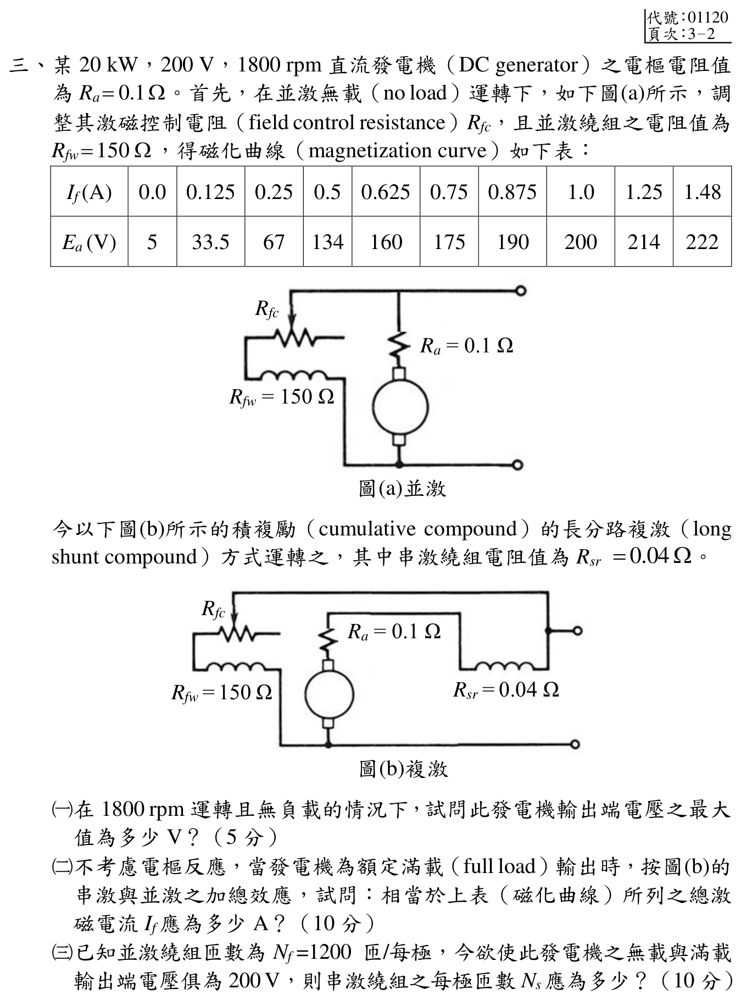

# 📝 111 年電機工程技師｜電機機械逐題詳解

> 本頁由題級 canonical 筆記組合；每題保留官方裁切圖、校驗狀態與可追溯的推導。

## 題目導覽
- [[#一、111 年電機機械第 1 題｜環形鐵心電感與提高電感值的方法|第 1 題：環形鐵心電感與提高電感值的方法]]
- [[#二、111 年電機機械第 2 題｜繞線式感應馬達轉矩與轉差率|第 2 題：繞線式感應馬達轉矩與轉差率]]
- [[#三、111 年電機機械第 3 題｜複激直流發電機磁化曲線|第 3 題：複激直流發電機磁化曲線]]
- [[#四、111 年電機機械第 4 題｜同步發電機電壓調整率與短路比|第 4 題：同步發電機電壓調整率與短路比]]
- [[#五、111 年電機機械第 5 題｜同步電容器功率因數改善|第 5 題：同步電容器功率因數改善]]

---

## 一、111 年電機機械第 1 題｜環形鐵心電感與提高電感值的方法

> 題級識別：EE-111-04-1
> canonical 來源：[[canonical/EE-111-04-1.md]]
> 題級校驗狀態：verified

### 官方題目與幾何讀值

官方裁切圖給出環形鐵磁材料的導磁係數 \(\mu\)、繞組匝數 \(N\)、平均半徑 \(r\)，以及圓形截面直徑 \(2a\)。題目要求依材料與幾何結構提出四種提高電感值的方法。

### 電感公式推導

在均勻、線性、無明顯漏磁且沒有額外氣隙的環形磁路近似下，平均磁路長度與截面積為

\[
\ell_m\approx2\pi r,\qquad A=\pi a^2.
\]

由安培定律

\[
H\ell_m=Ni,
\qquad B=\mu H,
\]

可得磁通

\[
\Phi=BA=\mu\frac{Ni}{\ell_m}A.
\]

磁通鏈結 \(\lambda=N\Phi\)，故

\[
L=\frac{\lambda}{i}
 =\frac{\mu N^2A}{\ell_m}
 =\frac{\mu N^2(\pi a^2)}{2\pi r}
 =\boxed{\frac{\mu N^2a^2}{2r}}.
\]

同樣結果可由磁阻交叉檢查：

\[
\mathcal{R}_m=\frac{\ell_m}{\mu A},
\qquad L=\frac{N^2}{\mathcal{R}_m}.
\]

### 四種提高電感值的方法

由

\[
L=\frac{\mu N^2A}{\ell_m}
\]

逐項可得：

1. **增加繞組匝數 \(N\)**：在其他條件不變時 \(L\propto N^2\)；匝數加倍，理想線性近似下電感變為四倍。
2. **選用較高導磁率 \(\mu\) 的材料**：在未飽和、頻率與損耗可接受的工作範圍內，\(L\propto\mu\)。材料必須依工作頻率、磁滯損與飽和特性選擇，不能只以材料名稱判定。
3. **增加磁路截面積 \(A\)**：加大鐵心截面；本圖為圓形截面，因此 \(A=\pi a^2\)，使截面半徑 \(a\) 增加會使 \(L\propto a^2\)。
4. **縮短平均磁路長度 \(\ell_m\)**：在不犧牲繞組空間與絕緣的前提下減小平均半徑 \(r\)，可使 \(L\propto1/r\)。若實際結構另有氣隙，則減少氣隙長度也會降低總磁阻；但本官方圖本身未畫出氣隙，不能把「減少氣隙」當成圖中既有尺寸的唯一答案。

### 校驗結論

官方圖的 \(2a\) 已正確轉成截面半徑 \(a\)，平均磁路長度使用 \(2\pi r\)，因此公式為 \(L=\mu N^2a^2/(2r)\)。上述四個方法分別對應 \(N\)、\(\mu\)、\(A\) 與 \(\ell_m\) 的單調變化，且每項均由公式回代確認會提高電感值；本題可標為 `verified`。

---

## 二、111 年電機機械第 2 題｜繞線式感應馬達轉矩與轉差率

> 題級識別：EE-111-04-2
> canonical 來源：[[canonical/EE-111-04-2.md]]
> 題級校驗狀態：verified

### 官方題目與條件

三相、\(60\,\mathrm{Hz}\)、四極繞線式感應馬達的機械轉矩關係為

\[
T_{\mathrm{mech}}(s)=
\frac{207.63s}{s^2+0.0925s+0.0382}\,\mathrm{N\cdot m}.
\]

題目要求：負載轉矩為 \(100\,\mathrm{N\cdot m}\) 時求轉速；轉子電阻加倍時求新轉速；以及使轉速降至 \(1700\,\mathrm{rpm}\) 所需的 \(R_2'/R_2\)。

### (一) 負載為 \(100\,\mathrm{N\cdot m}\) 的轉速

四極、\(60\,\mathrm{Hz}\) 的同步轉速為

\[
n_s=\frac{120f}{P}=\frac{120(60)}{4}=1800\,\mathrm{rpm}.
\]

穩態運轉時 \(T_{\mathrm{mech}}=100\,\mathrm{N\cdot m}\)，故

\[
100=\frac{207.63s}{s^2+0.0925s+0.0382},
\]

\[
100s^2-198.38s+3.82=0.
\]

兩根為

\[
s=\frac{198.38\pm\sqrt{198.38^2-4(100)(3.82)}}{200}
 =0.0194466\quad\text{或}\quad1.96435.
\]

馬達驅動負載的正常感應運轉需 \(0<s<1\)，所以取 \(s_1=0.0194466\)；另一根會導致負轉速，不是本題的馬達工作點。於是

\[
n_1=n_s(1-s_1)=1800(1-0.0194466)=1764.996\approx\boxed{1765\,\mathrm{rpm}}.
\]

回代檢查：

\[
\frac{207.63(0.0194466)}{(0.0194466)^2+0.0925(0.0194466)+0.0382}
 =100.000\,\mathrm{N\cdot m}.
\]

### (二) \(R_2\) 加倍

題目附帶的轉矩式由感應馬達等效電路得到，其轉子電阻只以 \(R_2/s\) 出現：

\[
T_{\mathrm{mech}}=\frac{1}{\omega_s}
\frac{3V_{1,\mathrm{eq}}^2(R_2/s)}{(R_{1,\mathrm{eq}}+R_2/s)^2+(X_{1,\mathrm{eq}}+X_2)^2}.
\]

在負載轉矩相同、其他參數不變時，為保持同一轉矩工作點，\(R_2/s\) 必須保持不變。因此 \(s/R_2\) 為常數。當 \(R_2'=2R_2\) 時

\[
s_2=2s_1=2(0.0194466)=0.0388932.
\]

\[
n_2=1800(1-0.0388932)=1730.0\,\mathrm{rpm}.
\]

所以轉速下降

\[
\Delta n=n_2-n_1=1730.0-1765.0\approx\boxed{-35.0\,\mathrm{rpm}}.
\]

### (三) 目標轉速 \(1700\,\mathrm{rpm}\)

目標轉差率為

\[
s_3=1-\frac{1700}{1800}=\frac{1}{18}=0.0555556.
\]

由同一負載轉矩下 \(s/R_2\) 不變：

\[
\frac{R_2'}{R_2}=\frac{s_3}{s_1}
 =\frac{0.0555556}{0.0194466}=2.85683\approx\boxed{2.857}.
\]

### 校驗結論

三個子題均使用官方裁切圖中的轉矩式與額定頻率／極數；二次方程的非物理解已排除，轉矩方程與同步轉速均回代一致。答案為 \(1765\,\mathrm{rpm}\)、\(1730\,\mathrm{rpm}\)（下降約 \(35\,\mathrm{rpm}\)）及 \(R_2'/R_2=2.857\)。

---

## 三、111 年電機機械第 3 題｜複激直流發電機磁化曲線

> 題級識別：EE-111-04-3
> canonical 來源：[[canonical/EE-111-04-3.md]]
> 題級校驗狀態：verified

### 考場標準作答

#### （一）1800 rpm 無載最大端電壓（5 分）

令場控電阻 \(R_{fc}=0\) 以求最大值，並忽略無載時約 1.5 A 流經少匝串激繞組所帶來的極小附加磁動勢。長分路無載時 \(I_a=I_f\)，故

\[
V_t=150I_f,\qquad E_a=V_t+I_f(R_a+R_{sr})=150.14I_f.
\]

以磁化表最後兩點線性插值求交點，得到 \(I_f=1.4782\,\mathrm A\)：

\[
\boxed{V_{0,\max}=150I_f=221.73\,\mathrm V}
\]

（若依表格讀值作近似，可答約 222 V。）

#### （二）額定滿載的等效總激磁電流（10 分）

\[
I_L=\frac{20\,000}{200}=100\,\mathrm A,\qquad
I_a=100+I_{f,sh},\qquad
E_a=200+0.14(100+I_{f,sh})=214+0.14I_{f,sh}\,\mathrm V.
\]

第（二）題本身未給場控電阻 \(R_{fc}\)，故精確的 \(I_{f,sh}\) 未定；依表格解析度，\(E_a\) 在 214 V 附近，應答 \(\boxed{I_{f,eq}\approx1.25\,\mathrm A}\)。若接續採用第（三）題指定的無載與滿載同為 200 V 條件，則 \(I_{f,sh}\approx1.0\,\mathrm A\)、\(E_a\approx214.14\,\mathrm V\)，線性插值得 \(I_{f,eq}\approx1.254\,\mathrm A\)。後者是附加條件下的精細近似，不是第（二）題單獨給出的唯一精確值。

#### （三）串激繞組匝數（10 分）

\[
N_fI_{f,eq}=N_fI_{f,sh}+N_sI_a,
\]

\[
\boxed{N_s\approx\frac{1200(1.254-1.000)}{101}=3.02\ \text{匝/極}
\approx3\ \text{匝/極}}.
\]

### 得分點拆解

- （一）無載仍有並激場電流，故端電壓不是直接等於磁化表的 222 V；要與場路電阻線求交點。
- （二）額定負載電流為 100 A，長分路電樞電流還要加並激場電流；未給場控電阻時先以 \(E_a=214+0.14I_{f,sh}\) 定位表格，不能擅自宣稱 1.254 A 是唯一精確值。
- （三）積複激的串、並激磁動勢相加，使用安匝平衡求 \(N_s\)。
- 磁化表讀值允許以最近點作考場近似，但要清楚標示插值值與近似值。

### 完整教學推導

#### 官方題目與磁化曲線

某 \(20\,\mathrm{kW},200\,\mathrm{V},1800\,\mathrm{rpm}\) 直流發電機，\(R_a=0.1\,\Omega\)，並激繞組 \(R_{fw}=150\,\Omega\)。官方表格在 \(1800\,\mathrm{rpm}\) 給出

| \(I_f\) (A) | 0.0 | 0.125 | 0.25 | 0.5 | 0.625 | 0.75 | 0.875 | 1.0 | 1.25 | 1.48 |
|---:|---:|---:|---:|---:|---:|---:|---:|---:|---:|---:|
| \(E_a\) (V) | 5 | 33.5 | 67 | 134 | 160 | 175 | 190 | 200 | 214 | 222 |

改接官方圖 (b) 的長分路積複激方式，串激繞組電阻為 \(R_{sr}=0.04\,\Omega\)，並激與串激磁動勢相加。

| $I_f\text{ (A)}$ | 0.0 | 0.125 | 0.25 | 0.5 | 0.625 | 0.75 | 0.875 | 1.0 | 1.25 | 1.48 |
| :---: | :---: | :---: | :---: | :---: | :---: | :---: | :---: | :---: | :---: | :---: |
| $E_a\text{ (V)}$ | 5 | 33.5 | 67 | 134 | 160 | 175 | 190 | 200 | 214 | 222 |

今以下圖(b)所示的積複勵（cumulative compound）的長分路複激（long shunt compound）方式運轉之，其中串激繞組電阻值為 $R_{sr} = 0.04\ \Omega$。
* **(一)** 求 1800 rpm、無載時的最大輸出端電壓。
* **(二)** 不考慮電樞反應，額定滿載輸出時，求相當於磁化曲線的總激磁電流。
* **(三)** 已知 \(N_f=1200\) 匝／極，若無載與滿載端電壓均為 \(200\,\mathrm{V}\)，求串激繞組匝數 \(N_s\)。

#### （一）無載最大端電壓

#### 無載端電壓的內阻修正（優先採用）

長分路複激在外部無載時仍有並激場電流，故 \(I_a=I_f\)，且

\[
V_t=150I_f,\qquad E_a=V_t+I_f(R_a+R_{sr})=150.14I_f.
\]

以官方表格最後兩點線性插值

\[
E_a(I_f)=214+\frac{8}{0.23}(I_f-1.25)
\]

得 \(I_f=1.478204\,\mathrm A\)，所以

\[
\boxed{V_{0,\max}=150I_f=221.731\,\mathrm V}.
\]

原段落的 \(222\,\mathrm V\) 是忽略 \(R_a+R_{sr}\) 壓降的教材近似上限，不是完整端電壓。

#### （二）滿載的等效總激磁電流

額定端功率與電壓給出負載電流

\[
I_L=\frac{20{,}000}{200}=100\,\mathrm{A}.
\]

長分路接法中，串激繞組位於電樞輸出主路，因此

\[
I_a=I_L+I_{f,sh}.
\]

第（二）題未給場控電阻，故 \(I_{f,sh}=200/(150+R_{fc})\) 未知；由 \(R_{fc}\ge0\) 可知 \(0<I_{f,sh}\le4/3\,\mathrm A\)，因而 \(214<E_a\le214.187\,\mathrm V\)。磁化表最近點為 214 V／1.25 A。若為第（三）題進一步採用「無載與滿載端電壓均為 200 V」的設定，忽略小電樞壓降及無載串激磁動勢的一階近似使 \(I_{f,sh}\approx1.0\,\mathrm A\)、\(R_{fc}\approx50\,\Omega\)。於是

\[
I_a=100+1=101\,\mathrm{A},
\]

\[
E_a=V_t+I_a(R_a+R_{sr})
 =200+101(0.1+0.04)=214.14\,\mathrm{V}.
\]

由表格，\(E_a=214\,\mathrm{V}\) 的資料點對應 \(I_{f,\mathrm{eq}}=1.25\,\mathrm{A}\)；線性插值到 \(214.14\,\mathrm{V}\) 則為

\[
I_{f,\mathrm{eq}}
 =1.25+\frac{214.14-214}{222-214}(1.48-1.25)
 =1.2540\,\mathrm{A}.
\]

因此第（二）題以表格最近點作答為 \(\boxed{I_{f,\mathrm{eq}}\approx1.25\,\mathrm{A}}\)；\(\boxed{1.254\,\mathrm{A}}\) 是沿用第（三）題設定後的插值近似。

#### （三）平複激串激匝數

平複激要求滿載時總等效磁動勢等於磁化曲線所需值。以第 (二) 題的場控設定及線性插值結果：

\[
N_fI_{f,\mathrm{eq}}=N_fI_{f,sh}+N_sI_a.
\]

故

\[
N_s=\frac{N_f(I_{f,\mathrm{eq}}-I_{f,sh})}{I_a}
 =\frac{1200(1.2540-1.0000)}{101}
 =3.02\,\text{匝/極}.
\]

若依考試表格最近點取 \(I_{f,\mathrm{eq}}=1.25\,\mathrm{A}\)，則

\[
N_s=\frac{1200(1.25-1.00)}{101}=2.970\approx3\,\text{匝/極}.
\]

### 獨立驗算

只有第（三）題明定無載與滿載端電壓均為 200 V；第（二）題單獨作答只取磁化表的約 1.25 A，不把第（三）題條件倒灌成唯一精確值。以下回代採第（三）題的一階近似 \(I_{f,sh}=1.0\,\mathrm A\) 與相鄰點線性插值；其用途是檢查三匝附近的串激繞組可補足滿載壓降。

把 \(N_s=3.02\) 回代磁動勢式：

\[
I_{f,sh}+\frac{N_s}{N_f}I_a
=1.000+\frac{3.02}{1200}(101)
=1.2542\,\mathrm A,
\]

與磁化表插值所需的 \(1.254\,\mathrm A\) 一致；再以 \(E_a=214.14\,\mathrm V\) 扣除內部壓降 \(101(0.14)=14.14\,\mathrm V\)，端電壓回到 200 V。

### 常見失分

- 無載時直接把磁化表最大內生電勢 222 V 當端電壓，忽略場電流造成的內阻壓降。
- 長分路滿載時只取 \(I_a=I_L=100\,\mathrm A\)，漏加 1 A 並激場電流。
- 串激與並激為積複激卻把磁動勢相減。
- 由表格插值後仍把 \(I_{f,eq}\) 當實際並激支路電流；它是並、串激合成的等效激磁電流。

---

## 四、111 年電機機械第 4 題｜同步發電機電壓調整率與短路比

> 題級識別：EE-111-04-4
> canonical 來源：[[canonical/EE-111-04-4.md]]
> 題級校驗狀態：reference_book_verified

### 參考書主解（reference_book evidence）

依使用者提供的參考書：

\[
I_r=\frac{25\,\mathrm{MVA}}{\sqrt3\times11\,\mathrm{kV}}
=1312.16\angle-31.8^\circ\,\mathrm{A},
\]
\[
E_f=10710.78\angle27.94^\circ\,\mathrm{V/相},
\qquad
\boxed{\mathrm{VR}=68.87\%}.
\]

由參考書的 OCC/SCC 慣例，額定電壓所需場電流為
\(\boxed{I_{f,\mathrm{OCC}}=200\,\mathrm{A}}\)；
\(Z_b=(11\,\mathrm{kV})^2/25\,\mathrm{MVA}=4.84\,\Omega\)、
\(X_{s,pu}=4.5/4.84=0.93\)，故
\(\boxed{I_{f,\mathrm{SCC}}=186\,\mathrm{A}}\)。

以上為參考書慣例下的主要答案；參考書 evidence 不等同官方公布答案。

### 官方題面界線（不作主要答案）

額定相量與 (X_s) 可直接回代電壓調整率；OCC／SCC 的場電流則依參考書曲線慣例保留，官方題圖未附完整曲線資料。

### 官方題目與條件

三相 Y 接、\(11\,\mathrm{kV}\) 線電壓、\(60\,\mathrm{Hz}\)、\(25\,\mathrm{MVA}\) 的圓桶式轉子同步發電機，每相飽和同步電抗為 \(X_s=4.5\,\Omega\)。場電流 \(I_f=200\,\mathrm{A}\) 時，機組以額定電壓、額定電流向 \(0.85\) 落後負載供電。官方提示為 \(X_{s,\mathrm{pu}}=1/\mathrm{SCR}\)。

### (一) 電壓調整率

額定相電壓與線電流為

\[
V_\phi=\frac{11{,}000}{\sqrt{3}}=6350.85296\,\mathrm{V},
\qquad
I_a=\frac{25\times10^6}{\sqrt{3}(11{,}000)}=1312.15970\,\mathrm{A}.
\]

\(0.85\) 落後的功率因數角為

\[
\theta=\cos^{-1}(0.85)=31.78833^\circ,
\]

故以端電壓為參考相量

\[
\underline I_a=1312.15970\angle(-\theta)
 =1115.33575-j691.22301\,\mathrm{A}.
\]

忽略電樞電阻，發電機相量關係為

\[
\underline E=\underline V_\phi+jX_s\underline I_a.
\]

代入 \(X_s=4.5\,\Omega\)：

\[
\begin{aligned}
\underline E
 &=6350.85296+j4.5(1115.33575-j691.22301)\\
 &=9461.35653+j5019.01086\,\mathrm{V},\\
|\underline E|&=10710.16981\,\mathrm{V}.
\end{aligned}
\]

場電流固定時，空載端電壓（忽略電樞電阻）等於此場電流所建立的內生電壓 \(|E|\)，因此以該值計算電壓調整率：

\[
\mathrm{VR}=\frac{|E|-V_\phi}{V_\phi}\times100\%
 =\frac{10710.16981-6350.85296}{6350.85296}\times100\%
 =\boxed{68.6414\%}.
\]

### (二) OCC 上產生額定電壓所需的場電流

若額外採用「在此工作區間 OCC 的 \(E\) 與 \(I_f\) 可按比例縮放」的線性近似，則

\[
I_{f,\mathrm{OCC}}=200\frac{V_\phi}{|E|}
 =200\frac{6350.85296}{10710.16981}
 =\boxed{118.595\,\mathrm{A}}.
\]

這個比例換算不是由官方裁切圖中的實際 OCC 曲線讀出的；若考慮磁飽和，必須有 OCC 數據或曲線才能得到唯一的 \(I_{f,\mathrm{OCC}}\)。

### (三) SCC 上產生額定電流所需的場電流

三相基準阻抗為

\[
Z_{\mathrm{base}}=\frac{V_{LL}^2}{S_{3\phi}}
 =\frac{11{,}000^2}{25\times10^6}=4.84\,\Omega.
\]

因此

\[
X_{s,\mathrm{pu}}=\frac{X_s}{Z_{\mathrm{base}}}
 =\frac{4.5}{4.84}=0.9297521.
\]

依官方提示 \(X_{s,\mathrm{pu}}=1/\mathrm{SCR}\)，

\[
\mathrm{SCR}=\frac{1}{0.9297521}=1.0755556.
\]

在同樣採用線性比例的 OCC/SCC 場電流近似下，

\[
I_{f,\mathrm{SCC}}=X_{s,\mathrm{pu}}I_{f,\mathrm{OCC}}
 =0.9297521(118.5948)
 =\boxed{110.264\,\mathrm{A}}.
\]

### 校驗界線

原始官方第 3-3 頁已逐像素檢查：題目下方只有 SCR 提示，沒有 OCC 或 SCC 的繪圖、座標刻度或可讀插值點。因此第（二）、（三）小題不能從目前題圖取得唯一曲線讀值。

第 (一) 題由官方明確給出的 \(X_s\)、額定 MVA、電壓及功率因數可完整重算；第 (二)、(三) 題的場電流依參考書 OCC／SCC 慣例列出，官方裁切圖未附完整曲線資料，故不宣稱為官方曲線可獨立讀出的唯一精確值。

---

## 五、111 年電機機械第 5 題｜同步電容器功率因數改善

> 題級識別：EE-111-04-5
> canonical 來源：[[canonical/EE-111-04-5.md]]
> 題級校驗狀態：verified

### 題目與模型假設

三相工廠以線電壓 $V_L=2300\,\mathrm V$ 供電，負載實功率 $P=3000\,\mathrm{kW}$、功率因數 $0.85$ 落後。以同步機作同步電容器，將總功率因數改善至 1.0；題目給「同步阻抗」單一數值 $1.6\,\Omega$，依同步機題的標準簡化，以下將其視為每相同步電抗 $X_s=1.6\,\Omega$，忽略電樞電阻。若製造商另給顯著電阻，應改用完整複阻抗相量式。

### (一) 同步機額定 kVA

原負載相角

$$
\theta=\cos^{-1}(0.85)=31.7883^\circ,
\qquad
\tan\theta=\frac{\sqrt{1-0.85^2}}{0.85}=0.619744.
$$

需由同步電容器提供的超前無效功率為

$$
Q_c=P\tan\theta
 =3000(0.619744)=1859.23\,\mathrm{kvar}.
$$

同步電容器不輸出實功率，故其額定表觀容量至少為

$$
\boxed{S_{sc}=|Q_c|=1859.23\,\mathrm{kVA}\approx1.86\,\mathrm{MVA}}.
$$

### (二) 輸電電纜線電流

安裝前總視在功率為

$$
S_{before}=\frac{P}{0.85}=3529.41\,\mathrm{kVA},
$$

因此

$$
I_{before}=\frac{S_{before}}{\sqrt3V_L}
 =\frac{3.52941\times10^6}{\sqrt3(2300)}
 =886.02\,\mathrm A.
$$

功因修正至 1 後，電纜只需供應實功率：

$$
I_{after}=\frac{P}{\sqrt3V_L}
 =\frac{3.000\times10^6}{\sqrt3(2300)}
 =753.12\,\mathrm A.
$$

故線電流減少

$$
\Delta I=I_{after}-I_{before}=-132.90\,\mathrm A,
$$

即降低 $15.0\%$；同步電容器本身在工廠端承擔約 $466.75$ A 的超前無效電流。

### (三) 同步機電樞電壓

三相同步電容器每相端電壓（以 Y 等效）為

$$
V_\phi=\frac{2300}{\sqrt3}=1327.91\,\mathrm V.
$$

其超前無效電流的線／相 RMS 值為

$$
I_c=\frac{|Q_c|}{\sqrt3V_L}=466.75\,\mathrm A,
\qquad
\mathbf I_c=+j466.75\,\mathrm A
$$

（以端電壓為相位基準）。同步電動機相量式為

$$
\mathbf E_f=\mathbf V_\phi-jX_s\mathbf I_c
 =1327.91-j(1.6)(j466.75)
 =2074.71\,\mathrm{V/相}.
$$

所以所需內生電樞電壓為

$$
\boxed{E_{f,\phi}=2074.71\,\mathrm{V}},
\qquad
\boxed{E_{f,LL}=\sqrt3E_{f,\phi}=3593.5\,\mathrm V\approx3.59\,\mathrm{kV}}.
$$

這是超激磁（over-excitation）狀態；若以同步發電機符號約定列式，電流方向與 $E_f$ 方程式會同時反向，但電壓幅值相同。

### 結論與校驗紀錄

- 同步電容器額定容量：$1859.23\,\mathrm{kVA}$。
- 電纜線電流：$886.02$ A 降至 $753.12$ A，減少 $132.90$ A（15.0%）。
- 以題目唯一給定的 $1.6\,\Omega$ 視為每相 $X_s$ 時，$E_{f,\phi}=2074.71$ V、$E_{f,LL}=3.5935$ kV。
- 已由官方裁切圖逐項核對 $2300$ V、$3000$ kW、PF $0.85$ 與 $1.6\,\Omega$；完成無效功率、線電流及相量回代，狀態升級為 `verified`。

---
