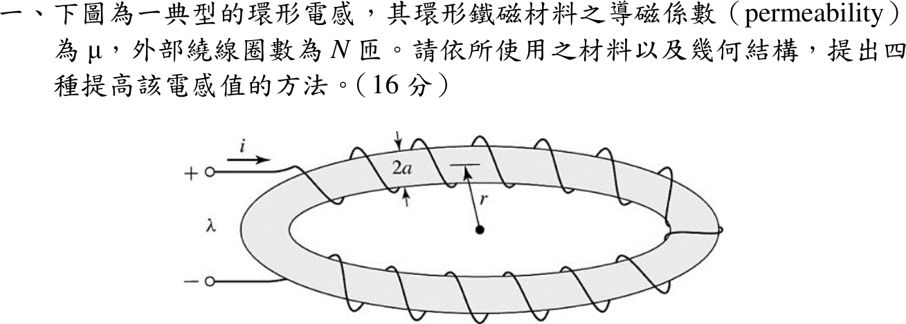
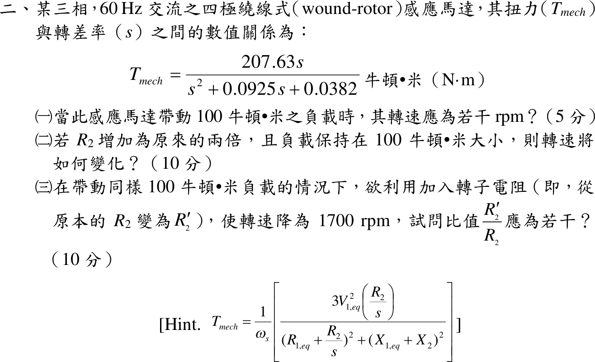

# 📝 111 年電機工程技師｜電機機械逐題詳解

> 本頁由題級 canonical 筆記組合；每題保留官方裁切圖、校驗狀態與可追溯的推導。

## 題目導覽
- [[#一、111 年電機機械第 1 題｜環形鐵心電感與提高電感值的方法|第 1 題：環形鐵心電感與提高電感值的方法]]
- [[#二、111 年電機機械第 2 題｜繞線式感應馬達轉矩與轉差率|第 2 題：繞線式感應馬達轉矩與轉差率]]
- [[#三、111 年電機機械第 3 題｜複激直流發電機磁化曲線|第 3 題：複激直流發電機磁化曲線]]
- [[#四、111 年電機機械第 4 題｜同步發電機電壓調整率與短路比|第 4 題：同步發電機電壓調整率與短路比]]
- [[#五、111 年電機機械第 5 題｜同步電容器功率因數改善|第 5 題：同步電容器功率因數改善]]

---

## 一、111 年電機機械第 1 題｜環形鐵心電感與提高電感值的方法

> 題級識別：EE-111-04-1
> canonical 來源：[[canonical/EE-111-04-1.md]]
> 題級校驗狀態：verified

### 已知與所求

環形鐵心導磁係數 \(\mu\)，繞 \(N\) 匝；圖示平均半徑 \(r\)、圓形截面直徑 \(2a\)。依材料與幾何結構提出四種提高電感的方法（16 分）。

### 考場標準作答

平均磁路長 \(\ell=2\pi r\)、截面積 \(A=\pi a^2\)。安培定律 \(H\ell=Ni\)，\(\lambda=N\mu HA\)：
\[
L=\frac{\lambda}{i}=\frac{\mu N^2A}{\ell}=\frac{N^2}{\mathcal R},\qquad
\boxed{L=\frac{\mu N^2a^2}{2r}}
\]
由此式提高 \(L\) 的四種方法：

1. **材料：選用導磁係數 \(\mu\) 較高的鐵磁材料**（如高導磁矽鋼、鐵氧體／坡莫合金），\(L\propto\mu\)；需在未飽和的工作範圍內。
2. **幾何：增加匝數 \(N\)**，\(L\propto N^2\)，匝數加倍電感為 4 倍。
3. **幾何：加大截面半徑 \(a\)（截面積 \(A=\pi a^2\)）**，\(L\propto a^2\)。
4. **幾何：縮小平均半徑 \(r\)（縮短磁路長 \(2\pi r\)）**，\(L\propto 1/r\)。

\[
\boxed{\text{提高 }\mu、\text{增加 }N、\text{加大 }a、\text{減小 }r}
\]

### 驗算

偏微分符號：\(\partial L/\partial\mu=N^2a^2/2r>0\)、\(\partial L/\partial N=\mu Na^2/r>0\)、\(\partial L/\partial a=\mu N^2a/r>0\)、\(\partial L/\partial r=-\mu N^2a^2/2r^2<0\)，四項變化方向都使 \(L\) 增加。量級：\(N\to2N\) 與 \(a\to2a\) 各使 \(L\) 變 4 倍，\(r\to r/2\) 使 \(L\) 變 2 倍。

### 失分點

- 把圖中的 \(2a\) 當半徑，截面積寫成 \(\pi(2a)^2\)，多出 4 倍。
- 磁路長誤用直徑 \(2r\) 或截面周長；環形磁路長是平均圓周 \(2\pi r\)。
- 只列「增加匝數」一類方法湊四點；材料（\(\mu\)）與三個幾何量（\(N,a,r\)）應各自對應公式中的一項。

---

## 二、111 年電機機械第 2 題｜繞線式感應馬達轉矩與轉差率

> 題級識別：EE-111-04-2
> canonical 來源：[[canonical/EE-111-04-2.md]]
> 題級校驗狀態：verified

### 已知與所求

三相、60 Hz、四極繞線式感應馬達，\(T_{mech}=\dfrac{207.63s}{s^2+0.0925s+0.0382}\ \mathrm{N\cdot m}\)。負載 \(100\ \mathrm{N\cdot m}\)。求（一）轉速；（二）\(R_2\) 加倍後轉速變化；（三）使轉速降為 1700 rpm 的 \(R_2'/R_2\)。

### 考場標準作答

#### （一）100 N·m 時的轉速

\(n_s=120f/P=120(60)/4=1800\ \mathrm{rpm}\)。
\[
100(s^2+0.0925s+0.0382)=207.63s\Rightarrow s^2-1.9838s+0.0382=0
\]
\[
s=\frac{1.9838\pm\sqrt{1.9838^2-4(0.0382)}}{2}=0.019447\ \text{或}\ 1.9644
\]
馬達穩定運轉區 \(0<s<s_{Tmax}\)，取 \(s_1=0.019447\)（另一根 \(s>1\) 為反轉制動區）：
\[
n_1=1800(1-0.019447)=\boxed{n_1\approx1765\ \mathrm{rpm}}
\]

#### （二）\(R_2\) 加倍

由提示式，轉子電阻只以 \(R_2/s\) 出現；其他參數不變時，同一轉矩對應同一 \(R_2/s\)，故 \(s\propto R_2\)：
\[
s_2=2s_1=0.038893,\qquad n_2=1800(1-0.038893)=1730.0\ \mathrm{rpm}
\]
\[
\boxed{\text{轉速降為約 }1730\ \mathrm{rpm}\text{（下降約 }35\ \mathrm{rpm}\text{）}}
\]

#### （三）降速至 1700 rpm

\[
s_3=\frac{1800-1700}{1800}=0.055556,\qquad
\frac{R_2'}{R_2}=\frac{s_3}{s_1}=\frac{0.055556}{0.019447}=\boxed{2.857}
\]

### 驗算

回代原式：\(207.63(0.019447)/(0.019447^2+0.0925\times0.019447+0.0382)=4.0377/0.040377=100.0\ \mathrm{N\cdot m}\)。\(R_2\) 加倍時新轉矩函數為 \(T_{new}(s)=T(s/2)\)，故 \(T_{new}(0.038893)=T(0.019447)=100\ \mathrm{N\cdot m}\)。最大轉矩轉差率 \(s_{Tmax}=\sqrt{0.0382}=0.195\)，\(s_1,s_2,s_3\) 皆小於它，均在穩定區。

### 失分點

- 二次式取到 \(s=1.964\) 而得負轉速；馬達帶負載應取小根。
- 誤認 \(R_2\) 加倍轉速不變；\(R_2\) 不改變的是最大轉矩 \(T_{max}\)，同一負載下 \(s\) 與 \(R_2\) 成正比。
- （三）把比值寫成 \(s_1/s_3=0.35\)；加電阻降速時 \(R_2'/R_2>1\)。

---

## 三、111 年電機機械第 3 題｜複激直流發電機磁化曲線

> 題級識別：EE-111-04-3
> canonical 來源：[[canonical/EE-111-04-3.md]]
> 題級校驗狀態：verified

### 已知與所求

20 kW、200 V、1800 rpm 直流發電機，\(R_a=0.1\ \Omega\)、並激繞組 \(R_{fw}=150\ \Omega\)、場控電阻 \(R_{fc}\) 可調、串激繞組 \(R_{sr}=0.04\ \Omega\)；改為圖 (b) 長分路積複激。1800 rpm 磁化表：

| \(I_f\) (A) | 0 | 0.125 | 0.25 | 0.5 | 0.625 | 0.75 | 0.875 | 1.0 | 1.25 | 1.48 |
|---|---|---|---|---|---|---|---|---|---|---|
| \(E_a\) (V) | 5 | 33.5 | 67 | 134 | 160 | 175 | 190 | 200 | 214 | 222 |

求（一）無載最大端電壓；（二）額定滿載時相當於磁化表的總激磁電流；（三）\(N_f=1200\) 匝／極，無載與滿載端電壓皆 200 V 時的串激匝數 \(N_s\)。

### 考場標準作答

#### （一）無載最大端電壓

\(R_{fc}=0\) 時場路電阻最小、端電壓最高。長分路無載 \(I_a=I_f\)：
\[
V_t=150I_f,\qquad E_a=V_t+I_f(R_a+R_{sr})=150.14I_f
\]
與磁化表 1.25–1.48 A 段 \(E_a=214+\tfrac{8}{0.23}(I_f-1.25)\) 求交點：\(I_f=1.4782\ \mathrm A\)。
\[
\boxed{V_{0,\max}=150(1.4782)=221.73\ \mathrm V\ (\approx222\ \mathrm V)}
\]
（場阻線 \(150I_f\) 恰過表末點 \(1.48\ \mathrm A,222\ \mathrm V\)；扣 0.14 Ω 壓降後為 221.73 V。無載串激安匝 \(N_sI_f\) 極小，略去。）

#### （二）滿載的等效總激磁電流

\[
I_L=\frac{20\,000}{200}=100\ \mathrm A,\quad I_a=100+I_{f,sh},\quad
E_a=200+0.14(100+I_{f,sh})=214+0.14I_{f,sh}\ \mathrm V
\]
第（二）題本身未給場控電阻 \(R_{fc}\)，\(I_{f,sh}=200/(150+R_{fc})\le4/3\ \mathrm A\)，故 \(214<E_a\le214.19\ \mathrm V\)，落在表格 214 V 點：
\[
\boxed{I_{f,eq}\approx1.25\ \mathrm A}
\]
若沿用第（三）題「無載 200 V」使 \(I_{f,sh}\approx1.0\ \mathrm A\)，則 \(E_a=214.14\ \mathrm V\)，插值 \(I_{f,eq}=1.25+\tfrac{0.14}{8}(0.23)=1.2540\ \mathrm A\)；這是附加條件下的精細近似，不是第（二）題單獨可定的唯一值。

#### （三）平複激的串激匝數

無載 200 V：表上 \(E_a=200\ \mathrm V\) 對應 \(I_f=1.0\ \mathrm A\)，故 \(R_{fc}=200/1.0-150=50\ \Omega\)。滿載端電壓仍 200 V，並激電流仍為 \(1.0\ \mathrm A\)，不足的激磁由串激安匝補足：
\[
N_fI_{f,eq}=N_fI_{f,sh}+N_sI_a\Rightarrow
N_s=\frac{1200(1.2540-1.000)}{101}=3.02
\]
\[
\boxed{N_s\approx3\ \text{匝/極}}
\]

### 驗算

同時解兩個條件（無載：\(E_a(I_{sh}(1+N_s/1200))=200+0.14I_{sh}\)；滿載：\(I_{sh}+N_s(100+I_{sh})/1200=E_a^{-1}(200+0.14I_a)\)，\(E_a^{-1}\) 為磁化表反查），二分法得 \(I_{sh}=1.0000\ \mathrm A\)、\(N_s=3.018\)，與一階近似一致。回代 \(N_s=3.02\)：\(1.000+3.02(101)/1200=1.2542\ \mathrm A\)，查表 \(E_a=214.14\ \mathrm V\)，扣 \(101\times0.14=14.14\ \mathrm V\) 得端電壓 200 V。

### 失分點

- 無載直接把表上最大值 222 V 當端電壓而不與場阻線求交點；最大值發生在 \(R_{fc}=0\) 的場阻線交點。
- 長分路滿載漏加並激電流，寫成 \(I_a=I_L=100\ \mathrm A\)。
- 積複激卻把串、並激安匝相減，或把 \(I_{f,eq}\) 當成實際並激支路電流。

---

## 四、111 年電機機械第 4 題｜同步發電機電壓調整率與短路比

> 題級識別：EE-111-04-4
> canonical 來源：[[canonical/EE-111-04-4.md]]
> 題級校驗狀態：needs_manual_review
> [!WARNING] 本題仍有官方資料缺口或事件定義歧義；請以 canonical 條件式解答為準。

### 已知與所求

三相 Y 接、11 kV、60 Hz、25 MVA 圓桶式同步發電機，每相飽和同步電抗 \(X_s=4.5\ \Omega\)（忽略 \(R_a\)）。場電流 \(I_f=200\ \mathrm A\) 時以額定電壓、額定電流供 0.85 落後負載。提示 \(X_{s,pu}=1/\mathrm{SCR}\)。求（一）場電流不變時的電壓調整率；（二）OCC 上額定電壓所需場電流；（三）SCC 上額定電流所需場電流。

### 考場標準作答

#### （一）電壓調整率

\[
V_\phi=\frac{11\,000}{\sqrt3}=6350.85\ \mathrm V,\qquad
I_a=\frac{25\times10^6}{\sqrt3(11\,000)}=1312.16\angle-31.79^\circ\ \mathrm A
\]
\[
\underline E=\underline V_\phi+jX_s\underline I_a=6350.85+j4.5(1115.34-j691.22)=9461.36+j5019.01=10710.17\angle27.94^\circ\ \mathrm V
\]
場電流不變，卸載後端電壓升到 \(|E|\)：
\[
\mathrm{VR}=\frac{10710.17-6350.85}{6350.85}\times100\%=\boxed{68.6414\%}
\]

#### （二）OCC 上額定電壓的場電流

題目只給飽和同步電抗，未給 OCC 數據，故以通過工作點的線性化 OCC（\(E\propto I_f\)，斜率 \(10710.17/200=53.55\ \mathrm{V/A}\)）：
\[
I_{f,\mathrm{OCC}}=200\times\frac{6350.85}{10710.17}=\boxed{118.595\ \mathrm A}
\]

#### （三）SCC 上額定電流的場電流

\[
Z_b=\frac{11^2}{25}=4.84\ \Omega,\quad X_{s,pu}=\frac{4.5}{4.84}=0.92975,\quad \mathrm{SCR}=\frac{I_{f,\mathrm{OCC}}}{I_{f,\mathrm{SCC}}}=1.0756
\]
\[
I_{f,\mathrm{SCC}}=X_{s,pu}\,I_{f,\mathrm{OCC}}=0.92975(118.595)=\boxed{110.264\ \mathrm A}
\]

### 驗算

短路法：三相短路時 \(E_{sc}=X_sI_a=4.5(1312.16)=5904.7\ \mathrm V\)，以同一斜率 \(53.55\ \mathrm{V/A}\) 得 \(I_f=5904.7/53.55=110.26\ \mathrm A\)，與 SCR 法一致。功率角檢查：\(|E|\sin\delta=X_sI_a\cos\theta=4.5(1115.34)=5019.0\ \mathrm V\)，與 \(\underline E\) 虛部相同。

### 失分點

- 用發電機式卻寫成 \(\underline E=\underline V-jX_s\underline I\)，得 \(|E|\) 偏小、VR 錯。
- 把題目的 200 A 當成 OCC 額定電壓場電流；200 A 是滿載 0.85 落後時的場電流，若它在無載也只產生額定電壓，第（一）題 VR 會是 0。
- SCR 寫反成 \(I_{f,\mathrm{SCC}}/I_{f,\mathrm{OCC}}\)，得 \(I_{f,\mathrm{SCC}}>I_{f,\mathrm{OCC}}\)。

### 條件與疑義

- 官方裁切圖未附完整曲線資料（無 OCC／SCC 圖或數據），第（二）（三）小題只能在「飽和同步電抗對應的線性化 OCC」假設下得唯一值；若另給實際 OCC，應以曲線讀值取代 118.595 A。
- 參考書主解：\(I_a=1312.16\angle-31.8^\circ\ \mathrm A\)、\(E_f=10710.78\angle27.94^\circ\) V/相、VR = 68.87%，\(I_{f,\mathrm{OCC}}=200\ \mathrm A\)，\(I_{f,\mathrm{SCC}}=0.93\times200\)，即 186 A。與獨立解不一致處：其 \(E_f\) 代回 \((10710.78-6350.85)/6350.85=68.65\%\)，非 68.87%；其 OCC 取 200 A 與第（一）題「200 A 時無載電壓為 10.71 kV/相」互相矛盾，186 A 隨之偏高。參考書數值僅作對照。

---

## 五、111 年電機機械第 5 題｜同步電容器功率因數改善

> 題級識別：EE-111-04-5
> canonical 來源：[[canonical/EE-111-04-5.md]]
> 題級校驗狀態：verified

### 已知與所求

線電壓 2300 V 三相供電，工廠 3000 kW、PF 0.85 落後；同步機（同步阻抗 1.6 Ω，視為每相 \(X_s\)，忽略 \(R_a\) 與損失）作同步電容器，將 PF 改善為 1.0。求（一）同步機額定 kVA；（二）安裝前後電纜線電流；（三）所需電樞（內生）電壓。

### 考場標準作答

#### （一）同步機額定容量

同步電容器不供實功率，只需補償全部落後無效功率：
\[
Q_c=P\tan(\cos^{-1}0.85)=3000(0.61974)=1859.2\ \mathrm{kvar}
\]
\[
\boxed{S_{sc}\approx1859\ \mathrm{kVA}}
\]

#### （二）電纜線電流

\[
I_{\text{前}}=\frac{3000\times10^3}{\sqrt3(2300)(0.85)}=885.96\ \mathrm A,\qquad
I_{\text{後}}=\frac{3000\times10^3}{\sqrt3(2300)}=753.07\ \mathrm A
\]
\[
\boxed{885.96\ \mathrm A\rightarrow753.07\ \mathrm A,\ \text{減少 }132.9\ \mathrm A\ (15\%)}
\]

#### （三）電樞電壓

\(V_\phi=2300/\sqrt3=1327.91\ \mathrm V\)，同步機電流 \(I_c=Q_c/(\sqrt3V_L)=466.71\ \mathrm A\)，超前 \(90^\circ\)：\(\underline I_c=j466.71\ \mathrm A\)。電動機慣例：
\[
\underline E_f=\underline V_\phi-jX_s\underline I_c=1327.91-j1.6(j466.71)=1327.91+746.73=2074.64\ \mathrm V
\]
\[
\boxed{E_f=2074.6\text{ V/相}\ (\text{線間 }3593\ \mathrm V)}
\]
\(E_f>V_\phi\)，為過激磁運轉。

### 驗算

匯流排 KCL：\(\underline I_{\text{負載}}=885.96\angle-31.79^\circ=753.07-j466.71\)，加上 \(j466.71\) 得 \(753.07\angle0^\circ\ \mathrm A\)，與（二）一致。同步機無效功率另算：\(Q=3V_\phi(E_f-V_\phi)/X_s=3(1327.91)(746.73)/1.6=1859.2\ \mathrm{kvar}\)，與（一）相同。

### 失分點

- 以 \(P/0.85=3529\ \mathrm{kVA}\) 當同步機容量；同步電容器只承擔無效功率 1859 kvar。
- 電動機式寫成 \(\underline E=\underline V+jX_s\underline I\) 且電流取超前，得 \(E_f=581\ \mathrm V\)（欠激磁），與「當電容器」矛盾。
- 相電壓與線電壓混用：用 2300 V 直接加 \(X_sI\)，答成 3047 V。

---
