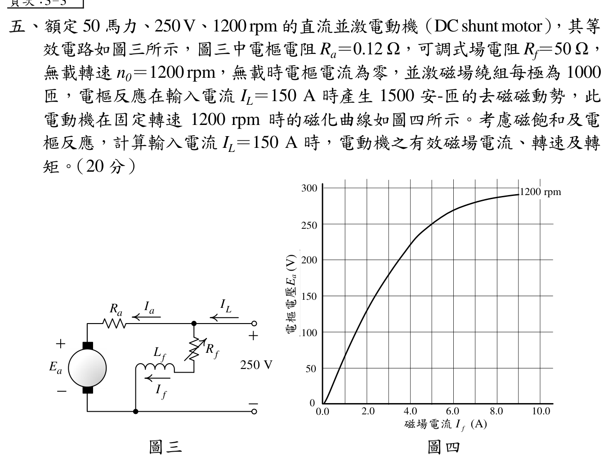

# 📝 112 年電機工程技師｜電機機械逐題詳解

> 本頁由題級 canonical 筆記組合；每題保留官方裁切圖、校驗狀態與可追溯的推導。

## 題目導覽
- [[#一、112 年第 1 題｜獨立驗證|第 1 題：獨立驗證]]
- [[#二、112 年第 2 題｜獨立驗證|第 2 題：獨立驗證]]
- [[#三、112 年第 3 題｜獨立驗證|第 3 題：獨立驗證]]
- [[#四、112 年第 4 題｜獨立驗證|第 4 題：獨立驗證]]
- [[#五、112 年第 5 題｜獨立驗證|第 5 題：獨立驗證]]

---

## 一、112 年第 1 題｜獨立驗證

> 題級識別：EE-112-04-1
> canonical 來源：[[canonical/EE-112-04-1.md]]
> 題級校驗狀態：verified

### 官方題目（逐題裁切）

圖一所示的電感器，鐵心的相對導磁係數 \(\mu_r=950\)，磁路平均長度 \(\ell_c=32\ \mathrm{cm}\)，磁路的平均截面積 \(A_c=20\ \mathrm{cm^2}\)，繞組的匝數 \(N=70\ \mathrm{匝}\)。此電感器與 \(60\ \Omega\) 的電阻器串聯後，連接至 \(220\ \mathrm{V}\)、\(60\ \mathrm{Hz}\) 的單相交流電源，試計算：
* **(一)** 此電感器的電感值。（10 分）
* **(二)** 鐵心中，磁通量 \(\phi\) 的最大值。（10 分）

### 獨立驗證

磁路的磁阻與電感分別為

\[
\mathcal R_m=\frac{\ell_c}{\mu_0\mu_r A_c},
\qquad
L=\frac{N^2}{\mathcal R_m}
 =\frac{\mu_0\mu_rN^2A_c}{\ell_c}.
\]

單位換算為 \(A_c=20\times10^{-4}=2.0\times10^{-3}\ \mathrm{m^2}\)、\(\ell_c=0.32\ \mathrm m\)，故

\[
L=\frac{(4\pi\times10^{-7})(950)(70)^2(2.0\times10^{-3})}{0.32}
 =0.0365603\ \mathrm H.
\]

電感抗與串聯電流（以 RMS 值計）為

\[
X_L=\omega L=2\pi(60)(0.0365603)=13.7829\ \Omega,
\]

\[
I=\frac{220}{\sqrt{60^2+X_L^2}}
 =3.57359\ \mathrm A.
\]

電感兩端的 RMS 電壓為 \(V_L=IX_L\)。由正弦磁通的感應電壓關係 \(V_{L,\mathrm{rms}}=\omega N\phi_{\max}/\sqrt2\)，所以

\[
\phi_{\max}=\frac{\sqrt2\,V_L}{\omega N}
 =\frac{\sqrt2(3.57359)(13.7829)}{2\pi(60)(70)}
 =2.63956\times10^{-3}\ \mathrm{Wb}.
\]

回代核對：

\[
I\left|60+jX_L\right|
 =3.57359\sqrt{60^2+13.7829^2}
 =220.0\ \mathrm V.
\]

因此

\[
\boxed{L=36.56\ \mathrm{mH}},\qquad
\boxed{\phi_{\max}=2.640\times10^{-3}\ \mathrm{Wb}}\,.
\]

---

## 二、112 年第 2 題｜獨立驗證

> 題級識別：EE-112-04-2
> canonical 來源：[[canonical/EE-112-04-2.md]]
> 題級校驗狀態：verified

### 官方題目（逐題裁切）

一部 \(5000\ \mathrm{kVA}\)、\(230\ \mathrm{kV}/13.8\ \mathrm{kV}\) 的單相變壓器，銘牌上標示電阻標么值為 \(1\%\)，電抗標么值為 \(5\%\)，在低壓側作開路試驗所量測到的數據為 \(V_{oc}=13.8\ \mathrm{kV}\)、\(I_{oc}=21.1\ \mathrm{A}\)、\(P_{oc}=90.8\ \mathrm{kW}\)。
* **(一)** 試繪出此變壓器參照至低壓側的等效電路圖，並求出所有的參數值。（12 分）
* **(二)** 若低壓側電壓為 \(13.8\ \mathrm{kV}\)，供應 \(4000\ \mathrm{kW}\)，功率因數 \(0.8\) 落後的負載時，計算此變壓器的電壓調整率。（8 分）

### 獨立驗證

#### (一) 低壓側等效電路與參數

採每相（本題為單相）低壓側折算的近似等效電路：輸入端並聯激磁支路 \(R_c\parallel jX_m\)，以及串聯漏阻抗 \(R_{\mathrm{eq}}+jX_{\mathrm{eq}}\) 接至負載。銘牌的標么值只決定串聯總量，不能由題目資料再唯一分拆成一次、二次繞組各自的電阻與漏抗。

拓撲為：低壓側輸入端的 \(R_c\parallel jX_m\) 並聯支路，之後串聯 \(R_{\mathrm{eq}}+jX_{\mathrm{eq}}\) 至負載端 \(V_2\)。

低壓側基準阻抗為

\[
a=\frac{230}{13.8}=16.667,\qquad
I_{\mathrm{base}}=\frac{5000\ \mathrm{kVA}}{13.8\ \mathrm{kV}}
 =362.32\ \mathrm A.
\]

\[
Z_{\mathrm{base}}=\frac{V_{\mathrm{base}}^2}{S_{\mathrm{base}}}
 =\frac{(13{,}800\ \mathrm{V})^2}{5{,}000{,}000\ \mathrm{VA}}
 =38.088\ \Omega .
\]

因此

\[
R_{\mathrm{eq}}=0.01Z_{\mathrm{base}}=0.38088\ \Omega,
\qquad
X_{\mathrm{eq}}=0.05Z_{\mathrm{base}}=1.9044\ \Omega .
\]

開路試驗在低壓側量測，所以直接得到低壓側激磁支路參數。鐵損電阻

\[
R_c=\frac{V_{oc}^2}{P_{oc}}
 =\frac{(13{,}800\ \mathrm{V})^2}{90{,}800\ \mathrm{W}}
 =2{,}097.36\ \Omega .
\]

\[
S_{oc}=V_{oc}I_{oc}=13{,}800\times21.1
 =291{,}180\ \mathrm{VA},
\]

\[
Q_{oc}=\sqrt{S_{oc}^2-P_{oc}^2}=276{,}660.72\ \mathrm{var},
\qquad
X_m=\frac{V_{oc}^2}{Q_{oc}}=688.35\ \Omega .
\]

故低壓側等效電路參數為

\[
\boxed{R_{\mathrm{eq}}=0.3809\ \Omega,\quad
X_{\mathrm{eq}}=1.9044\ \Omega,\quad
R_c=2.097\ \mathrm{k}\Omega,\quad
X_m=688.4\ \Omega .}
\]

#### (二) 電壓調整率

\(P=4000\ \mathrm{kW}\)、\(\mathrm{pf}=0.8\) 落後，因此

\[
|S|=\frac{4000}{0.8}=5000\ \mathrm{kVA},
\qquad
I_2=\frac{|S|}{V_2}=\frac{5{,}000\ \mathrm{kVA}}{13.8\ \mathrm{kV}}
 =362.32\ \mathrm{A},
\]

\[
\mathbf I_2=362.32\angle(-\cos^{-1}0.8)
 =289.86-j217.39\ \mathrm{A}.
\]

令負載端電壓 \(\mathbf V_2=13{,}800\angle0^\circ\ \mathrm{V}\)，則串聯壓降為

\[
\mathbf V_1'=\mathbf V_2+\mathbf I_2(R_{\mathrm{eq}}+jX_{\mathrm{eq}})
 =14{,}324.40+j469.20\ \mathrm{V},
\]

\[
|V_1'|=14{,}332.08\ \mathrm{V}.
\]

以低壓側端電壓固定為額定值時，電壓調整率為

\[
\mathrm{VR}=\frac{|V_1'|-|V_2|}{|V_2|}\times100\%
 =\frac{14{,}332.08-13{,}800}{13{,}800}\times100\%
 =\boxed{3.856\%\ \approx3.86\%}.
\]

標么近似交叉核對為

\[
\mathrm{VR}\approx R_{pu}\cos\theta+X_{pu}\sin\theta
 =0.01(0.8)+0.05(0.6)=0.038=3.80\%,
\]

與精確串聯壓降結果一致於四捨五入誤差範圍。

---

## 三、112 年第 3 題｜獨立驗證

> 題級識別：EE-112-04-3
> canonical 來源：[[canonical/EE-112-04-3.md]]
> 題級校驗狀態：verified

### 考場標準作答

Y 接相電壓
\[
V_\phi=\frac{208}{\sqrt3}=120.089\,\mathrm V.
\]
單位功因時 \(\mathbf I_{A1}=50\angle0^\circ\,\mathrm A\)，同步電動機相量式為
\[
\mathbf E_A=\mathbf V_\phi-jX_s\mathbf I_A.
\]
故
\[
\mathbf E_{A1}=120.089-j80.000\,\mathrm V,
\]
\[
\boxed{|E_{A1}|=144.30\,\mathrm{V/相}},\qquad
\boxed{\delta_1=-33.67^\circ}.
\]

機械負載不變且忽略損失，實功率不變：
\[
50(1)=I_{A2}(0.8)\Rightarrow I_{A2}=62.5\,\mathrm A.
\]
0.8 超前時
\[
\mathbf I_{A2}=62.5\angle36.87^\circ=50+j37.5\,\mathrm A,
\]
\[
\mathbf E_{A2}=180.089-j80.000\,\mathrm V,\qquad
|E_{A2}|=197.058\,\mathrm V.
\]
採未飽和線性模型 \(E_A\propto I_f\)：
\[
\boxed{I_{f2}=2.7\frac{197.058}{144.296}=3.69\,\mathrm A}.
\]

### 得分點拆解

- Y 接線電壓先除以 \(\sqrt3\) 得相電壓。
- 使用電動機相量式 \(\mathbf E_A=\mathbf V_\phi-jX_s\mathbf I_A\)。
- 單位功因時電流與端電壓同相，轉矩角為負，表示內生電壓落後。
- 負載不變代表實功率不變，故 0.8 超前時電樞電流增為 62.5 A。
- 題目未給磁化曲線，必須明示採 \(E_A\propto I_f\) 的未飽和假設。

### 完整教學推導

#### 官方題目（逐題裁切）

額定 \(25\ \mathrm{hp}\)、\(208\ \mathrm V\)、\(60\ \mathrm{Hz}\)、Y 接之三相同步電動機，每相同步電抗為 \(1.6\ \Omega\)，一切損失均可忽略。此電動機工作在某一負載下，調整其激磁電流為 \(2.7\ \mathrm A\) 時，電動機從電源汲取 \(50\ \mathrm A\) 的電流，功率因數恰為 \(1.0\)。
* **(一)** 求此操作條件下，每相內部生成電壓 \(\mathbf{E}_A\) 之大小及轉矩角 \(\delta\)。（10 分）
* **(二)** 若機械負載不變，欲使此電動機運轉於功率因數 0.8 超前，求新的激磁電流值。（10 分）

#### 計算過程

Y 接的每相端電壓為

\[
V_\phi=\frac{208}{\sqrt3}=120.0889\ \mathrm V.
\]

同步電動機（忽略電阻）的相量方程為

\[
\mathbf E_A=\mathbf V_\phi-jX_s\mathbf I_A.
\]

#### (一) 原激磁電流、單位功因

以端電壓為相角基準，單位功因時 \(\mathbf I_{A1}=50\angle0^\circ\ \mathrm A\)。因此

\[
\mathbf E_{A1}=120.0889-j(1.6)(50)
 =120.0889-j80.000\ \mathrm V,
\]

\[
|E_{A1}|=\sqrt{120.0889^2+80^2}
 =\boxed{144.30\ \mathrm{V/相}}.
\]

電壓 \(\mathbf E_{A1}\) 落後 \(\mathbf V_\phi\)，故以內生電壓相對端電壓定義

\[
\delta_1=\arg(\mathbf E_{A1})
 =\tan^{-1}\left(\frac{-80}{120.0889}\right)
 =\boxed{-33.67^\circ}.
\]

#### (二) 功率因數 0.8 超前且機械負載不變

忽略損失時機械負載不變即輸入實功率不變。故

\[
3V_\phi(50)(1.0)=3V_\phi I_{A2}(0.8),
\qquad
I_{A2}=62.5\ \mathrm A.
\]

0.8 超前表示

\[
\mathbf I_{A2}=62.5\angle36.87^\circ
 =50+j37.5\ \mathrm A.
\]

新的內生電壓為

\[
\mathbf E_{A2}=120.0889-j(1.6)(50+j37.5)
 =180.0889-j80.000\ \mathrm V,
\]

\[
|E_{A2}|=\sqrt{180.0889^2+80^2}
 =197.058\ \mathrm{V/相}.
\]

題目未提供飽和磁化曲線，依同步機標準未飽和模型 \(E_A\propto I_f\)，故

\[
\frac{I_{f2}}{I_{f1}}=\frac{|E_{A2}|}{|E_{A1}|},
\qquad
I_{f2}=2.7\frac{197.058}{144.296}
 =\boxed{3.687\ \mathrm A\approx3.69\ \mathrm A}.
\]

回代 \(\mathbf E_{A2}=\mathbf V_\phi-jX_s\mathbf I_{A2}\) 可恢復上述相量，且實功率仍為 \(3V_\phi(50)=18.013\ \mathrm{kW}\)。激磁比例以前述線性未飽和假設為前提。

### 獨立驗算

兩個操作點的實功率分別為
\[
P_1=3V_\phi(50)(1)=18.013\,\mathrm{kW},
\]
\[
P_2=3V_\phi(62.5)(0.8)=18.013\,\mathrm{kW},
\]
與機械負載不變相符。

第二操作點的電流實部仍為 50 A，因此
\[
-jX_sI_{A2}=-j(1.6)(50+j37.5)=60-j80\,\mathrm V,
\]
加到 \(V_\phi\) 後正好得到 \(180.089-j80\,\mathrm V\)。

### 常見失分

- 把 208 V 當每相電壓。
- 套用發電機方程 \(E=V+jXI\)，使轉矩角方向相反。
- 功因改為 0.8 時仍令電流為 50 A，違反定負載實功率條件。
- 「0.8 超前」寫成 \(-36.87^\circ\)，與端電壓的相位關係相反。
- 未說明線性磁化假設就直接用內生電壓比求激磁電流比。

---

## 四、112 年第 4 題｜獨立驗證

> 題級識別：EE-112-04-4
> canonical 來源：[[canonical/EE-112-04-4.md]]
> 題級校驗狀態：verified

### 官方題目（逐題裁切）

額定 \(35\ \mathrm{hp}\)、\(380\ \mathrm V\)、\(60\ \mathrm{Hz}\)、Y 接之三相感應電動機，以 \(380\ \mathrm V\) 全壓啟動時，啟動電流 \(I_{st}=330\ \mathrm A\)，功率因數 \(PF_{st}=0.51\) 落後。若欲降低此電動機之啟動電流至 \(200\ \mathrm A\)（落後），於啟動時並聯一組 \(\Delta\) 接的電容器如圖二所示，試計算電容 \(C_\Delta\) 之值。（20 分）

### 獨立驗證

以電源相電壓為相量基準。馬達啟動電流的有功與無功分量為

\[
\mathbf I_m=330\left(0.51-j\sqrt{1-0.51^2}\right)
 =168.30-j283.858\ \mathrm A.
\]

三角形電容器接在線電壓兩端，每一支路電流超前其支路電壓 \(90^\circ\)，故其線電流可寫成 \(+jI_{C,\mathrm{line}}\)。補償後電源線電流為

\[
\mathbf I_s=168.30+j\left(I_{C,\mathrm{line}}-283.858\right)\ \mathrm A.
\]

要求總電流仍為落後且大小 \(200\ \mathrm A\)，所以虛部取負根：

\[
168.30^2+\left(I_{C,\mathrm{line}}-283.858\right)^2=200^2,
\]

\[
I_{C,\mathrm{line}}-283.858
 =-\sqrt{200^2-168.30^2}
 =-108.051\ \mathrm A,
\]

\[
I_{C,\mathrm{line}}=175.806\ \mathrm A.
\]

對 \(\Delta\) 接，每相電容支路承受線電壓 \(V_{LL}=380\ \mathrm V\)，且

\[
I_{C,\mathrm{line}}=\sqrt3\,\omega C_\Delta V_{LL},
\qquad
\omega=2\pi f=2\pi(60)\ \mathrm{rad/s}.
\]

因此

\[
C_\Delta=\frac{175.806}{\sqrt3(2\pi)(60)(380)}
 =7.0853\times10^{-4}\ \mathrm F
 =\boxed{708.5\ \mu\mathrm F\ \text{(每一支路)}}.
\]

回代後 \(\mathbf I_s=168.30-j108.051\ \mathrm A\)，其大小為 \(200.00\ \mathrm A\)，且虛部為負，符合「落後」條件。圖二的三個電容是三角形三支路，各支路均使用此 \(C_\Delta\)。

---

## 五、112 年第 5 題｜獨立驗證

> 題級識別：EE-112-04-5
> canonical 來源：[[canonical/EE-112-04-5.md]]
> 題級校驗狀態：verified

### 官方題目（逐題裁切）

額定 \(50\ \mathrm{hp}\)、\(250\ \mathrm V\)、\(1200\ \mathrm{rpm}\) 的直流並激電動機（DC shunt motor），其等效電路如圖三所示，圖三中電樞電阻 \(R_a=0.12\ \Omega\)，可調式場電阻 \(R_f=50\ \Omega\)，無載轉速 \(n_0=1200\ \mathrm{rpm}\)，無載時電樞電流為零，並激磁場繞組每極為 1000 匝，電樞反應在輸入電流 \(I_L=150\ \mathrm A\) 時產生 1500 安-匝的去磁磁動勢，此電動機在固定轉速 \(1200\ \mathrm{rpm}\) 時的磁化曲線如圖四所示。考慮磁飽和及電樞反應，計算輸入電流 \(I_L=150\ \mathrm A\) 時，電動機之有效磁場電流、轉速及轉矩。（20 分）

### 考場標準作答

\[
I_f=\frac{250}{50}=5\,\mathrm A,
\qquad I_a=I_L-I_f=145\,\mathrm A.
\]

\[
I_{f,\mathrm{eff}}
=\frac{1000(5)-1500}{1000}
=\boxed{3.50\,\mathrm A}.
\]

由 \(1200\,\mathrm{rpm}\) 磁化曲線讀得 \(I_{f,\mathrm{eff}}=3.5\,\mathrm A\) 時 \(E_{a,1200}\approx200\,\mathrm V\)。負載反電勢

\[
E_a=250-(145)(0.12)=232.6\,\mathrm V,
\]

\[
n=1200\frac{232.6}{200}
=\boxed{1396\,\mathrm{rpm}}.
\]

\[
T_e=\frac{E_aI_a}{2\pi n/60}
=\boxed{230.8\,\mathrm{N\cdot m}}.
\]

### 得分點拆解

- 正確分流得到 \(I_f=5\,\mathrm A\)、\(I_a=145\,\mathrm A\)。
- 將 1500 安匝去磁磁動勢除以每極 1000 匝，得到等效減少 \(1.5\,\mathrm A\)，而不是直接從 \(I_L\) 扣除。
- 明示磁化曲線是在 \(1200\,\mathrm{rpm}\) 下讀值，並利用同磁通時 \(E_a\propto n\)。
- 轉矩使用開發功率 \(E_aI_a\)，答案標示為電磁轉矩；題面沒有機械損失，不能另算唯一軸轉矩。

### 完整教學推導

並激場繞組直接跨接 \(250\ \mathrm V\)，故

\[
I_f=\frac{V_t}{R_f}=\frac{250}{50}=5.00\ \mathrm A,
\qquad
I_a=I_L-I_f=150-5=145.0\ \mathrm A.
\]

在 \(I_L=150\ \mathrm A\) 時，電樞反應去磁磁動勢為 \(1500\ \mathrm{A\cdot turn}\)。淨磁動勢為

\[
\mathcal F_{\mathrm{net}}=N_fI_f-\mathcal F_{\mathrm{ar}}
 =1000(5.00)-1500=3500\ \mathrm{A\cdot turn},
\]

\[
I_{f,\mathrm{eff}}=\frac{\mathcal F_{\mathrm{net}}}{N_f}
 =\boxed{3.50\ \mathrm A}.
\]

圖四是在 \(1200\ \mathrm{rpm}\) 下的磁化曲線；讀取 \(I_{f,\mathrm{eff}}=3.5\ \mathrm A\) 得 \(E_{a,1200}\approx200\ \mathrm V\)（圖讀值的近似精度）。負載時反電動勢由電樞迴路為

\[
E_a=V_t-I_aR_a
 =250-(145.0)(0.12)
 =232.6\ \mathrm V.
\]

同一有效磁通下 \(E_a\propto n\)，所以

\[
n=1200\frac{E_a}{E_{a,1200}}
 =1200\frac{232.6}{200}
 =\boxed{1395.6\ \mathrm{rpm}\approx1396\ \mathrm{rpm}}.
\]

電磁轉換功率與機械角速度為

\[
P_{\mathrm{dev}}=E_aI_a=(232.6)(145.0)=33{,}727\ \mathrm W,
\]

\[
\omega_m=\frac{2\pi n}{60}
 =\frac{2\pi(1395.6)}{60}
 =146.147\ \mathrm{rad/s}.
\]

因此電磁轉矩為

\[
T_e=\frac{P_{\mathrm{dev}}}{\omega_m}
 =\frac{33{,}727}{146.147}
 =\boxed{230.8\ \mathrm{N\cdot m}}.
\]

回代 \(I_f=5.00\ \mathrm A\)、\(I_a=145.0\ \mathrm A\)、\(E_a=232.6\ \mathrm V\) 可同時滿足場路與電樞 KVL。此處的「轉矩」是由題目資料可唯一求得的電磁（開發）轉矩；若另要求軸輸出轉矩，仍需提供機械損失。

### 獨立驗算

由磁化曲線在 \(1200\,\mathrm{rpm}\) 的讀值可得

\[
K\phi=\frac{E_{a,1200}}{\omega_{1200}}
=\frac{200}{2\pi(1200)/60}.
\]

故另一條轉矩路徑為

\[
T_e=K\phi I_a
=\frac{200}{2\pi(1200)/60}(145)
=230.8\,\mathrm{N\cdot m},
\]

與 \(E_aI_a/\omega_m\) 相同。

圖上 \(I_f=5\,\mathrm A\) 約對應 \(250\,\mathrm V\)，符合題設無載 \(1200\,\mathrm{rpm}\) 且 \(I_a=0\) 的基準點。負載後有效磁場電流降到 \(3.5\,\mathrm A\)，同速磁化曲線讀值約 \(200\,\mathrm V\)；實際反電勢仍為 \(232.6\,\mathrm V\)，故轉速必須高於 \(1200\,\mathrm{rpm}\)。這也與上式求得的 \(1396\,\mathrm{rpm}\) 方向一致。

### 常見失分

- 忘記並激馬達 \(I_L=I_a+I_f\)，直接令 \(I_a=150\,\mathrm A\)。
- 把電樞反應的 1500 安匝當成 1500 A，或沒有除以 1000 匝。
- 用磁化曲線的 \(200\,\mathrm V\) 直接當負載時 \(E_a\)，沒有先由電樞 KVL 求 \(232.6\,\mathrm V\)。
- 讀圖值本來就是近似值，卻把轉速寫成過多有效位數。

---
