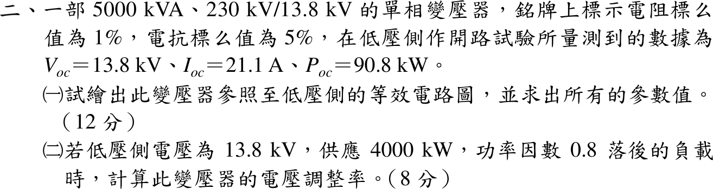

# 📝 112 年電機工程技師｜電機機械逐題詳解

> 本頁由題級 canonical 筆記組合；每題保留官方裁切圖、校驗狀態與可追溯的推導。

## 題目導覽
- [[#一、112 年第 1 題｜獨立驗證|第 1 題：獨立驗證]]
- [[#二、112 年第 2 題｜獨立驗證|第 2 題：獨立驗證]]
- [[#三、112 年第 3 題｜獨立驗證|第 3 題：獨立驗證]]
- [[#四、112 年第 4 題｜獨立驗證|第 4 題：獨立驗證]]
- [[#五、112 年第 5 題｜獨立驗證|第 5 題：獨立驗證]]

---

## 一、112 年第 1 題｜獨立驗證

> 題級識別：EE-112-04-1
> canonical 來源：[[canonical/EE-112-04-1.md]]
> 題級校驗狀態：verified

### 已知與所求

\(\mu_r=950\)、\(\ell_c=32\ \mathrm{cm}\)、\(A_c=20\ \mathrm{cm^2}\)、\(N=70\)；電感器串聯 \(60\ \Omega\) 接 220 V、60 Hz。求（一）電感；（二）鐵心磁通最大值。

### 考場標準作答

#### （一）電感

\[
\mathcal R=\frac{\ell_c}{\mu_0\mu_rA_c}=\frac{0.32}{(4\pi\times10^{-7})(950)(2\times10^{-3})}=1.340\times10^5\ \mathrm{A\,t/Wb}
\]
\[
\boxed{L=\frac{N^2}{\mathcal R}=\frac{4900}{1.340\times10^5}=36.56\ \mathrm{mH}}
\]

#### （二）磁通最大值

\[
X_L=2\pi(60)(0.03656)=13.78\ \Omega,\qquad I=\frac{220}{\sqrt{60^2+13.78^2}}=3.574\ \mathrm A\ (\text{rms})
\]
磁鏈 \(N\phi=Li\)，取電流峰值：
\[
\boxed{\phi_{max}=\frac{L\sqrt2I}{N}=\frac{0.03656(1.4142)(3.574)}{70}=2.640\times10^{-3}\ \mathrm{Wb}}
\]

### 驗算

法拉第定律：電感端電壓 \(V_L=IX_L=49.25\ \mathrm V\)，\(\phi_{max}=\sqrt2V_L/(\omega N)=69.65/(377\times70)=2.640\times10^{-3}\ \mathrm{Wb}\)。安培定律：\(B_{max}=\mu_0\mu_rN\sqrt2I/\ell_c=1.320\ \mathrm T\)，\(B_{max}A_c=2.640\times10^{-3}\ \mathrm{Wb}\)。

### 失分點

- 把 220 V 全部當成電感電壓：\(220\sqrt2/(377\times70)=11.8\times10^{-3}\ \mathrm{Wb}\)，忽略 60 Ω 分壓。
- 用電流有效值求磁通，少乘 \(\sqrt2\)，得 \(1.87\times10^{-3}\ \mathrm{Wb}\)。

---

## 二、112 年第 2 題｜獨立驗證

> 題級識別：EE-112-04-2
> canonical 來源：[[canonical/EE-112-04-2.md]]
> 題級校驗狀態：verified

### 已知與所求

單相 5000 kVA、230 kV/13.8 kV，\(R_{pu}=1\%\)、\(X_{pu}=5\%\)；低壓側開路試驗 \(V_{oc}=13.8\ \mathrm{kV}\)、\(I_{oc}=21.1\ \mathrm A\)、\(P_{oc}=90.8\ \mathrm{kW}\)。求（一）參照低壓側的等效電路與參數；（二）低壓側 13.8 kV 供 4000 kW、PF 0.8 落後時的電壓調整率。

### 考場標準作答

#### （一）低壓側等效電路

近似等效電路：輸入端並聯激磁支路 \(R_c\parallel jX_m\)，再串聯 \(R_{eq}+jX_{eq}\) 至負載（銘牌標么值只給串聯總量，無法再拆成一、二次各自的值）。
\[
Z_{b,LV}=\frac{13800^2}{5\times10^6}=38.088\ \Omega,\qquad R_{eq}=0.01Z_b=0.3809\ \Omega,\quad X_{eq}=0.05Z_b=1.904\ \Omega
\]
\[
R_c=\frac{13800^2}{90800}=2097\ \Omega,\qquad Q_{oc}=\sqrt{(13800\times21.1)^2-90800^2}=276.66\ \mathrm{kvar},\qquad X_m=\frac{13800^2}{Q_{oc}}=688.4\ \Omega
\]
\[
\boxed{R_{eq}=0.3809\ \Omega,\ X_{eq}=1.904\ \Omega,\ R_c=2097\ \Omega,\ X_m=688.4\ \Omega}
\]

#### （二）電壓調整率

\(|S|=4000/0.8=5000\ \mathrm{kVA}\)（滿載），\(I=362.32\angle-36.87^\circ=289.86-j217.39\ \mathrm A\)，取 \(V_2=13800\angle0^\circ\)：
\[
V_1'=V_2+I(R_{eq}+jX_{eq})=14324.4+j469.2\ \mathrm V,\qquad |V_1'|=14332.1\ \mathrm V
\]
\[
\boxed{\mathrm{VR}=\frac{14332.1-13800}{13800}=3.86\%}
\]

### 驗算

標么值精確式：\(|1+(0.8-j0.6)(0.01+j0.05)|=|1.038+j0.034|=1.03856\)，VR \(=3.86\%\)。開路支路回代：\(13800\,|1/R_c+1/(jX_m)|=13800\sqrt{(4.768\times10^{-4})^2+(1.4527\times10^{-3})^2}=21.1\ \mathrm A\)。

### 失分點

- 以 \(V_{oc}/I_{oc}=654\ \Omega\) 當 \(X_m\)，忽略鐵損分量。
- 用高壓側 230 kV 求基準阻抗（\(Z_b=10.58\ \mathrm{k\Omega}\)），卻把參數畫在低壓側。

---

## 三、112 年第 3 題｜獨立驗證

> 題級識別：EE-112-04-3
> canonical 來源：[[canonical/EE-112-04-3.md]]
> 題級校驗狀態：verified

### 已知與所求

25 hp、208 V、60 Hz、Y 接同步電動機，\(X_s=1.6\ \Omega\)，損失忽略；\(I_f=2.7\ \mathrm A\) 時取 50 A、PF 1.0。求（一）\(E_A\) 與轉矩角 \(\delta\)；（二）負載不變、PF 0.8 超前時的激磁電流。

### 考場標準作答

#### （一）內部生成電壓與轉矩角

\(V_\phi=208/\sqrt3=120.09\ \mathrm V\)，\(\mathbf I_A=50\angle0^\circ\)，電動機方程：
\[
\mathbf E_A=\mathbf V_\phi-jX_s\mathbf I_A=120.09-j80.0\ \mathrm V
\]
\[
\boxed{|E_A|=144.3\ \mathrm{V/相}},\qquad \boxed{\delta=\tan^{-1}\frac{-80}{120.09}=-33.67^\circ}
\]

#### （二）新的激磁電流

負載不變且無損失 → 輸入實功率不變：\(I_A(0.8)=50\Rightarrow I_A=62.5\ \mathrm A\)，\(\mathbf I_A=62.5\angle36.87^\circ=50+j37.5\ \mathrm A\)。
\[
\mathbf E_A=120.09-j1.6(50+j37.5)=180.09-j80.0\ \mathrm V,\qquad |E_A|=197.06\ \mathrm V
\]
未飽和時 \(E_A\propto I_f\)：
\[
\boxed{I_f=2.7\times\frac{197.06}{144.30}=3.69\ \mathrm A}
\]

### 驗算

定功率軌跡：\(P=3V_\phi E_A\sin|\delta|/X_s\) 不變，故 \(E_A\sin|\delta|=X_sP/(3V_\phi)=1.6(50)=80\ \mathrm V\)；兩個工作點的虛部都是 \(-80\ \mathrm V\)，符合。\(P=3(120.09)(50)=18.01\ \mathrm{kW}=3(120.09)(62.5)(0.8)\)。

### 失分點

- 用發電機方程 \(\mathbf V+jX\mathbf I\)，使 \(\delta\) 變號、（二）的 \(|E_A|\) 變小。
- PF 改變後仍取 50 A，違反定負載條件。

### 條件與疑義

題目未給磁化曲線，（二）採未飽和線性關係 \(E_A\propto I_f\)；若鐵心已飽和，所需激磁電流會大於 3.69 A。

---

## 四、112 年第 4 題｜獨立驗證

> 題級識別：EE-112-04-4
> canonical 來源：[[canonical/EE-112-04-4.md]]
> 題級校驗狀態：verified

### 已知與所求

35 hp、380 V、60 Hz、Y 接感應電動機，全壓啟動 \(I_{st}=330\ \mathrm A\)、\(PF_{st}=0.51\) 落後；啟動時並聯 Δ 接電容，使線電流降為 200 A（仍落後）。求每支路電容 \(C_\Delta\)。

### 考場標準作答

以相電壓為基準，啟動電流分量：
\[
\mathbf I_m=330(0.51-j0.8602)=168.30-j283.86\ \mathrm A
\]
電容只供無功、不改變有功分量 168.30 A；補償後仍落後：
\[
I_q'=-\sqrt{200^2-168.30^2}=-108.05\ \mathrm A,\qquad I_{C,line}=283.86-108.05=175.81\ \mathrm A
\]
Δ 接每支路跨線電壓 380 V，支路電流 \(I_{C,line}/\sqrt3=101.50\ \mathrm A\)：
\[
X_C=\frac{380}{101.50}=3.744\ \Omega,\qquad
\boxed{C_\Delta=\frac{1}{2\pi(60)(3.744)}=708.5\ \mu\mathrm F}
\]

### 驗算

無功功率平衡：馬達 \(Q_m=\sqrt3(380)(283.86)=186.83\ \mathrm{kvar}\)，補償後 \(Q'=\sqrt3(380)(108.05)=71.12\ \mathrm{kvar}\)；電容須供 \(115.71\ \mathrm{kvar}=3V_{LL}^2\omega C_\Delta=3(380^2)(377)C_\Delta\)，得 \(C_\Delta=708.5\ \mu\mathrm F\)。

### 失分點

- 把線電流 \(175.81\ \mathrm A\) 直接當 Δ 支路電流，\(C\) 大 \(\sqrt3\) 倍（\(1227\ \mu\mathrm F\)）。
- 取正根 \(+108.05\ \mathrm A\)（超前），電容變為 \(1579\ \mu\mathrm F\)，違反「落後」條件。

---

## 五、112 年第 5 題｜獨立驗證

> 題級識別：EE-112-04-5
> canonical 來源：[[canonical/EE-112-04-5.md]]
> 題級校驗狀態：verified

### 已知與所求

50 hp、250 V、1200 rpm 並激電動機：\(R_a=0.12\ \Omega\)、場電阻 \(R_f=50\ \Omega\)，無載 1200 rpm、\(I_a=0\)；場繞組每極 1000 匝；\(I_L=150\ \mathrm A\) 時電樞反應去磁 1500 A·t；圖四為 1200 rpm 磁化曲線。求 \(I_L=150\ \mathrm A\) 時有效磁場電流、轉速、轉矩。

### 考場標準作答

#### 有效磁場電流

\[
I_f=\frac{250}{50}=5\ \mathrm A,\qquad I_a=150-5=145\ \mathrm A
\]
\[
\boxed{I_f^*=I_f-\frac{\mathcal F_{AR}}{N_f}=5-\frac{1500}{1000}=3.5\ \mathrm A}
\]

#### 轉速

圖四在 \(I_f^*=3.5\ \mathrm A\) 讀得 \(E_{A0}\approx200\ \mathrm V\)（1200 rpm）。負載時
\[
E_A=250-145(0.12)=232.6\ \mathrm V,\qquad
\boxed{n=1200\times\frac{232.6}{200}\approx1396\ \mathrm{rpm}}
\]

#### 轉矩

\[
\boxed{T=\frac{E_AI_a}{\omega_m}=\frac{232.6\times145}{2\pi(1396)/60}\approx230.8\ \mathrm{N\cdot m}}
\]
此為電磁（感應）轉矩；題目未給旋轉損失。

### 驗算

以 \(K\phi\) 求轉矩：\(K\phi=E_{A0}/\omega_{1200}=200/125.66=1.592\ \mathrm{V\cdot s}\)，\(T=K\phi I_a=1.592\times145=230.8\ \mathrm{N\cdot m}\)。圖四在 \(I_f=5\ \mathrm A\) 約為 250 V，與無載 250 V、1200 rpm 的設定一致，讀圖基準正確。

### 失分點

- 用 \(I_f=5\ \mathrm A\) 讀 250 V 而忽略電樞反應，得 \(n=1116\ \mathrm{rpm}\)；去磁使磁通下降，轉速應上升。
- 把磁化曲線讀值 200 V 直接當負載 \(E_A\)；\(E_A\) 須由電樞 KVL 求得 232.6 V。

### 條件與疑義

\(E_{A0}\) 由圖讀取，約 \(\pm2\ \mathrm V\) 的讀圖誤差會使轉速變動約 \(\pm1\%\)（約 1382–1410 rpm），轉矩隨 \(K\phi\) 同比例變動。

---
