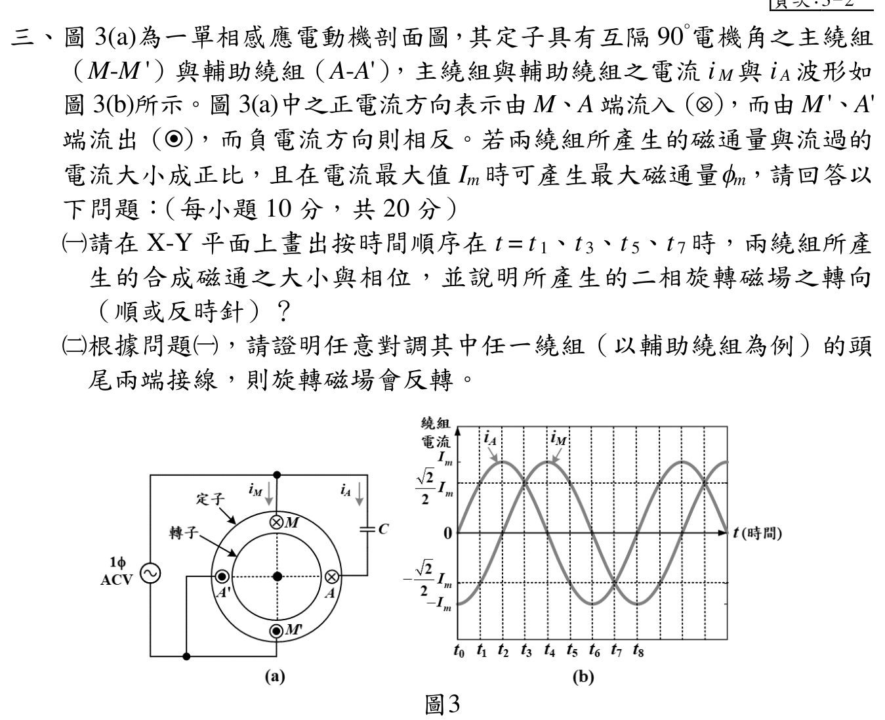

# 📝 114 年電機工程技師｜電機機械逐題詳解

> 本頁由題級 canonical 筆記組合；每題保留 QID、官方裁切、校驗狀態與完整得分型解答。

## 題目導覽
- [[#一、114 年電機機械第 1 題：氣隙磁路與電感|第 1 題：114 年電機機械第 1 題：氣隙磁路與電感]]
- [[#二、114 年電機機械第 2 題：變壓器分接頭最大功率|第 2 題：114 年電機機械第 2 題：變壓器分接頭最大功率]]
- [[#三、114 年電機機械第 3 題：單相感應電動機二相旋轉磁場|第 3 題：114 年電機機械第 3 題：單相感應電動機二相旋轉磁場]]
- [[#四、114 年電機機械第 4 題：同步發電機|第 4 題：114 年電機機械第 4 題：同步發電機]]
- [[#五、114 年電機機械第 5 題：磁阻電動機轉矩|第 5 題：114 年電機機械第 5 題：磁阻電動機轉矩]]

---

## 一、114 年電機機械第 1 題：氣隙磁路與電感

> 題級識別：`EE-114-04-1`
> canonical 來源：`canonical/EE-114-04-1.md`
> 題級校驗狀態：`verified`

![[依考科分類/04_電機機械/images/questions/PE_114年_電機機械_Q01.png]]

> 官方裁切來源：`依考科分類/04_電機機械/images/questions/PE_114年_電機機械_Q01.png`

### 考場標準作答

兩個氣隙串聯，且鐵心磁阻、漏磁與 fringe effect 忽略，因此兩個氣隙的磁通相同。由安培定律
\[
NI=\Phi\,2\frac{l_g}{\mu_0A_g}
\]
得
\[
\boxed{B_g=\frac{\Phi}{A_g}=\frac{\mu_0NI}{2l_g}=0.5027\ \mathrm T},
\qquad
\boxed{L=\frac{N\Phi}{I}=5.027\ \mathrm H}.
\]
等效磁路可畫成：

    F=NI → [ Rg1=lg/(μ0Ag) ] → [ Rg2=lg/(μ0Ag) ] → 回路
                   Φ（兩氣隙串聯，磁通相同）

### 得分點拆解

- 畫出一個磁動勢源 \(NI\) 串聯兩個相同氣隙磁阻 \(\mathcal R_g=l_g/(\mu_0A_g)\) 的等效磁路。
- 先將 \(400\ \mathrm{cm^2}\) 換成 \(0.04\ \mathrm{m^2}\)，並注意兩個氣隙要相加。
- 用 \(NI=\Phi\mathcal R_{eq}\) 求磁通，再用 \(B_g=\Phi/A_g\) 求磁通密度。
- 電感應以磁鏈除以電流，或用 \(L=N^2/\mathcal R_{eq}\)；單位分別為 T 與 H。

### 完整教學推導

#### （一）等效磁路與氣隙磁通密度

每一氣隙的磁阻為
\[
\mathcal R_g=\frac{l_g}{\mu_0A_g},
\]
所以兩個串聯氣隙的等效磁阻為
\[
\mathcal R_{eq}=2\mathcal R_g
 =2\frac{2\times10^{-3}}{(4\pi\times10^{-7})(0.04)}
 =7.95775\times10^4\ \mathrm{A\,turn/Wb}.
\]
安培定律給出
\[
\Phi=\frac{NI}{\mathcal R_{eq}}
 =\frac{400(4)}{7.95775\times10^4}
 =2.01062\times10^{-2}\ \mathrm{Wb}.
\]
因此
\[
B_g=\frac{\Phi}{A_g}
 =\frac{2.01062\times10^{-2}}{0.04}
 =0.502655\ \mathrm T.
\]

#### （二）線圈電感

磁鏈 \(\lambda=N\Phi\)，故
\[
L=\frac{\lambda}{I}=\frac{N\Phi}{I}
 =\frac{N^2}{\mathcal R_{eq}}
 =\frac{400^2}{7.95775\times10^4}
 =5.02655\ \mathrm H.
\]

### 獨立驗算

直接由兩個氣隙的磁場關係
\[
NI=H_g(2l_g)=\frac{B_g}{\mu_0}(2l_g)
\]
得到
\[
B_g=\frac{\mu_0NI}{2l_g}
 =\frac{(4\pi\times10^{-7})(400)(4)}{4\times10^{-3}}
 =0.502655\ \mathrm T,
\]
與磁阻法相同。再以 \(L I/N\) 回代磁通：
\[
\frac{(5.02655)(4)}{400}=2.01062\times10^{-2}\ \mathrm{Wb},
\]
故磁通、磁通密度與電感彼此一致。

### 常見失分

- 把兩個氣隙誤當成一個，少掉等效磁阻的倍率 2。
- 將 \(400\ \mathrm{cm^2}\) 誤寫成 \(0.004\) 或 \(4\ \mathrm{m^2}\)。
- 忘記兩個串聯氣隙的磁通相同，或把 \(B=\mu_0NI/l_g\) 少寫分母的 2。
- 以 \(L=N\Phi\) 當作電感；必須再除以 \(I\)。


---

## 二、114 年電機機械第 2 題：變壓器分接頭最大功率

> 題級識別：`EE-114-04-2`
> canonical 來源：`canonical/EE-114-04-2.md`
> 題級校驗狀態：`verified`

![[依考科分類/04_電機機械/images/questions/PE_114年_電機機械_Q02.png]]

> 官方裁切來源：`依考科分類/04_電機機械/images/questions/PE_114年_電機機械_Q02.png`

### 考場標準作答

> 幅值辨識：題圖只標示交流源 \(110\sqrt2\,\mathrm V\)，沒有時域波形，也未註明峰值或 RMS。相量圖一般採 RMS 慣例；若另採峰值解讀，必須明寫假設。以下兩種條件解均列出，不能把其中一個數值當成題圖唯一指定的答案。匝比結論不受此影響。

將二次負載折算至一次側：\(R_L'=a^2R_L\)。一次側串聯內阻為純電抗 \(j1\,\Omega\)，最大功率傳輸條件為
\[
R_L'=|X_s|=1\,\Omega.
\]
因此
\[
\boxed{a=\sqrt{\frac{1}{2.5}}=0.632456}.
\]
若依相量圖的 RMS 慣例，\(V_s=110\sqrt2\,\mathrm V_{rms}\)，一次側負載端電壓為
\[
|V_1|=110\sqrt2\frac{1}{\sqrt{1^2+1^2}}=110\ \mathrm V_{rms},
\]
故負載端
\[
\boxed{|V_o|=\frac{|V_1|}{a}=173.925\ \mathrm V_{rms}\quad\text{（若電源標示為 RMS）}}.
\]
若電源標示的是峰值，則所有 RMS 電壓縮小 \(\sqrt2\) 倍，得到 \(\boxed{|V_o|=122.984\,\mathrm V_{rms}}\)。

### 得分點拆解

- 明確採用 \(a=N_1/N_2\)，因此二次阻抗折算到一次側要乘 \(a^2\)。
- 最大功率條件是折算後電阻等於 Thevenin 阻抗的 magnitude：\(R_L'=|j1|\)。
- 只有在電源標示為峰值時，才可先換成 110 V RMS；若按相量圖常用的 RMS 慣例，源端就是 \(110\sqrt2\,\mathrm V_{rms}\)。
- 最後由理想變壓器的 \(V_1/V_o=a\) 求二次負載電壓。

### 完整教學推導

#### （一）分接頭匝數比

若電源標示的是峰值，源端 RMS 電壓為 \(V_s=110\ \mathrm V\)；Thevenin 串聯阻抗為
\[
Z_s=j1\,\Omega,\qquad |Z_s|=1\,\Omega.
\]
負載折算到一次側後為
\[
R_L'=a^2R_L=2.5a^2\ \Omega.
\]
最大功率傳輸時
\[
R_L'=|Z_s|,\qquad 2.5a^2=1,
\]
故
\[
a=\sqrt{0.4}=0.632456.
\]

#### （二）一次側與負載端電壓

在最大功率點，折算負載為 \(1\,\Omega\)，一次側電流大小為
\[
|I_1|=\frac{110}{|1+j1|}=\frac{110}{\sqrt2}=77.7817\ \mathrm A.
\]
一次側負載端電壓為
\[
|V_1|=|I_1|R_L'=77.7817\ \mathrm V.
\]
理想變壓器關係式 \(|V_1|/|V_o|=a\) 給出
\[
|V_o|=\frac{110/\sqrt2}{\sqrt{0.4}}=122.984\ \mathrm V_{rms}.
\]
此時 \(V_{o,pk}=\sqrt2|V_o|=173.925\ \mathrm V\)。若題圖的 \(110\sqrt2\,\mathrm V\) 原本是 RMS 相量值，則 \(V_o=173.925\,\mathrm V_{rms}\)；兩種情況的匝比皆為 \(\sqrt{0.4}\)。

### 獨立驗算

先回折負載：
\[
a^2R_L=(0.632456)^2(2.5)=1.0000\ \Omega,
\]
確實等於 \(|Z_s|\)。再以一次側電壓驗算：
\[
|V_1|=110\frac{1}{|1+j1|}=77.7817\ \mathrm V,
\qquad
a|V_o|=\sqrt{0.4}(122.984)=77.782\ \mathrm V.
\]
兩個獨立關係均閉合。

### 常見失分

- 把 \(a\) 誤定義成 \(N_2/N_1\)，導致阻抗折算方向顛倒。
- 把最大功率條件寫成 \(R_L'=j1\,\Omega\)；電阻應等於阻抗 magnitude 1 Ω。
- 未說明幅值慣例就直接將 \(110\sqrt2\,\mathrm V\) 視為峰值或 RMS，導致輸出電壓差一個 \(\sqrt2\)。
- 求得一次側端電壓後忘記再除以 \(a\) 才是二次負載端電壓。


---

## 三、114 年電機機械第 3 題：單相感應電動機二相旋轉磁場

> 題級識別：`EE-114-04-3`
> canonical 來源：`canonical/EE-114-04-3.md`
> 題級校驗狀態：`verified`

![[依考科分類/04_電機機械/images/questions/PE_114年_電機機械_Q03.png]]

> 官方裁切來源：`依考科分類/04_電機機械/images/questions/PE_114年_電機機械_Q03.png`



### 考場標準作答

取圖 3(a) 紙面向右為 \(+x\)、向上為 \(+y\)。依題示電流進／出紙面的方向，主繞組正電流產生 \(-x\) 磁通，輔助繞組正電流產生 \(+y\) 磁通。令 \(\vartheta=\omega(t-t_0)\)，由圖 3(b) 可讀得 \(i_M=-I_m\cos\vartheta\)、\(i_A=I_m\sin\vartheta\)，所以
\[
\boldsymbol\Phi(t)=\Phi_m\cos\vartheta\,\hat x
 +\Phi_m\sin\vartheta\,\hat y.
\]
故
\[
|\boldsymbol\Phi|=\Phi_m,
\qquad \alpha=\vartheta,
\]
磁場以固定大小逆時針旋轉。圖上 \(t_1,t_3,t_5,t_7\) 均位於兩繞組電流絕對值為 \(I_m/\sqrt2\) 的位置；合成磁通依序為右上、左上、左下、右下，相位 \(45^\circ,135^\circ,225^\circ,315^\circ\)。

考場可直接畫下列 X–Y 向量草圖；四支箭頭均由原點出發，長度皆為 \(\Phi_m\)：

```text
                  +Y
             t₃ ↖ │ ↗ t₁
                  │
       −X ────────O──────── +X
                  │
             t₅ ↙ │ ↘ t₇
                  −Y

          t₁ → t₃ → t₅ → t₇：逆時針
```

若將輔助繞組頭尾對調，\(i_A\to-i_A\)，則
\[
\boldsymbol\Phi'(t)=\Phi_m\cos\vartheta\,\hat x-\Phi_m\sin\vartheta\,\hat y,
\]
相位變成 \(-\vartheta\)，所以旋轉方向反為順時針，大小仍為 \(\Phi_m\)。

### 得分點拆解

- 交代兩繞組空間軸相差 \(90^\circ\)，以及兩電流／磁通時間相差 \(90^\circ\)。
- 由官方波形先讀出四個指定時刻兩電流皆為 \(\pm I_m/\sqrt2\)，再寫合成向量方向與 \(45^\circ\) 起始相位，並指出大小不變。
- 用 \(x\)、\(y\) 分量合成，而不是只以兩個瞬時標量相加。
- 對調任一繞組等效為該軸分量變號，最後明確說明角速度符號改變、轉向反轉。

### 完整教學推導

#### （一）正常接線的合成磁通

依圖 3(a) 的正電流箭頭與進／出紙面記號，以紙面向右、向上為正座標：主繞組正電流的中心磁通向左，輔助繞組正電流的中心磁通向上。圖 3(b) 於 \(t_0\) 有 \(i_M=-I_m,i_A=0\)，故取 \(\vartheta=\omega(t-t_0)\)，兩繞組所生磁通的座標分量為
\[
\Phi_x=-\Phi_m\frac{i_M}{I_m}=\Phi_m\cos\vartheta,
\qquad
\Phi_y=\Phi_m\frac{i_A}{I_m}=\Phi_m\sin\vartheta.
\]
其中正弦與餘弦的相位差為 \(90^\circ\)，正好配合空間軸差 \(90^\circ\)。因此
\[
\boldsymbol\Phi=\Phi_x\hat x+\Phi_y\hat y.
\]
在四個時刻：
\[
\begin{array}{c|c|c|c}
t & (i_M,i_A)/I_m & (\Phi_x,\Phi_y)/\Phi_m & \text{相位}\\ \hline
t_1 & (-1,1)/\sqrt2 & (1,1)/\sqrt2 & 45^\circ\\
t_3 & (1,1)/\sqrt2 & (-1,1)/\sqrt2 & 135^\circ\\
t_5 & (1,-1)/\sqrt2 & (-1,-1)/\sqrt2 & 225^\circ\\
t_7 & (-1,-1)/\sqrt2 & (1,-1)/\sqrt2 & 315^\circ
\end{array}
\]
四點大小都由平方和得 \(\Phi_m\)；相位隨時間增加，故由右上經左上、左下至右下，逆時針等速旋轉。

#### （二）對調輔助繞組的頭尾

對調 A、A' 後，該繞組的正方向反轉，所以
\[
\Phi_y'=-\Phi_m\sin\vartheta.
\]
新的合成向量為
\[
\boldsymbol\Phi'=\Phi_m\cos\vartheta\,\hat x
 -\Phi_m\sin\vartheta\,\hat y.
\]
其大小仍為
\[
|\boldsymbol\Phi'|=\Phi_m\sqrt{\cos^2\vartheta+\sin^2\vartheta}=\Phi_m,
\]
但相位為 \(-\vartheta\)，因此方向改為順時針。對調主繞組時同理，只是座標相位基準改變，旋轉方向仍反轉。

### 獨立驗算

以分量平方和檢查正常接線：
\[
|\boldsymbol\Phi|^2=\Phi_m^2(\cos^2\vartheta+\sin^2\vartheta)=\Phi_m^2.
\]
對調後平方和完全相同，故不改變磁通大小。再以相位導數判斷方向：
\[
\frac{d}{dt}\vartheta=+\omega,
\qquad
\frac{d}{dt}(-\vartheta)=-\omega,
\]
顯示旋轉角速度大小相同而符號相反，與接線反轉的物理結論一致。

### 常見失分

- 把兩個互相垂直的磁通當成同一直線相加，錯寫成 \(2\Phi_m\)。
- 把 \(t_1,t_3,t_5,t_7\) 誤讀成一繞組峰值、另一繞組零值；圖上這四點兩電流的量值都是 \(I_m/\sqrt2\)，相位從 \(45^\circ\) 起。
- 忽略電流波形的正負號，導致 \(t_5\) 或 \(t_7\) 的方向錯誤。
- 對調繞組後只說「磁通變小」，沒有證明大小仍為 \(\Phi_m\)。
- 將首尾對調誤認成只改變相位、不改變旋轉方向；必須展示一個空間分量變號。


---

## 四、114 年電機機械第 4 題：同步發電機

> 題級識別：`EE-114-04-4`
> canonical 來源：`canonical/EE-114-04-4.md`
> 題級校驗狀態：`verified`

![[依考科分類/04_電機機械/images/questions/PE_114年_電機機械_Q04.png]]

> 官方裁切來源：`依考科分類/04_電機機械/images/questions/PE_114年_電機機械_Q04.png`

### 考場標準作答

額定 Y 接相電壓、線電流與功率因數角為
\[
V_\phi=\frac{3200}{\sqrt3}=1847.52\,\mathrm V,
\]
\[
I_a=\frac{1000\times10^3}{\sqrt3(3200)}=180.422\,\mathrm A,
\qquad \theta=\cos^{-1}(0.9)=25.842^\circ.
\]
取 \(\underline V_\phi=1847.52\angle0^\circ\)，則 \(\underline I_a=180.422\angle-25.842^\circ\)。發電機相量方程為
\[
\underline E_f=\underline V_\phi+\underline I_a(0.1+j2.0).
\]
計算得
\[
\underline E_f=2021.05+j316.90\;\mathrm V,
\]
\[
\boxed{|E_f|=2045.74\;\mathrm{V/phase}},
\qquad
\boxed{\delta=8.91^\circ}.
\]

額定輸出實功率與電樞銅損為
\[
P_o=1000(0.9)=900\,\mathrm{kW},
\qquad P_{cu}=3I_a^2R_a=9.77\,\mathrm{kW}.
\]
故原動機輸入功率
\[
P_{in}=900+9.77+15+14=938.77\;\mathrm{kW}.
\]
四極、60 Hz 的同步機械角速度為
\[
n_s=\frac{120f}{P}=1800\,\mathrm{rpm},
\qquad \omega_m=188.496\,\mathrm{rad/s}.
\]
所以
\[
\boxed{T_{in}=\frac{938770}{188.496}=4.980\times10^3\;\mathrm{N\,m}}.
\]

### 得分點拆解

- Y 接需先把線電壓換成相電壓；額定電流由三相視在功率求得。
- 0.9 落後表示電流相角為 \(-25.842^\circ\)，並使用發電機方程 \(\underline E_f=\underline V_\phi+\underline I_a(R_a+jX_s)\)。
- 第（一）小題同時給出每相內生電壓大小與功率角。
- 第（二）小題先把輸出實功率、電樞銅損、鐵損、摩擦風阻損全部加總成機械輸入功率。
- 四極 60 Hz 的軸速為 1800 rpm；轉矩必須以機械角速度 \(188.496\,\mathrm{rad/s}\) 換算。

### 完整教學推導

#### （一）每相內生電壓與功率角

額定線電流為
\[
I_a=\frac{S}{\sqrt3V_L}
=\frac{1000\times10^3}{\sqrt3(3200)}
=180.422\,\mathrm A.
\]
因負載功率因數為 0.9 落後，
\[
\underline I_a=180.422(0.9-j\sqrt{1-0.9^2})
=162.380-j78.644\,\mathrm A.
\]
電樞阻抗壓降為
\[
\underline I_a(0.1+j2.0)=173.53+j316.90\,\mathrm V.
\]
加上端相電壓 \(1847.52\angle0^\circ\) 後，
\[
\underline E_f=2021.05+j316.90\,\mathrm V.
\]
故
\[
|E_f|=\sqrt{2021.05^2+316.90^2}=2045.74\,\mathrm V,
\]
\[
\delta=\tan^{-1}\frac{316.90}{2021.04}=8.91^\circ.
\]

#### （二）原動機所需轉矩

發電機的機械輸入必須供應端輸出功率及題目所列損失：
\[
P_{in}=P_o+P_{cu}+P_{core}+P_{fw}.
\]
其中
\[
P_{cu}=3(180.422)^2(0.1)=9.766\,\mathrm{kW},
\]
所以
\[
P_{in}=900+9.766+15+14=938.766\,\mathrm{kW}.
\]
再由 \(T=P/\omega_m\) 得原動機轉矩約 \(4.98\,\mathrm{kN\,m}\)。

### 獨立驗算

內生電壓虛部為正，因此 \(\underline E_f\) 超前端電壓，符合發電機正常送出實功率時 \(\delta>0\) 的物理方向。用未四捨五入的相量核對跨氣隙實功率：
\[
P_{gap}=3\operatorname{Re}(\underline E_f\underline I_a^*)
=3\operatorname{Re}\!\left[(\underline V_\phi+(R_a+jX_s)\underline I_a)\underline I_a^*\right]
=3V_\phi I_a\cos\theta+3I_a^2R_a
=900+9.765625=909.765625\,\mathrm{kW}.
\]
電抗項 \(jX_s I_a^2\) 的實部為零，故上述相量驗算與功率平衡完全一致；鐵損及摩擦風阻損再加在機械輸入端。

以完整功率平衡回代：
\[
T_{in}\omega_m=(4.9803\times10^3)(188.496)
\approx938.77\,\mathrm{kW},
\]
與損失加總結果一致。

### 常見失分

- Y 接仍直接使用 \(3.2\,\mathrm{kV}\) 作每相端電壓。
- 把 0.9 落後電流寫成 \(+25.842^\circ\)，或套用馬達的相量方程而把阻抗壓降減掉。
- 只給 \(|E_f|\) 而漏答功率角 \(\delta\)。
- 機械輸入只加鐵損與風阻損，漏掉三相電樞銅損。
- 用 60 Hz 的電氣角速度 \(2\pi60\) 直接算四極機械轉矩；本題軸速為 1800 rpm。


---

## 五、114 年電機機械第 5 題：磁阻電動機轉矩

> 題級識別：`EE-114-04-5`
> canonical 來源：`canonical/EE-114-04-5.md`
> 題級校驗狀態：`verified`

![[依考科分類/04_電機機械/images/questions/PE_114年_電機機械_Q05.png]]

> 官方裁切來源：`依考科分類/04_電機機械/images/questions/PE_114年_電機機械_Q05.png`


> 官方題幹明給 \(T=\tfrac12\phi^2\,d\mathcal R/d\theta\)。本解依此正號約定作答；舊解使用負號，雖未改變最大轉矩的絕對值，卻把第（一）小題瞬時轉矩與平均轉矩的符號寫反。下列瞬時式採週期穩態、無直流磁通偏置；若未給初始磁通，電壓積分另可有常數 \(\phi_{dc}\)，須先聲明此常用假設。

> 官方 Hint 的 \(\sin\alpha\sin\beta=[\sin(\alpha+\beta)+\sin(\alpha-\beta)]/2\) 是誤植（取 \(\alpha=\beta=\pi/2\) 即不成立）。本題實際需要的是 \(\cos u\sin v=[\sin(v+u)+\sin(v-u)]/2\)；不要照抄錯誤恆等式。

### 考場標準作答

採週期穩態、無直流磁通偏置。由 \(v=N\,d\phi/dt\)，\(V_m=110\sqrt2\)、\(\omega=120\pi\)、\(N=50\)，得
\[
\phi(t)=-\frac{V_m}{N\omega}\cos\omega t
 =-\Phi_m\cos\omega t,
\qquad \Phi_m=8.2530\times10^{-3}\ \mathrm{Wb}.
\]
因
\[
\mathcal R(\theta)=\mathcal R_0-\mathcal R_1\cos4\theta,
\qquad
\frac{d\mathcal R}{d\theta}=4\mathcal R_1\sin4\theta,
\]
故
\[
\boxed{T(t)=+2\mathcal R_1\Phi_m^2\cos^2(\omega t)\sin(4\omega_mt+4\delta)}.
\]
在 \(\omega_m=\pm\omega/2=\pm60\pi\ \mathrm{rad/s}\) 時取平均，
\[
\boxed{T_{avg}=\tfrac12\mathcal R_1\Phi_m^2\sin4\delta},
\qquad
\boxed{|T_{avg,max}|=\frac12\mathcal R_1\Phi_m^2=3.4055\ \mathrm{N\cdot m}},
\]
\[
\boxed{|P_{m,max}|=|T_{avg,max}\omega_m|=0.642\ \mathrm{kW}}.
\]

### 得分點拆解

- 由電壓積分得到磁通，不能直接把電壓峰值當磁通峰值。
- 先對 \(\mathcal R(\theta)\) 微分，並依官方提示保留轉矩式的正號與 \(1/2\)。
- 代入 \(\theta=\omega_mt+\delta\) 後，轉矩必須保留 \(\cos^2\omega t\) 因子。
- 在 \(|\omega_m|=\omega/2\) 時以三角恆等式取平均，再對 \(\delta\) 取最大值。

### 完整教學推導

#### （一）磁通與瞬時轉矩

由題給正弦電壓
\[
v(t)=V_m\sin\omega t=N\frac{d\phi}{dt},
\]
積分的一般式為 \(\phi(t)=\phi_{dc}-V_m\cos(\omega t)/(N\omega)\)。若採無直流磁通偏置的週期穩態，得
\[
\phi(t)=-\frac{V_m}{N\omega}\cos\omega t
 =-\Phi_m\cos\omega t.
\]
題面未另給初始磁通；若保留 \(\phi_{dc}\)，瞬時轉矩應把 \(\phi(t)^2\) 完整代回官方轉矩式。\(\phi_{dc}\) 的常數項及與 \(\cos\omega t\) 的交叉項在 \(\omega_m=\pm\omega/2\) 的一週期平均皆為零，因此後面的同步平均轉矩最大量值不受此偏置影響。
數值為
\[
\Phi_m=\frac{110\sqrt2}{50(120\pi)}
 =8.2530\times10^{-3}\ \mathrm{Wb}.
\]
磁阻函數微分為
\[
\frac{d\mathcal R}{d\theta}=4\mathcal R_1\sin4\theta,
\qquad \theta=\omega_mt+\delta.
\]
由官方題示轉矩公式（此處以題目指定的正方向為準）
\[
T=+\frac12\phi^2\frac{d\mathcal R}{d\theta},
\]
代入 \(\phi^2=\Phi_m^2\cos^2\omega t\) 得
\[
T(t)=+2\mathcal R_1\Phi_m^2\cos^2(\omega t)
 \sin(4\omega_mt+4\delta).
\]

#### （二）同步轉速下的平均轉矩與機械功率

令 \(\omega_m=+\omega/2\)，則
\[
4\omega_mt=2\omega t,
\qquad
\cos^2\omega t=\frac{1+\cos2\omega t}{2}.
\]
乘積取一週期平均時，只有 \(\cos2\omega t\sin(2\omega t+4\delta)\) 的直流項保留，因此
\[
\left\langle\cos2\omega t\sin(2\omega t+4\delta)\right\rangle
=\frac12\sin4\delta.
\]
連同 \(\cos^2\omega t\) 展開的係數 \(1/2\)，可得
\[
T_{avg}=+\frac{1}{2}\mathcal R_1\Phi_m^2\sin(4\delta).
\]
\(\omega_m=-\omega/2\) 時，對固定的 \(\delta\) 仍得到同一平均轉矩式；機械功率 \(T_{avg}\omega_m\) 的符號才因轉向而改變。若求正向最大機械功率，\(\omega_m>0\) 選 \(\sin4\delta=1\)，\(\omega_m<0\) 選 \(\sin4\delta=-1\)。最大轉矩量值在 \(|\sin4\delta|=1\) 時出現：
\[
|T_{avg,max}|=\frac{1}{2}\mathcal R_1\Phi_m^2
=\frac12(1\times10^5)(8.2530\times10^{-3})^2
 =3.4055\ \mathrm{N\cdot m}.
\]
亦可直接記為
\[
|T_{avg,max}|=\frac{1}{2}\mathcal R_1\Phi_m^2=3.4055\;\mathrm{N\,m}.
\]
又
\[
|\omega_m|=\frac{\omega}{2}=60\pi\ \mathrm{rad/s},
\]
故
\[
|P_{m,max}|=|T_{avg,max}\omega_m|
 =3.4055(60\pi)=641.9\ \mathrm W
 \approx0.642\;\mathrm{kW}.
\]

### 獨立驗算

先做量綱與數值檢查：
\[
\frac{V_m}{N\omega}
 =\frac{155.563}{50(376.991)}
 =8.2530\times10^{-3}\ \mathrm{Wb}.
\]
再由最大轉矩回算最大機械功率：
\[
3.4055\ \mathrm{N\cdot m}\times188.496\ \mathrm{rad/s}
 =641.9\ \mathrm W.
\]
此值與直接代入 \(|T_{avg,max}\omega_m|\) 相同；而平均轉矩的係數為 \(1/2\)，正是 \(\cos^2\omega t\) 的平均與混頻項共同留下的結果。

### 常見失分

- 漏掉積分中的 \(1/\omega\)，或把 \(V_m\) 誤當 RMS 值。
- 對 \(-\mathcal R_1\cos4\theta\) 微分時漏掉 4，或沿用與官方提示相反的轉矩符號。
- 照抄官方 Hint 誤植的 \(\sin\alpha\sin\beta\) 公式；應改用正確的 \(\cos u\sin v\) 積化和差式。
- 將瞬時轉矩的振幅 \(2\mathcal R_1\Phi_m^2\) 直接當平均轉矩，漏掉同步取平均的 \(1/2\)。
- 把 \(\omega/2\) 誤寫成 \(\omega\)，使最大機械功率大一倍。
- 未說明 \(\delta\) 決定正負方向，只報絕對值而不交代最大條件 \(|\sin4\delta|=1\)。
