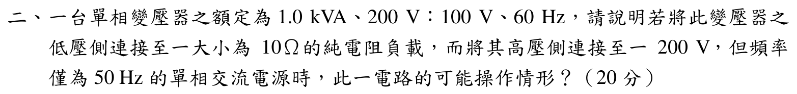

# 104 年電機機械第 2 題｜60 Hz 變壓器接 50 Hz 電源

## 題目與額定條件

單相變壓器額定 $1.0\,\mathrm{kVA}$、$200/100\,\mathrm V$、$60\,\mathrm{Hz}$；低壓側接 $10\,\Omega$ 純電阻，高壓側改接 $200\,\mathrm V$、$50\,\mathrm{Hz}$ 電源。題目要求說明可否操作及物理影響，並非要求由未提供的磁化曲線猜測激磁電流倍數。

## 1. 伏赫比與磁通

正弦激磁下

$$
V_1=4.44fN_1\Phi_{\max}
\quad\Longrightarrow\quad
\Phi_{\max}\propto\frac{V_1}{f}.
$$

電壓不變而頻率由 60 Hz 降至 50 Hz，因此

$$
\frac{\Phi_{\max,50}}{\Phi_{\max,60}}
 =\frac{200/50}{200/60}=\frac{60}{50}=1.20.
$$

鐵心峰值磁通（及近似磁通密度）增加 20%。原本已按 60 Hz 額定伏赫比設計，增加 20% 很可能進入飽和區；激磁電流會變成非正弦尖峰，且其實際倍數必須由磁化曲線與鐵心資料決定，不能直接宣稱固定為 3～5 倍。

## 2. 負載電流與反映阻抗

若先忽略內阻、漏抗及飽和造成的電壓畸變，匝數比為

$$
a=\frac{N_1}{N_2}=\frac{200}{100}=2.
$$

低壓端約為 $100\,\mathrm V$，故

$$
I_2=\frac{100}{10}=10\,\mathrm A,
\qquad
S_2=100\times10=1000\,\mathrm{VA}=1.0\,\mathrm{kVA}.
$$

負載反映到高壓側為

$$
R'_L=a^2R_L=2^2(10)=40\,\Omega,
\qquad
I'_2=\frac{200}{40}=5\,\mathrm A.
$$

因此在理想近似下，負載本身仍達額定 kVA；但額外的飽和激磁電流會增加一次側 RMS 電流與銅損，使實際可用負載容量低於額定值。

## 3. 損耗、溫升與安全操作

- 磁滯損與渦流損均受磁通密度影響；磁通增加會使鐵損上升，且飽和時波形畸變更嚴重。
- 激磁電流尖峰增加一次側銅損、噪音與溫升；二次側負載電流仍約 10 A 並不代表變壓器仍可安全滿載。
- 若要在 50 Hz 保持原額定磁通，應將高壓側電壓降為

$$
V_{1,\,safe}=200\left(\frac{50}{60}\right)=166.7\,\mathrm V,
$$

或依製造商的伏赫比／溫升曲線降額運轉。未提供磁化曲線時，不能給出唯一的「降額百分比」或激磁電流倍數。

## 結論與校驗紀錄

- 200 V、50 Hz 直接接入是過高伏赫比操作，峰值磁通增加 20%，有飽和、尖峰激磁電流、鐵損與過熱風險，不宜長時間以 1.0 kVA 額定負載運轉。
- 理想負載反映計算為低壓 $I_2=10$ A、高壓 $I'_2=5$ A；這只是負載分量，必須再加上飽和激磁分量。
- 已依官方題目條件完成伏赫比、匝數比、負載反映與物理影響的獨立回代；移除原詳解未有依據的「激磁電流 3～5 倍」與固定 80% 降額說法，狀態升級為 `verified`。
