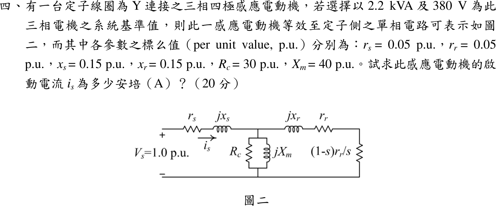

# 104 年電機機械第 4 題｜感應電動機起動電流

## 已知與所求

Y 接三相四極感應電動機，系統基準 \(S_b=2.2\ \mathrm{kVA}\)、\(V_b=380\ \mathrm V\)；標么值 \(r_s=r_r=0.05\)、\(x_s=x_r=0.15\)、\(R_c=30\)、\(X_m=40\)，\(V_s=1.0\ \mathrm{pu}\)。求起動電流 \(i_s\)（A）。

## 考場標準作答

圖中轉子支路為 \(jx_r\)、\(r_r\) 與負載電阻 \((1-s)r_r/s\) 三者串聯，激磁支路 \(R_c\parallel jX_m\) 位於定子阻抗之後。起動 \(s=1\)：$(1-s)r_r/s=0$，但串聯的 \(r_r\) 仍在：
\[
Z_r=r_r+jx_r=0.05+j0.15,\qquad
Z_m=R_c\parallel jX_m=\frac{j1200}{30+j40}=19.2+j14.4
\]
\[
Z_p=Z_r\parallel Z_m=0.05029+j0.14900,\qquad
Z_{in}=0.05+j0.15+Z_p=0.10029+j0.29900\ \mathrm{pu}
\]
\[
|Z_{in}|=0.31537,\quad i_{s,pu}=\frac{1}{0.31537}=3.171\ \mathrm{pu}
\]
\[
I_b=\frac{2200}{\sqrt3(380)}=3.3426\ \mathrm A,\qquad
\boxed{i_s=3.171(3.3426)=10.60\ \mathrm A}
\]

## 驗算

網目法：以 \(V_s=1\) 對兩網目列 \(2\times2\) 方程，\(\begin{bmatrix}Z_s+Z_m&-Z_m\\-Z_m&Z_m+Z_r\end{bmatrix}\begin{bmatrix}I_1\\I_2\end{bmatrix}=\begin{bmatrix}1\\0\end{bmatrix}\)（\(Z_s=0.05+j0.15\)），解得 \(I_1=3.171\angle-71.46^\circ\ \mathrm{pu}\)、\(|I_2|=3.154\ \mathrm{pu}\)；功率平衡：\(\mathrm{Re}(V_sI_1^*)=1.0083\)，等於 \(|I_1|^2r_s+|I_2|^2r_r+|V_p|^2/R_c=0.5027+0.4973+0.0083=1.0083\)（\(V_p=Z_m(I_1-I_2)\)）。

## 失分點

- 起動時只有 $(1-s)r_r/s$ 為零，串聯的 \(r_r\) 不能省；寫成 \(Z_r=jx_r\) 會得約 11 A，偏高。
- Y 接線電流為 \(I_b=S_b/(\sqrt3V_b)\)，不是 \(S_b/V_b\)。
