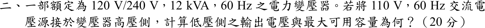

# 105 年電機機械第 2 題｜變壓器降壓使用

## 考場標準作答

匝數比 \(a=240/120=2\)。高壓側（240 V 繞組）接 110 V：
\[
\boxed{V_{L}=\frac{110}{2}=55\ \mathrm V}
\]
繞組容量受額定電流（溫升）限制，額定電流 \(I_H=\dfrac{12000}{240}=50\ \mathrm A\)、\(I_L=\dfrac{12000}{120}=100\ \mathrm A\) 不變：
\[
\boxed{S_{\max}=110(50)=55(100)=5500\ \mathrm{VA}=5.5\ \mathrm{kVA}}
\]
（電壓降為 \(110/240=45.8\%\)，容量按比例降為額定的 \(45.8\%\)。）

## 驗算

磁通 \(\propto V/f\)：\(110/240=55/120=0.4583\)，兩側一致且未飽和（\(f\) 仍 60 Hz）。\(5.5/12=0.4583\)，與電壓比相同。

## 失分點

- 容量不可仍答 12 kVA；電壓降低但電流上限不變，\(S=VI\) 隨電壓降低。
- 高壓側是 240 V 繞組，輸出為降壓 55 V，不是升壓到 220 V。
