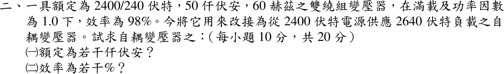

# 106 年電機機械第 2 題｜雙繞組變壓器改接自耦變壓器

## 已知與所求

2400/240 V、50 kVA、60 Hz 雙繞組變壓器，滿載 PF 1.0 時效率 98%。改接為由 2400 V 電源供應 2640 V 負載的自耦變壓器。求自耦變壓器（一）額定 kVA；（二）效率。

## 考場標準作答

### （一）額定容量

2640 = 2400 + 240：2400 V 繞組為公共繞組，240 V 繞組與其電壓相加作串聯繞組，負載跨兩者。串聯繞組額定電流
\[
I_{se}=\frac{50\,000}{240}=208.33\ \mathrm A=I_{out}
\]
\[
\boxed{S_{auto}=V_{out}I_{out}=2640(208.33)=550.0\text{ kVA}}
\]

### （二）效率

雙繞組滿載損耗（輸出 50 kW，PF 1.0）：
\[
P_{loss}=\frac{50}{0.98}-50=1.0204\ \mathrm{kW}
\]
改接後各繞組電壓、電流仍為額定，損耗不變；自耦輸出 \(550\ \mathrm{kW}\)（PF 1.0）：
\[
\boxed{\eta_{auto}=\frac{550}{550+1.0204}=99.81\%}
\]

## 驗算

輸入電流 \(I_{in}=550\,000/2400=229.17\ \mathrm A\)，公共繞組電流 \(229.17-208.33=20.83\ \mathrm A=50\,000/2400\)，兩繞組都恰為額定；容量比 \(S_{auto}/S_{2w}=V_{out}/(V_{out}-V_{in})=2640/240=11\)，\(50\times11=550\ \mathrm{kVA}\)。

## 失分點

- 以 2400 V 繞組電流 20.83 A 乘 2640 V，得 55 kVA（限制電流是串聯 240 V 繞組的 208.33 A）。
- 把 98% 直接當成自耦效率；損耗不變、輸出變 11 倍，效率提高到 99.81%。
- 損耗用 \(50(1-0.98)=1.0\ \mathrm{kW}\)：98% 效率是輸出對輸入，損耗為 \(50/0.98-50\)。
