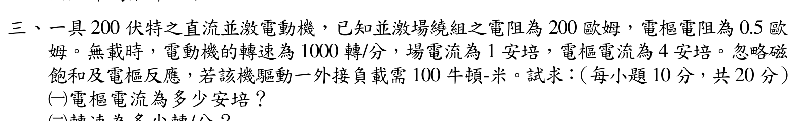

# 106 年電機機械第 3 題｜並激馬達外接負載轉矩

> 題目給的是外接軸負載轉矩，並另給無載電樞電流 \(4\,\mathrm A\)。若未指定旋轉損失如何隨轉速變化，嚴格說沒有唯一負載工作點；以下主解採考場常用的「空載損失轉矩近似不變」，並列出把 100 N·m 視為電磁轉矩時的另一組數值，兩者不可混用。

## 考場標準作答

無載反電勢與角速度為

\[
E_{a0}=200-(4)(0.5)=198\,\mathrm V,
\qquad
\omega_0=\frac{2\pi(1000)}{60}=104.72\,\mathrm{rad/s}.
\]

因忽略磁飽和與電樞反應，磁通固定：

\[
K\Phi=\frac{E_{a0}}{\omega_0}=1.8908\,\mathrm{V\cdot s/rad}.
\]

無載時仍有電磁轉矩 \(T_{e0}=K\Phi I_{a0}=7.563\,\mathrm{N\cdot m}\)，用以克服旋轉損失。若此損失轉矩於負載後近似不變，則

\[
K\Phi I_a=100+K\Phi(4)
\quad\Longrightarrow\quad
\boxed{I_a=4+\frac{100}{1.8907607}=56.89\,\mathrm A}.
\]

負載反電勢與轉速為

\[
\boxed{E_a=200-(56.89)(0.5)=171.56\,\mathrm V},
\qquad
\boxed{n=1000\frac{171.56}{198}=866.4\,\mathrm{rpm}}.
\]

若考題慣例把 \(100\,\mathrm{N\cdot m}\) 直接視為電磁轉矩且忽略旋轉損失，才得到 \(I_a=100/(K\Phi)=52.89\,\mathrm A\)、\(n=876.5\,\mathrm{rpm}\)。作答時須先寫明此簡化，不能一面承認無載 \(4\,\mathrm A\) 的損失、一面令外接轉矩等於全部電磁轉矩。

## 得分點拆解

- 由無載電樞電流先扣除 \(I_{a0}R_a\)，求得無載反電勢 198 V。
- 把 1000 rpm 換成 rad/s，利用無載資料建立 \(K\Phi\)。
- （一）分清題目的外接軸負載轉矩與電磁轉矩；無載 \(4\,\mathrm A\) 對應克服旋轉損失的電磁轉矩，若採定損失轉矩近似，須加到 100 N·m 上。
- （二）由負載 KVL 求反電勢與轉速；每一步保留單位，並明示固定磁通假設來自「忽略磁飽和及電樞反應」。
- 題面未給旋轉損失的速度函數；寫出所採近似，並將直接令 \(T_e=100\,\mathrm{N\cdot m}\) 的結果標為另一模型，避免冒稱唯一精確解。

## 完整教學推導

### 三、直流並激電動機負載運轉分析（20 分）

### 📌 題目與已知條件
- 額定 $200\text{ V}$ 直流並激電動機，$R_f = 200\ \Omega, R_a = 0.5\ \Omega$。
- 無載試驗：$n_{nl} = 1000\text{ rpm}, I_f = 1.0\text{ A}, I_{a,nl} = 4.0\text{ A}$。
- 外接負載轉矩 $T_L = 100\text{ N}\cdot\text{m}$。忽略磁飽和與電樞反應。

* **(一)** 求負載時之電樞電流 $I_a$ 為多少安培？（10 分）
* **(二)** 求負載時之轉速 $n$ 為多少轉/分？（10 分）

---

### ✏️ 步驟式詳細數學推導
1. **反電動勢常數 $K\Phi$**：
   $$E_{a,nl} = V_t - I_{a,nl} R_a = 200 - (4.0 \times 0.5) = \mathbf{198.0\text{ V}}$$
   $$\omega_{nl} = \frac{2\pi \times 1000}{60} = \frac{100\pi}{3} \approx 104.72\text{ rad/s}$$
   $$K\Phi = \frac{E_{a,nl}}{\omega_{nl}} = \frac{198.0}{104.72} = \mathbf{1.8908\text{ V}\cdot\text{s/rad}}$$
2. **負載狀態計算（空載損失轉矩不變的近似）**：
   無載 \(I_{a0}=4.0\,\mathrm A\) 產生 \(T_{e0}=K\Phi I_{a0}\approx7.563\,\mathrm{N\cdot m}\)，此時軸上外接負載為零，所以這部分電磁轉矩用以克服旋轉損失。若損失轉矩在新轉速附近近似不變，則
   $$T_e=T_L+T_{\mathrm{rot}}\approx100+K\Phi(4),$$
   $$\mathbf{I_a=\frac{T_e}{K\Phi}=4+\frac{100}{1.8907607}\approx\mathbf{56.89\text{ A}}}.$$
   負載反電動勢：
   $$E_a = V_t - I_a R_a = 200 - (56.8888 \times 0.5) \approx \mathbf{171.56\text{ V}}.$$
   負載轉速：
   $$\omega_m = \frac{E_a}{K\Phi} \approx 90.734\text{ rad/s},$$
   $$\mathbf{n = \omega_m \frac{60}{2\pi} \approx \mathbf{866.4\text{ rpm}}}.$$

   題面只說忽略磁飽和和電樞反應，沒有說忽略旋轉損失，也沒有給損失轉矩隨轉速的函數。上式是常用近似，不是由原題資料嚴格唯一決定的工作點。若另採「100 N·m 就是電磁轉矩、負載時忽略旋轉損失」模型，則 \(I_a=52.89\,\mathrm A\)、\(n=876.5\,\mathrm{rpm}\)；此模型不可與無載損失轉矩相加的式子混寫。

---

### 🎯 第三題 滿分關鍵與結論
- **定空載損失轉矩近似下的電樞電流**：\(I_a\approx\mathbf{56.89\,\mathrm A}\)。
- **同一近似下的負載轉速**：\(n\approx\mathbf{866.4\,\mathrm{rpm}}\)。
- **若另把 100 N·m 當電磁轉矩**：\(I_a\approx52.89\,\mathrm A\)、\(n\approx876.5\,\mathrm{rpm}\)；須明示改採的模型。

---

## 獨立驗算

- 官方題目裁切：`依考科分類/04_電機機械/images/questions/PE_106年_電機機械_Q03.png`
- 年度詳解來源：`📝 個人題解與錯題本/04_電機機械/106年_電機機械_全卷完整詳細題解.md`
- 狀態：`needs_manual_review`；公式與兩組條件值已回代，但題目未給旋轉損失隨速模型，不能宣稱負載工作點有唯一數值解。
以未四捨五入的 \(K\Phi=198/(1000\cdot2\pi/60)=1.8907607\) 計算，定損失轉矩近似給出

\[
I_a=4+\frac{100}{K\Phi}=56.8888\,\mathrm A,\qquad
E_a=200-0.5I_a=171.5556\,\mathrm V.
\]

回代軸上轉矩差與反電勢：

\[
K\Phi(I_a-4)=100.000\,\mathrm{N\cdot m},\qquad
K\Phi\frac{2\pi(866.4425)}{60}=171.5556\,\mathrm V.
\]

由固定磁通比例式也可直接驗證轉速：

\[
\frac{n}{1000}=\frac{E_a}{E_{a0}}
=\frac{171.5556}{198},
\]

得到 \(n=866.44\,\mathrm{rpm}\)，與 \(K\Phi\) 路徑一致。若損失模型不同，這組負載結果也會改變；已知無載點只能固定該點的損失功率或轉矩，不能單獨推出其在所有轉速的函數。

## 常見失分

- 直接用端電壓 200 V 除以無載角速度，漏掉無載電樞壓降。
- rpm 未換成 rad/s 就計算 \(K\Phi\)，導致轉矩常數錯誤。
- 求得負載電流後仍用無載反電勢 198 V 算轉速。
- 將並激場電流 1 A 與電樞電流混加；本題的 \(I_a\) 已明確給定／求得。
- 把外接負載轉矩直接等同電磁轉矩，卻又用 \(4\,\mathrm A\) 無載電流表示已有旋轉損失；須明確寫出採用的損失近似。
