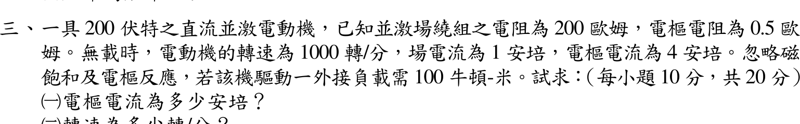

# 106 年電機機械第 3 題｜並激馬達外接負載轉矩

## 已知與所求

200 V 直流並激電動機，\(R_f=200\ \Omega\)、\(R_a=0.5\ \Omega\)；無載時轉速 1000 rpm、場電流 1 A、電樞電流 4 A；忽略磁飽和與電樞反應。驅動一外接負載需 100 N·m。求（一）電樞電流；（二）轉速。

## 考場標準作答

題目給的是外接軸負載轉矩，並另給無載電樞電流 4 A（代表無載時仍有旋轉損失）；損失模型未給，主解採「空載損失轉矩近似不變」，另一模型列於條件與疑義，兩者不可混用。

無載反電勢與磁通常數（\(I_f=200/200=1\ \mathrm A\)，磁通固定）：
\[
E_{a0}=200-4(0.5)=198\ \mathrm V,\qquad
\omega_0=\frac{2\pi(1000)}{60}=104.72\ \mathrm{rad/s},\qquad
K\Phi=\frac{198}{104.72}=1.8907607\ \mathrm{V\cdot s/rad}
\]
無載電磁轉矩 \(K\Phi(4)=7.563\ \mathrm{N\cdot m}\) 用來克服旋轉損失；損失轉矩不變時，電磁轉矩為外接負載加損失轉矩：

### （一）電樞電流

\[
K\Phi I_a=100+K\Phi(4)\ \Rightarrow\
\boxed{I_a=4+\frac{100}{1.8907607}=56.89\ \mathrm A}
\]

### （二）轉速

\[
E_a=200-56.89(0.5)=171.56\ \mathrm V,\qquad
\boxed{n=1000\frac{171.56}{198}=866.4\ \mathrm{rpm}}
\]

另一模型（旋轉損失忽略，直接令 \(T_e=100\ \mathrm{N\cdot m}\)）：\(I_a=100/K\Phi=52.89\ \mathrm A\)，\(E_a=173.56\ \mathrm V\)，\(n=876.5\ \mathrm{rpm}\)。

## 驗算

由轉矩–轉速直線 \(\omega=(V_t-R_aT_e/K\Phi)/K\Phi\) 回算：\(T_e=100+7.563=107.563\ \mathrm{N\cdot m}\) 給 \(n=866.44\ \mathrm{rpm}\)；\(T_e=100\ \mathrm{N\cdot m}\) 給 \(876.54\ \mathrm{rpm}\)。同一直線代 \(T_e=7.563\ \mathrm{N\cdot m}\) 得 1000 rpm，吻合無載點。

## 失分點

- 直接用 200 V 除以無載角速度求 \(K\Phi\)，漏掉無載電樞壓降 \(4(0.5)=2\ \mathrm V\)（正確 \(E_{a0}=198\ \mathrm V\)）。
- 求得 \(I_a\) 後仍用 198 V 算轉速，沒有重算負載反電勢。
- 把外接負載轉矩直接當電磁轉矩，卻又承認無載有 4 A 損失電流；要先寫明採用哪一種損失模型。

## 條件與疑義

題面只說忽略磁飽和與電樞反應，沒有說忽略旋轉損失，也沒有給損失轉矩隨轉速的關係；無載點只能固定該點的損失，不能單獨推出其在所有轉速的函數，因此沒有唯一數值解。

| 模型 | 電樞電流 | 轉速 |
| --- | --- | --- |
| 空載損失轉矩近似不變（主解） | 56.89 A | 866.4 rpm |
| 旋轉損失忽略（\(T_e=100\ \mathrm{N\cdot m}\)） | 52.89 A | 876.5 rpm |

需取得官方評分參考確認命題口徑。
