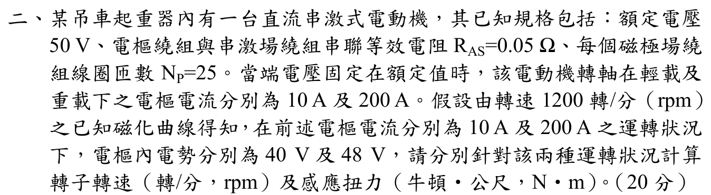

# 107 年電機機械第 2 題｜直流串激電動機工作點

> ✅ 已逐字核對官方裁切圖：額定端電壓為 $50\,\mathrm V$，電樞與串激場總電阻 $R_{AS}=0.05\,\Omega$；在 $1200\,\mathrm{rpm}$ 磁化曲線上，$I_a=10\,\mathrm A$ 與 $200\,\mathrm A$ 時的內電勢分別為 $40\,\mathrm V$ 與 $48\,\mathrm V$。原稿誤讀為 240 V 且把曲線電勢直接當作工作點電勢，已更正。

## 考場標準作答

原圖指定 \(V_t=50\,\mathrm V\)、\(R_{AS}=0.05\,\Omega\)。磁化曲線是在 \(n_0=1200\,\mathrm{rpm}\) 下給定的參考反電勢 \(E_{a0}\)；對每個已知電流，先求工作點反電勢 \(E_a=V_t-I_aR_{AS}\)，再用同磁通比例 \(n=n_0E_a/E_{a0}\)。感應轉矩即電磁轉矩 \(T_e=E_aI_a/(2\pi n/60)\)。

\[
\begin{array}{c|c|c|c|c}
I_a & E_{a0}\;(1200\,\mathrm{rpm}) & E_a & n & T_e\\
\hline
10\,\mathrm A & 40\,\mathrm V & 49.5\,\mathrm V &
\boxed{1485\,\mathrm{rpm}} & \boxed{3.183\,\mathrm{N\cdot m}}\\
200\,\mathrm A & 48\,\mathrm V & 40.0\,\mathrm V &
\boxed{1000\,\mathrm{rpm}} & \boxed{76.394\,\mathrm{N\cdot m}}
\end{array}
\]

其中 \(E_{a0}\) 不是實際工作點的 \(E_a\)；題目問感應轉矩，不另扣題面未給的旋轉損失。

## 得分點拆解

- 由官方圖分清 50 V 額定端電壓、0.05 Ω 總串聯電阻及 1200 rpm 磁化曲線參考值。
- 兩個電流各自先列 \(E_a=V_t-I_aR_{AS}\)，不能直接把表列 40 V／48 V 當工作點反電勢。
- 同一電流下磁通相同，才可用 \(n/1200=E_a/E_{a0}\)；10 A 與 200 A 的磁通不可互換。
- 由 \(P_{em}=E_aI_a\) 除以各工作點角速度求感應轉矩，單位寫 N·m。

## 完整教學推導

### 1. 串激電動機的工作方程

端電壓固定為 $V_t=50\,\mathrm V$。忽略電刷壓降時，實際工作點的反電動勢為
\[
E_a=V_t-I_aR_{AS}.
\]
磁化曲線給的是同一磁通下、參考轉速 $n_0=1200\,\mathrm{rpm}$ 的電勢 $E_{a0}$；因 $E_a\propto\Phi n$，故
\[
n=n_0\frac{E_a}{E_{a0}}.
\]
電磁轉矩可由轉換功率回算：
\[
T_e=\frac{E_aI_a}{\omega},\qquad \omega=\frac{2\pi n}{60}.
\]
這樣同時納入了串激場磁通隨電流變化，以及端電壓和電阻壓降的影響。

### 2. 輕載工作點 $I_a=10\,\mathrm A$

磁化曲線參考值為 $E_{a0}=40\,\mathrm V$，因此
\[
E_a=50-10(0.05)=49.5\,\mathrm V,
\]
\[
n=1200\frac{49.5}{40}=1485\,\mathrm{rpm},
\qquad
\omega=\frac{2\pi(1485)}{60}=155.508\,\mathrm{rad/s}.
\]
\[
\boxed{T_e=\frac{49.5(10)}{155.508}=3.183\,\mathrm{N\cdot m}}.
\]

### 3. 重載工作點 $I_a=200\,\mathrm A$

磁化曲線參考值為 $E_{a0}=48\,\mathrm V$，因此
\[
E_a=50-200(0.05)=40.0\,\mathrm V,
\]
\[
n=1200\frac{40}{48}=1000\,\mathrm{rpm},
\qquad
\omega=\frac{2\pi(1000)}{60}=104.720\,\mathrm{rad/s}.
\]
\[
\boxed{T_e=\frac{40(200)}{104.720}=76.394\,\mathrm{N\cdot m}}.
\]

## 獨立驗算

\[
\boxed{(n_{10},T_{10})=(1485\,\mathrm{rpm},\ 3.183\,\mathrm{N\cdot m})},
\]
\[
\boxed{(n_{200},T_{200})=(1000\,\mathrm{rpm},\ 76.394\,\mathrm{N\cdot m})}.
\]

回代端電壓：$49.5+10(0.05)=50\,\mathrm V$、$40+200(0.05)=50\,\mathrm V$；回代轉換功率：$3.183(2\pi\cdot1485/60)=49.5\times10$ W、$76.394(2\pi\cdot1000/60)=40\times200$ W。題目給的每極匝數 $N_P=25$ 不需另用，因磁化曲線已直接提供各電流對應的參考內電勢；若硬套線性 $\Phi\propto I_a$ 會違反圖上已顯示的飽和特性。

## 獨立校驗紀錄

- 官方題目裁切：`依考科分類/04_電機機械/images/questions/PE_107年_電機機械_Q02.png`
- 狀態：`verified`
- 檢核項目：題意／電壓降／磁化曲線比例／轉速／轉矩／單位／端電壓與功率回代。

## 常見失分

- 把 1200 rpm 磁化曲線讀出的 40 V／48 V 直接當成 50 V 供電下兩工作點的反電勢。
- 把 10 A 和 200 A 兩點視為相同磁通，錯把串激馬達當固定磁通馬達。
- 將感應轉矩誤寫成未知的軸輸出轉矩，擅自扣掉題面沒有給的機械損失。
- 以 rpm 直接計算 \(T=P/\omega\)，漏乘 \(2\pi/60\)；或忽略 \(I_aR_{AS}\) 壓降。
