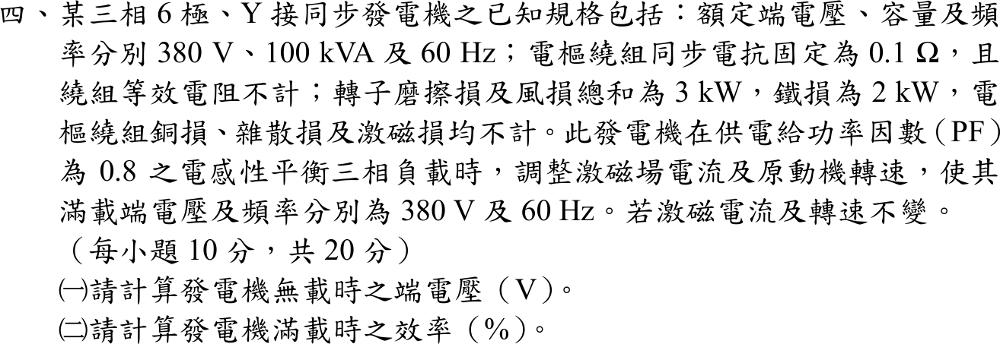

# 107 年電機機械第 4 題｜同步發電機無載電壓與滿載效率

## 已知與所求

三相 6 極 Y 接同步發電機：380 V、100 kVA、60 Hz，\(X_s=0.1\ \Omega\)，電阻不計；磨擦與風損合計 3 kW，鐵損 2 kW，其餘損失不計。供 PF 0.8 落後平衡負載且滿載端電壓 380 V、60 Hz，激磁電流與轉速維持不變。求（一）無載端電壓；（二）滿載效率。

## 考場標準作答

### （一）無載端電壓

\[
V_\phi=\frac{380}{\sqrt3}=219.39\ \mathrm V,\qquad
I_a=\frac{100\,000}{\sqrt3(380)}=151.93\ \mathrm A,\qquad \underline I_a=151.93\angle-36.87^\circ\ \mathrm A
\]
\[
\underline E_f=\underline V_\phi+jX_s\underline I_a=219.39+15.193\angle53.13^\circ=228.51+j12.155\ \mathrm V,\qquad |E_f|=228.83\ \mathrm V
\]
激磁電流與轉速不變，無載時端電壓＝\(E_f\)：
\[
\boxed{V_{L,0}=\sqrt3(228.83)=396.35\,\mathrm V}
\]

### （二）滿載效率

\[
P_{out}=100(0.8)=80\ \mathrm{kW},\qquad P_{in}=80+3+2=85\ \mathrm{kW}
\]
\[
\boxed{\eta=\frac{80}{85}=94.12\%}
\]

## 驗算

純量公式：\(E_f=\sqrt{(V_\phi+X_sI_a\sin\varphi)^2+(X_sI_a\cos\varphi)^2}=\sqrt{(219.39+9.116)^2+12.155^2}=228.83\ \mathrm V\)。功率角檢查：\(\delta=\tan^{-1}(12.155/228.51)=3.04^\circ\)，\(3V_\phi E_f\sin\delta/X_s=80.0\ \mathrm{kW}\)，與輸出功率相同。

## 失分點

- 把 PF 0.8 落後的 \(jX_sI_a\) 當成與 \(V_\phi\) 同相或反向，只做代數相加：\(219.39+15.19=234.6\ \mathrm V\)，無載電壓變成 406 V。
- 計入電樞銅損：題目已明示電樞電阻與銅損皆不計，效率分母只加 3 kW＋2 kW。
- 無載電壓忘記乘回 \(\sqrt3\)，答成 228.83 V（相電壓）。
