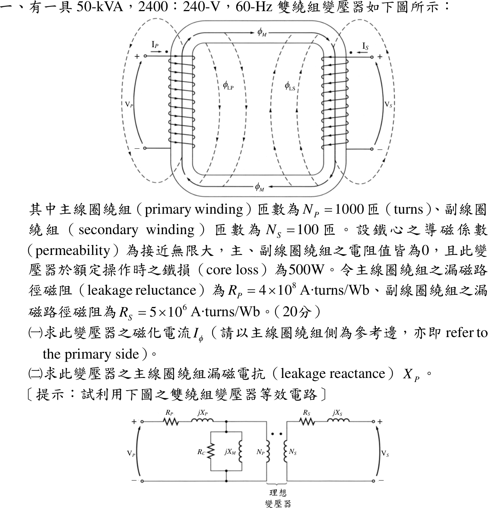

# 109 年電機機械第 1 題｜變壓器激磁電流與漏磁電抗

## 已知與所求

50 kVA、2400:240 V、60 Hz 雙繞組變壓器，\(N_P=1000\)、\(N_S=100\)；鐵心導磁係數趨近無限大，繞組電阻為 0，額定時鐵損 500 W；漏磁路徑磁阻 \(\mathcal R_P=4\times10^8\)、\(\mathcal R_S=5\times10^6\ \mathrm{A\cdot t/Wb}\)。求（一）參考一次側的激磁電流 \(I_\phi\)；（二）一次側漏磁電抗 \(X_P\)。

## 考場標準作答

### （一）激磁電流

\(\mu\to\infty\) 使主磁路磁阻 \(\mathcal R_M\to0\)，\(X_M=\omega N_P^2/\mathcal R_M\to\infty\)，磁化分量 \(I_M=0\)；只剩鐵損分量：
\[
R_C=\frac{V_P^2}{P_{core}}=\frac{2400^2}{500}=11\,520\ \Omega,\qquad
I_\phi=I_C=\frac{2400}{11\,520}
\]
\[
\boxed{I_\phi=0.2083\ \mathrm A\ (\text{與 }V_P\text{ 同相})}
\]

### （二）一次側漏磁電抗

\[
L_P=\frac{N_P^2}{\mathcal R_P}=\frac{1000^2}{4\times10^8}=2.5\ \mathrm{mH},\qquad
\boxed{X_P=\omega L_P=2\pi(60)(2.5\times10^{-3})=0.9425\ \Omega}
\]

## 驗算

功率回代：\(V_PI_\phi=2400(0.2083)=500\ \mathrm W\)，等於鐵損。二次側漏抗另算：\(X_S=377(100^2/5\times10^6)=0.754\ \Omega\)，折算一次側 \(a^2X_S=100(0.754)=75.4\ \Omega=\omega N_P^2/\mathcal R_S\)，與以一次匝數直接計算一致，可確認 \(L=N^2/\mathcal R\) 的匝數用法。

## 失分點

- 以為 \(\mu\to\infty\) 時激磁電流為 0；磁化分量為 0，但鐵損分量 0.2083 A 仍在。
- 用二次電壓 240 V 算 \(R_C\)，得 2.083 A（那是參考二次側的值）。
- 漏感寫成 \(N_P/\mathcal R_P\) 漏掉平方，或把 \(\mathcal R_S\) 配 \(N_P\) 當成一次側漏抗。
