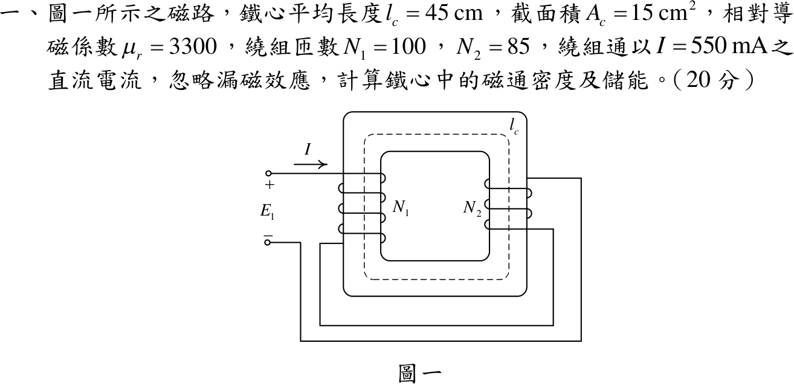

# 110 年電機機械第 1 題｜串聯繞組磁路



## 已知與所求

\(l_c=45\ \mathrm{cm}\)、\(A_c=15\ \mathrm{cm^2}\)、\(\mu_r=3300\)；左柱 \(N_1=100\)、右柱 \(N_2=85\)，兩繞組依圖串聯，通直流 \(I=550\ \mathrm{mA}\)，忽略漏磁。求鐵心磁通密度與儲能。

## 考場標準作答

**繞向判定**（依圖逐段追線）：電流由 \(+\) 端進入 \(N_1\) 上端、往下繞出；\(N_1\) 下端引線經底部接到 \(N_2\) **下端**，電流在 \(N_2\) 中往上繞，再由上端引出回到 \(-\) 端。兩線圈畫法相同（前側直線段、柱緣弧線），但 \(N_1\) 前側直線段電流向右、\(N_2\) 前側直線段電流向左。以紙面朝外為前側，右手定則（四指沿前側電流繞柱）：\(N_1\) 磁通向上、\(N_2\) 磁通向下。若改以直線段為背側，兩者同時反向，相對關係不變。

```text
        ┌──────────→──────────┐
        │                     │
   N1   ↑  左柱磁通向上        ↓  右柱磁通向下   N2
 (I 向下繞)                     (I 向上繞)
        │                     │
        └──────────←──────────┘
     兩者同為順時針 → 磁動勢相加（和動串聯）
```

\[
\mathcal F=(N_1+N_2)I=185(0.55)=101.75\ \mathrm{A\cdot t}
\]
\[
\mathcal R_c=\frac{l_c}{\mu_r\mu_0A_c}=\frac{0.45}{3300(4\pi\times10^{-7})(1.5\times10^{-3})}=7.2343\times10^4\ \mathrm{A\cdot t/Wb}
\]
\[
\Phi=\frac{\mathcal F}{\mathcal R_c}=1.4065\times10^{-3}\ \mathrm{Wb},\qquad
\boxed{B=\frac{\Phi}{A_c}=0.9377\ \mathrm T}
\]
\[
\boxed{W_m=\tfrac12\mathcal F\Phi=\tfrac12(101.75)(1.4065\times10^{-3})=71.56\ \mathrm{mJ}}
\]

## 驗算

能量密度法：\(W_m=\dfrac{B^2}{2\mu}A_cl_c=\dfrac{0.9377^2}{2(4.1469\times10^{-3})}(6.75\times10^{-4})=71.56\ \mathrm{mJ}\)。電感法：\(L=(N_1+N_2)^2/\mathcal R_c=0.4731\ \mathrm H\)，\(\tfrac12LI^2=\tfrac12(0.4731)(0.55)^2=71.56\ \mathrm{mJ}\)。量級：\(H=226.1\ \mathrm{A/m}\)，\(B\approx0.94\ \mathrm T\) 在矽鋼未飽和範圍內。

## 失分點

- 誤以為 \(N_1\) 下端接 \(N_2\) 上端而判成差動串聯：\(\mathcal F=(100-85)(0.55)=8.25\ \mathrm{A\cdot t}\)，得 \(B=0.07603\ \mathrm T\)、\(W_m=0.4704\ \mathrm{mJ}\)。
- 只比較兩線圈「同在柱上向上／向下」而忘了兩柱位於磁路迴圈的對邊：左柱向上與右柱向下才是同一環繞方向。
- 截面積換算 \(15\ \mathrm{cm^2}=1.5\times10^{-3}\ \mathrm{m^2}\) 錯成 \(1.5\times10^{-4}\)。
