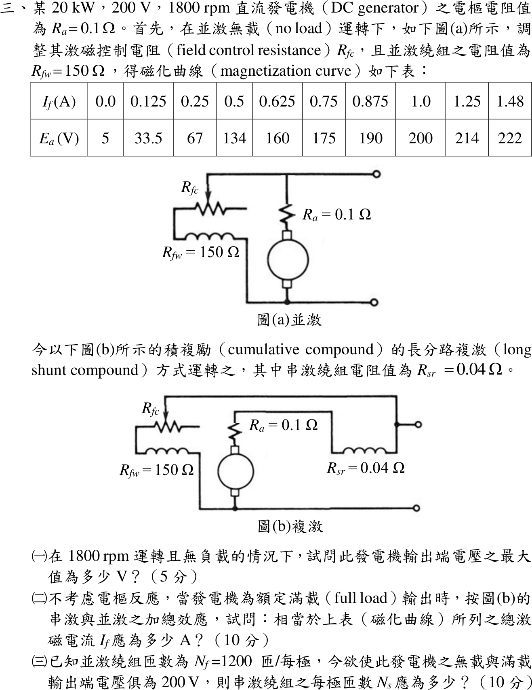

# 111 年電機機械第 3 題｜複激直流發電機磁化曲線

## 已知與所求

20 kW、200 V、1800 rpm 直流發電機，\(R_a=0.1\ \Omega\)、並激繞組 \(R_{fw}=150\ \Omega\)、場控電阻 \(R_{fc}\) 可調、串激繞組 \(R_{sr}=0.04\ \Omega\)；改為圖 (b) 長分路積複激。1800 rpm 磁化表：

| \(I_f\) (A) | 0 | 0.125 | 0.25 | 0.5 | 0.625 | 0.75 | 0.875 | 1.0 | 1.25 | 1.48 |
|---|---|---|---|---|---|---|---|---|---|---|
| \(E_a\) (V) | 5 | 33.5 | 67 | 134 | 160 | 175 | 190 | 200 | 214 | 222 |

求（一）無載最大端電壓；（二）額定滿載時相當於磁化表的總激磁電流；（三）\(N_f=1200\) 匝／極，無載與滿載端電壓皆 200 V 時的串激匝數 \(N_s\)。

## 考場標準作答

### （一）無載最大端電壓

\(R_{fc}=0\) 時場路電阻最小、端電壓最高。長分路無載 \(I_a=I_f\)：
\[
V_t=150I_f,\qquad E_a=V_t+I_f(R_a+R_{sr})=150.14I_f
\]
與磁化表 1.25–1.48 A 段 \(E_a=214+\tfrac{8}{0.23}(I_f-1.25)\) 求交點：\(I_f=1.4782\ \mathrm A\)。
\[
\boxed{V_{0,\max}=150(1.4782)=221.73\ \mathrm V\ (\approx222\ \mathrm V)}
\]
（場阻線 \(150I_f\) 恰過表末點 \(1.48\ \mathrm A,222\ \mathrm V\)；扣 0.14 Ω 壓降後為 221.73 V。無載串激安匝 \(N_sI_f\) 極小，略去。）

### （二）滿載的等效總激磁電流

\[
I_L=\frac{20\,000}{200}=100\ \mathrm A,\quad I_a=100+I_{f,sh},\quad
E_a=200+0.14(100+I_{f,sh})=214+0.14I_{f,sh}\ \mathrm V
\]
第（二）題本身未給場控電阻 \(R_{fc}\)，\(I_{f,sh}=200/(150+R_{fc})\le4/3\ \mathrm A\)，故 \(214<E_a\le214.19\ \mathrm V\)，落在表格 214 V 點：
\[
\boxed{I_{f,eq}\approx1.25\ \mathrm A}
\]
若沿用第（三）題「無載 200 V」使 \(I_{f,sh}\approx1.0\ \mathrm A\)，則 \(E_a=214.14\ \mathrm V\)，插值 \(I_{f,eq}=1.25+\tfrac{0.14}{8}(0.23)=1.2540\ \mathrm A\)；這是附加條件下的精細近似，不是第（二）題單獨可定的唯一值。

### （三）平複激的串激匝數

無載 200 V：表上 \(E_a=200\ \mathrm V\) 對應 \(I_f=1.0\ \mathrm A\)，故 \(R_{fc}=200/1.0-150=50\ \Omega\)。滿載端電壓仍 200 V，並激電流仍為 \(1.0\ \mathrm A\)，不足的激磁由串激安匝補足：
\[
N_fI_{f,eq}=N_fI_{f,sh}+N_sI_a\Rightarrow
N_s=\frac{1200(1.2540-1.000)}{101}=3.02
\]
\[
\boxed{N_s\approx3\ \text{匝/極}}
\]

## 驗算

同時解兩個條件（無載：\(E_a(I_{sh}(1+N_s/1200))=200+0.14I_{sh}\)；滿載：\(I_{sh}+N_s(100+I_{sh})/1200=E_a^{-1}(200+0.14I_a)\)，\(E_a^{-1}\) 為磁化表反查），二分法得 \(I_{sh}=1.0000\ \mathrm A\)、\(N_s=3.018\)，與一階近似一致。回代 \(N_s=3.02\)：\(1.000+3.02(101)/1200=1.2542\ \mathrm A\)，查表 \(E_a=214.14\ \mathrm V\)，扣 \(101\times0.14=14.14\ \mathrm V\) 得端電壓 200 V。

## 失分點

- 無載直接把表上最大值 222 V 當端電壓而不與場阻線求交點；最大值發生在 \(R_{fc}=0\) 的場阻線交點。
- 長分路滿載漏加並激電流，寫成 \(I_a=I_L=100\ \mathrm A\)。
- 積複激卻把串、並激安匝相減，或把 \(I_{f,eq}\) 當成實際並激支路電流。
