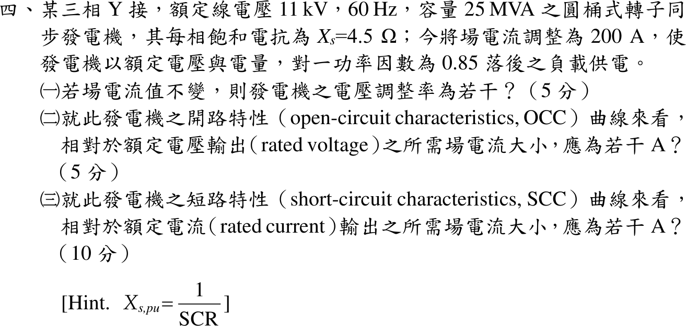

# 111 年電機機械第 4 題｜同步發電機電壓調整率與短路比

## 已知與所求

三相 Y 接、11 kV、60 Hz、25 MVA 圓桶式同步發電機，每相飽和同步電抗 \(X_s=4.5\ \Omega\)（忽略 \(R_a\)）。場電流 \(I_f=200\ \mathrm A\) 時以額定電壓、額定電流供 0.85 落後負載。提示 \(X_{s,pu}=1/\mathrm{SCR}\)。求（一）場電流不變時的電壓調整率；（二）OCC 上額定電壓所需場電流；（三）SCC 上額定電流所需場電流。

## 考場標準作答

### （一）電壓調整率

\[
V_\phi=\frac{11\,000}{\sqrt3}=6350.85\ \mathrm V,\qquad
I_a=\frac{25\times10^6}{\sqrt3(11\,000)}=1312.16\angle-31.79^\circ\ \mathrm A
\]
\[
\underline E=\underline V_\phi+jX_s\underline I_a=6350.85+j4.5(1115.34-j691.22)=9461.36+j5019.01=10710.17\angle27.94^\circ\ \mathrm V
\]
場電流不變，卸載後端電壓升到 \(|E|\)：
\[
\mathrm{VR}=\frac{10710.17-6350.85}{6350.85}\times100\%=\boxed{68.6414\%}
\]

### （二）OCC 上額定電壓的場電流

題目只給飽和同步電抗，未給 OCC 數據，故以通過工作點的線性化 OCC（\(E\propto I_f\)，斜率 \(10710.17/200=53.55\ \mathrm{V/A}\)）：
\[
I_{f,\mathrm{OCC}}=200\times\frac{6350.85}{10710.17}=\boxed{118.595\ \mathrm A}
\]

### （三）SCC 上額定電流的場電流

\[
Z_b=\frac{11^2}{25}=4.84\ \Omega,\quad X_{s,pu}=\frac{4.5}{4.84}=0.92975,\quad \mathrm{SCR}=\frac{I_{f,\mathrm{OCC}}}{I_{f,\mathrm{SCC}}}=1.0756
\]
\[
I_{f,\mathrm{SCC}}=X_{s,pu}\,I_{f,\mathrm{OCC}}=0.92975(118.595)=\boxed{110.264\ \mathrm A}
\]

## 驗算

短路法：三相短路時 \(E_{sc}=X_sI_a=4.5(1312.16)=5904.7\ \mathrm V\)，以同一斜率 \(53.55\ \mathrm{V/A}\) 得 \(I_f=5904.7/53.55=110.26\ \mathrm A\)，與 SCR 法一致。功率角檢查：\(|E|\sin\delta=X_sI_a\cos\theta=4.5(1115.34)=5019.0\ \mathrm V\)，與 \(\underline E\) 虛部相同。

## 失分點

- 用發電機式卻寫成 \(\underline E=\underline V-jX_s\underline I\)，得 \(|E|\) 偏小、VR 錯。
- 把題目的 200 A 當成 OCC 額定電壓場電流；200 A 是滿載 0.85 落後時的場電流，若它在無載也只產生額定電壓，第（一）題 VR 會是 0。
- SCR 寫反成 \(I_{f,\mathrm{SCC}}/I_{f,\mathrm{OCC}}\)，得 \(I_{f,\mathrm{SCC}}>I_{f,\mathrm{OCC}}\)。

## 條件與疑義

- 官方裁切圖未附完整曲線資料（無 OCC／SCC 圖或數據），第（二）（三）小題只能在「飽和同步電抗對應的線性化 OCC」假設下得唯一值；若另給實際 OCC，應以曲線讀值取代 118.595 A。
- 參考書主解：\(I_a=1312.16\angle-31.8^\circ\ \mathrm A\)、\(E_f=10710.78\angle27.94^\circ\) V/相、VR = 68.87%，\(I_{f,\mathrm{OCC}}=200\ \mathrm A\)，\(I_{f,\mathrm{SCC}}=0.93\times200\)，即 186 A。與獨立解不一致處：其 \(E_f\) 代回 \((10710.78-6350.85)/6350.85=68.65\%\)，非 68.87%；其 OCC 取 200 A 與第（一）題「200 A 時無載電壓為 10.71 kV/相」互相矛盾，186 A 隨之偏高。參考書數值僅作對照。
