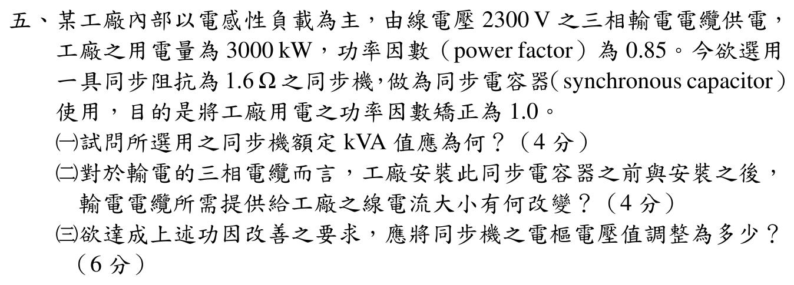

# 111 年電機機械第 5 題｜同步電容器功率因數改善

## 題目與模型假設

三相工廠以線電壓 $V_L=2300\,\mathrm V$ 供電，負載實功率 $P=3000\,\mathrm{kW}$、功率因數 $0.85$ 落後。以同步機作同步電容器，將總功率因數改善至 1.0；題目給「同步阻抗」單一數值 $1.6\,\Omega$，依同步機題的標準簡化，以下將其視為每相同步電抗 $X_s=1.6\,\Omega$，忽略電樞電阻。若製造商另給顯著電阻，應改用完整複阻抗相量式。

## (一) 同步機額定 kVA

原負載相角

$$
\theta=\cos^{-1}(0.85)=31.7883^\circ,
\qquad
\tan\theta=\frac{\sqrt{1-0.85^2}}{0.85}=0.619744.
$$

需由同步電容器提供的超前無效功率為

$$
Q_c=P\tan\theta
 =3000(0.619744)=1859.23\,\mathrm{kvar}.
$$

同步電容器不輸出實功率，故其額定表觀容量至少為

$$
\boxed{S_{sc}=|Q_c|=1859.23\,\mathrm{kVA}\approx1.86\,\mathrm{MVA}}.
$$

## (二) 輸電電纜線電流

安裝前總視在功率為

$$
S_{before}=\frac{P}{0.85}=3529.41\,\mathrm{kVA},
$$

因此

$$
I_{before}=\frac{S_{before}}{\sqrt3V_L}
 =\frac{3.52941\times10^6}{\sqrt3(2300)}
 =886.02\,\mathrm A.
$$

功因修正至 1 後，電纜只需供應實功率：

$$
I_{after}=\frac{P}{\sqrt3V_L}
 =\frac{3.000\times10^6}{\sqrt3(2300)}
 =753.12\,\mathrm A.
$$

故線電流減少

$$
\Delta I=I_{after}-I_{before}=-132.90\,\mathrm A,
$$

即降低 $15.0\%$；同步電容器本身在工廠端承擔約 $466.75$ A 的超前無效電流。

## (三) 同步機電樞電壓

三相同步電容器每相端電壓（以 Y 等效）為

$$
V_\phi=\frac{2300}{\sqrt3}=1327.91\,\mathrm V.
$$

其超前無效電流的線／相 RMS 值為

$$
I_c=\frac{|Q_c|}{\sqrt3V_L}=466.75\,\mathrm A,
\qquad
\mathbf I_c=+j466.75\,\mathrm A
$$

（以端電壓為相位基準）。同步電動機相量式為

$$
\mathbf E_f=\mathbf V_\phi-jX_s\mathbf I_c
 =1327.91-j(1.6)(j466.75)
 =2074.71\,\mathrm{V/相}.
$$

所以所需內生電樞電壓為

$$
\boxed{E_{f,\phi}=2074.71\,\mathrm{V}},
\qquad
\boxed{E_{f,LL}=\sqrt3E_{f,\phi}=3593.5\,\mathrm V\approx3.59\,\mathrm{kV}}.
$$

這是超激磁（over-excitation）狀態；若以同步發電機符號約定列式，電流方向與 $E_f$ 方程式會同時反向，但電壓幅值相同。

## 結論與校驗紀錄

- 同步電容器額定容量：$1859.23\,\mathrm{kVA}$。
- 電纜線電流：$886.02$ A 降至 $753.12$ A，減少 $132.90$ A（15.0%）。
- 以題目唯一給定的 $1.6\,\Omega$ 視為每相 $X_s$ 時，$E_{f,\phi}=2074.71$ V、$E_{f,LL}=3.5935$ kV。
- 已由官方裁切圖逐項核對 $2300$ V、$3000$ kW、PF $0.85$ 與 $1.6\,\Omega$；完成無效功率、線電流及相量回代，狀態升級為 `verified`。
