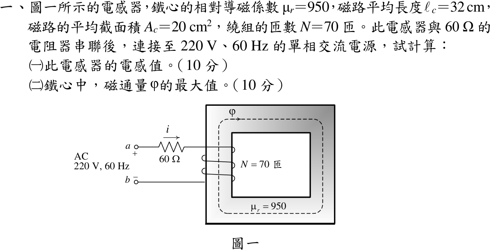

# 112 年電機機械第 1 題｜鐵心電感器與磁通峰值

## 已知與所求

\(\mu_r=950\)、\(\ell_c=32\ \mathrm{cm}\)、\(A_c=20\ \mathrm{cm^2}\)、\(N=70\)；電感器串聯 \(60\ \Omega\) 接 220 V、60 Hz。求（一）電感；（二）鐵心磁通最大值。

## 考場標準作答

### （一）電感

\[
\mathcal R=\frac{\ell_c}{\mu_0\mu_rA_c}=\frac{0.32}{(4\pi\times10^{-7})(950)(2\times10^{-3})}=1.340\times10^5\ \mathrm{A\,t/Wb}
\]
\[
\boxed{L=\frac{N^2}{\mathcal R}=\frac{4900}{1.340\times10^5}=36.56\ \mathrm{mH}}
\]

### （二）磁通最大值

\[
X_L=2\pi(60)(0.03656)=13.78\ \Omega,\qquad I=\frac{220}{\sqrt{60^2+13.78^2}}=3.574\ \mathrm A\ (\text{rms})
\]
磁鏈 \(N\phi=Li\)，取電流峰值：
\[
\boxed{\phi_{max}=\frac{L\sqrt2I}{N}=\frac{0.03656(1.4142)(3.574)}{70}=2.640\times10^{-3}\ \mathrm{Wb}}
\]

## 驗算

法拉第定律：電感端電壓 \(V_L=IX_L=49.25\ \mathrm V\)，\(\phi_{max}=\sqrt2V_L/(\omega N)=69.65/(377\times70)=2.640\times10^{-3}\ \mathrm{Wb}\)。安培定律：\(B_{max}=\mu_0\mu_rN\sqrt2I/\ell_c=1.320\ \mathrm T\)，\(B_{max}A_c=2.640\times10^{-3}\ \mathrm{Wb}\)。

## 失分點

- 把 220 V 全部當成電感電壓：\(220\sqrt2/(377\times70)=11.8\times10^{-3}\ \mathrm{Wb}\)，忽略 60 Ω 分壓。
- 用電流有效值求磁通，少乘 \(\sqrt2\)，得 \(1.87\times10^{-3}\ \mathrm{Wb}\)。
