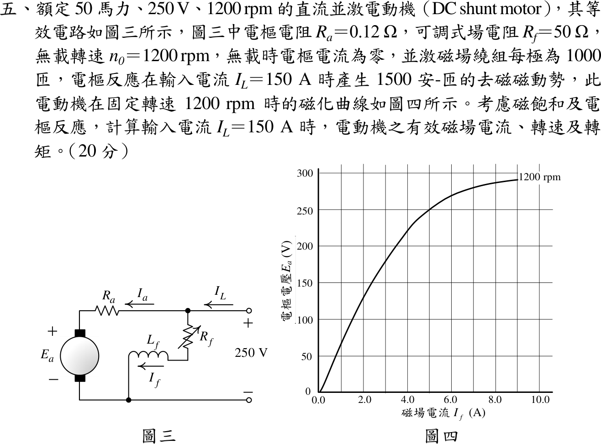

# 112 年電機機械第 5 題｜直流並激電動機（飽和與電樞反應）

## 已知與所求

50 hp、250 V、1200 rpm 並激電動機：\(R_a=0.12\ \Omega\)、場電阻 \(R_f=50\ \Omega\)，無載 1200 rpm、\(I_a=0\)；場繞組每極 1000 匝；\(I_L=150\ \mathrm A\) 時電樞反應去磁 1500 A·t；圖四為 1200 rpm 磁化曲線。求 \(I_L=150\ \mathrm A\) 時有效磁場電流、轉速、轉矩。

## 考場標準作答

### 有效磁場電流

\[
I_f=\frac{250}{50}=5\ \mathrm A,\qquad I_a=150-5=145\ \mathrm A
\]
\[
\boxed{I_f^*=I_f-\frac{\mathcal F_{AR}}{N_f}=5-\frac{1500}{1000}=3.5\ \mathrm A}
\]

### 轉速

圖四在 \(I_f^*=3.5\ \mathrm A\) 讀得 \(E_{A0}\approx200\ \mathrm V\)（1200 rpm）。負載時
\[
E_A=250-145(0.12)=232.6\ \mathrm V,\qquad
\boxed{n=1200\times\frac{232.6}{200}\approx1396\ \mathrm{rpm}}
\]

### 轉矩

\[
\boxed{T=\frac{E_AI_a}{\omega_m}=\frac{232.6\times145}{2\pi(1396)/60}\approx230.8\ \mathrm{N\cdot m}}
\]
此為電磁（感應）轉矩；題目未給旋轉損失。

## 驗算

以 \(K\phi\) 求轉矩：\(K\phi=E_{A0}/\omega_{1200}=200/125.66=1.592\ \mathrm{V\cdot s}\)，\(T=K\phi I_a=1.592\times145=230.8\ \mathrm{N\cdot m}\)。圖四在 \(I_f=5\ \mathrm A\) 約為 250 V，與無載 250 V、1200 rpm 的設定一致，讀圖基準正確。

## 失分點

- 用 \(I_f=5\ \mathrm A\) 讀 250 V 而忽略電樞反應，得 \(n=1116\ \mathrm{rpm}\)；去磁使磁通下降，轉速應上升。
- 把磁化曲線讀值 200 V 直接當負載 \(E_A\)；\(E_A\) 須由電樞 KVL 求得 232.6 V。

## 條件與疑義

\(E_{A0}\) 由圖讀取，約 \(\pm2\ \mathrm V\) 的讀圖誤差會使轉速變動約 \(\pm1\%\)（約 1382–1410 rpm），轉矩隨 \(K\phi\) 同比例變動。
