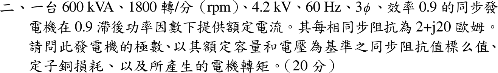

# 113 年電機機械第 2 題｜同步發電機標么阻抗、銅損與轉矩

## 已知與所求

三相同步發電機 600 kVA、1800 rpm、4.2 kV、60 Hz、效率 0.9，於 0.9 滯後功因供額定電流；每相同步阻抗 \(2+j20\ \Omega\)。求極數、同步阻抗標么值、定子銅損與轉矩。

## 考場標準作答

\[
\boxed{P=\frac{120f}{n_s}=\frac{120(60)}{1800}=4\ \text{極}}
\]
\[
Z_b=\frac{V_{LL}^2}{S_{3\phi}}=\frac{4200^2}{600\times10^3}=29.4\ \Omega,\qquad
\boxed{Z_{s,pu}=\frac{2+j20}{29.4}=0.0680+j0.6803\ \mathrm{pu}}
\]
\[
I_a=\frac{600\times10^3}{\sqrt3(4200)}=82.48\ \mathrm A,\qquad
\boxed{P_{cu}=3I_a^2R_a=3(82.48)^2(2)=40.82\ \mathrm{kW}}
\]
\(P_o=600(0.9)=540\ \mathrm{kW}\)，\(\omega_m=2\pi(1800)/60=188.50\ \mathrm{rad/s}\)。「所產生的電機轉矩」取電磁（感應）轉矩：
\[
\boxed{T_{em}=\frac{P_o+P_{cu}}{\omega_m}=\frac{580.82\times10^3}{188.50}=3081\ \mathrm{N\cdot m}}
\]

## 驗算

標么法求銅損：額定電流 \(I_{pu}=1\)，\(P_{cu}=I_{pu}^2R_{pu}S_b=0.06803(600)=40.82\ \mathrm{kW}\)。功率平衡：效率 0.9 對應機械輸入 600 kW，\(600-540-40.82=19.18\ \mathrm{kW}\) 為題目未分列的鐵損與機械損，非負，數據自洽。

## 失分點

- 以相電壓 \(4200/\sqrt3\) 配三相容量求基準，\(Z_b\) 錯為 9.8 Ω。
- 用 \(|Z_s|=20.1\ \Omega\) 算銅損；銅損只取實部 \(R_a=2\ \Omega\)。

## 條件與疑義

題目給總效率 0.9，但未分列鐵損、機械損，「所產生的電機轉矩」可有兩種解讀：主解為電磁轉矩 3081 N·m；若指原動機軸端輸入轉矩，\(T_{shaft}=(540/0.9)\times10^3/188.50=3183\ \mathrm{N\cdot m}\)。作答時應寫明採用的定義。
