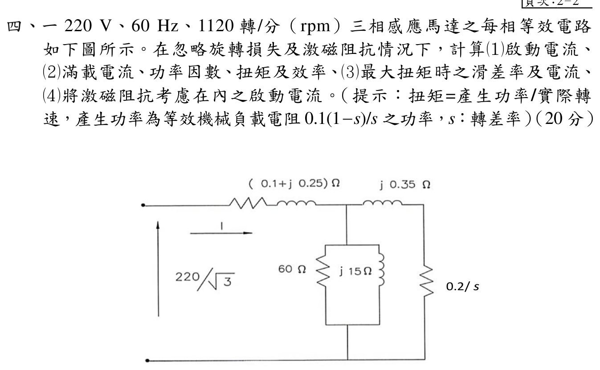

# 113 年電機機械第 4 題｜三相感應馬達等效電路與轉矩（來源矛盾，人工覆核）

## 官方題目（逐題裁切）

一 \(220\,\mathrm{V}\)、\(60\,\mathrm{Hz}\)、\(1120\,\mathrm{rpm}\) 三相感應馬達之每相等效電路如下圖所示。在忽略旋轉損失及激磁阻抗情況下，計算：(1) 啟動電流；(2) 滿載電流、功率因數、扭矩及效率；(3) 最大扭矩時之滑差率及電流；(4) 將激磁阻抗考慮在內之啟動電流。（20 分）

圖示每相參數為

\[
Z_1=0.1+j0.25\,\Omega,\qquad
Z_2=\frac{0.2}{s}+j0.35\,\Omega,
\]

以及激磁支路 \(R_c=60\,\Omega\)、\(X_m=15\,\Omega\)。

## 獨立重算（以圖示參數為準）

### 0. 同步轉速與相電壓

由 \(60\,\mathrm{Hz}\) 與運轉速度可判定為六極機：

\[
n_s=\frac{120f}{P}=1200\,\mathrm{rpm},
\qquad
s_{fl}=\frac{n_s-n}{n_s}=\frac{1200-1120}{1200}=\frac1{15}.
\]

Y 相等效電路的相電壓為

\[
V_\phi=\frac{220}{\sqrt3}=127.017059\,\mathrm{V}.
\]

### 1. 啟動電流（忽略激磁支路）

啟動時 \(s=1\)，故

\[
Z_{st}=0.1+0.2+j(0.25+0.35)=0.3+j0.6\,\Omega,
\]

\[
|Z_{st}|=0.670820\,\Omega,
\qquad
I_{st}=\frac{127.017059}{0.3+j0.6}
 =84.6780-j169.3561\,\mathrm{A},
\]

\[
\boxed{|I_{st}|=189.346\,\mathrm{A}}.
\]

### 2. 滿載電流、功率因數、轉矩與效率

滿載 \(s=1/15\)，所以 \(R_2/s=3.0\,\Omega\)：

\[
Z_{fl}=3.1+j0.6\,\Omega,
\qquad
I_{fl}=\frac{127.017059}{3.1+j0.6}
 =39.4938-j7.6440\,\mathrm{A},
\]

\[
\boxed{|I_{fl}|=40.2267\,\mathrm{A}},
\qquad
\boxed{\mathrm{pf}=\frac{3.1}{\sqrt{3.1^2+0.6^2}}=0.981780\ \text{滯後}}.
\]

以圖示轉子電阻計算氣隙功率與機械輸出功率：

\[
P_{in}=3|I_{fl}|^2\left(R_1+\frac{R_2}{s}\right)
 =15.0491\,\mathrm{kW},
\]

\[
P_{ag}=3|I_{fl}|^2\frac{R_2}{s}=14.5637\,\mathrm{kW},
\qquad
P_{mech}=P_{ag}(1-s)=13.5928\,\mathrm{kW}.
\]

\[
\omega_s=\frac{2\pi(1200)}{60}=125.663706\,\mathrm{rad/s},
\qquad
\omega_m=(1-s)\omega_s=117.286132\,\mathrm{rad/s}.
\]

因此

\[
T=\frac{P_{mech}}{\omega_m}
 =\frac{13\,592.778}{117.286132}
 =\boxed{115.894\,\mathrm{N\cdot m}},
\]

\[
\eta=\frac{P_{mech}}{P_{in}}
 =\boxed{90.3226\%}.
\]

### 3. 最大轉矩時的滑差率與電流

對忽略激磁支路的近似等效電路，最大轉矩條件為

\[
s_{max}=\frac{R_2}{\sqrt{R_1^2+(X_1+X_2)^2}}
 =\frac{0.2}{\sqrt{0.1^2+0.6^2}}
 =\boxed{0.328798}.
\]

此時

\[
Z_{max}=0.1+\frac{0.2}{0.328798}+j0.6
 =0.708276+j0.6\,\Omega,
\]

\[
I_{max}=\frac{127.017059}{Z_{max}},
\qquad
\boxed{|I_{max}|=136.834\,\mathrm{A}}.
\]

交叉檢查最大電磁轉矩為

\[
T_{max}=\frac{3|I_{max}|^2(R_2/s_{max})}{\omega_s}
 =271.896\,\mathrm{N\cdot m}.
\]

### 4. 納入激磁阻抗的啟動電流

啟動時激磁支路

\[
Z_m=R_c\parallel jX_m
 =60\parallel j15
 =3.529412+j14.117647\,\Omega,
\]

轉子支路為 \(Z_2=0.2+j0.35\,\Omega\)，故並聯等效為

\[
Z_p=Z_m\parallel Z_2
 =0.192305+j0.342314\,\Omega.
\]

全相等效阻抗與啟動電流為

\[
Z_{in}=Z_1+Z_p=0.292305+j0.592314\,\Omega,
\]

\[
I_{st,m}=\frac{127.017059}{Z_{in}}
 =85.1010-j172.4451\,\mathrm{A},
\qquad
\boxed{|I_{st,m}|=192.301\,\mathrm{A}}.
\]

## 來源矛盾與人工覆核原因

官方圖中轉子支路明確標示為 \(0.2/s\,\Omega\)，但同一裁切圖的提示文字卻寫成等效機械負載電阻 \(0.1(1-s)/s\,\Omega\)。兩者不一致。上面的主表依電路圖之 \(0.2/s\) 完成方程與回代；不能把提示中的 \(0.1\) 只替換在機械功率項而保留同一支路電流，因為轉子銅阻、氣隙功率與電流會同時改變。

若將提示視為正確，則應採轉子銅阻 \(R_2=0.1\,\Omega\)，使等效支路為 \(0.1/s+j0.35\,\Omega\)。完整重算的第二組結果為：

\[
I_{st}=200.832\,\mathrm{A},\qquad
I_{fl}=74.331\,\mathrm{A},\qquad
\mathrm{pf}=0.936329\ \text{滯後},
\]

\[
T_{fl}=197.854\,\mathrm{N\cdot m},
\qquad
\eta_{fl}=87.500\%,
\qquad
s_{max}=0.164399,
\qquad
I_{max}=136.834\,\mathrm{A}.
\]

納入激磁支路時，該第二解讀的啟動電流為 \(I_{st,m}=203.692\,\mathrm{A}\)。由於官方圖示支路與提示的機械負載值無法同時成立，本題仍保留 `needs_manual_review`，待官方勘誤或人工確認採用基準後再定稿。

## 暫定結論（圖示基準）

\[
\boxed{I_{st}=189.346\,\mathrm{A}},\quad
\boxed{I_{fl}=40.2267\,\mathrm{A}},\quad
\boxed{\mathrm{pf}=0.981780\ \text{滯後}},
\]

\[
\boxed{T=115.894\,\mathrm{N\cdot m}},\quad
\boxed{\eta=90.3226\%},\quad
\boxed{s_{max}=0.328798},\quad
\boxed{I_{max}=136.834\,\mathrm{A}},\quad
\boxed{I_{st,m}=192.301\,\mathrm{A}}.
\]
