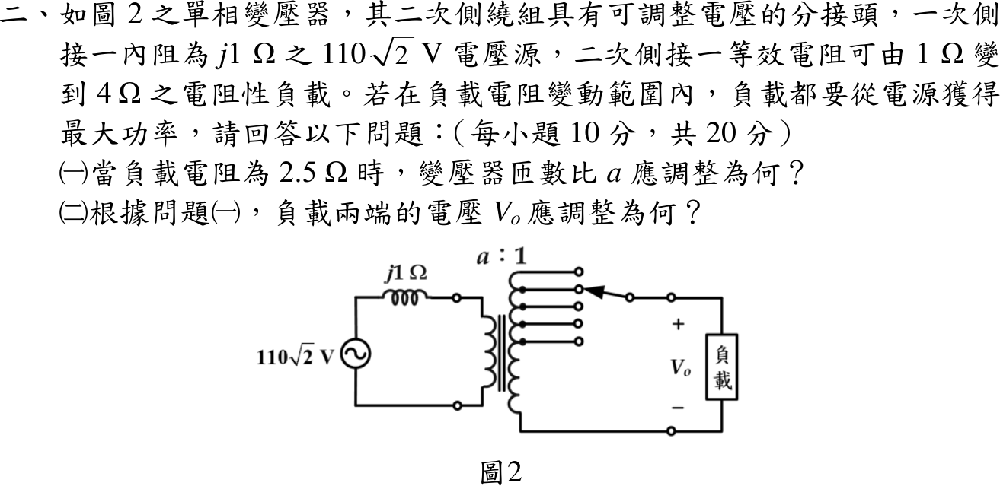

# 114 年電機機械第 2 題｜變壓器分接頭最大功率

## 已知與所求

一次側接 \(110\sqrt2\ \mathrm V\) 電源、內阻 \(j1\ \Omega\)；二次側電阻性負載 \(1\)～\(4\ \Omega\)，以分接頭調整匝數比 \(a=N_1:N_2\) 使負載恆得最大功率。求 \(R_L=2.5\ \Omega\) 時（一）\(a\)；（二）負載電壓 \(V_o\)。

## 考場標準作答

### （一）匝數比

負載折算至一次側 \(R_L'=a^2R_L\)。電源內阻為純電抗，只能調整負載電阻大小時，最大功率條件為 \(R_L'=|Z_s|=1\ \Omega\)：
\[
2.5a^2=1\ \Rightarrow\ \boxed{a=\sqrt{0.4}=0.6325}
\]

### （二）負載電壓

依相量圖慣例取電源標示為 RMS（\(V_s=110\sqrt2\ \mathrm V\)）：
\[
|V_1|=V_s\frac{R_L'}{|R_L'+j1|}=110\sqrt2\cdot\frac{1}{\sqrt2}=110\ \mathrm V,\qquad
\boxed{|V_o|=\frac{|V_1|}{a}=\frac{110}{0.6325}=173.925\ \mathrm V_{rms}}
\]

## 驗算

功率守恆：一次側 \(|I_1|=110\sqrt2/\sqrt2=110\ \mathrm A\)，\(P=|I_1|^2(1)=12100\ \mathrm W\)；二次側 \(V_o^2/R_L=173.925^2/2.5=12100\ \mathrm W\)。對 \(a\in[0.3,1.2]\) 掃描負載功率，最大值落在 \(a=0.6325\)。

## 失分點

- 把最大功率條件寫成 \(a^2R_L=Z_s^*\)：負載為純電阻、只能調 \(a\)，應取 \(|Z_s|=1\ \Omega\)。
- 求出一次側 110 V 後忘了再除以 \(a\)（\(a<1\)，二次電壓高於一次）。

## 條件與疑義

題圖只標 \(110\sqrt2\) V，未註明 RMS 或峰值。主解採 RMS；若該值是峰值，RMS 電壓縮小 \(\sqrt2\) 倍，\(|V_o|=173.925/\sqrt2=122.984\ \mathrm V_{rms}\)（峰值 173.925 V）。匝數比 \(a=0.6325\) 兩種解讀相同。
