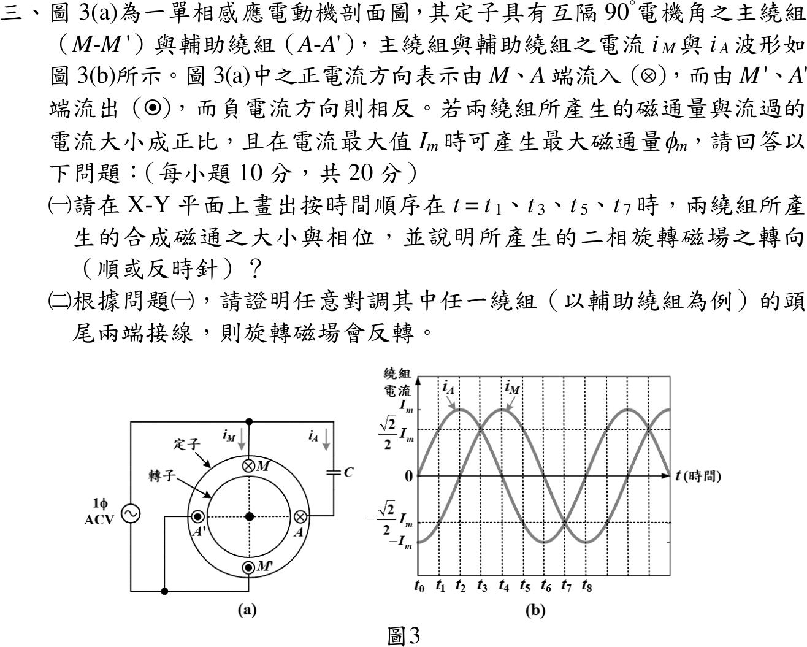

# 114 年電機機械第 3 題｜單相感應電動機二相旋轉磁場



## 已知與所求

主繞組 \(M\)（上，⊗）—\(M'\)（下，⊙）、輔助繞組 \(A\)（右，⊗）—\(A'\)（左，⊙），空間相隔 \(90^\circ\)；正電流由 \(M\)、\(A\) 流入。磁通與電流成正比，\(I_m\) 對應 \(\phi_m\)。由圖 3(b)，相鄰刻度相隔 \(45^\circ\) 電機角：\(i_A=I_m\sin\vartheta\)、\(i_M=-I_m\cos\vartheta\)，\(\vartheta=\omega(t-t_0)\)。求（一）\(t_1,t_3,t_5,t_7\) 的合成磁通與轉向；（二）證明對調輔助繞組頭尾使磁場反轉。

## 考場標準作答

### （一）合成磁通與轉向

取紙面向右為 \(+x\)、向上為 \(+y\)。右手定則：上方導體流入、下方流出，中心磁場向左，故主繞組正電流產生 \(-x\) 磁通；右方流入、左方流出，中心磁場向上，故輔助繞組正電流產生 \(+y\) 磁通。合成磁通
\[
\boldsymbol\phi=-\phi_m\frac{i_M}{I_m}\hat x+\phi_m\frac{i_A}{I_m}\hat y=\phi_m(\cos\vartheta\,\hat x+\sin\vartheta\,\hat y)
\]

| 時刻 | \((i_M,i_A)/I_m\) | 合成磁通 | 相位 |
| --- | --- | --- | --- |
| \(t_1\) | \((-1,1)/\sqrt2\) | 右上，\(\phi_m\) | \(45^\circ\) |
| \(t_3\) | \((1,1)/\sqrt2\) | 左上，\(\phi_m\) | \(135^\circ\) |
| \(t_5\) | \((1,-1)/\sqrt2\) | 左下，\(\phi_m\) | \(225^\circ\) |
| \(t_7\) | \((-1,-1)/\sqrt2\) | 右下，\(\phi_m\) | \(315^\circ\) |

X–Y 草圖（四支箭頭由原點出發，長度皆為 \(\phi_m\)）：

```text
                  +Y
             t₃ ↖ │ ↗ t₁
                  │
       −X ────────O──────── +X
                  │
             t₅ ↙ │ ↘ t₇
                  −Y

          t₁ → t₃ → t₅ → t₇：逆時針
```

\[
\boxed{|\boldsymbol\phi|=\phi_m,\ \angle\boldsymbol\phi=\vartheta\ \text{（}45^\circ\to135^\circ\to225^\circ\to315^\circ\text{），逆時針旋轉}}
\]

### （二）對調輔助繞組頭尾

對調 \(A\)、\(A'\) 後同一電流產生的 \(y\) 分量反號：
\[
\boldsymbol\phi'=\phi_m(\cos\vartheta\,\hat x-\sin\vartheta\,\hat y)=\phi_m\angle(-\vartheta)
\]
大小仍為 \(\phi_m\)，但相位隨時間遞減，\(t_1,t_3,t_5,t_7\) 依序為 \(315^\circ,225^\circ,135^\circ,45^\circ\)：
\[
\boxed{d\angle\boldsymbol\phi'/dt=-\omega\ \Rightarrow\ \text{旋轉磁場反轉為順時針}}
\]
對調主繞組時 \(x\) 分量反號，同理得 \(\phi_m\angle(180^\circ-\vartheta)\)，亦為反轉。

## 驗算

以向量式 \(\mathbf B\propto\hat{\mathbf I}\times\hat{\mathbf r}\)（\(\hat{\mathbf r}\) 由導體指向中心）重算軸向：\(M\) 在 \((0,1)\)、電流 \(-\hat z\)：\((-\hat z)\times(-\hat y)=-\hat x\)；\(A\) 在 \((1,0)\)：\((-\hat z)\times(-\hat x)=+\hat y\)，回流導體 \(M'\)、\(A'\) 貢獻同向，與主解一致。各時刻 \(|\boldsymbol\phi|^2=\phi_m^2(\cos^2\vartheta+\sin^2\vartheta)=\phi_m^2\)，四點都是 \(|i_M|=|i_A|=I_m/\sqrt2\)。

## 失分點

- 把 \(t_1,t_3,t_5,t_7\) 讀成某一繞組峰值、另一繞組為零；圖上四點兩電流量值都是 \(I_m/\sqrt2\)，磁通落在對角線。
- 把兩個互相垂直的分量代數相加成 \(\sqrt2\phi_m\) 或 \(2\phi_m\)。
- 第（二）小題只寫「相序改變」而沒寫出 \(y\) 分量反號、角速度變為 \(-\omega\)。
