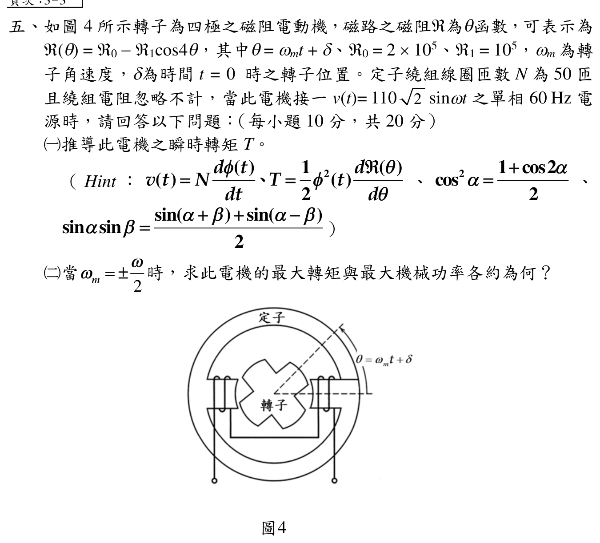

# 114 年電機機械第 5 題：磁阻電動機轉矩

> 官方題幹明給 \(T=\tfrac12\phi^2\,d\mathcal R/d\theta\)。本解依此正號約定作答；舊解使用負號，雖未改變最大轉矩的絕對值，卻把第（一）小題瞬時轉矩與平均轉矩的符號寫反。下列瞬時式採週期穩態、無直流磁通偏置；若未給初始磁通，電壓積分另可有常數 \(\phi_{dc}\)，須先聲明此常用假設。

> 官方 Hint 的 \(\sin\alpha\sin\beta=[\sin(\alpha+\beta)+\sin(\alpha-\beta)]/2\) 是誤植（取 \(\alpha=\beta=\pi/2\) 即不成立）。本題實際需要的是 \(\cos u\sin v=[\sin(v+u)+\sin(v-u)]/2\)；不要照抄錯誤恆等式。

## 考場標準作答

採週期穩態、無直流磁通偏置。由 \(v=N\,d\phi/dt\)，\(V_m=110\sqrt2\)、\(\omega=120\pi\)、\(N=50\)，得
\[
\phi(t)=-\frac{V_m}{N\omega}\cos\omega t
 =-\Phi_m\cos\omega t,
\qquad \Phi_m=8.2530\times10^{-3}\ \mathrm{Wb}.
\]
因
\[
\mathcal R(\theta)=\mathcal R_0-\mathcal R_1\cos4\theta,
\qquad
\frac{d\mathcal R}{d\theta}=4\mathcal R_1\sin4\theta,
\]
故
\[
\boxed{T(t)=+2\mathcal R_1\Phi_m^2\cos^2(\omega t)\sin(4\omega_mt+4\delta)}.
\]
在 \(\omega_m=\pm\omega/2=\pm60\pi\ \mathrm{rad/s}\) 時取平均，
\[
\boxed{T_{avg}=\tfrac12\mathcal R_1\Phi_m^2\sin4\delta},
\qquad
\boxed{|T_{avg,max}|=\frac12\mathcal R_1\Phi_m^2=3.4055\ \mathrm{N\cdot m}},
\]
\[
\boxed{|P_{m,max}|=|T_{avg,max}\omega_m|=0.642\ \mathrm{kW}}.
\]

## 得分點拆解

- 由電壓積分得到磁通，不能直接把電壓峰值當磁通峰值。
- 先對 \(\mathcal R(\theta)\) 微分，並依官方提示保留轉矩式的正號與 \(1/2\)。
- 代入 \(\theta=\omega_mt+\delta\) 後，轉矩必須保留 \(\cos^2\omega t\) 因子。
- 在 \(|\omega_m|=\omega/2\) 時以三角恆等式取平均，再對 \(\delta\) 取最大值。

## 完整教學推導

### （一）磁通與瞬時轉矩

由題給正弦電壓
\[
v(t)=V_m\sin\omega t=N\frac{d\phi}{dt},
\]
積分的一般式為 \(\phi(t)=\phi_{dc}-V_m\cos(\omega t)/(N\omega)\)。若採無直流磁通偏置的週期穩態，得
\[
\phi(t)=-\frac{V_m}{N\omega}\cos\omega t
 =-\Phi_m\cos\omega t.
\]
題面未另給初始磁通；若保留 \(\phi_{dc}\)，瞬時轉矩應把 \(\phi(t)^2\) 完整代回官方轉矩式。\(\phi_{dc}\) 的常數項及與 \(\cos\omega t\) 的交叉項在 \(\omega_m=\pm\omega/2\) 的一週期平均皆為零，因此後面的同步平均轉矩最大量值不受此偏置影響。
數值為
\[
\Phi_m=\frac{110\sqrt2}{50(120\pi)}
 =8.2530\times10^{-3}\ \mathrm{Wb}.
\]
磁阻函數微分為
\[
\frac{d\mathcal R}{d\theta}=4\mathcal R_1\sin4\theta,
\qquad \theta=\omega_mt+\delta.
\]
由官方題示轉矩公式（此處以題目指定的正方向為準）
\[
T=+\frac12\phi^2\frac{d\mathcal R}{d\theta},
\]
代入 \(\phi^2=\Phi_m^2\cos^2\omega t\) 得
\[
T(t)=+2\mathcal R_1\Phi_m^2\cos^2(\omega t)
 \sin(4\omega_mt+4\delta).
\]

### （二）同步轉速下的平均轉矩與機械功率

令 \(\omega_m=+\omega/2\)，則
\[
4\omega_mt=2\omega t,
\qquad
\cos^2\omega t=\frac{1+\cos2\omega t}{2}.
\]
乘積取一週期平均時，只有 \(\cos2\omega t\sin(2\omega t+4\delta)\) 的直流項保留，因此
\[
\left\langle\cos2\omega t\sin(2\omega t+4\delta)\right\rangle
=\frac12\sin4\delta.
\]
連同 \(\cos^2\omega t\) 展開的係數 \(1/2\)，可得
\[
T_{avg}=+\frac{1}{2}\mathcal R_1\Phi_m^2\sin(4\delta).
\]
\(\omega_m=-\omega/2\) 時，對固定的 \(\delta\) 仍得到同一平均轉矩式；機械功率 \(T_{avg}\omega_m\) 的符號才因轉向而改變。若求正向最大機械功率，\(\omega_m>0\) 選 \(\sin4\delta=1\)，\(\omega_m<0\) 選 \(\sin4\delta=-1\)。最大轉矩量值在 \(|\sin4\delta|=1\) 時出現：
\[
|T_{avg,max}|=\frac{1}{2}\mathcal R_1\Phi_m^2
=\frac12(1\times10^5)(8.2530\times10^{-3})^2
 =3.4055\ \mathrm{N\cdot m}.
\]
亦可直接記為
\[
|T_{avg,max}|=\frac{1}{2}\mathcal R_1\Phi_m^2=3.4055\;\mathrm{N\,m}.
\]
又
\[
|\omega_m|=\frac{\omega}{2}=60\pi\ \mathrm{rad/s},
\]
故
\[
|P_{m,max}|=|T_{avg,max}\omega_m|
 =3.4055(60\pi)=641.9\ \mathrm W
 \approx0.642\;\mathrm{kW}.
\]

## 獨立驗算

先做量綱與數值檢查：
\[
\frac{V_m}{N\omega}
 =\frac{155.563}{50(376.991)}
 =8.2530\times10^{-3}\ \mathrm{Wb}.
\]
再由最大轉矩回算最大機械功率：
\[
3.4055\ \mathrm{N\cdot m}\times188.496\ \mathrm{rad/s}
 =641.9\ \mathrm W.
\]
此值與直接代入 \(|T_{avg,max}\omega_m|\) 相同；而平均轉矩的係數為 \(1/2\)，正是 \(\cos^2\omega t\) 的平均與混頻項共同留下的結果。

## 常見失分

- 漏掉積分中的 \(1/\omega\)，或把 \(V_m\) 誤當 RMS 值。
- 對 \(-\mathcal R_1\cos4\theta\) 微分時漏掉 4，或沿用與官方提示相反的轉矩符號。
- 照抄官方 Hint 誤植的 \(\sin\alpha\sin\beta\) 公式；應改用正確的 \(\cos u\sin v\) 積化和差式。
- 將瞬時轉矩的振幅 \(2\mathcal R_1\Phi_m^2\) 直接當平均轉矩，漏掉同步取平均的 \(1/2\)。
- 把 \(\omega/2\) 誤寫成 \(\omega\)，使最大機械功率大一倍。
- 未說明 \(\delta\) 決定正負方向，只報絕對值而不交代最大條件 \(|\sin4\delta|=1\)。
