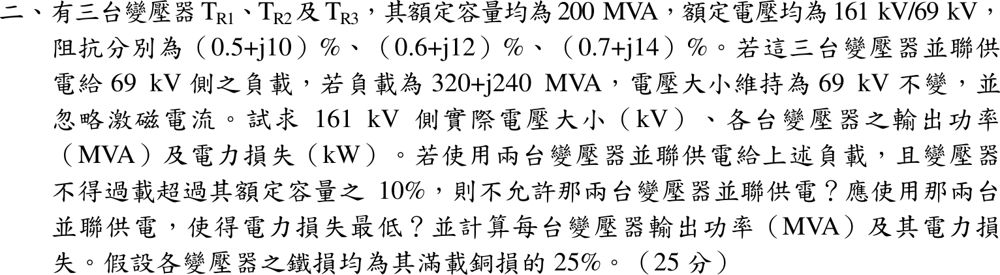
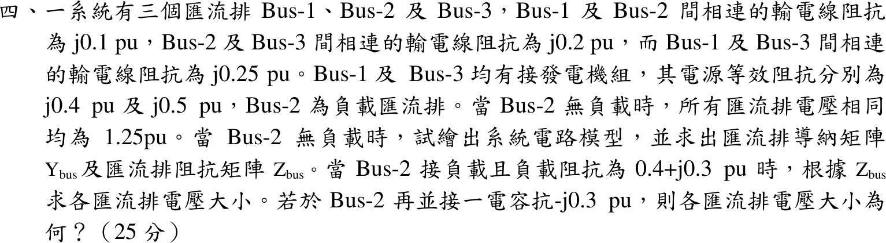

# 📝 104 年電機工程技師｜電力系統逐題詳解

> 本頁由題級 canonical 筆記組合；每題保留官方裁切圖、校驗狀態與可追溯的推導。

## 題目導覽
- [[#一、104 年電力系統第 1 題｜序網與接地開關故障分析|第 1 題：序網與接地開關故障分析]]
- [[#二、104 年電力系統第 2 題｜並聯變壓器功率分擔與損失最佳化|第 2 題：並聯變壓器功率分擔與損失最佳化]]
- [[#三、104 年電力系統第 3 題｜兩發電機並聯三相故障|第 3 題：兩發電機並聯三相故障]]
- [[#四、104 年電力系統第 4 題｜三匯流排 $Y_{bus}$、$Z_{bus}$ 與電容補償|第 4 題：三匯流排 $Y_{bus}$、$Z_{bus}$ 與電容補償]]

---

## 一、104 年電力系統第 1 題｜序網與接地開關故障分析

> 題級識別：EE-104-05-1
> canonical 來源：[[canonical/EE-104-05-1.md]]
> 題級校驗狀態：needs_manual_review
> [!WARNING] 本題仍有官方資料缺口或事件定義歧義；請以 canonical 條件式解答為準。


### 已知與所求

基準取主變 \(MT_R\)：500 MVA、345 kV（發電機側 18 kV）。系統匯流排 345 kV，供給系統等效電源 \(360\ \mathrm{MW}+j270\ \mathrm{Mvar}\)。

| 設備 | 序電抗（各自額定為基準） | 接線 |
| --- | --- | --- |
| 發電機 500 MVA、18 kV | \(X_1=X_2=X_d''=25\%\)、\(X_0=12\%\) | 經 \(2\ \mathrm{k}\Omega\) 接地 |
| \(MT_R\) 500 MVA、18/345 kV | \(X_1=X_2=15\%\)、\(X_0=10\%\) | 發電機側 \(\Delta\)，345 kV 側 Y 經接地開關 ES |
| 系統等效電源 | \(X_1=X_2=X_0=2.5\%\)（500 MVA、345 kV） | Y 直接接地 |
| \(AT_R\) 25 MVA、\(ST_R\) 50 MVA（\(X=8\%,\,10\%\)） | 負載 A（25 MVA）、負載 B（50 MVA）皆 PF 0.8 滯後、定阻抗 | 接於發電機端／系統匯流排 |

求（一）發電機端電壓；（二）匯流排 a 相單線接地，ES 投入與切離時 345 kV 側故障相電流與匯流排零序電壓。假設：故障前匯流排電壓 \(1.0\) pu；故障計算依題意忽略 \(AT_R\)、\(ST_R\) 負載；各設備串聯電阻忽略。

### 考場標準作答

#### （一）發電機端電壓

\(ST_R\) 與負載 B 接在系統匯流排上，由 \(MT_R\) 一併供電。負載 B 阻抗（500 MVA 基準）：
\[
Z_B=\Big[(0.8+j0.6)+j0.10\Big]\frac{500}{50}=8+j7\ \mathrm{pu},\qquad I_B=\frac{1}{8+j7}=0.0708-j0.0620
\]
送往系統的電流 \(I_{sys}=\left(\dfrac{360+j270}{500}\right)^*=0.72-j0.54\)，\(MT_R\) 電流 \(I=I_{sys}+I_B=0.7908-j0.6020\)。發電機端：
\[
V_t=1+j0.15\,I=1.0903+j0.1186,\quad |V_t|=1.0968\ \mathrm{pu}
\]
\[
\boxed{|V_t|=1.0968\times18=19.74\ \mathrm{kV}}
\]
負載 A 接在發電機端，不影響由匯流排倒推的 \(V_t\)。

#### （二）序網路與故障計算

\(MT_R\) 發電機側為 \(\Delta\)，零序電流不進入發電機；ES 閉合時主變 345 kV 側才有零序接地支路 \(X_0=0.10\)。

正序（500 MVA 基準，pu；負序網路相同但無電源 \(E\)，且不含負載電流）：
```
E ─j0.25─ G ─ V_t(1.0968) ─j0.15(MT_R)─┬─ 系統匯流排 V=1.0∠0° ─ j0.025 ─ E_sys（S_sys=0.72+j0.54）
         │ I_MT=0.7908−j0.6020          │
         └─ j1.6(AT_R)─ 負載A 16+j12     └─ j1.0(ST_R)─ 負載B 8+j6，S_B=0.0708+j0.0619
```
零序（\(MT_R\) 發電機側 \(\Delta\)，零序電流不進入發電機）：
```
發電機 j0.12 + 3R_n(=3×3086≈9259)  ── 被 MT_R 的 Δ 隔離（不與匯流排相通）
母線 ─┬─ j0.025（系統）─ 地
      ├─ j0.10（MT_R）─ [ES] ─ 地      （ES 閉合才接地）
      ├─ j1.0(ST_R) ─ 3×26.25 ─ 開路於 Δ 負載（無零序路徑）
      └─ AT_R 經 Δ 隔離；其 Y 側 j1.6 ─ 3×144.5 ─ 開路於 Δ 負載
```
\(R_n\)：發電機 \(2\,\mathrm{k}\Omega/0.648=3086\)、\(AT_R\) \(5/0.0346=144.5\)、\(ST_R\) \(10/0.3809=26.25\ \mathrm{pu}\)。故障計算依題意忽略 \(AT_R\)、\(ST_R\)。
\[
Z_1=Z_2=0.025\parallel0.40=0.023529,\quad Z_0^{ES\,on}=0.025\parallel0.10=0.020,\quad Z_0^{ES\,off}=0.025
\]
\[
I_f=\frac{3(1.0)}{Z_1+Z_2+Z_0},\qquad I_b=\frac{500}{\sqrt3(345)}=0.83674\ \mathrm{kA},\qquad V_{0}=\frac{I_f}{3}Z_0
\]

- ES 投入：\(I_f=\dfrac{3}{0.067059}=44.74\) pu，\(V_0=14.91(0.020)=0.2982\) pu：
\[
\boxed{I_f=37.43\ \mathrm{kA},\qquad |V_0|=0.2982\times\tfrac{345}{\sqrt3}=59.4\ \mathrm{kV}}
\]
- ES 切離：\(I_f=\dfrac{3}{0.072059}=41.63\) pu，\(V_0=13.88(0.025)=0.3469\) pu：
\[
\boxed{I_f=34.84\ \mathrm{kA},\qquad |V_0|=0.3469\times\tfrac{345}{\sqrt3}=69.1\ \mathrm{kV}}
\]

### 驗算

用相域轉換：三序電流相等 \(I_{a0}=I_{a1}=I_{a2}\)，\(I_b=I_c=0\)，\(I_a=I_{a0}+I_{a1}+I_{a2}=3I_{a1}\)，與上式相同；\(V_{a0}=-Z_0I_{a0}\) 的大小同上。ES 切離後零序阻抗變大，故障電流變小、零序電壓變大，方向合理。

### 失分點

- 求 \(V_t\) 時漏掉啟動變壓器負載 B（題目明示為定阻抗負載）會得 19.56 kV；負載 B 約 \(35\ \mathrm{MW}+j31\ \mathrm{Mvar}\)，需併入 \(MT_R\) 電流。
- 發電機側為 \(\Delta\)，發電機 \(X_0=12\%\) 與 \(2\ \mathrm{k}\Omega\) 接地電阻不入零序網；誤把它串入會讓零序阻抗錯誤。
- ES 投入才有 \(X_0=0.10\) 支路；切離時零序只剩系統 0.025。

### 條件與疑義

1. 題幹未明說 \(P,Q\) 是否含負載 B；本解依圖示讀為匯流排送往系統等效電源的功率，負載 B 另由主變供電。若不計負載 B，\(|V_t|=19.56\ \mathrm{kV}\)，故障部分不受影響。
2. 「345 kV 側之故障相電流」取故障點總電流。若指流過 \(MT_R\) 345 kV 繞組的 a 相電流，則 ES 投入約 3.96 kA、切離約 1.37 kA。

---

## 二、104 年電力系統第 2 題｜並聯變壓器功率分擔與損失最佳化

> 題級識別：EE-104-05-2
> canonical 來源：[[canonical/EE-104-05-2.md]]
> 題級校驗狀態：verified



### 已知與所求

三台變壓器 \(T_{R1},T_{R2},T_{R3}\)，各 200 MVA、161/69 kV，阻抗 \((0.5+j10)\%\)、\((0.6+j12)\%\)、\((0.7+j14)\%\)（各自額定基準，即 200 MVA）。負載 \(320+j240\ \mathrm{MVA}\)（400 MVA），69 kV 側電壓維持 69 kV，忽略激磁電流。求三台並聯時 161 kV 側電壓、各台輸出功率與損失；若只用兩台且每台不得超過額定 110%（220 MVA），不允許哪兩台並聯，哪兩台損失最低及其輸出與損失。每台鐵損 \(=25\%\) 其滿載銅損。假設：負載電壓為 1.0 pu，銅損以各台輸出電流計算，鐵損為定值。

### 考場標準作答

#### 1. 三台並聯

以 200 MVA 為基準：\(z_1=0.005+j0.10\)、\(z_2=0.006+j0.12\)、\(z_3=0.007+j0.14\)，\(S_L=1.6+j1.2\) pu。三台 \(X/R\) 皆為 20，電流分配（共同壓降）\(I_i\propto 1/z_i\) 為實數比例：
\[
w_i=\frac{1/z_i}{\sum1/z_k}=0.39252,\ 0.32710,\ 0.28037
\]
\[
|S_i|=w_i(400)=157.01,\ 130.84,\ 112.15\ \mathrm{MVA}\quad(\text{皆}<220)
\]
等效阻抗 \(z_{eq}=1/\sum(1/z_k)=0.001963+j0.039252\)，161 kV 側電壓：
\[
E=1+z_{eq}S_L^*=1.05024+j0.06045,\quad |E|=1.05198\ \mathrm{pu}\;\Rightarrow\;\boxed{|E_{161}|=169.369\ \mathrm{kV}}
\]
滿載銅損 \(R_iS_b=1.0,\,1.2,\,1.4\) MW，鐵損為其 25%（0.25、0.30、0.35 MW），\(P_{cu,i}=R_iS_b|S_i/S_b|^2\)：

| 變壓器 | 輸出 (MVA) | 銅損 (kW) | 鐵損 (kW) | 合計 (kW) |
| --- | --- | --- | --- | --- |
| \(T_{R1}\) | 157.01 | 616.3 | 250 | 866.3 |
| \(T_{R2}\) | 130.84 | 513.6 | 300 | 813.6 |
| \(T_{R3}\) | 112.15 | 440.2 | 350 | 790.2 |

三台總損失 \(\boxed{2470.1\ \mathrm{kW}}\)。

#### 2. 兩台並聯

同法重新分配 400 MVA：

| 組合 | 輸出 (MVA) | 最大負載率 | 總損失 |
| --- | --- | --- | --- |
| \(T_{R1}+T_{R2}\) | 218.18／181.82 | 218.18 < 220 可 | 2.73182 MW |
| \(T_{R1}+T_{R3}\) | 233.33／166.67 | 233.33 > 220 **不可** | 2.93333 MW |
| \(T_{R2}+T_{R3}\) | 215.38／184.62 | 215.38 < 220 可 | 3.23462 MW |

\(\boxed{\text{不允許 }T_{R1}+T_{R3}\text{ 並聯（}T_{R1}\text{ 過載 }233.3\ \mathrm{MVA}\text{）}}\)；容許組合中損失最低的是 \(\boxed{T_{R1}+T_{R2}}\)（TR1+TR2）：
\[
S_1=174.545+j130.909\ \mathrm{MVA},\quad S_2=145.455+j109.091\ \mathrm{MVA}
\]
\[
P_{loss,1}=1440.1\ \mathrm{kW},\quad P_{loss,2}=1291.7\ \mathrm{kW},\quad \boxed{P_{loss}=2.73182\ \mathrm{MW}=2731.8\ \mathrm{kW}}
\]

### 驗算

以壓降相等檢查分擔：\(z_1I_1=z_2I_2=z_3I_3\)（三台並聯大小皆約 \(0.079\ \mathrm{pu}\)，相同）。損失加總：三台並聯銅損 \(=\sum R_i|I_i|^2S_b=1.5701\) MW，加三台鐵損 0.90 MW 得 2.4701 MW，與表列相符；\(T_{R1}+T_{R2}\) 的銅損 \(1.19008+0.99174=2.18182\) MW 加鐵損 0.55 MW 得 2.73182 MW。

### 失分點

- \(T_{R1}\) 與 \(T_{R3}\) 並聯時 \(T_{R1}\) 分得 \(400\times0.5833=233.3\) MVA，超過 220 MVA；總損失雖不是最大，仍必須剔除。
- 鐵損不隨負載變，每多投入一台即多 \(0.25R_iS_b\)；只比銅損會誤選 \(T_{R2}+T_{R3}\) 或三台全開。
- 百分阻抗是各台額定基準（200 MVA），三台容量相同故可直接換為同一基準；\(161\ \mathrm{kV}\) 側電壓要由 \(1+z_{eq}S_L^*\) 求，不能直接用 161 kV。

---

## 三、104 年電力系統第 3 題｜兩發電機並聯三相故障

> 題級識別：EE-104-05-3
> canonical 來源：[[canonical/EE-104-05-3.md]]
> 題級校驗狀態：verified


### 已知與所求

兩部相同發電機各 550 MVA、20 kV，\(X_d''=25\%\)、\(X_d=95\%\)；各經 550 MVA、20/345 kV、\(X_T=15\%\) 升壓變壓器接至 345 kV 系統匯流排，忽略電阻。正常時匯流排電壓 345 kV；題面「兩部機組各自供電至系統匯流排之有效功率均為 440 MW」，匯流排三相短路時兩機的次暫態故障電流分別為 \(2.5\ \mathrm{kA}\)、\(3\ \mathrm{kA}\)。求單線圖與次暫態電路、正常時各機端電壓與送至匯流排的無效功率，以及匯流排故障時的次暫態故障電流。基準取升壓變壓器額定：\(S_b=550\) MVA，\(V_b=345\) kV（高壓側）、20 kV（低壓側）。

假設：「均為 440 MW」讀為每部機各 440 MW（\(P_i=0.8\) pu）；系統側阻抗未給，故「系統提供至匯流排的故障電流」取兩部機組貢獻之相量和。

### 考場標準作答

```
單線圖：  G1 ─ T1 ─┐
                    ├─ 345 kV 匯流排（三相故障點）
          G2 ─ T2 ─┘
次暫態電路（每機）： E'' ─ j0.25 ─ j0.15 ─ 匯流排（V_B=1∠0° pu，故障時 0）
```
\[
I_b=\frac{550}{\sqrt3(345)}=0.920413\ \mathrm{kA},\quad P_i=\frac{440}{550}=0.8\ \mathrm{pu},\quad X_\Sigma''=0.25+0.15=0.40\ \mathrm{pu}
\]

#### 1. 故障電流反算 \(E''\)

匯流排短路時 \(V_B=0\)，\(|E_i''|=X_\Sigma''I_{f,i}/I_b\)：
\[
\boxed{|E_1''|=0.40\tfrac{2.5}{0.920413}=1.086468\ \mathrm{pu}},\qquad \boxed{|E_2''|=0.40\tfrac{3.0}{0.920413}=1.303762\ \mathrm{pu}}
\]

#### 2. 預故障電流與功率平衡

設送入匯流排電流 \(I_i=0.8-jq_i\)，則 \(S_B=V_BI_i^*=0.8+jq_i\)（功率平衡），且 \(E_i''=V_B+jX_\Sigma''I_i=(1+0.4q_i)+j0.32\)。取正常小訊號穩定的低功角分支：
\[
q_i=\frac{\sqrt{|E_i''|^2-0.32^2}-1}{0.4}\;\Rightarrow\; q_1=0.095685,\ q_2=0.659702
\]
\[
\delta_1=\boxed{17.1295^\circ},\quad \delta_2=\boxed{14.2081^\circ}
\]
另一根 \(\delta>90^\circ\) 需吸收超過 2000 Mvar 且 \(dP/d\delta<0\)，不符正常小訊號穩定運轉，捨去。

#### 3. 端電壓與無效功率

\(V_{t,i}=V_B+jX_TI_i\)：\(V_{t,1}=1.01435+j0.12\)、\(V_{t,2}=1.09896+j0.12\)：
\[
\boxed{|V_{t,1}|=1.021426\times20=20.4285\ \mathrm{kV}},\qquad \boxed{|V_{t,2}|=1.105488\times20=22.1098\ \mathrm{kV}}
\]
\[
\boxed{Q_{B,1}=0.095685(550)=52.6270\ \mathrm{Mvar}},\qquad \boxed{Q_{B,2}=0.659702(550)=362.8363\ \mathrm{Mvar}}
\]

#### 4. 匯流排三相故障電流

\(I_{f,i}''=E_i''/j0.40\)：\(I_{f,1}''=0.8-j2.595685\)、\(I_{f,2}''=0.8-j3.159702\)，相量和 \(1.6-j5.755388\)：
\[
|I_f''|=5.973649(0.920413)=\boxed{5.4982\ \mathrm{kA}}\approx\boxed{5.5\text{ kA}}
\]

### 驗算

故障電流反算：由重建的 \(E_i''\) 除以 \(j0.40\)，大小乘 \(I_b\) 恰為 \(2.5\) 與 \(3.0\ \mathrm{kA}\)。另以功角公式檢查有功：\(P=\dfrac{|E_i''|V_B\sin\delta_i}{X_\Sigma''}\)，\(\dfrac{1.086468\sin17.1295^\circ}{0.40}=0.800\)、\(\dfrac{1.303762\sin14.2081^\circ}{0.40}=0.800\)，與 \(P_i=0.8\) pu 相符。

### 失分點

- 不可先假設 \(E''=1\) pu；題面給的 \(2.5/3.0\ \mathrm{kA}\) 正是反推各機 \(E''\) 的資料，也因此兩機的 \(Q\) 不同。
- \(P_i=0.8\) 是每部機各 440 MW 對 550 MVA 基準，不是兩部合計除以兩台。
- 最後是兩個故障電流相量相加（5.498 kA），不是代數相加；電流的相角不同。

### 條件與疑義

題幹未給系統等效阻抗，故「系統提供至匯流排之故障電流」只能取兩部機組貢獻之相量和；若題意另含系統側貢獻，須補系統阻抗後再加。

---

## 四、104 年電力系統第 4 題｜三匯流排 $Y_{bus}$、$Z_{bus}$ 與電容補償

> 題級識別：EE-104-05-4
> canonical 來源：[[canonical/EE-104-05-4.md]]
> 題級校驗狀態：verified



### 已知與所求

三匯流排：Bus 1–2 線路 \(j0.1\)、Bus 2–3 線路 \(j0.2\)、Bus 1–3 線路 \(j0.25\)（pu）。Bus 1、Bus 3 各接發電機組，電源等效阻抗 \(j0.4\)、\(j0.5\)；Bus 2 為負載匯流排。Bus 2 無載時各匯流排電壓同為 \(1.25\) pu。求電路模型、\(Y_{bus}\)、\(Z_{bus}\)；Bus 2 接 \(0.4+j0.3\) pu 負載時依 \(Z_{bus}\) 求各匯流排電壓；再並接 \(-j0.3\) pu 電容抗後各匯流排電壓。假設：電源模型為等電壓 \(1.25\ \mathrm{pu}\) 串聯其等效電抗，電源阻抗視為接地支路；忽略線路電阻與並聯電納。

### 考場標準作答

#### 1. 電路模型與 \(Y_{bus}\)、\(Z_{bus}\)

```
Bus1 ──j0.1── Bus2 ──j0.2── Bus3
  │  ╲___________j0.25____________╱  │
 j0.4 (E=1.25)                    j0.5 (E=1.25)
 接地                              接地          Bus2：負載
```
\[
y_{12}=-j10,\ y_{23}=-j5,\ y_{13}=-j4,\ y_{g1}=-j2.5,\ y_{g3}=-j2
\]
\[
\boxed{Y_{bus}=\begin{bmatrix}-j16.5&j10&j4\\ j10&-j15&j5\\ j4&j5&-j11\end{bmatrix}\mathrm{pu},\quad
Z_{bus}=Y_{bus}^{-1}=j\begin{bmatrix}0.245614&0.228070&0.192982\\0.228070&0.290351&0.214912\\0.192982&0.214912&0.258772\end{bmatrix}\mathrm{pu}}
\]

#### 2. Bus 2 接 \(Z_L=0.4+j0.3\)

無載電壓即開路電壓 \(V_{oc}=1.25\) pu，Bus 2 戴維寧阻抗 \(Z_{22}=j0.290351\)：
\[
I_L=\frac{1.25}{0.4+j(0.3+0.290351)}=0.983257-j1.451166,\qquad V=V_{oc}-Z_{bus}(:,2)\,I_L
\]
\[
V_1=0.919032-j0.224252,\ V_2=0.828653-j0.285489,\ V_3=0.938127-j0.211314
\]
\[
\boxed{|V_1|=0.9460,\ |V_2|=0.8765,\ |V_3|=0.9616\ \mathrm{pu}}
\]

#### 3. 再並接 \(-j0.3\) 電容抗

負載與電容並聯：\(Z_{L\parallel C}=\left(\dfrac1{0.4+j0.3}+\dfrac1{-j0.3}\right)^{-1}=0.225-j0.300\)：
\[
I=\frac{1.25}{0.225+j(0.290351-0.300)}=5.545357+j0.237813
\]
\[
V_1=1.304238-j1.264731,\ V_2=1.319049-j1.610099,\ V_3=1.301109-j1.191765
\]
\[
\boxed{|V_1|=1.8168,\ |V_2|=2.0814,\ |V_3|=1.7644\ \mathrm{pu}}
\]

### 驗算

節點電壓法（不用 \(Z_{bus}\)）：電源以諾頓電流 \(1.25y_{g1}\)、\(1.25y_{g3}\) 注入，負載導納加到 \(Y_{22}\)，直接解 \(Y_{bus}'V=I\)，兩種負載情況與上列電壓全相符（誤差 \(<10^{-9}\) pu）。電容抗 0.300 與 Bus 2 戴維寧電抗 0.290351 幾乎相消，總阻抗只剩 \(0.225-j0.0096\)，電流約 5.5 pu，電壓大幅上升屬並聯共振現象，非計算錯誤。

### 失分點

- \(Y_{bus}\) 對角項要含電源等效阻抗的接地支路：\(Y_{11}=-j(10+4+2.5)\)、\(Y_{33}=-j(5+4+2)\)；漏掉會得到奇異矩陣，無法求 \(Z_{bus}\)。
- 負載情況的開路電壓用 \(1.25\) pu（不是 1.0）；電壓下降量 \(Z_{bus}(:,2)I_L\) 要用 Bus 2 那一行，三匯流排都要更新。
- 並聯電容後要先把電容與負載合成 \(0.225-j0.300\) 再與 \(Z_{22}\) 串聯，不可把電容電流另外加上。

---
