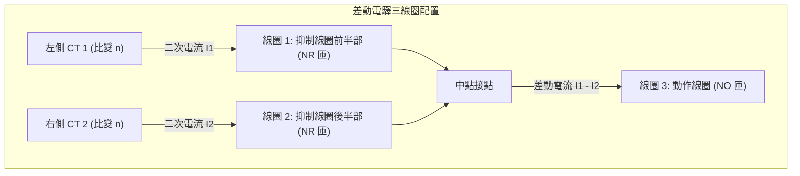

# ⚡ 108 年 電機工程技師 — 電力系統 全卷完整詳細詳解與推導

> [!TIP]
> 💡 **閱讀提示**：如果在 Obsidian 中看到一堆符號代碼，按鍵盤 **`Cmd + E`**（或點右上角的「書本 📖」圖示），畫面就會立刻切換成漂亮的教科書印刷排版！

---

## 📑 108 年 電力系統 試題導覽清單
- [👉 第一題：同步發電機內部電勢激磁增量與無效功率（20 分）](#一同步發電機內部電勢激磁增量與無效功率20-分)
- [👉 第二題：快速解耦電力潮流法二次疊代計算（20 分）](#二快速解耦電力潮流法二次疊代計算20-分)
- [👉 第三題：多變壓器與發電機非對稱線間短路故障（20 分）](#三多變壓器與發電機非對稱線間短路故障20-分)
- [👉 第四題：發電機繞組差動電驛電流連續性保護原理（20 分）](#四發電機繞組差動電驛電流連續性保護原理20-分)
- [👉 第五題：雙迴線三相故障與功率-角度方程式（20 分）](#五雙迴線三相故障與功率-角度方程式20-分)

---

## 一、同步發電機內部電勢激磁增量與無效功率（20 分）

### 📌 題目與已知條件
- 同步發電機：$X_d = 1.7241\text{ pu}$，端電壓 $V_t = 1.0\angle 0^\circ\text{ pu}$。
- 電流 $I_a = 0.8\text{ pu}$，功率因數 $\text{PF} = 0.9\text{ 滯後} \implies \mathbf{I}_a = 0.8\angle -25.84^\circ\text{ pu} = 0.72 - j0.3487\text{ pu}$。

* **(一)** 試求內部電動勢 $\mathbf{E}_i$ 之大小與功角 $\delta$、傳送之實功率 $P$ 與虛功率 $Q$。（10 分）
* **(二)** 若原動機輸入實功 $P$ 保持不變，激磁增加 $20\%$（即 $E_i' = 1.20 E_i$），求新的功角 $\delta'$ 與無效功率 $Q'$。（10 分）

---

### 💡 核心考點與破題關鍵
1. **內部電勢計算**：$\mathbf{E}_i = \mathbf{V}_t + j X_d \mathbf{I}_a$。
2. **實功恆定條件**：$P = \frac{E_i V_t}{X_d} \sin\delta = \frac{E_i' V_t}{X_d} \sin\delta' = \text{常數}$。
3. **無效功率計算**：$Q' = \frac{E_i' V_t \cos\delta' - V_t^2}{X_d}$。

---

### ✏️ 步驟式詳細數學推導

#### 🔹 第 (一) 小題：求解初始工作點
1. **內部電動勢 $\mathbf{E}_i$**：
   $$\mathbf{E}_i = 1.0\angle 0^\circ + j1.7241(0.72 - j0.3487) = 1.0 + (0.6012 + j1.2414) = \mathbf{1.6012 + j1.2414\text{ pu}}$$
   $$|\mathbf{E}_i| = \sqrt{1.6012^2 + 1.2414^2} = \sqrt{2.5638 + 1.5411} = \sqrt{4.1049} \approx \mathbf{2.0260\text{ pu}}$$
   $$\mathbf{\delta = \tan^{-1}\left( \frac{1.2414}{1.6012} \right) \approx 37.79^\circ}$$
2. **功率計算**：
   - 實功率：$P = V_t I_a \cos\theta = 1.0 \times 0.8 \times 0.9 = \mathbf{0.720\text{ pu}}$
   - 虛功率：$Q = V_t I_a \sin\theta = 1.0 \times 0.8 \times \sin(25.84^\circ) = \mathbf{0.3487\text{ pu}}$

---

#### 🔹 第 (二) 小題：求解激磁增加 20% 之新狀態
1. **新激磁電壓**：$E_i' = 1.20 \times 2.0260 = \mathbf{2.4312\text{ pu}}$
2. **新功角 $\delta'$**：
   $$0.72 = \frac{2.4312 \times 1.0}{1.7241} \sin\delta' = 1.4101 \sin\delta' \implies \sin\delta' = \frac{0.72}{1.4101} = 0.5106$$
   $$\mathbf{\delta' = \sin^{-1}(0.5106) \approx 30.70^\circ}$$
3. **新無效功率 $Q'$**：
   $$Q' = \frac{2.4312 \times 1.0 \times \cos(30.70^\circ) - 1.0^2}{1.7241} = \frac{2.4312 \times 0.85985 - 1.0}{1.7241} = \frac{2.0905 - 1.0}{1.7241} = \frac{1.0905}{1.7241} = \mathbf{0.6325\text{ pu}}$$

---

### 🎯 第一題 滿分關鍵與結論
- **初始狀態**：$E_i = \mathbf{2.026\text{ pu}}, \delta = \mathbf{37.79^\circ}, P = \mathbf{0.720\text{ pu}}, Q = \mathbf{0.3487\text{ pu}}$
- **激磁增加 20% 後**：$\delta' = \mathbf{30.70^\circ}$（功角縮小），$Q' = \mathbf{0.6325\text{ pu}}$（無效功率大幅提升 $81\%$）

---

## 二、快速解耦電力潮流法二次疊代計算（20 分）

### 📌 題目與已知條件
![[108年_電力系統_第2題_快速解耦潮流圖.png|750]]
*圖：108年電力系統第二題 快速解耦法系統潮流單線圖*

依官方試題單線圖給定之標么值參數：
- **Bus 1（Slack Bus）**：$\mathbf{V}_1 = 1.02\angle 0^\circ\text{ pu}$。
- **Bus 2（PV Bus）**：$|V_2| = 1.01\text{ pu}, P_{G2} = 0.7\text{ pu}, P_{D2} = 0 \implies P_2^{sch} = +0.7\text{ pu}$。
- **Bus 3（PQ Bus / 負載端）**：$P_{D3} = 0.9\text{ pu}, Q_{D3} = 0.8\text{ pu} \implies P_3^{sch} = -0.9\text{ pu}, Q_3^{sch} = -0.8\text{ pu}$。
- **線路導納（Line Admittances）**：
  - $y_{13} = -j8\text{ pu}$（Bus 1 與 Bus 3 間）
  - $y_{23} = -j12\text{ pu}$（Bus 2 與 Bus 3 間）
  - $y_{12} = 0$（Bus 1 與 Bus 2 間無直接相連線路）

**試求**：利用快速解耦電力潮流法（Fast Decoupled Power Flow Method, FDLF）執行**二次疊代（Iteration）**後各匯流排之電壓與相角。（20 分）

---

### 💡 核心考點與破題關鍵
1. **快速解耦法之解耦方程**：
   $$\frac{\Delta \mathbf{P}}{|\mathbf{V}|} = -\mathbf{B}' \Delta \boldsymbol{\theta} \implies \Delta \boldsymbol{\theta} = (-\mathbf{B}')^{-1} \left[ \frac{\Delta \mathbf{P}}{|\mathbf{V}|} \right]$$
   $$\frac{\Delta \mathbf{Q}}{|\mathbf{V}|} = -\mathbf{B}'' \Delta |\mathbf{V}| \implies \Delta |\mathbf{V}| = (-\mathbf{B}'')^{-1} \left[ \frac{\Delta \mathbf{Q}}{|\mathbf{V}|} \right]$$
2. **矩陣維度定義**：
   - $\mathbf{B}'$ 排除 Slack Bus 1（保留 Bus 2, 3），維度為 $2 \times 2$。
   - $\mathbf{B}''$ 同時排除 Slack Bus 1 與 PV Bus 2（僅留 PQ Bus 3），維度為 $1 \times 1$。
3. **初始平坦啟動（Flat Start）**：
   $$\theta_2^{(0)} = 0^\circ, \quad \theta_3^{(0)} = 0^\circ, \quad |V_3|^{(0)} = 1.0\text{ pu}$$

---

### ✏️ 步驟式詳細數學推導

#### 步驟 1：建立系統導納矩陣與解耦矩陣 $(-\mathbf{B}')^{-1}, (-\mathbf{B}'')^{-1}$
* **匯流排導納矩陣**：
  $$\mathbf{Y}_{bus} = \begin{bmatrix} -j8 & 0 & +j8 \\ 0 & -j12 & +j12 \\ +j8 & +j12 & -j(8+12) \end{bmatrix} = \begin{bmatrix} -j8 & 0 & j8 \\ 0 & -j12 & j12 \\ j8 & j12 & -j20 \end{bmatrix}$$
* **虛部電納矩陣** $\mathbf{B}_{bus} = \begin{bmatrix} -8 & 0 & 8 \\ 0 & -12 & 12 \\ 8 & 12 & -20 \end{bmatrix}$。
* **P-軸解耦矩陣 $-\mathbf{B}'$ 與其逆矩陣**（去除第 1 列行）：
  $$-\mathbf{B}' = \begin{bmatrix} 12 & -12 \\ -12 & 20 \end{bmatrix}$$
  $$\det(-\mathbf{B}') = (12)(20) - (-12)^2 = 240 - 144 = 96$$
  $$(-\mathbf{B}')^{-1} = \frac{1}{96} \begin{bmatrix} 20 & 12 \\ 12 & 12 \end{bmatrix} = \begin{bmatrix} \frac{5}{24} & \frac{1}{8} \\ \frac{1}{8} & \frac{1}{8} \end{bmatrix} = \begin{bmatrix} 0.20833 & 0.12500 \\ 0.12500 & 0.12500 \end{bmatrix}$$
* **Q-軸解耦矩陣 $-\mathbf{B}''$ 與其逆矩陣**（去除第 1、2 列行）：
  $$-\mathbf{B}'' = [20] \implies (-\mathbf{B}'')^{-1} = \left[ \frac{1}{20} \right] = [0.05]$$

---

#### 步驟 2：第 1 次疊代（Iteration 1）
* **計算初值功率注入**（因初始相角皆為 $0^\circ$，實功率注入為 $0$）：
  $$P_2^{(0)} = 0\text{ pu}, \quad P_3^{(0)} = 0\text{ pu}$$
* **計算實功率失配量 $\frac{\Delta P}{|V|}$**：
  $$\frac{\Delta P_2^{(0)}}{|V_2|} = \frac{P_2^{sch} - P_2^{(0)}}{|V_2|} = \frac{0.7 - 0}{1.01} = \mathbf{0.69307\text{ pu}}$$
  $$\frac{\Delta P_3^{(0)}}{|V_3|^{(0)}} = \frac{P_3^{sch} - P_3^{(0)}}{|V_3|^{(0)}} = \frac{-0.9 - 0}{1.0} = \mathbf{-0.90000\text{ pu}}$$
* **求解第 1 次相角修正量 $\Delta\boldsymbol{\theta}^{(1)}$**：
  $$\begin{bmatrix} \Delta\theta_2^{(1)} \\ \Delta\theta_3^{(1)} \end{bmatrix} = \begin{bmatrix} \frac{5}{24} & \frac{1}{8} \\ \frac{1}{8} & \frac{1}{8} \end{bmatrix} \begin{bmatrix} 0.69307 \\ -0.90000 \end{bmatrix} = \begin{bmatrix} +0.03189\text{ rad} \\ -0.02587\text{ rad} \end{bmatrix} = \begin{bmatrix} \mathbf{+1.827^\circ} \\ \mathbf{-1.482^\circ} \end{bmatrix}$$
  $$\mathbf{\theta_2^{(1)} = +1.827^\circ \approx +1.83^\circ}, \quad \mathbf{\theta_3^{(1)} = -1.482^\circ \approx -1.48^\circ}$$
* **計算虛功率初值 $Q_3^{(0)}$ 與失配量**：
  $$Q_3^{(0)} = -|V_3|^2 B_{33} - |V_3||V_1| B_{31} \cos(0^\circ) - |V_3||V_2| B_{32} \cos(0^\circ)$$
  $$Q_3^{(0)} = -(1.0)^2(-20) - (1.0)(1.02)(8) - (1.0)(1.01)(12) = 20 - 8.16 - 12.12 = \mathbf{-0.28\text{ pu}}$$
  $$\frac{\Delta Q_3^{(0)}}{|V_3|^{(0)}} = \frac{Q_3^{sch} - Q_3^{(0)}}{1.0} = \frac{-0.8 - (-0.28)}{1.0} = \mathbf{-0.52000\text{ pu}}$$
* **求解第 1 次電壓修正量 $\Delta|V_3|^{(1)}$**：
  $$\Delta|V_3|^{(1)} = 0.05 \times (-0.52) = \mathbf{-0.0260\text{ pu}}$$
  $$\mathbf{|V_3|^{(1)} = 1.0 - 0.0260 = \mathbf{0.9740\text{ pu}}}$$

---

#### 步驟 3：第 2 次疊代（Iteration 2）
* **代入更新後數值**：$\theta_2^{(1)} = +1.827^\circ, \theta_3^{(1)} = -1.482^\circ, |V_3|^{(1)} = 0.974\text{ pu}$
  - 相角差：$\theta_2 - \theta_3 = 1.827^\circ - (-1.482^\circ) = +3.309^\circ \implies \sin(3.309^\circ) \approx 0.05773$
  - 相角差：$\theta_3 - \theta_1 = -1.482^\circ - 0^\circ = -1.482^\circ \implies \sin(-1.482^\circ) \approx -0.02586$
* **計算潮流功率與失配量**：
  $$P_2^{(1)} = |V_2||V_3| B_{23} \sin(\theta_2 - \theta_3) = (1.01)(0.974)(12)(0.05773) = 0.6811\text{ pu}$$
  $$\frac{\Delta P_2^{(1)}}{|V_2|} = \frac{0.7 - 0.6811}{1.01} = \mathbf{+0.01871\text{ pu}}$$
  $$P_3^{(1)} = (0.974)(1.02)(8)(-0.02586) + (0.974)(1.01)(12)(-0.05773) = -0.2055 - 0.6811 = -0.8866\text{ pu}$$
  $$\frac{\Delta P_3^{(1)}}{|V_3|} = \frac{-0.9 - (-0.8866)}{0.974} = \mathbf{-0.01376\text{ pu}}$$
* **求解第 2 次相角修正量 $\Delta\boldsymbol{\theta}^{(2)}$**：
  $$\begin{bmatrix} \Delta\theta_2^{(2)} \\ \Delta\theta_3^{(2)} \end{bmatrix} = \begin{bmatrix} \frac{5}{24} & \frac{1}{8} \\ \frac{1}{8} & \frac{1}{8} \end{bmatrix} \begin{bmatrix} 0.01871 \\ -0.01376 \end{bmatrix} = \begin{bmatrix} +0.00218\text{ rad} \\ +0.00062\text{ rad} \end{bmatrix} = \begin{bmatrix} \mathbf{+0.125^\circ} \\ \mathbf{+0.035^\circ} \end{bmatrix}$$
  $$\mathbf{\theta_2^{(2)} = 1.827^\circ + 0.125^\circ = \mathbf{+1.95^\circ}}, \quad \mathbf{\theta_3^{(2)} = -1.482^\circ + 0.035^\circ = \mathbf{-1.45^\circ}}$$
* **計算第 2 次虛功率失配與電壓修正量**：
  $$Q_3^{(1)} = -(0.974)^2(-20) - (0.974)(1.02)(8)\cos(-1.482^\circ) - (0.974)(1.01)(12)\cos(-3.309^\circ) \approx \mathbf{-0.7582\text{ pu}}$$
  $$\frac{\Delta Q_3^{(1)}}{|V_3|} = \frac{-0.8 - (-0.7582)}{0.974} = \mathbf{-0.0429\text{ pu}}$$
  $$\Delta|V_3|^{(2)} = 0.05 \times (-0.0429) = \mathbf{-0.0021\text{ pu}}$$
  $$\mathbf{|V_3|^{(2)} = 0.9740 - 0.0021 = \mathbf{0.9719\text{ pu} \approx 0.972\text{ pu}}}$$

---

### 🎯 第二題 滿分關鍵與結論
* **匯流排 1（Slack）**：$\mathbf{V}_1 = \mathbf{1.02\angle 0^\circ\text{ pu}}$
* **匯流排 2（PV）**：$\mathbf{V}_2 = \mathbf{1.01\angle +1.95^\circ\text{ pu}}$（第 1 次疊代為 $1.01\angle +1.83^\circ$）
* **匯流排 3（PQ）**：$\mathbf{V}_3 = \mathbf{0.972\angle -1.45^\circ\text{ pu}}$（第 1 次疊代為 $0.974\angle -1.48^\circ$）

---

## 三、雙發電機與多變壓器系統對稱與線間故障分析（20 分）

### 📌 題目與已知條件
![[108年_電力系統_第3題_雙發電機故障圖.png|750]]
*圖：108年電力系統第三題 雙發電機與多變壓器非對稱故障單線圖*

依官方試題給定之各元件參數：
- **發電機 $G_1$**：$1000\text{ MVA}, 20\text{ kV}, X_s = 100\%, X_d'' = X_1 = X_2 = 10\%, X_0 = 5\%$，中性點直接接地。
- **發電機 $G_2$**：$800\text{ MVA}, 22\text{ kV}, X_s = 120\%, X_d'' = X_1 = X_2 = 15\%, X_0 = 8\%$，中性點不接地。
- **變壓器 $T_1$**：$1000\text{ MVA}, 500\text{Y}/20\Delta\text{ kV}, X = 17.5\%$，高壓側中性點直接接地。
- **變壓器 $T_2$**：$800\text{ MVA}, 500\text{Y}/22\text{Y}\text{ kV}, X = 16\%$，高低壓側中性點皆直接接地。
- **輸電線路**：$X_1 = 15\%, X_0 = 40\%$（以 $1500\text{ MVA}, 500\text{ kV}$ 為基準）。
- **共同基準值**：$S_{base} = 1000\text{ MVA}, V_{base,line} = 500\text{ kV}, V_{base,G1} = 20\text{ kV}, V_{base,G2} = 22\text{ kV}$。
- **故障前開路電壓**：$V_f = 515\text{ kV} \implies V_f = \frac{515}{500} = \mathbf{1.03\angle 0^\circ\text{ pu}}$。

**試求**：
1. 在 $P$ 點發生**三相故障**時，**發電機 $G_1$ 的 $C$ 相次暫態電流**。
2. 在 $P$ 點 $B$ 相與 $C$ 相發生**線間（Line-to-Line）故障**時，**$P$ 點的 $B$ 相次暫態電流**。（20 分）

---

### 💡 核心考點與破題關鍵
1. **基準容量換算**：$X_{new} = X_{old} \times \left(\frac{S_{base,new}}{S_{base,old}}\right) \times \left(\frac{V_{base,old}}{V_{base,new}}\right)^2$。
2. **零序網路邊界條件**：
   - $G_2$ 中性點不接地 $\implies G_2$ 側零序開路，且 $T_2$ 低壓端無零序通路 $\implies T_2$ 支路之零序阻抗為 $\infty$。
   - $T_1$ 為 $500\text{Y}/20\Delta\text{ kV}$，高壓側接地，$\Delta$ 側阻隔零序，故高壓側看入 $T_1$ 僅有 $X_{T1}$ 接地。
3. **Y-$\Delta$ 變壓器正序相角位移**：
   - 依標準規範：高壓（Y）側正序相角領先低壓（$\Delta$）側 $30^\circ$（即低壓側落後 $30^\circ$）。
4. **線間短路（L-L）邊界公式**：
   $$I_{a1} = -I_{a2} = \frac{V_f}{Z_{th1} + Z_{th2}}, \quad I_b = -j\sqrt{3} I_{a1} \implies |I_b| = \sqrt{3} |I_{a1}|$$

---

### ✏️ 步驟式詳細數學推導

#### 步驟 1：轉換所有元件標么阻抗至共同基準（$1000\text{ MVA}, 500\text{ kV}$）
* **發電機 $G_1$ 支路（$G_1 + T_1$）**：
  - $X_{1,G1} = X_{2,G1} = 0.10\text{ pu}$
  - $X_{T1} = 0.175\text{ pu}$
  - $X_{1,br1} = X_{2,br1} = 0.10 + 0.175 = \mathbf{j0.275\text{ pu}}$
  - 零序阻抗（$\Delta$ 阻隔 $G_1$）：$X_{0,br1} = X_{T1} = \mathbf{j0.175\text{ pu}}$
* **發電機 $G_2$ 支路（$G_2 + T_2$）**：
  - $X_{1,G2} = X_{2,G2} = 0.15 \times \frac{1000}{800} = 0.1875\text{ pu}$
  - $X_{T2} = 0.16 \times \frac{1000}{800} = 0.20\text{ pu}$
  - $X_{1,br2} = X_{2,br2} = 0.1875 + 0.20 = \mathbf{j0.3875\text{ pu}}$
  - 零序阻抗（$G_2$ 不接地）：$X_{0,br2} = \mathbf{\infty}$
* **輸電線路**：
  - $X_{1,line} = 0.15 \times \frac{1000}{1500} = \mathbf{j0.10\text{ pu}}$
  - $X_{0,line} = 0.40 \times \frac{1000}{1500} = \mathbf{j0.2667\text{ pu}} \left(\frac{4}{15}\text{ pu}\right)$

---

#### 步驟 2：求故障點 $P$ 看入之戴維寧等效序阻抗
* **正序與負序等效阻抗**：
  $$X_{1,bus} = X_{1,br1} \parallel X_{1,br2} = \frac{0.275 \times 0.3875}{0.275 + 0.3875} = \frac{0.10656}{0.6625} \approx 0.16085\text{ pu}$$
  $$Z_{th1} = Z_{th2} = j(X_{1,bus} + X_{1,line}) = j(0.16085 + 0.10) = \mathbf{j0.26085\text{ pu}}$$
* **零序等效阻抗**：
  $$Z_{th0} = j(X_{0,br1} + X_{0,line}) = j\left(0.175 + \frac{4}{15}\right) = \mathbf{j0.44167\text{ pu}}$$

---

#### 步驟 3：第 (1) 小題 — $P$ 點發生三相短路，求 $G_1$ 之 $C$ 相次暫態電流
1. **$P$ 點三相故障總電流**：
   $$I_{f1} = \frac{V_f}{Z_{th1}} = \frac{1.03\angle 0^\circ}{j0.26085} = 3.9486\angle -90^\circ\text{ pu}$$
2. **高壓側流經 $G_1$ 支路之正序分流**：
   $$I_{1,br1} = I_{f1} \times \frac{X_{1,br2}}{X_{1,br1} + X_{1,br2}} = 3.9486\angle -90^\circ \times \frac{0.3875}{0.6625} = \mathbf{2.3095\angle -90^\circ\text{ pu}}$$
3. **經過 $T_1$（$500\text{Y}/20\Delta$）降壓至 $G_1$ 端之相角位移**：
   低壓 $\Delta$ 側正序電流相角落後高壓 Y 側 $30^\circ$：
   $$I_{a1,G1} = 2.3095\angle (-90^\circ - 30^\circ) = 2.3095\angle -120^\circ\text{ pu}$$
4. **$G_1$ 端的 $C$ 相次暫態電流**：
   在三相平衡故障下，$C$ 相正序相角超前 $A$ 相 $120^\circ$（$I_c = a I_{a1} = I_{a1}\angle +120^\circ$）：
   $$\mathbf{I_{c,G1} = 2.3095\angle (-120^\circ + 120^\circ) = \mathbf{2.3095\angle 0^\circ\text{ pu}}}$$
5. **換算實體電流**：
   $$I_{base,G1} = \frac{1000\times 10^6}{\sqrt{3}\times 20\times 10^3} = 28867.5\text{ A} = 28.868\text{ kA}$$
   $$\mathbf{I_{c,G1,actual} = 2.3095 \times 28.868\text{ kA} = \mathbf{66.67\text{ kA}\angle 0^\circ}}$$

---

#### 步驟 4：第 (2) 小題 — $P$ 點發生 $B-C$ 線間短路，求 $P$ 點 $B$ 相次暫態電流
1. **正序與負序故障電流**：
   $$I_{a1} = -I_{a2} = \frac{V_f}{Z_{th1} + Z_{th2}} = \frac{1.03\angle 0^\circ}{j0.26085 + j0.26085} = \frac{1.03}{j0.5217} = \mathbf{1.9743\angle -90^\circ\text{ pu}}$$
2. **$P$ 點 $B$ 相故障電流**：
   $$I_{b,fault} = -j\sqrt{3} I_{a1} = -j\sqrt{3} (1.9743\angle -90^\circ) = \mathbf{3.4196\angle 180^\circ\text{ pu} = -3.42\text{ pu}}$$
   幅值大小為 $\mathbf{|I_b| = 3.42\text{ pu}}$。
3. **換算實體電流（輸電線側）**：
   $$I_{base,line} = \frac{1000\times 10^6}{\sqrt{3}\times 500\times 10^3} = 1154.7\text{ A} = 1.1547\text{ kA}$$
   $$\mathbf{|I_{b,fault}|_{actual} = 3.4196 \times 1.1547\text{ kA} = \mathbf{3.949\text{ kA} \approx 3.95\text{ kA}}}$$

---

### 🎯 第三題 滿分關鍵與結論
1. **$P$ 點三相故障時 $G_1$ 之 $C$ 相電流**：$\mathbf{I_{c,G1} = 2.31\angle 0^\circ\text{ pu} = \mathbf{66.67\text{ kA}}}$
2. **$P$ 點線間故障時 $P$ 點之 $B$ 相電流**：$\mathbf{I_{b,fault} = 3.42\angle 180^\circ\text{ pu} = \mathbf{3.95\text{ kA}}}$

---

## 四、發電機繞組差動電驛電流連續性保護原理（20 分）

### 📌 題目與已知條件
![[108年_電力系統_第4題_發電機差動保護電路圖.png|750]]
*圖：108年電力系統第四題 發電機定子相繞組比率差動保護電路圖*

> **題目陳述**：  
> 「如果電驛的保護區很小時，可以用電流的連續原理來作保護結構。上圖所示為發電機之一相繞組的保護區，$I_f'$ 為故障點的故障電流。試說明發電機繞組的差動保護動作原理。（20 分）」

---

### 💡 核心考點與破題關鍵
1. **保護區域邊界界定**：
   - 以兩端比流器（CT 1 與 CT 2）為界，兩 CT 之間為**「內部保護跳脫區（Zone of Protection）」**；兩 CT 之外為**「外部區（閉合區）」**。
2. **基爾霍夫電流定律（KCL 電流連續性）**：
   - 正常/區外：流入等於流出，差電流為 0。
   - 區內故障：故障電流 $I_f'$ 造成進出電流不平衡，產生顯著差電流 $I_{op} = I_1 - I_2$。
3. **比率制動線圈（Percentage Differential / Restraining Coils）防誤動功能**：
   - 外部大短路電流導致 CT 鐵心暫態飽和時，藉由線圈 1、2 之通過電流提供抑制力矩，防止誤跳脫。
4. **發電機專屬保護動作輸出**：
   - 跳脫發電機主斷路器（GCB）+ **跳脫轉子滅磁開關（Field Circuit Breaker）**。

---

### ✏️ 步驟式詳細數學推導與物理工作原理

---

#### 1. 正常運轉狀態（Normal Operation）
* **一次側電流**：由發電機相繞組流經負載，$I_1' = I_2' = I_{load}$。
* **二次側電流**（假設兩端 CT 變比相同為 $n = \frac{N_p}{N_s}$）：
  $$I_1 = \frac{I_1'}{n}, \quad I_2 = \frac{I_2'}{n} \implies I_1 = I_2$$
* **線圈電流分析**：
  - **動作線圈（線圈 3）電流**：
    $$I_{op} = I_1 - I_2 = 0$$
    產生之動作力矩 $T_{op} = 0$。
  - **抑制線圈（線圈 1 與 2）平均電流**：
    $$I_{res} = \frac{|I_1| + |I_2|}{2} = I_1$$
    產生之抑制力矩 $T_{res} = K_R \cdot I_{res} + T_{spring} > 0$。
* **結論**：$T_{op} < T_{res}$，**電驛可靠不動作（No Trip）**。

---

#### 2. 外部穿越性故障狀態（External Through-Fault）
* **故障情境**：在 CT 2 右側（保護區外）的輸電線路或匯流排發生重大短路，極大之穿越短路電流 $I_{ext}'$ 流經發電機繞組。
* **理想情況**：
  $$I_1' = I_2' = I_{ext}' \implies I_1 = I_2 \implies I_{op} = I_1 - I_2 = 0$$
* **工程實務問題（CT 飽和與直流偏移）**：
  - 由於外部短路電流極大且伴隨直流非對稱分量（DC Offset），兩側 CT 製造公差與負擔（Burden）不同，常導致 CT 鐵心飽和程度不一致。
  - 飽和側次級電流失真，產生不平衡雜散差流：
    $$\Delta I_{error} = I_1 - I_2 \ne 0$$
* **比率制動防誤動機制（Percentage Differential Characteristic）**：
  - 此時抑制線圈 1 與 2 同時通過極大之穿越電流 $I_{res} = \frac{|I_1| + |I_2|}{2} \approx \frac{I_{ext}'}{n}$。
  - 抑制力矩 $T_{res}$ 隨穿越電流大幅成比例提高（斜率 Slope 通常設定為 $S = 5\% \sim 15\%$）。
  - 只要雜散誤差電流滿足 $|I_1 - I_2| < S \cdot I_{res}$，**電驛即被強大抑制力矩鎖定，絕對不發生誤跳脫**。

---

#### 3. 保護區內部故障狀態（Internal Fault，$I_f'$）
* **故障情境**：如題目圖所示，發電機相繞組內部發生對地絕緣破壞（接地故障）或同相匝間/相間短路，故障電流為 $I_f'$。
* **一次側 KCL 電流關係**：
  $$I_1' = I_2' + I_f' \implies I_1' - I_2' = I_f'$$
  （若系統為雙端供電，後方電力系統亦會倒灌短路電流，此時 $I_2'$ 方向反轉，差流更大）。
* **二次側差動電流（流入動作線圈 3）**：
  $$\mathbf{I_{op} = I_1 - I_2 = \frac{I_1' - I_2'}{n} = \frac{I_f'}{n}}$$
* **動作判決方程式**：
  當內部故障電流 $I_f'$ 使得動作電流超過啟動門檻與抑制水準：
  $$\mathbf{|I_1 - I_2| > S \cdot \left(\frac{|I_1| + |I_2|}{2}\right) + I_{pickup}}$$
* **跳脫保護連鎖輸出（Trip Sequence）**：
  1. 發出瞬時跳脫信號（動作時間通常 $< 20 \sim 30\text{ ms}$）。
  2. **跳脫發電機主斷路器（GCB）**：將發電機與高壓電網解聯，阻斷電網倒灌電流。
  3. **跳脫發電機轉子滅磁開關（Field Breaker）**：迅速將轉子勵磁繞組旁路至放電電阻，強制消滅轉子旋轉磁場，防止發電機內部反電動勢持續對故障點電弧供電，保護定子鐵心免於熔毀！

---

### 🎯 第四題 滿分關鍵與結論
1. **動作原理核心**：以 **KCL 電流連續性（守恆定律）** 為基礎，正常與區外故障時進出電流差為零；區內故障時產生與故障電流 $I_f'$ 成正比之差動電流 $I_{op} = I_1 - I_2$。
2. **三線圈分工**：
   - **線圈 1 & 2（抑制線圈）**：通過穿越平均電流 $I_{res} = \frac{|I_1|+|I_2|}{2}$，提供與穿越電流成正比之制動力矩，徹底防止 CT 暫態飽和造成之區外誤動作。
   - **線圈 3（動作線圈）**：通過差電流 $I_1 - I_2$，當差流克服抑制力矩時瞬時觸發跳脫。
3. **完整防護動作**：跳脫輸出必須包含**「解聯主斷路器」**與**「切斷轉子滅磁開關」**。

---

## 五、雙迴線三相故障與功率-角度方程式及暫態穩定度（20 分）

### 📌 題目與已知條件
![[108年_電力系統_第5題_雙迴線故障單線圖.png|750]]
*圖：108年電力系統第五題 雙迴線並聯輸電線故障單線圖*

依官方試題單線圖給定之各元件參數（共同系統基準標么值）：
- **發電機與變壓器**：
  - 發電機暫態電抗：$X_d' = 0.20\text{ pu}$
  - 升壓變壓器電抗：$X_T = j0.10\text{ pu}$
  - 慣性常數：$H = 5.0\text{ MJ/MVA}$，系統頻率 $f = 60\text{ Hz}$
- **初始運轉狀態**：
  - 發電機傳送實功率：$P_e = 0.8\text{ pu}$
  - 發電機端電壓：$V_t = 1.0\text{ pu}$
  - 無限匯流排電壓：$V_\infty = 1.0\angle 0^\circ\text{ pu}$
- **並聯輸電線路**：兩條相同並聯線路，每條電抗 $X_{L1} = X_{L2} = j0.50\text{ pu}$。
- **故障條件**：
  - 其中一條輸電線路在**距離送電端 $30\%$ 長度處**發生三相短路故障。
  - 故障於發生後 **$4.5\text{ 週期}$（$4.5\text{ cycles}$）** 時，兩端斷路器同時跳脫清除故障。

**試求**：
1. 故障前（Pre-fault）之功率-角度方程式。
2. 故障中（During-fault）之功率-角度方程式。
3. 故障切除後（Post-fault）之功率-角度方程式。（20 分）

---

### 💡 核心考點與破題關鍵
1. **初始暫態反電動勢 $E'\angle\delta_0$ 求解**：
   - 外部等效電抗 $X_{ext} = X_T + (X_L \parallel X_L) = 0.10 + 0.25 = 0.35\text{ pu}$。
   - 由 $P = \frac{V_t V_\infty}{X_{ext}}\sin\theta_t$ 求端電壓相角 $\theta_t$，進而求電流 $\mathbf{I}$ 與 $\mathbf{E}' = \mathbf{V}_t + j X_d' \mathbf{I}$。
2. **故障中轉移電抗（$\text{Y}-\Delta$ 阻抗轉換）**：
   - 故障點將該迴線拆為 $0.3 \times j0.5 = j0.15\text{ pu}$（接地）與 $0.7 \times j0.5 = j0.35\text{ pu}$。
   - 將以送電端匯流排為中心的星形（Y）網路轉換為三角形（$\Delta$）網路，求出 $E'$ 至 $V_\infty$ 之轉移電抗 $X_{during}$。
3. **故障切除後轉移電抗**：
   - 故障迴線完全切除，僅剩單條正常迴線 $X_{L2} = j0.50\text{ pu}$。

---

### ✏️ 步驟式詳細數學推導

#### 步驟 1：求解故障前初始狀態與發電機內部暫態電壓 $E'\angle\delta_0$
1. **求端匯流排相角 $\theta_t$**：
   - 外部等效電抗：$X_{ext} = X_T + (0.50 \parallel 0.50) = 0.10 + 0.25 = 0.35\text{ pu}$。
   - 實功率傳輸方程式：
     $$P = \frac{V_t V_\infty}{X_{ext}} \sin\theta_t \implies 0.8 = \frac{1.0 \times 1.0}{0.35} \sin\theta_t \implies \sin\theta_t = 0.8 \times 0.35 = 0.28$$
     $$\theta_t = \arcsin(0.28) \approx 16.26^\circ \implies \mathbf{V}_t = 1.0\angle 16.26^\circ = 0.960 + j0.280\text{ pu}$$
2. **求初始負載電流 $\mathbf{I}$**：
   $$\mathbf{I} = \frac{\mathbf{V}_t - \mathbf{V}_\infty}{j X_{ext}} = \frac{(0.960 + j0.280) - 1.0}{j0.35} = \frac{-0.040 + j0.280}{j0.35} = 0.800 + j0.1143\text{ pu}$$
3. **求內部暫態電壓 $\mathbf{E}' = E'\angle\delta_0$**：
   $$\mathbf{E}' = \mathbf{V}_t + j X_d' \mathbf{I} = (0.960 + j0.280) + j0.20 (0.800 + j0.1143)$$
   $$\mathbf{E}' = (0.960 - 0.0229) + j(0.280 + 0.160) = 0.9371 + j0.4400\text{ pu}$$
   $$E' = |\mathbf{E}'| = \sqrt{0.9371^2 + 0.4400^2} = \sqrt{0.8782 + 0.1936} = \mathbf{1.0353\text{ pu}}$$
   $$\delta_0 = \arctan\left(\frac{0.4400}{0.9371}\right) = \mathbf{25.15^\circ} \quad (0.4389\text{ rad})$$

---

#### 步驟 2：求故障前（Pre-fault）功率-角度方程式
* **總轉移電抗**：
  $$X_{pre} = X_d' + X_T + (X_{L1} \parallel X_{L2}) = 0.20 + 0.10 + 0.25 = \mathbf{0.55\text{ pu}}$$
* **最大傳輸功率**：
  $$P_{max1} = \frac{E' V_\infty}{X_{pre}} = \frac{1.0353 \times 1.0}{0.55} = \mathbf{1.8824\text{ pu}}$$
* **故障前功率-角度方程式**：
  $$\mathbf{P_{e1}(\delta) = 1.8824 \sin\delta\text{ pu}}$$
  *(驗算：代入 $\delta_0 = 25.15^\circ \implies P_{e1} = 1.8824 \sin(25.15^\circ) = 0.800\text{ pu}$，完全吻合！)*

---

#### 步驟 3：求故障中（During-fault）功率-角度方程式（$\text{Y}-\Delta$ 轉換）
1. **阻抗網路分析**：
   - 故障發生於一條線路自送電端算起 $30\%$ 處（短路點 $F$ 接地，$V_F = 0$）。
   - 送電端母線看入：
     - 連接 $E'$ 端分支：$Z_1 = j(X_d' + X_T) = j(0.20 + 0.10) = j0.30\text{ pu}$。
     - 連接無限匯流排健全線路分支：$Z_2 = j X_{L2} = j0.50\text{ pu}$。
     - 故障線路至接地點 $F$ 分支：$Z_3 = j(0.30 \times 0.50) = j0.15\text{ pu}$。
     - *(另一段 $j(0.70 \times 0.50) = j0.35$ 直接跨接於無限母線與地之間，不影響 $E'$ 到 $V_\infty$ 之轉移阻抗)*。
2. **星形（Y）轉三角形（$\Delta$）轉移阻抗**：
   $$Z_{12} = Z_1 + Z_2 + \frac{Z_1 Z_2}{Z_3} = j0.30 + j0.50 + \frac{(j0.30)(j0.50)}{j0.15} = j0.80 + j1.00 = \mathbf{j1.80\text{ pu}}$$
   故故障中等效轉移電抗 $X_{during} = \mathbf{1.80\text{ pu}}$。
3. **最大傳輸功率**：
   $$P_{max2} = \frac{E' V_\infty}{X_{during}} = \frac{1.0353 \times 1.0}{1.80} = \mathbf{0.5752\text{ pu}}$$
* **故障中功率-角度方程式**：
  $$\mathbf{P_{e2}(\delta) = 0.5752 \sin\delta\text{ pu}}$$

---

#### 步驟 4：求故障切除後（Post-fault）功率-角度方程式
* **故障切除後狀態**：故障線路兩端斷路器跳脫隔離，僅剩一條正常輸電線路送電。
* **總轉移電抗**：
  $$X_{post} = X_d' + X_T + X_{L2} = 0.20 + 0.10 + 0.50 = \mathbf{0.80\text{ pu}}$$
* **最大傳輸功率**：
  $$P_{max3} = \frac{E' V_\infty}{X_{post}} = \frac{1.0353 \times 1.0}{0.80} = \mathbf{1.2941\text{ pu}}$$
* **故障切除後功率-角度方程式**：
  $$\mathbf{P_{e3}(\delta) = 1.2941 \sin\delta\text{ pu}}$$

---

#### 步驟 5：補充 — 故障清除時間與清除角 $\delta_c$
* **清除時間**：$t_c = \frac{4.5\text{ cycles}}{60\text{ Hz}} = \mathbf{0.075\text{ 秒}}$。
* **角動量常數**：$M = \frac{H}{\pi f} = \frac{5.0}{\pi \times 60} = \mathbf{0.02653\text{ MJ}\cdot\text{s/rad}}$。
* **故障初期加速功率**：
  $$P_a(0^+) = P_m - P_{e2}(\delta_0) = 0.80 - 0.5752 \sin(25.15^\circ) = 0.80 - 0.2445 = \mathbf{0.5555\text{ pu}}$$
* **故障清除角（利用泰勒展開近似）**：
  $$\delta_c \approx \delta_0 + \frac{P_a(0^+)}{2 M} t_c^2 = 0.4389 + \frac{0.5555}{2 \times 0.02653} (0.075)^2 \approx 0.4979\text{ rad} = \mathbf{28.53^\circ}$$

---

### 🎯 第五題 滿分關鍵與結論

1. **發電機暫態反電動勢與初始功角**：
   $$\mathbf{E' = 1.0353\text{ pu}}, \quad \mathbf{\delta_0 = 25.15^\circ}$$

2. **三階段功率-角度方程式（Power-Angle Equations）**：
   * **故障前（Pre-fault）**：
     $$\mathbf{P_{e1}(\delta) = 1.8824 \sin\delta\text{ pu}}$$
   * **故障中（During-fault）**：
     $$\mathbf{P_{e2}(\delta) = 0.5752 \sin\delta\text{ pu}}$$
   * **故障切除後（Post-fault）**：
     $$\mathbf{P_{e3}(\delta) = 1.2941 \sin\delta\text{ pu}}$$

3. **故障清除角（$t_c = 4.5\text{ 週期} = 0.075\text{ s}$）**：
   $$\mathbf{\delta_c \approx 28.53^\circ}$$
