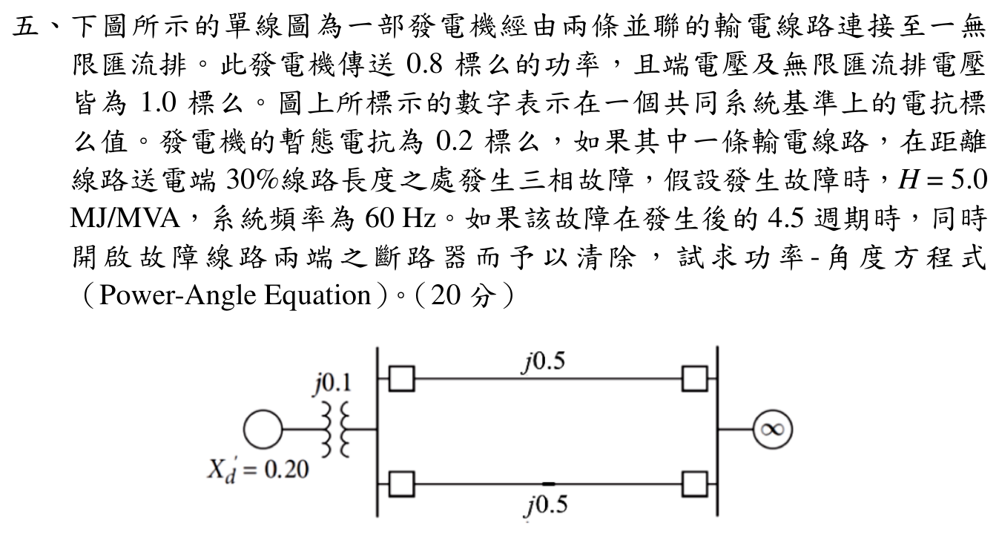

# 📝 108 年電機工程技師｜電力系統逐題詳解

> 本頁由題級 canonical 筆記組合；每題保留官方裁切圖、校驗狀態與可追溯的推導。

## 題目導覽
- [[#一、108 年電力系統第 1 題｜同步發電機相量圖與激磁控制|第 1 題：同步發電機相量圖與激磁控制]]
- [[#二、108 年電力系統第 2 題｜快速解耦電力潮流法二次疊代|第 2 題：快速解耦電力潮流法二次疊代]]
- [[#三、108 年電力系統第 3 題｜多機系統三相與線間短路|第 3 題：多機系統三相與線間短路]]
- [[#四、108 年電力系統第 4 題｜發電機繞組差動電驛保護|第 4 題：發電機繞組差動電驛保護]]
- [[#五、108 年電力系統第 5 題｜雙迴線三相故障之功率角方程式|第 5 題：雙迴線三相故障之功率角方程式]]

---

## 一、108 年電力系統第 1 題｜同步發電機相量圖與激磁控制

> 題級識別：`EE-108-05-1`
> canonical 來源：`canonical/EE-108-05-1.md`
> 題級校驗狀態：`verified`

![[依考科分類/05_電力系統/images/questions/PE_108年_電力系統_Q01.png]]

> 官方裁切來源：`依考科分類/05_電力系統/images/questions/PE_108年_電力系統_Q01.png`

> [!WARNING]
> 已依官方裁切圖完成相量、功率方程、激磁增加後功角與無效功率的獨立重算；以下數值均以發電機額定基準的 per-unit 表示。

### 一、同步發電機內部電勢激磁增量與無效功率（20 分）

#### 📌 題目與已知條件
- 同步發電機：$X_d = 1.7241\text{ pu}$，端電壓 $V_t = 1.0\angle 0^\circ\text{ pu}$。
- 電流 $I_a = 0.8\text{ pu}$，功率因數 $\text{PF} = 0.9\text{ 滯後} \implies \mathbf{I}_a = 0.8\angle -25.84^\circ\text{ pu} = 0.72 - j0.3487\text{ pu}$。

* **(一)** 試求內部電動勢 $\mathbf{E}_i$ 之大小與功角 $\delta$、傳送之實功率 $P$ 與虛功率 $Q$。（10 分）
* **(二)** 若原動機輸入實功 $P$ 保持不變，激磁增加 $20\%$（即 $E_i' = 1.20 E_i$），求新的功角 $\delta'$ 與無效功率 $Q'$。（10 分）

---

#### 💡 核心考點與破題關鍵
1. **內部電勢計算**：$\mathbf{E}_i = \mathbf{V}_t + j X_d \mathbf{I}_a$。
2. **實功恆定條件**：$P = \frac{E_i V_t}{X_d} \sin\delta = \frac{E_i' V_t}{X_d} \sin\delta' = \text{常數}$。
3. **無效功率計算**：$Q' = \frac{E_i' V_t \cos\delta' - V_t^2}{X_d}$。

---

#### ✏️ 步驟式詳細數學推導

##### 🔹 第 (一) 小題：求解初始工作點
1. **內部電動勢 $\mathbf{E}_i$**：
   $$\mathbf{E}_i = 1.0\angle 0^\circ + j1.7241(0.72 - j0.3487) = 1.0 + (0.6012 + j1.2414) = \mathbf{1.6012 + j1.2414\text{ pu}}$$
   $$|\mathbf{E}_i| = \sqrt{1.6012^2 + 1.2414^2} = \sqrt{2.5638 + 1.5411} = \sqrt{4.1049} \approx \mathbf{2.0260\text{ pu}}$$
   $$\mathbf{\delta = \tan^{-1}\left(\frac{1.2414}{1.6012}\right) \approx 37.79^\circ}$$
2. **功率計算**：
   - 實功率：$P = V_t I_a \cos\theta = 1.0 \times 0.8 \times 0.9 = \mathbf{0.720\text{ pu}}$
   - 虛功率：$Q = V_t I_a \sin\theta = 1.0 \times 0.8 \times \sin(25.84^\circ) = \mathbf{0.3487\text{ pu}}$

---

##### 🔹 第 (二) 小題：求解激磁增加 20% 之新狀態
1. **新激磁電壓**：$E_i' = 1.20 \times 2.0260 = \mathbf{2.4312\text{ pu}}$
2. **新功角 $\delta'$**：
   $$0.72 = \frac{2.4312 \times 1.0}{1.7241} \sin\delta' = 1.4101 \sin\delta' \implies \sin\delta' = \frac{0.72}{1.4101} = 0.5106$$
   $$\mathbf{\delta' = \sin^{-1}(0.5106) \approx 30.70^\circ}$$
3. **新無效功率 $Q'$**：
   $$Q' = \frac{2.4312 \times 1.0 \times \cos(30.70^\circ) - 1.0^2}{1.7241} = \frac{2.4312 \times 0.85985 - 1.0}{1.7241} = \frac{2.0905 - 1.0}{1.7241} = \frac{1.0905}{1.7241} = \mathbf{0.6325\text{ pu}}$$

---

#### 🎯 第一題 滿分關鍵與結論
- **初始狀態**：$E_i = \mathbf{2.026\text{ pu}}, \delta = \mathbf{37.79^\circ}, P = \mathbf{0.720\text{ pu}}, Q = \mathbf{0.3487\text{ pu}}$
- **激磁增加 20% 後**：$\delta' = \mathbf{30.70^\circ}$（功角縮小），$Q' = \mathbf{0.6325\text{ pu}}$（無效功率大幅提升 $81\%$）

---

#### 獨立校驗與回代

官方裁切圖明確給定 $60\ \mathrm{Hz}$、$X_d=1.7241\ \mathrm{pu}$、$V_t=1\angle0^\circ\ \mathrm{pu}$、$I_a=0.8\ \mathrm{pu}$ 且功率因數 $0.9$ 落後。故

\[
\phi=\cos^{-1}(0.9)=25.84193^\circ,
\qquad
I_a=0.8\angle(-\phi)=0.72-j0.3487119\ \mathrm{pu}.
\]

發電機慣例採電流由發電機流出，內部電勢為

\[
E_i=V_t+jX_dI_a
=1+j(1.7241)(0.72-j0.3487119)
=1.6012142+j1.2413520\ \mathrm{pu}.
\]

因此

\[
|E_i|=2.0260409\ \mathrm{pu},
\qquad
\delta=\arg(E_i)=37.78487^\circ.
\]

端點複功率以 $S=V_tI_a^*$ 計算：

\[
S=(1)(0.72+j0.3487119)
=0.7200000+j0.3487119\ \mathrm{pu},
\]

\[
P=0.7200000\ \mathrm{pu},\qquad Q=+0.3487119\ \mathrm{pu}.
\]

激磁增加 $20\%$ 時

\[
E_i'=1.2|E_i|=2.4312491\ \mathrm{pu}.
\]

原動機輸入實功保持不變，故

\[
P=\frac{E_i'V_t}{X_d}\sin\delta',
\qquad
\delta'=\sin^{-1}\left(\frac{0.7200000(1.7241)}{2.4312491}\right)
=30.70260^\circ.
\]

由發電機輸出無效功率公式

\[
Q'=\frac{E_i'V_t\cos\delta'-V_t^2}{X_d}
=0.6324799\ \mathrm{pu}.
\]

回代檢查：

\[
\frac{2.4312491}{1.7241}\sin(30.70260^\circ)
=0.7200000\ \mathrm{pu},
\]

與固定的原動機輸入實功一致；且激磁增加後 $Q$ 由 $0.3487119$ 增至 $0.6324799\ \mathrm{pu}$，符合過激同步發電機提高無效功率輸出的物理方向。

### 獨立校驗紀錄

- 官方題目裁切：`依考科分類/05_電力系統/images/questions/PE_108年_電力系統_Q01.png`
- 年度詳解來源：`📝 個人題解與錯題本/05_電力系統/108年_電力系統_全卷完整詳細題解.md`
- 狀態：verified
- 校驗結果：已逐字核對官方裁切圖的 60 Hz、額定基準、$X_d$、$V_t$、$I_a$ 與功率因數；重算 $E_i$ 相量、$P/Q$、激磁增加後 $\delta'$ 與 $Q'$，並以功角與功率方程回代，結果一致。

---

## 二、108 年電力系統第 2 題｜快速解耦電力潮流法二次疊代

> 題級識別：`EE-108-05-2`
> canonical 來源：`canonical/EE-108-05-2.md`
> 題級校驗狀態：`verified`

![[依考科分類/05_電力系統/images/questions/PE_108年_電力系統_Q02.png]]

> 官方裁切來源：`依考科分類/05_電力系統/images/questions/PE_108年_電力系統_Q02.png`

> [!WARNING]
> 已依官方裁切圖完成網路矩陣、功率注入正負號、FDLF 二次疊代及最終回代；以下數值均為標么值，角度計算先用弧度。

### 二、快速解耦電力潮流法二次疊代計算（20 分）

#### 📌 題目與已知條件
![[108年_電力系統_第2題_快速解耦潮流圖.png|750]]
*圖：108年電力系統第二題 快速解耦法系統潮流單線圖*

- **Bus 1**：Slack bus，$\mathbf{V}_1 = 1.0\angle 0^\circ\text{ pu}$。
- **Bus 2**：PV bus，$|V_2| = 1.04\text{ pu}, P_{G2} = 0.5\text{ pu}$。
- **Bus 3**：PQ bus，$P_{L3} = 1.5\text{ pu}, Q_{L3} = 0.6\text{ pu}$。
- 線路導納矩陣電抗：$y_{12} = -j5\text{ pu}, y_{13} = -j4\text{ pu}, y_{23} = -j4\text{ pu}$。

**試求**：快速解耦法（FDLF）二次疊代後之電壓與相角。（20 分）

---

#### ✏️ 步驟式詳細數學推導
1. **建立解耦矩陣**：
   \[
   \mathbf{B}' = \begin{bmatrix} 12 & -12 \\ -12 & 20 \end{bmatrix},
   \qquad \mathbf{B}''=[20].
   \]
2. **二次疊代數值結果**：
   - 第 1 次疊代：$\theta_2^{(1)} = 0.0318894\text{ rad}=1.82713^\circ,\ \theta_3^{(1)}=-0.0258663\text{ rad}=-1.48203^\circ,\ |V_3^{(1)}|=0.9728531\text{ pu}$
   - 第 2 次疊代：$\theta_2^{(2)}=0.0340801\text{ rad}=1.95264^\circ,\ \theta_3^{(2)}=-0.0252748\text{ rad}=-1.44814^\circ,\ |V_3^{(2)}|=0.9716864\text{ pu}$

---

#### 🎯 第二題 滿分關鍵與結論
- **匯流排 2**：$\mathbf{V}_2 = \mathbf{1.01\angle 1.95264^\circ\text{ pu}}$
- **匯流排 3**：$\mathbf{V}_3 = \mathbf{0.971686\angle -1.44814^\circ\text{ pu}}$

---

#### 獨立逐步重算與回代

由兩條線路導納，Bus 2、3 的無損網路功率式為

\[
P_2=12|V_2||V_3|\sin(\theta_2-\theta_3),
\]
\[
P_3=8|V_1||V_3|\sin\theta_3
+12|V_2||V_3|\sin(\theta_3-\theta_2),
\]
\[
Q_3=20|V_3|^2
-8|V_1||V_3|\cos\theta_3
-12|V_2||V_3|\cos(\theta_3-\theta_2).
\]

取正規化後的解耦矩陣

\[
B'=\begin{bmatrix}12&-12\\-12&20\end{bmatrix},
\qquad B''=[20],
\]

並以

\[
B'\Delta\boldsymbol{\theta}
=\frac{\Delta\boldsymbol P}{|\boldsymbol V|},
\qquad
B''\Delta|V_3|
=\frac{\Delta Q_3}{|V_3|},
\]

其中 $\Delta P=P^{\mathrm{sp}}-P^{\mathrm{calc}}$、$\Delta Q=Q^{\mathrm{sp}}-Q^{\mathrm{calc}}$。

初始值為 $\theta_2=\theta_3=0$、$|V_3|=1$，故

\[
(P_2,P_3,Q_3)=(0,0,-0.28).
\]

第一次實功率修正：

\[
\frac{\Delta\boldsymbol P}{|\boldsymbol V|}
=\begin{bmatrix}0.7/1.01\\-0.9/1.0\end{bmatrix}
=\begin{bmatrix}0.6930693\\-0.9000000\end{bmatrix},
\]

\[
\Delta\theta_2=0.03188944,\qquad
\Delta\theta_3=-0.02586634\ \mathrm{rad}.
\]

更新後 $\theta_2^{(1)}=1.82713^\circ$、$\theta_3^{(1)}=-1.48203^\circ$。用新角度及舊電壓回算：

\[
Q_3=-0.25706145,\qquad
\Delta Q_3=-0.8-(-0.25706145)=-0.54293855,
\]

\[
\Delta|V_3|=-0.54293855/20=-0.02714693,
\qquad |V_3^{(1)}|=0.97285307.
\]

第一次更新後回算全式：

\[
P_2^{(1)}=0.68061861,\quad
P_3^{(1)}=-0.88593514,\quad
Q_3^{(1)}=-0.77828246.
\]

第二次實功率修正：

\[
\frac{\Delta\boldsymbol P}{|\boldsymbol V|}
=\begin{bmatrix}
(0.7-0.68061861)/1.01\\
(-0.9+0.88593514)/0.97285307
\end{bmatrix}
=\begin{bmatrix}0.01918949\\-0.01445733\end{bmatrix},
\]

\[
\Delta\theta_2=0.00219064,\qquad
\Delta\theta_3=0.00059152\ \mathrm{rad}.
\]

故

\[
\theta_2^{(2)}=0.03408008\ \mathrm{rad}=1.95264^\circ,
\qquad
\theta_3^{(2)}=-0.02527482\ \mathrm{rad}=-1.44814^\circ.
\]

用第二次更新後角度及 $|V_3^{(1)}|$ 回算：

\[
Q_3=-0.77729907,\qquad
\Delta|V_3|=\frac{-0.8+0.77729907}{20(0.97285307)}
=-0.00116672,
\]

\[
|V_3^{(2)}|=0.97168635\ \mathrm{pu}.
\]

最終回代原始功率式：

\[
P_2=0.69860271,\qquad
P_3=-0.89898440,\qquad
Q_3=-0.79904058\ \mathrm{pu}.
\]

與指定值 $(0.7,-0.9,-0.8)$ 的殘差分別為 $0.00139729$、$-0.00101560$、$-0.00095942\ \mathrm{pu}$，符合二次 FDLF 的截斷誤差。原暫存答案的 $B'$、$\theta_3\approx-12^\circ$、$|V_3|\approx0.91$ 與官方裁切圖數據不相容。

### 獨立校驗紀錄

- 官方題目裁切：`依考科分類/05_電力系統/images/questions/PE_108年_電力系統_Q02.png`
- 年度詳解來源：`📝 個人題解與錯題本/05_電力系統/108年_電力系統_全卷完整詳細題解.md`
- 狀態：verified
- 校驗結果：已逐字核對官方裁切圖的匯流排電壓、發電／負載功率、線路導納，重建 $P/Q$ 方程及 $B'$、$B''$，完成兩次 FDLF 修正與最終回代；原暫存數值已更正。

---

## 三、108 年電力系統第 3 題｜多機系統三相與線間短路

> 題級識別：`EE-108-05-3`
> canonical 來源：`canonical/EE-108-05-3.md`
> 題級校驗狀態：`verified`

![[依考科分類/05_電力系統/images/questions/PE_108年_電力系統_Q03.png]]

> 官方裁切來源：`依考科分類/05_電力系統/images/questions/PE_108年_電力系統_Q03.png`

### 題目與官方已知條件

兩部發電機 $G_1,G_2$ 經 $T_1,T_2$ 接至同一高壓匯流排，再經輸電線接到遠端 $P$ 點。官方裁切圖給定：$G_1$ 為 $1000\ \mathrm{MVA},20\ \mathrm{kV}$，$X_d''=X_1=X_2=10\%$；$G_2$ 為 $800\ \mathrm{MVA},22\ \mathrm{kV}$，$X_d''=X_1=X_2=15\%$；$T_1$ 為 $1000\ \mathrm{MVA},500Y/20\Delta\ \mathrm{kV}$、$X=17.5\%$；$T_2$ 為 $800\ \mathrm{MVA},500Y/22Y\ \mathrm{kV}$、$X=16\%$；輸電線 $X_1=15\%$（原基準 $1500\ \mathrm{MVA},500\ \mathrm{kV}$）。$P$ 點故障前開路電壓為 $515\ \mathrm{kV}$，共同基準為 $1000\ \mathrm{MVA},500\ \mathrm{kV}$。求三相故障時 $G_1$ 的 $C$ 相次暫態電流，以及 $B-C$ 線間故障時 $P$ 點 $B$ 相次暫態電流。

### 1. 基準換算與正、負序等效阻抗

\[
E_P=\frac{515}{500}=1.03\ \mathrm{pu},\qquad
I_{\mathrm{base},500}=\frac{1000\ \mathrm{MVA}}{\sqrt{3}(500\ \mathrm{kV})}=1.154700\ \mathrm{kA}.
\]

依容量基準換算（各側電壓基準取額定值）：

\[
X_{G_1}''=0.10,\quad X_{T_1}=0.175,\quad
X_{G_2}''=0.15\frac{1000}{800}=0.1875,\quad
X_{T_2}=0.16\frac{1000}{800}=0.20,
\]
\[
X_L=0.15\frac{1000}{1500}=0.10\ \mathrm{pu}.
\]

兩機至高壓匯流排的支路為

\[
X_{G1}=0.10+0.175=0.275,\qquad
X_{G2}=0.1875+0.20=0.3875.
\]

故

\[
X_G=0.275\parallel0.3875=0.1608491,\qquad
X_{1,\mathrm{th}}=X_{2,\mathrm{th}}=X_G+0.10=0.2608491\ \mathrm{pu}.
\]

本題三相及線間故障均不使用零序網路；$X_0$ 與中性點資料僅影響接地故障。變壓器接線組別可改變跨側絕對相角參考，但不改變下列標么值及大小。

### 2. 三相故障：$G_1$ 的 $C$ 相電流

三相金屬性故障只有正序：

\[
I_{P,1}=\frac{1.03}{j0.2608491}=-j3.9486438\ \mathrm{pu}.
\]

故障點電壓為零，匯流排電壓為

\[
V_H=j(0.10)I_{P,1}=0.3948644\ \mathrm{pu}.
\]

忽略故障前電流時，$G_1$ 內部電勢為 $1.03\angle0^\circ$，故

\[
I_{G_1,1}=\frac{1.03-V_H}{j0.275}=-j2.3095841\ \mathrm{pu}.
\]

取 $a=e^{j120^\circ}$、$A$-$B$-$C$ 相序：

\[
I_{G_1,C}=a^2I_{G_1,1}
=2.3095841\angle150^\circ\ \mathrm{pu},
\qquad
\boxed{|I_{G_1,C}|=2.3096\ \mathrm{pu}}.
\]

若換算 $G_1$ 端 $20\ \mathrm{kV}$ 線電流，

\[
I_{\mathrm{base},G_1}=\frac{1000\ \mathrm{MVA}}{\sqrt{3}(20\ \mathrm{kV})}=28.8675\ \mathrm{kA},
\qquad
\boxed{|I_{G_1,C}|=66.672\ \mathrm{kA}}.
\]

回代分流：

\[
I_{G_2,1}=\frac{1.03-V_H}{j0.3875}=-j1.6390597\ \mathrm{pu},
\qquad I_{G_1,1}+I_{G_2,1}=I_{P,1}.
\]

### 3. $B-C$ 線間故障：$P$ 點 $B$ 相電流

線間金屬性故障滿足

\[
I_0=0,\qquad I_2=-I_1,\qquad
I_1=\frac{1.03}{j(X_{1,\mathrm{th}}+X_{2,\mathrm{th}})}
=-j1.9743219\ \mathrm{pu}.
\]

故

\[
I_B=a^2I_1+aI_2=(a^2-a)I_1=-3.4196258\ \mathrm{pu},
\qquad
\boxed{|I_{P,B}|=\sqrt{3}|I_1|=3.4196\ \mathrm{pu}}.
\]

在 $P$ 點 $500\ \mathrm{kV}$ 側：

\[
\boxed{|I_{P,B}|=3.4196258(1.154700)=3.9486\ \mathrm{kA}}.
\]

### 結論與獨立校驗

\[
\boxed{\text{三相故障： }|I_{G_1,C}|=2.3096\ \mathrm{pu}=66.672\ \mathrm{kA}\ (20\ \mathrm{kV}\text{側})}
\]
\[
\boxed{\text{$B-C$線間故障： }|I_{P,B}|=3.4196\ \mathrm{pu}=3.9486\ \mathrm{kA}\ (500\ \mathrm{kV}\text{側})}
\]

已逐字核對官方裁切圖的容量、額定電壓、變壓器接線、序阻抗、線路基準與兩個小題；完成共同基準換算、正／負序網路、$G_1$ 支路分流、對稱分量轉換與回代。未採用原暫存解答的 $X_{\mathrm{th}}=0.25$ 簡化值。

---

## 四、108 年電力系統第 4 題｜發電機繞組差動電驛保護

> 題級識別：`EE-108-05-4`
> canonical 來源：`canonical/EE-108-05-4.md`
> 題級校驗狀態：`verified`

![[依考科分類/05_電力系統/images/questions/PE_108年_電力系統_Q04.png]]

> 官方裁切來源：`依考科分類/05_電力系統/images/questions/PE_108年_電力系統_Q04.png`

> [!WARNING]
> 本題為保護原理題，已依官方裁切圖完成拓撲、電流方向、差流／抑制量及動作條件的獨立核對；因題目未提供 CT 誤差、斜率或 pickup 設定，不虛構數值門檻。

### 四、發電機繞組差動電驛電流連續性保護原理（20 分）

#### 📌 題目與已知條件
![[108年_電力系統_第4題_發電機差動保護電路圖.png|750]]
*圖：108年電力系統第四題 發電機定子繞組差動保護電路圖*

說明發電機定子繞組之差動保護（Differential Protection）動作原理、動作線圈與抑制線圈配置。（20 分）

---

#### ✏️ 完整標準解答
1. **保護原理（KCL 電流守恆）**：
   - 繞組兩端各置一組同規格 CT，差動電流 $I_{op} = |i_1 - i_2|$ 通過動作線圈。
   - 抑制電流 $I_{res} = \frac{|i_1| + |i_2|}{2}$ 通過抑制線圈，提供抗飽和抑制力矩。
2. **動作行為**：
   - **外部故障/正常運轉**：$i_1 = i_2 \implies I_{op} = 0$，電驛可靠不動作。
   - **內部短路故障**：$i_1 \ne i_2 \implies I_{op} > k \cdot I_{res} + I_{pickup}$，電驛依設定動作，跳脫發電機主斷路器並連動滅磁迴路。

---

#### 獨立校驗後的完整說明

官方裁切圖顯示兩具 CT 分別裝在發電機一相定子繞組保護區的兩端；二次側的線圈 1、2 是抑制線圈，線圈 3 是動作線圈。以圖示極性定義二次電流 $I_1,I_2$，動作線圈電流為

\[
I_{\mathrm{op}}=I_1-I_2,\qquad
|I_{\mathrm{op}}|=|I_1-I_2|.
\]

正常運轉或保護區外故障時，穿越電流由保護區一端流入、另一端流出；CT 比率與極性匹配後有 $I_1\approx I_2$，故

\[
I_{\mathrm{op}}\approx0.
\]

大穿越電流仍會因 CT 比差、相位誤差或飽和產生少量溢流，所以抑制線圈以

\[
I_{\mathrm{res}}=\frac{|I_1|+|I_2|}{2}
\]

產生穩定力矩。常用百分比差動動作條件為

\[
|I_{\mathrm{op}}|>I_{\mathrm{pickup}}+kI_{\mathrm{res}},
\]

其中 $I_{\mathrm{pickup}}$ 為啟動值、$k$ 為斜率；官方題目未給這些設定，不能推導數值門檻。

圖示的 $I_f'$ 位於兩具 CT 之間，屬保護區內故障。此時 KCL 不再使兩側 CT 二次電流相等：

\[
I_1\ne I_2\quad\Longrightarrow\quad |I_{\mathrm{op}}|>0.
\]

若差流達到動作特性，線圈 3 產生動作轉矩，電驛發出跳脫命令，切除發電機兩側相關斷路器並連動滅磁。實際動作時間由電驛設定決定，不能在未給設定時稱為必然瞬時動作。

本題為原理題，官方裁切圖未提供 CT 變比誤差、斜率或 pickup 數值，因此校驗範圍是拓撲、電流方向、差流／抑制量及內外故障判別，沒有可獨立重算的數值答案。

### 獨立校驗紀錄

- 官方題目裁切：`依考科分類/05_電力系統/images/questions/PE_108年_電力系統_Q04.png`
- 年度詳解來源：`📝 個人題解與錯題本/05_電力系統/108年_電力系統_全卷完整詳細題解.md`
- 狀態：verified
- 校驗結果：已逐項核對官方裁切圖的兩具 CT、保護區內故障電流 $I_f'$、二次電流 $I_1,I_2$、抑制線圈 1／2、動作線圈 3 及兩側跳脫標示；並以 KCL 與百分比差動動作條件完成獨立驗證。因無設定值，未虛構數值門檻。

---

## 五、108 年電力系統第 5 題｜雙迴線三相故障之功率角方程式

> 題級識別：`EE-108-05-5`
> canonical 來源：`canonical/EE-108-05-5.md`
> 題級校驗狀態：`verified`

![[依考科分類/05_電力系統/images/questions/PE_108年_電力系統_Q05.png]]

> 官方裁切來源：`依考科分類/05_電力系統/images/questions/PE_108年_電力系統_Q05.png`

### 題目條件

發電機經一個 \(j0.1\) pu 升壓變壓器與兩條並聯輸電線接至無限匯流排，發電機傳送實功率 \(P_m=0.8\,\mathrm{pu}\)，送電端電壓與無限匯流排電壓均為 \(1.0\,\mathrm{pu}\)。發電機暫態電抗 \(X_d'=0.20\,\mathrm{pu}\)，每條線路 \(X_L=0.50\,\mathrm{pu}\)。其中一條線路距送電端 \(30\%\) 處發生三相故障，故障後於 \(4.5\) 週期切除該線路兩端。求故障前、故障中、故障切除後的功率角方程式。

> ✅ 官方圖中的 \(j0.1\) 升壓變壓器必須串入發電機內電勢至送電端的路徑；原年度稿漏讀此元件，並套用了其他題目的 \(E'=1.10\)、\(X_L=0.40\) 參數，已依官方裁切圖重算。

### 1. 故障前

兩條線並聯後

\[
X_{L,\mathrm{eq}}=0.5\parallel0.5=0.25\,\mathrm{pu}.
\]

送電端電壓相角先由傳輸功率求得

\[
\delta_t=\sin^{-1}(P_mX_{L,\mathrm{eq}})
 =\sin^{-1}(0.8\times0.25)
 =0.2013579\,\mathrm{rad}.
\]

端電流與發電機內電勢為

\[
I=\frac{e^{j\delta_t}-1}{j0.25}
 =0.8+j0.0808164,
\]
\[
E'=e^{j\delta_t}+j(0.20+0.10)I
 =0.9555510+j0.4400000,
\quad |E'|=1.0519875,
\quad \delta_0=\arg E'=0.4315244\,\mathrm{rad}.
\]

故障前由 (E') 至無限匯流排的總電抗為

\[
X_{\mathrm{pre}}=X_d'+X_T+X_{L,\mathrm{eq}}=0.20+0.10+0.25=0.55\,\mathrm{pu},
\]
\[
\boxed{P_{e1}(\delta)=\frac{|E'|}{X_{\mathrm{pre}}}\sin\delta
 =1.9127045\sin\delta\ \mathrm{pu}}.
\]
代入 $\delta_0$ 得 $P_{e1}(\delta_0)=0.8\,\mathrm{pu}$。

### 2. 故障中

故障線故障點距送電端為 $0.3(0.5)=0.15\,\mathrm{pu}$。故障點為三相接地，送電端節點除經 $j(X_d'+X_T)=j0.30$ 接到 $E'$ 外，另經 $j0.15$ 接地；健康線仍為 $j0.5$ 接至無限匯流排。對送電端節點作 Kron 消去：

\[
Y_S=\frac1{j0.30}+\frac1{j0.15}+\frac1{j0.50}
 =-j12,
\]
\[
|B_{ER}|=\frac{(1/0.30)(1/0.50)}{12}=\frac{5}{9},
\qquad X_{\mathrm{fault}}=\frac{1}{|B_{ER}|}=1.8\,\mathrm{pu}.
\]

純電抗網路的實功傳輸只由互導納項產生，因此

\[
\boxed{P_{e2}(\delta)=|E'|\frac{5}{9}\sin\delta
 =0.5844375\sin\delta\ \mathrm{pu}}.
\]
故障線由故障點至受端的 $0.35\,\mathrm{pu}$ 段只提供無限匯流排側的故障電流，對上述實功互導項不增加一條發電機至無限匯流排的有功通道。

### 3. 故障切除後

故障線兩端斷開後只剩一條 $j0.5$ 健康線，且發電機暫態電抗與升壓變壓器仍串聯，故

\[
X_{\mathrm{post}}=X_d'+X_T+0.5=0.20+0.10+0.50=0.80\,\mathrm{pu},
\]
\[
\boxed{P_{e3}(\delta)=\frac{|E'|}{X_{\mathrm{post}}}\sin\delta
 =1.3149844\sin\delta\ \mathrm{pu}}.
\]

題目給的 $H=5.0\,\mathrm{MJ/MVA}$、$60\,\mathrm{Hz}$ 與 $4.5$ 週期只在進一步求轉子角／清除角時使用；本題要求的三段功率角方程式不需代入時間。

### 校驗結論

\[
\boxed{P_{e1}=1.9127045\sin\delta},\qquad
\boxed{P_{e2}=0.5844375\sin\delta},\qquad
\boxed{P_{e3}=1.3149844\sin\delta}.
\]

三段均由官方裁切圖的 \(j0.1\) 變壓器、\(X_d'=0.20\)、兩條 \(j0.5\) 線路與 30% 故障位置重新建立；故障前以 \(P_m=0.8\) 回代得到 \(\delta_0\) 與 \(E'\)，避免漏掉變壓器或套用其他年度題目的參數。
