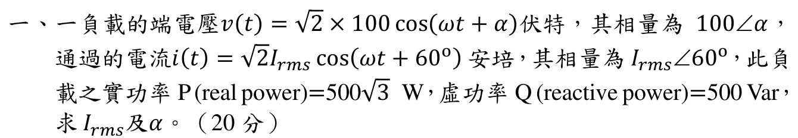
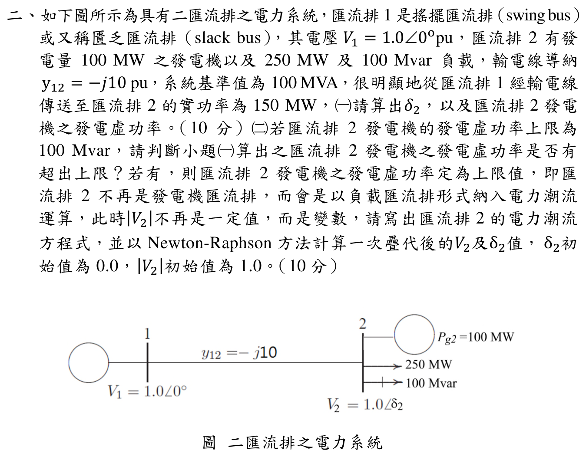
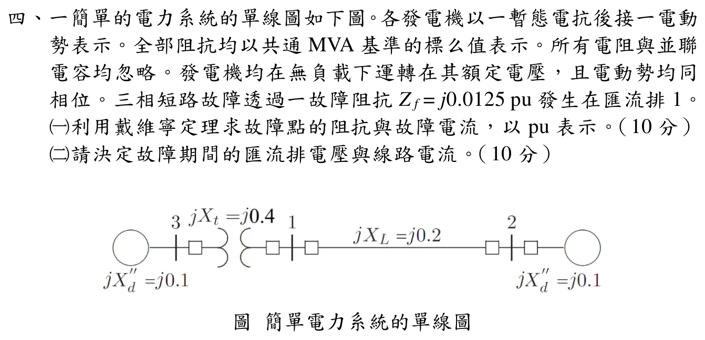

# 📝 114 年電機工程技師｜電力系統逐題詳解

> 本頁由題級 canonical 筆記組合；每題保留 QID、官方裁切、校驗狀態與完整得分型解答。

## 題目導覽
- [[#一、114 年電力系統第 1 題：負載相量與複功率|第 1 題：114 年電力系統第 1 題：負載相量與複功率]]
- [[#二、114 年電力系統第 2 題｜二匯流排潮流|第 2 題：二匯流排潮流]]
- [[#三、114 年電力系統第 3 題：經濟調度|第 3 題：114 年電力系統第 3 題：經濟調度]]
- [[#四、114 年電力系統第 4 題：三相短路|第 4 題：114 年電力系統第 4 題：三相短路]]
- [[#五、114 年電力系統第 5 題：搖擺方程式|第 5 題：114 年電力系統第 5 題：搖擺方程式]]

---

## 一、114 年電力系統第 1 題：負載相量與複功率

> 題級識別：`EE-114-05-1`
> canonical 來源：`canonical/EE-114-05-1.md`
> 題級校驗狀態：`verified`

![[依考科分類/05_電力系統/images/questions/PE_114年_電力系統_Q01.png]]

> 官方裁切來源：`依考科分類/05_電力系統/images/questions/PE_114年_電力系統_Q01.png`

### 考場標準作答

題目給定
\[
v(t)=\sqrt2(100)\cos(\omega t+\alpha),\qquad
i(t)=\sqrt2 I_{rms}\cos(\omega t+60^\circ),
\]
因此 \(\mathbf V=100\angle\alpha\ \mathrm V\)、\(\mathbf I=I_{rms}\angle60^\circ\ \mathrm A\)。

\[
|S|=\sqrt{P^2+Q^2}
=\sqrt{(500\sqrt3)^2+500^2}=1000\ \mathrm{VA},
\]
\[
\boxed{I_{rms}=|S|/|V|=1000/100=10\ \mathrm A}.
\]
由 \(S=VI^*\)，複功率角為
\[
\angle S=\tan^{-1}\frac{Q}{P}=\tan^{-1}\frac{500}{500\sqrt3}=30^\circ.
\]
又 \(\angle S=\alpha-60^\circ\)，故
\[
\boxed{\alpha=90^\circ}.
\]

### 得分點拆解

- 將時域峰值寫成 RMS 相量：\(|V|=100\ \mathrm V\)、\(|I|=I_{rms}\)。
- 使用 \(S=P+jQ\) 求視在功率大小 \(1000\ \mathrm{VA}\)。
- 寫出 \(S=VI^*\)，注意電流相量要取共軛，所以功率角為 \(\alpha-60^\circ\)。
- 同時給出電流有效值與電壓相角，並標明單位。

### 完整教學推導

由標準形式 \(x(t)=\sqrt2 X_{rms}\cos(\omega t+\theta)\)，題目中的電壓與電流 RMS 相量為
\[
\mathbf V=100\angle\alpha\ \mathrm V,
\qquad
\mathbf I=I_{rms}\angle60^\circ\ \mathrm A.
\]
負載吸收複功率採被動符號約定：
\[
S=VI^*=P+jQ=500\sqrt3+j500\ \mathrm{VA}.
\]
先取大小：
\[
|S|=\sqrt{(500\sqrt3)^2+500^2}
=\sqrt{750000+250000}=1000\ \mathrm{VA}.
\]
由 \(|S|=|V||I|\) 得
\[
I_{rms}=\frac{1000\ \mathrm{VA}}{100\ \mathrm V}=10\ \mathrm A.
\]
再取角度：
\[
\angle S=\tan^{-1}\left(\frac{500}{500\sqrt3}\right)=30^\circ.
\]
因 \(I^*=I_{rms}\angle(-60^\circ)\)，所以
\[
\angle S=\angle V+\angle I^*=\alpha-60^\circ.
\]
解得 \(\alpha=90^\circ\)。此時電壓相角比電流大 \(30^\circ\)，正好對應 \(Q>0\) 的感性負載。

### 獨立驗算

以所得結果直接重建複功率：
\[
S=(100\angle90^\circ)(10\angle60^\circ)^*
=(100\angle90^\circ)(10\angle-60^\circ)
=1000\angle30^\circ\ \mathrm{VA}.
\]
\[
S=1000(\cos30^\circ+j\sin30^\circ)
=500\sqrt3+j500\ \mathrm{VA},
\]
與題給 \(P,Q\) 完全一致；且 \(|S|=100\times10=1000\ \mathrm{VA}\)。官方裁切來源為 `依考科分類/05_電力系統/images/questions/PE_114年_電力系統_Q01.png`。

### 常見失分

- 把 \(100\) V 誤當成峰值而再除一次 \(\sqrt2\)；題目已用 \(\sqrt2\times100\)，所以 100 V 是 RMS 值。
- 忘記 \(S=VI^*\) 的共軛，誤寫成 \(\alpha+60^\circ\)。
- 只算 \(P/Q\) 比值而漏寫 \(I_{rms}\) 或角度單位。
- 將 \(Q>0\) 誤判為電流超前；本題電流落後電壓 30°。

---

## 二、114 年電力系統第 2 題｜二匯流排潮流

> 題級識別：`EE-114-05-2`
> canonical 來源：`canonical/EE-114-05-2.md`
> 題級校驗狀態：`verified`

![[依考科分類/05_電力系統/images/questions/PE_114年_電力系統_Q02.png]]

> 官方裁切來源：`依考科分類/05_電力系統/images/questions/PE_114年_電力系統_Q02.png`

### 考場標準作答

#### （一）功角與發電機虛功率（10 分）

匯流排 2 的淨注入實功率為

\[
P_2=\frac{100-250}{100}=-1.5\,\mathrm{pu}.
\]

由 \(V_1=1\angle0^\circ\)、\(V_2=1\angle\delta_2\)、\(y_{12}=-j10\)，

\[
P_2=10\sin\delta_2=-1.5
\quad\Longrightarrow\quad
\boxed{\delta_2=-8.627^\circ}.
\]

此處取正常運轉的低功角分支 \(|\delta_2|<90^\circ\)；僅由正弦方程不能宣稱這是數學上的唯一根。

\[
Q_2=10(1-\cos\delta_2)=0.11314\,\mathrm{pu}.
\]

因 \(Q_2=Q_{g2}-Q_{L2}\)，故

\[
Q_{g2}=0.11314+1.0=1.11314\,\mathrm{pu}
=\boxed{111.31\,\mathrm{Mvar}}.
\]

#### （二）PV 轉 PQ 與一次 Newton–Raphson 疊代（10 分）

\(111.31>100\,\mathrm{Mvar}\)，所以超限，令 \(Q_{g2}=100\,\mathrm{Mvar}\)，此時淨注入 \(Q_2=1.0-1.0=0\,\mathrm{pu}\)。PQ 匯流排方程式為

\[
P_2=10|V_2|\sin\delta_2=-1.5,
\]

\[
Q_2=10|V_2|^2-10|V_2|\cos\delta_2=0.
\]

在 \(\delta_2^{(0)}=0\)、\(|V_2|^{(0)}=1\) 處，

\[
\begin{bmatrix}\Delta P_2\\ \Delta Q_2\end{bmatrix}
=
\begin{bmatrix}-1.5\\0\end{bmatrix},
\qquad
J^{(0)}=
\begin{bmatrix}10&0\\0&10\end{bmatrix}.
\]

因此

\[
\begin{bmatrix}\Delta\delta_2\\ \Delta|V_2|\end{bmatrix}
=J^{-1}
\begin{bmatrix}\Delta P_2\\ \Delta Q_2\end{bmatrix}
=
\begin{bmatrix}-0.15\\0\end{bmatrix},
\]

\[
\boxed{\delta_2^{(1)}=-0.15\,\mathrm{rad}=-8.594^\circ},
\qquad
\boxed{|V_2|^{(1)}=1.000\,\mathrm{pu}}.
\]

### 得分點拆解

- （一）先把發電與負載換成「淨注入」\(P_2=-1.5\,\mathrm{pu}\)，再列 \(P_2=10\sin\delta_2\)。
- （一）取低功角運轉分支並註明選根條件，再由該角度求虛功率。
- （一）由潮流式算到的是匯流排淨注入 \(Q_2\)，必須加回 \(100\,\mathrm{Mvar}\) 負載才是發電機 \(Q_{g2}\)。
- （二）明確判斷超限並將 PV 匯流排改為 PQ；指定量改成 \(P_2=-1.5\)、\(Q_2=0\)。
- （二）寫出兩條非線性方程、初始不平衡量、Jacobian、修正量與一次疊代後數值。

### 完整教學推導

二匯流排的 \(Y_{22}=-j10\)、\(Y_{21}=j10\)。依潮流注入式可得

\[
P_2=10|V_2|\sin\delta_2,
\qquad
Q_2=10|V_2|^2-10|V_2|\cos\delta_2.
\]

在 PV 狀態 \(|V_2|=1\)，由實功率先求 \(\delta_2\)，再算淨虛功率並加回負載，得到 \(Q_{g2}=111.31\,\mathrm{Mvar}\)。這裡的 \(\sin\delta_2=-0.15\) 尚有大角度數學根；採用 \(|\delta_2|<90^\circ\) 的正常運轉分支，才得到上列 \(-8.627^\circ\)。超限後的 Jacobian 元素為

\[
\frac{\partial P_2}{\partial\delta_2}=10|V_2|\cos\delta_2,
\quad
\frac{\partial P_2}{\partial|V_2|}=10\sin\delta_2,
\]

\[
\frac{\partial Q_2}{\partial\delta_2}=10|V_2|\sin\delta_2,
\quad
\frac{\partial Q_2}{\partial|V_2|}=20|V_2|-10\cos\delta_2.
\]

代入平坦起始值即得標準作答中的對角矩陣。

### 獨立驗算

- （一）\(10\sin(-8.627^\circ)=-1.5\,\mathrm{pu}\)，與由匯流排 1 傳入 \(150\,\mathrm{MW}\) 一致。
- （一）\(Q_{g2}-Q_{L2}=111.31-100=11.31\,\mathrm{Mvar}\)，即 \(0.1131\,\mathrm{pu}\)。
- （二）將一次疊代值代回，\(P_2=-1.4944\,\mathrm{pu}\)、\(Q_2=0.1123\,\mathrm{pu}\)；它已沿正確方向修正，但一次疊代本來不要求完全收斂。

### 常見失分

- 把負載 \(250\,\mathrm{MW}\) 寫成正注入，導致 \(\delta_2\) 正負號相反。
- 把 \(Q_2=11.31\,\mathrm{Mvar}\) 誤當發電機輸出，忘記加回 \(100\,\mathrm{Mvar}\) 負載。
- 發電機到達虛功率上限後仍固定 \(|V_2|=1\)，沒有把 PV 匯流排轉成 PQ。
- Jacobian 使用度數微分；Newton–Raphson 的角度修正必須使用弧度。

---

## 三、114 年電力系統第 3 題：經濟調度

> 題級識別：`EE-114-05-3`
> canonical 來源：`canonical/EE-114-05-3.md`
> 題級校驗狀態：`verified`

![[依考科分類/05_電力系統/images/questions/PE_114年_電力系統_Q03.png]]

> 官方裁切來源：`依考科分類/05_電力系統/images/questions/PE_114年_電力系統_Q03.png`

### 考場標準作答

忽略損失時，最佳調度滿足增量成本相等及功率平衡：
\[
\frac{dC_1}{dP_1}=6+0.008P_1,
\qquad
\frac{dC_2}{dP_2}=6.8+0.004P_2,
\qquad P_1+P_2=550.
\]
令兩者相等，代入 \(P_2=550-P_1\)：
\[
6+0.008P_1=6.8+0.004(550-P_1)=9-0.004P_1,
\]
\[
\boxed{P_1=250\ \mathrm{MW}},\qquad
\boxed{P_2=300\ \mathrm{MW}}.
\]
共同增量成本為
\[
\boxed{\lambda=8\ \$/\mathrm{MWh}}.
\]

### 得分點拆解

- 從兩個燃料成本函數正確微分，保留 \(\$/\mathrm{MWh}\) 單位。
- 寫出忽略損失時的等增量成本條件。
- 與 \(P_1+P_2=550\ \mathrm{MW}\) 聯立，不可只靠平均分配。
- 回代檢查兩座機組均在 0–800 MW 可行範圍內，且共同增量成本均為 8。

### 完整教學推導

官方裁切圖給定兩座 800 MW 火力機組的成本函數（\(P_1,P_2\) 以 MW 計）：
\[
C_1=400+6.0P_1+0.004P_1^2,
\qquad
C_2=400+6.8P_2+0.002P_2^2.
\]
總需求為 550 MW，且忽略輸電損失。由拉格朗日條件或等增量成本原理，內點最佳解需滿足
\[
6+0.008P_1=6.8+0.004P_2.
\]
功率平衡給出 \(P_2=550-P_1\)，所以
\[
6+0.008P_1=6.8+0.004(550-P_1)
=9-0.004P_1.
\]
因此 \(0.012P_1=3\)，得 \(P_1=250\ \mathrm{MW}\)，進而 \(P_2=300\ \mathrm{MW}\)。
兩台的增量成本分別為
\[
6+0.008(250)=8,
\qquad 6.8+0.004(300)=8\quad(\$/\mathrm{MWh}).
\]
若需總成本，
\[
C_1=400+6(250)+0.004(250)^2=2150\ \$/h,
\]
\[
C_2=400+6.8(300)+0.002(300)^2=2620\ \$/h,
\]
\[
C_{total}=4770\ \$/h.
\]
因二階導數 \(0.008,0.004>0\)，成本函數為凸函數；所得內點符合容量限制，故為全域最小解。

### 獨立驗算

功率平衡：
\[
250+300=550\ \mathrm{MW}.
\]
增量成本回代：
\[
\frac{dC_1}{dP_1}=6+0.008(250)=8,
\qquad
\frac{dC_2}{dP_2}=6.8+0.004(300)=8\ \$/\mathrm{MWh}.
\]
兩台容量均為 800 MW，故 \(0\le250,300\le800\)；凸性又排除更低的可行內點。官方裁切來源為 `依考科分類/05_電力系統/images/questions/PE_114年_電力系統_Q03.png`。

### 常見失分

- 將二次項微分時漏掉係數 2。
- 忘記忽略損失時是 \(P_1+P_2=550\)，而不是各自等於 550。
- 把成本函數值 \(C_i\) 與增量成本 \(dC_i/dP_i\) 混為一談。
- 只寫等增量成本卻不檢查容量範圍與功率平衡。

---

## 四、114 年電力系統第 4 題：三相短路

> 題級識別：`EE-114-05-4`
> canonical 來源：`canonical/EE-114-05-4.md`
> 題級校驗狀態：`verified`

![[依考科分類/05_電力系統/images/questions/PE_114年_電力系統_Q04.png]]

> 官方裁切來源：`依考科分類/05_電力系統/images/questions/PE_114年_電力系統_Q04.png`

### 考場標準作答

故障點為匯流排 1，兩部發電機內部電勢均為 \(1\angle0^\circ\ \mathrm{pu}\)。由官方單線圖：
\[
Z_L=j(X_{d3}''+X_t)=j(0.1+0.4)=j0.5,
\qquad
Z_R=j(X_L+X_{d2}'')=j(0.2+0.1)=j0.3.
\]
故障點戴維寧阻抗
\[
Z_{th}=j0.5\parallel j0.3=j0.1875,
\qquad
Z_{total}=Z_{th}+Z_f=j0.2.
\]
所以
\[
\boxed{I_f=\frac{1}{j0.2}=-j5.0\ \mathrm{pu}}.
\]
匯流排 1 電壓
\[
\boxed{V_1=I_fZ_f=(-j5)(j0.0125)=0.0625\ \mathrm{pu}}.
\]
題圖未指定線路電流正方向；以下定義 \(I_{31}\) 為匯流排 3 經變壓器流向故障匯流排 1，\(I_{21}\) 為匯流排 2 經線路流向匯流排 1。兩側支路電流為
\[
\boxed{I_{31}=\frac{1-V_1}{j0.5}=-j1.875\ \mathrm{pu}},
\qquad
\boxed{I_{21}=\frac{1-V_1}{j0.3}=-j3.125\ \mathrm{pu}}.
\]
若採由故障點向外為正方向，則 \(I_{13}=+j1.875\,\mathrm{pu}\)、\(I_{12}=+j3.125\,\mathrm{pu}\)；這只是參考方向反轉，不是不同故障結果。
若列出發電機端電壓，
\[
\boxed{V_3=0.8125\ \mathrm{pu}},
\qquad
\boxed{V_2=0.6875\ \mathrm{pu}}.
\]

### 得分點拆解

- 正確把左支路的變壓器 \(j0.4\) 納入，得 \(j0.5\)，右支路得 \(j0.3\)。
- 以兩支路並聯求 \(Z_{th}\)，再串入故障阻抗 \(j0.0125\)。
- 用故障點戴維寧電勢 1 pu 求故障電流與匯流排 1 電壓。
- 由各支路電壓差求線路／發電機支路電流，並用 KCL 驗算。
- 若答案改採匯流排 1 流向兩側，需同時把支路電流符號反轉，先聲明正方向。

### 完整教學推導

將理想電勢相同的兩台發電機視為匯流排 1 的等效電勢 \(E_{th}=1\angle0^\circ\ \mathrm{pu}\)。故障點左、右兩側的串聯電抗為
\[
Z_L=j0.1+j0.4=j0.5,
\qquad Z_R=j0.2+j0.1=j0.3.
\]
停用理想電壓源後，匯流排 1 看入的阻抗是
\[
Z_{th}=\frac{(j0.5)(j0.3)}{j0.5+j0.3}=j0.1875.
\]
故障阻抗為 \(Z_f=j0.0125\)，總回路阻抗為 \(j0.2\)，故障電流方向取由等效電源流入故障點：
\[
I_f=\frac{1}{j0.2}=-j5.0\ \mathrm{pu}.
\]
故障點電壓就是故障阻抗上的電壓：
\[
V_1=I_fZ_f=(-j5)(j0.0125)=0.0625\ \mathrm{pu}.
\]
由兩台內部電勢到匯流排 1 的電壓差，支路電流分別為
\[
I_{31}=\frac{1-0.0625}{j0.5}=-j1.875\ \mathrm{pu},
\qquad
I_{21}=\frac{1-0.0625}{j0.3}=-j3.125\ \mathrm{pu}.
\]
再沿各支路回推發電機端電壓：
\[
V_3=1-I_{31}(j0.1)=0.8125\ \mathrm{pu},
\qquad
V_2=1-I_{21}(j0.1)=0.6875\ \mathrm{pu}.
\]

### 獨立驗算

以 KCL 直接回代：
\[
I_{31}+I_{21}=-j1.875-j3.125=-j5.0=I_f.
\]
再以壓降回代：
\[
V_1+I_{31}(j0.5)=0.0625+0.9375=1,
\qquad
V_1+I_{21}(j0.3)=0.0625+0.9375=1.
\]
兩支路均回到各自內部電勢，故阻抗、方向與故障電壓自洽。官方裁切來源為 `依考科分類/05_電力系統/images/questions/PE_114年_電力系統_Q04.png`。

### 常見失分

- 漏掉左側升壓變壓器 \(j0.4\)，把左支路誤當 \(j0.1\)。
- 把並聯阻抗寫成相加，或把故障阻抗漏在總回路外。
- 以金屬短路的 \(V_1=0\) 公式代入；本題有 \(Z_f=j0.0125\)，所以 \(V_1\ne0\)。
- 只列故障總電流，未由支路電流回代線路電壓與 KCL。
- 電流方向未先定義就混用 \(I_{31}\) 與 \(I_{13}\)、\(I_{21}\) 與 \(I_{12}\)，造成表面上相差一個負號。

---

## 五、114 年電力系統第 5 題：搖擺方程式

> 題級識別：`EE-114-05-5`
> canonical 來源：`canonical/EE-114-05-5.md`
> 題級校驗狀態：`verified`

![[依考科分類/05_電力系統/images/questions/PE_114年_電力系統_Q05.png]]

> 官方裁切來源：`依考科分類/05_電力系統/images/questions/PE_114年_電力系統_Q05.png`

### 考場標準作答

負載移除後，機械輸入暫時不變而電氣輸出為 0，故加速功率
\[
P_a=P_m-P_e=0.24-0=0.24\,\mathrm{pu}.
\]
同步電氣角速度 \(\omega_s=2\pi f=120\pi\,\mathrm{rad/s}\)，由搖擺方程
\[
\boxed{\alpha=\frac{\omega_s}{2H}P_a
=\frac{120\pi}{2(4.32)}(0.24)
=\frac{10\pi}{3}
=10.472\,\mathrm{rad/s^2}}.
\]
二極、60 Hz 的同步轉速為
\[
N_s=\frac{120f}{P}=3600\,\mathrm{rpm}.
\]
角加速度換成轉速加速度：
\[
\frac{dN}{dt}=\alpha\frac{60}{2\pi}=100\,\mathrm{rpm/s}.
\]
12 週期所需時間為 \(t=12/60=0.2\,\mathrm s\)，故
\[
\boxed{N(0.2)=3600+(100)(0.2)=3620\,\mathrm{rpm}}.
\]

### 得分點拆解

- 負載突然移除後取 \(P_e=0\)，而原動機機械輸入在短時間內仍為 \(P_m=0.24\,\mathrm{pu}\)。
- 在 250 MVA 額定基準下直接使用題給的 \(0.24\,\mathrm{pu}\)，不再重複換基準。
- 寫出搖擺方程 \(2H\alpha/\omega_s=P_a\)，並使用 \(\omega_s=2\pi60\)。
- 二極機同步轉速為 3600 rpm；將 \(\mathrm{rad/s^2}\) 正確換成 \(\mathrm{rpm/s}\)。
- 12 週期是 \(0.2\,\mathrm s\)，再用等加速度求終點轉速。

### 完整教學推導

慣量常數的搖擺方程可寫成
\[
\frac{2H}{\omega_s}\frac{d^2\delta}{dt^2}=P_m-P_e=P_a.
\]
卸除負載前，發電機穩態送出 \(60\,\mathrm{MW}\)，因此
\[
P_m=P_e=\frac{60}{250}=0.24\,\mathrm{pu}.
\]
負載突然移除的瞬間，調速機尚未改變機械輸入，但 \(P_e\) 降為 0，故
\[
P_a=0.24\,\mathrm{pu}.
\]
代入 \(H=4.32\,\mathrm s\) 與 \(\omega_s=120\pi\,\mathrm{rad/s}\)：
\[
\frac{d^2\delta}{dt^2}
=\frac{\omega_sP_a}{2H}
=\frac{(120\pi)(0.24)}{8.64}
=\frac{10\pi}{3}\,\mathrm{rad/s^2}.
\]

由於題目假設 12 週期內加速度不變，轉速增量可直接由
\[
\Delta\omega=\alpha t
=\frac{10\pi}{3}(0.2)
=\frac{2\pi}{3}\,\mathrm{rad/s}
\]
求得。換算為 rpm：
\[
\Delta N=\Delta\omega\frac{60}{2\pi}=20\,\mathrm{rpm}.
\]
故終點轉速為 \(3600+20=3620\,\mathrm{rpm}\)。

### 獨立驗算

直接先將角加速度換算：
\[
10.472\frac{\mathrm{rad}}{\mathrm{s^2}}
\left(\frac{60\,\mathrm{rpm}}{2\pi\,\mathrm{rad/s}}\right)
=100\,\mathrm{rpm/s}.
\]
在 \(0.2\,\mathrm s\) 內增加 20 rpm，與完整推導一致。

另由等加速度可得 12 週期內轉子相對同步軸的角位移
\[
\Delta\delta=\frac12\alpha t^2
=\frac12\left(\frac{10\pi}{3}\right)(0.2)^2
=\frac\pi{15}\,\mathrm{rad}=12^\circ,
\]
其微分終值正是 \(\Delta\omega=2\pi/3\,\mathrm{rad/s}\)，兩者自洽。

### 常見失分

- 負載移除後把 \(P_m\) 也立即設成 0，因而錯算成無加速度。
- 將 \(H=4.32\,\mathrm s\) 當成機械時間常數，未使用搖擺方程的 \(2H\)。
- 把 12 週期誤當 12 秒，或誤算成 \(12/3600\) 秒。
- 忘記本題是二極機，誤用 1800 rpm 當同步轉速。
- 把 \(10.472\,\mathrm{rad/s^2}\) 直接加到 rpm，混用角速度與轉速單位。
