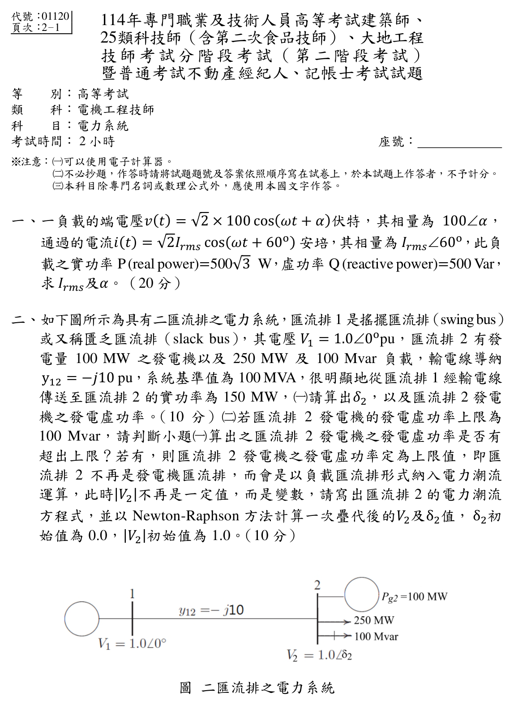
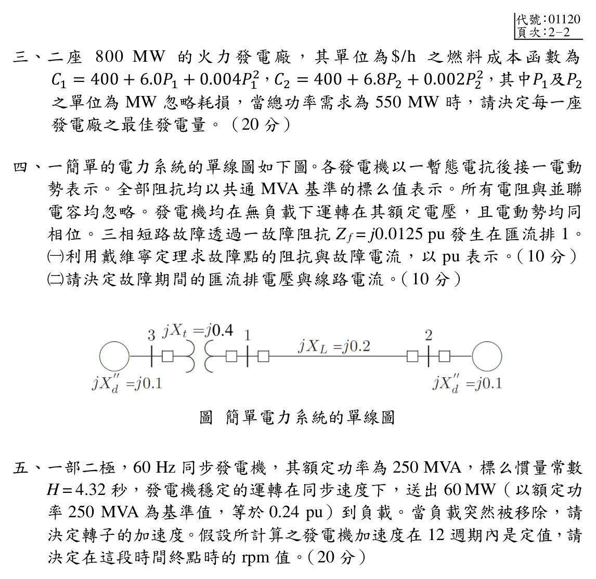

# ⚡ 114 年 電機工程技師 — 電力系統 全卷完整詳細詳解與推導

> [!TIP]
> 💡 **閱讀提示**：如果在 Obsidian 中看到一堆符號代碼，按鍵盤 **`Cmd + E`**（或點右上角的「書本 📖」圖示），畫面就會立刻切換成漂亮的教科書印刷排版！

---

## 📑 114 年 電力系統 試題導覽清單
- [👉 第一題：交流負載相量與複數功率計算（20 分）](#一交流負載相量與複數功率計算20-分)
- [👉 第二題：二匯流排電力潮流與 Newton-Raphson 疊代（20 分）](#二二匯流排電力潮流與-newton-raphson-疊代20-分)
- [👉 第三題：二發電機最佳經濟調度（20 分）](#三二發電機最佳經濟調度20-分)
- [👉 第四題：戴維寧等效三相短路故障分析（20 分）](#四戴維寧等效三相短路故障分析20-分)
- [👉 第五題：發電機轉子加速度與同步轉速計算（20 分）](#五發電機轉子加速度與同步轉速計算20-分)

---

## 一、交流負載相量與複數功率計算（20 分）

### 📌 題目與已知條件
一負載的端電壓 $v(t) = \sqrt{2} \times 100 \cos(\omega t + \alpha)\text{ V}$，其相量為 $100\angle\alpha$；通過的電流 $i(t) = \sqrt{2} I_{rms} \cos(\omega t + 60^\circ)\text{ A}$，其相量為 $I_{rms}\angle 60^\circ$。此負載之實功率 $P = 500\sqrt{3}\text{ W}$，虛功率 $Q = 500\text{ Var}$，求 $I_{rms}$ 及 $\alpha$。（20 分）

---

### 💡 核心考點與破題關鍵
1. **複數功率定義式**：
   $$\mathbf{S} = P + jQ = \mathbf{V} \mathbf{I}^* = |\mathbf{V}| |\mathbf{I}| \angle (\theta_v - \theta_i)$$
   其中 $\mathbf{I}^*$ 為電流相量的**複數共軛**（角度變號：$\angle 60^\circ \to \angle -60^\circ$）。
2. **視在功率與功率因數角**：
   $$|\mathbf{S}| = \sqrt{P^2 + Q^2} = |\mathbf{V}| I_{rms}, \quad \theta = \theta_v - \theta_i = \tan^{-1}\left( \frac{Q}{P} \right)$$

---

### ✏️ 步驟式詳細數學推導

#### 步驟 1：計算複數功率 $\mathbf{S}$ 之大小與角度
由已知條件：
$$P = 500\sqrt{3}\text{ W}, \quad Q = 500\text{ Var}$$

計算視在功率大小 $|\mathbf{S}|$：
$$|\mathbf{S}| = \sqrt{P^2 + Q^2} = \sqrt{(500\sqrt{3})^2 + 500^2} = \sqrt{750000 + 250000} = \sqrt{1000000} = 1000\text{ VA}$$

計算功率因數角 $\theta$：
$$\theta = \tan^{-1}\left( \frac{Q}{P} \right) = \tan^{-1}\left(\frac{500}{500\sqrt{3}}\right) = \tan^{-1}\left(\frac{1}{\sqrt{3}}\right) = 30^\circ$$

因此複數功率為：
$$\mathbf{S} = 1000\angle 30^\circ\text{ VA}$$

#### 步驟 2：由 $\mathbf{S} = \mathbf{V} \mathbf{I}^*$ 求解 $I_{rms}$ 與 $\alpha$
將電壓相量 $\mathbf{V} = 100\angle\alpha$ 與共軛電流 $\mathbf{I}^* = I_{rms}\angle -60^\circ$ 代入：
$$\mathbf{S} = (100\angle\alpha) \times (I_{rms}\angle -60^\circ) = 100 I_{rms} \angle (\alpha - 60^\circ)$$

比對大小與角度：
1. **大小部分**：
   $$100 I_{rms} = 1000 \implies \mathbf{I_{rms} = 10\text{ A}}$$
2. **角度部分**：
   $$\alpha - 60^\circ = 30^\circ \implies \mathbf{\alpha = 90^\circ}$$

---

### 🎯 第一題 滿分結論
- **電流有效值**：$I_{rms} = 10\text{ A}$
- **電壓相角**：$\alpha = 90^\circ$（即電壓超前電流 $30^\circ$，負載為電感性）

---

## 二、二匯流排電力潮流與 Newton-Raphson 疊代（20 分）

### 📌 題目與已知條件
![[114年_電力系統_第2題_單線圖.png|750]]
*圖：114年電力系統第二題 二匯流排潮流系統單線圖*

如下圖所示為具有二匯流排之電力系統，系統基準值為 $S_{base} = 100\text{ MVA}$：
- **匯流排 1**：搖擺匯流排（Slack Bus），電壓 $\mathbf{V}_1 = 1.0\angle 0^\circ\text{ pu}$。
- **匯流排 2**：發電機發電量 $P_{g2} = 100\text{ MW}$，負載 $P_{d2} = 250\text{ MW}, Q_{d2} = 100\text{ Mvar}$。
- **輸電線導納**：$y_{12} = -j10\text{ pu}$（即 $g_{12} = 0, b_{12} = -10\text{ pu}$）。
- 從匯流排 1 經輸電線傳送至匯流排 2 之實功率為 $150\text{ MW}$。

* **(一)** 請算出 $\delta_2$ 以及匯流排 2 發電機之發電虛功率 $Q_{g2}$。（10 分）
* **(二)** 若匯流排 2 發電機的發電虛功率上限為 $100\text{ Mvar}$，判斷是否有超出上限？若有，將發電虛功率定為上限值並轉為負載匯流排（PQ Bus）。寫出電力潮流方程式，以 Newton-Raphson 方法計算一次疊代後的 $|V_2|$ 及 $\delta_2$ 值（初始值 $\delta_2^{(0)} = 0.0, |V_2|^{(0)} = 1.0$）。（10 分）

---

### 💡 核心考點與破題關鍵
1. **潮流傳輸功率公式**（無損線路 $g_{12}=0$）：
   $$P_2 = |V_2||V_1| b_{12}\sin(\delta_2 - \delta_1) = -10|V_2|\sin\delta_2$$
2. **PV 匯流排轉 PQ 匯流排機制**：
   - 當發電機計算出的 $Q_{g2} > Q_{g2,\max}$ 時，發電機無效功率飽和，失去維持電壓能力，此時匯流排 2 必須由 PV Bus 轉為 PQ Bus，並將 $Q_{g2}$ 鎖定在 $Q_{g2,\max} = 100\text{ Mvar}$。
3. **Newton-Raphson 一階疊代修正公式**：
   $$\begin{bmatrix} \Delta P_2 \\ \Delta Q_2 \end{bmatrix} = \mathbf{J} \begin{bmatrix} \Delta \delta_2 \\ \Delta |V_2| \end{bmatrix} \implies \begin{bmatrix} \Delta \delta_2 \\ \Delta |V_2| \end{bmatrix} = \mathbf{J}^{-1} \begin{bmatrix} \Delta P_2 \\ \Delta Q_2 \end{bmatrix}$$

---

### ✏️ 步驟式詳細數學推導

#### 🔹 第 (一) 小題：求解 $\delta_2$ 與發電機虛功率 $Q_{g2}$
將數值轉為標么值（Base $100\text{ MVA}$）：
- $P_{g2} = 100/100 = 1.0\text{ pu}$
- $P_{d2} = 250/100 = 2.5\text{ pu}, \quad Q_{d2} = 100/100 = 1.0\text{ pu}$
- 匯流排 2 之淨實功率注入值：$P_{2,sch} = P_{g2} - P_{d2} = 1.0 - 2.5 = -1.5\text{ pu}$

此時匯流排 2 為 PV Bus，$|V_2| = 1.0\text{ pu}, |V_1| = 1.0\text{ pu}$：
$$P_2 = |V_2||V_1| B_{21} \sin(\delta_2 - \delta_1) = 1.0 \times 1.0 \times 10 \sin(\delta_2 - 0) = 10\sin\delta_2$$

令 $P_2 = P_{2,sch} = -1.5$：
$$10\sin\delta_2 = -1.5 \implies \sin\delta_2 = -0.15$$
$$\delta_2 = \sin^{-1}(-0.15) \approx -0.15057\text{ rad} = -8.627^\circ$$

計算匯流排 2 注入系統之虛功率 $Q_2$：
$$\cos\delta_2 = \sqrt{1 - (-0.15)^2} = \sqrt{0.9775} \approx 0.98869$$
$$Q_2 = -|V_2||V_1| B_{21} \cos\delta_2 - |V_2|^2 B_{22} = -10(1.0)(1.0)(0.98869) - (1.0)^2(-10) = -9.8869 + 10 = 0.1131\text{ pu}$$

由淨無效功率定義 $Q_2 = Q_{g2} - Q_{d2}$：
$$Q_{g2} = Q_2 + Q_{d2} = 0.1131 + 1.0 = 1.1131\text{ pu} = \mathbf{111.31\text{ Mvar}}$$

---

#### 🔹 第 (二) 小題：Q 極限判斷與 Newton-Raphson 疊代
1. **極限判斷**：
   $$Q_{g2} = 111.31\text{ Mvar} > Q_{g2,\max} = 100\text{ Mvar} \implies \text{超出上限！}$$
   因此匯流排 2 轉為 **PQ 負載匯流排**，設定 $Q_{g2} = 1.0\text{ pu} = 100\text{ Mvar}$。
   新排程值為：
   $$P_{2,sch} = -1.5\text{ pu}, \quad Q_{2,sch} = Q_{g2} - Q_{d2} = 1.0 - 1.0 = 0.0\text{ pu}$$

2. **潮流方程式**：
   $$\begin{cases} P_2(\delta_2, |V_2|) = 10 |V_2| \sin\delta_2 \\ Q_2(\delta_2, |V_2|) = -10 |V_2| \cos\delta_2 + 10 |V_2|^2 \end{cases}$$

3. **初值代入計算不平衡量（Mismatches）**：
   代入初始值 $\delta_2^{(0)} = 0.0, |V_2|^{(0)} = 1.0$：
   - $P_2^{(0)} = 10(1.0)\sin(0) = 0.0\text{ pu} \implies \Delta P_2^{(0)} = P_{2,sch} - P_2^{(0)} = -1.5 - 0 = -1.5\text{ pu}$
   - $Q_2^{(0)} = -10(1.0)\cos(0) + 10(1.0)^2 = -10 + 10 = 0.0\text{ pu} \implies \Delta Q_2^{(0)} = Q_{2,sch} - Q_2^{(0)} = 0.0 - 0 = 0.0\text{ pu}$

4. **建構雅可比矩陣（Jacobian Matrix $\mathbf{J}$）**：
   $$\mathbf{J} = \begin{bmatrix} \\ \frac{\partial P_2}{\partial \delta_2} & \frac{\partial P_2}{\partial |V_2|} \\ \frac{\partial Q_2}{\partial \delta_2} & \frac{\partial Q_2}{\partial |V_2|} \end{bmatrix} = \begin{bmatrix} 10|V_2|\cos \delta_2 & 10 \\ sin \delta_2 \\ 10|V_2|\sin \delta_2 & -10 \\ cos \delta_2 + 20|V_2| \end{bmatrix}$$
   在初值點 $(\delta_2=0, |V_2|=1.0)$ 計算：
   $$\mathbf{J}^{(0)} = \begin{bmatrix} 10(1) \\ cos 0 & 10 \\ sin 0 \\ 10(1) \\ sin 0 & -10 \\ cos 0 + 20(1) \end{bmatrix} = \begin{bmatrix} 10 & 0 \\ 0 & 10 \end{bmatrix}$$

5. **求解修正量並更新**：
   $$\begin{bmatrix} \Delta \delta_2^{(0)} \\ \Delta|V_2|^{(0)} \end{bmatrix} = \begin{bmatrix} 10 & 0 \\ 0 & 10 \end{bmatrix}^{-1} \begin{bmatrix} -1.5 \\ 0.0 \end{bmatrix} = \begin{bmatrix} 0.1 & 0 \\ 0 & 0.1 \end{bmatrix} \begin{bmatrix} -1.5 \\ 0.0 \end{bmatrix} = \begin{bmatrix} -0.15 \text{ rad} \\ 0.0 \text{ pu} \end{bmatrix}$$

   一次疊代後之數值：
   - $\delta_2^{(1)} = \delta_2^{(0)} + \Delta\delta_2^{(0)} = 0 + (-0.15) = \mathbf{-0.15\text{ rad}} \approx \mathbf{-8.594^\circ}$
   - $|V_2|^{(1)} = |V_2|^{(0)} + \Delta|V_2|^{(0)} = 1.0 + 0.0 = \mathbf{1.0\text{ pu}}$
   - $\mathbf{V}_2^{(1)} = 1.0\angle -8.594^\circ\text{ pu}$

---

## 三、二發電機最佳經濟調度（20 分）

### 📌 題目與已知條件
二座 $800\text{ MW}$ 的火力發電廠，其燃料成本函數（單位為 $\$ /\text{h}$）為：
$$C_1 = 400 + 6.0 P_1 + 0.004 P_1^2$$
$$C_2 = 400 + 6.8 P_2 + 0.002 P_2^2$$
其中 $P_1, P_2$ 單位為 $\text{MW}$，各機組容量限制 $0 \le P_1, P_2 \le 800\text{ MW}$。
忽略輸電線耗損，當系統總負載需求為 $P_D = 550\text{ MW}$ 時，求每一座發電廠之最佳發電量。（20 分）

---

### 💡 核心考點與破題關鍵
1. **等微增燃料成本準則（Equal Incremental Cost Criterion）**：
   忽略線損時，系統總運轉成本最低的充要條件為各發電機的**微增成本（Incremental Fuel Cost, $\lambda$）相等**：
   $$\lambda = \frac{dC_1}{dP_1} = \frac{dC_2}{dP_2}$$
2. **功率平衡約束**：
   $$P_1 + P_2 = P_D = 550\text{ MW}$$

---

### ✏️ 步驟式詳細數學推導

#### 步驟 1：求各機組之微增成本函數 $\lambda$
對各成本函數微分：
$$\text{IC}_1 = \frac{dC_1}{dP_1} = 6.0 + 0.008 P_1 = \lambda \implies P_1 = \frac{\lambda - 6.0}{0.008} = 125\lambda - 750$$
$$\text{IC}_2 = \frac{dC_2}{dP_2} = 6.8 + 0.004 P_2 = \lambda \implies P_2 = \frac{\lambda - 6.8}{0.004} = 250\lambda - 1700$$

#### 步驟 2：利用總負載需求求解微增成本 $\lambda$
將 $P_1, P_2$ 代入功率平衡方程式：
$$P_1 + P_2 = (125\lambda - 750) + (250\lambda - 1700) = 550$$
$$375\lambda - 2450 = 550$$
$$375\lambda = 3000 \implies \lambda = \frac{3000}{375} = \mathbf{8.0\text{ \$/MWh}}$$

#### 步驟 3：回代求解各電廠最佳發電出力
$$P_1 = 125(8.0) - 750 = 1000 - 750 = \mathbf{250\text{ MW}}$$
$$P_2 = 250(8.0) - 1700 = 2000 - 1700 = \mathbf{300\text{ MW}}$$

#### 步驟 4：檢驗機組發電限制
- 機組 1：$0 \le 250\text{ MW} \le 800\text{ MW}$（符合規範 $\checkmark$）
- 機組 2：$0 \le 300\text{ MW} \le 800\text{ MW}$（符合規範 $\checkmark$）
- 總功率：$250 + 300 = 550\text{ MW} = P_D$（完全吻合 $\checkmark$）

---

### 🎯 第三題 滿分結論
- **發電廠 1 之最佳發電量**：$P_1 = 250\text{ MW}$
- **發電廠 2 之最佳發電量**：$P_2 = 300\text{ MW}$
- （系統微增成本 $\lambda = 8.0\text{ \$/MWh}$）

---

## 四、戴維寧等效三相短路故障分析（20 分）

### 📌 題目與已知條件
![[114年_電力系統_第4題_短路單線圖.png|750]]
*圖：114年電力系統第四題 戴維寧等效三相短路單線圖*

電力系統單線圖如下，所有參數皆以共同基準之標么值（$\text{pu}$）表示，故障前系統無載且運轉於額定電壓 $V_f = 1.0\angle 0^\circ\text{ pu}$：
- 發電機 1（匯流排 3）：$jX_{d1}'' = j0.1\text{ pu}$
- 變壓器（匯流排 3 與 1 之間）：$jX_t = j0.4\text{ pu}$
- 輸電線（匯流排 1 與 2 之間）：$jX_L = j0.2\text{ pu}$
- 發電機 2（匯流排 2）：$jX_{d2}'' = j0.1\text{ pu}$
- 三相短路故障透過故障阻抗 $Z_f = j0.0125\text{ pu}$ 發生在**匯流排 1**。

* **(一)** 利用戴維寧定理求故障點的阻抗與故障電流（以 $\text{pu}$ 表示）。（10 分）
* **(二)** 請決定故障期間各匯流排電壓與線路電流。（10 分）

---

### 💡 核心考點與破題關鍵
1. **戴維寧等效阻抗 $Z_{th1}$**：
   - 從匯流排 1 往左看：$Z_{\text{左}} = jX_{d1}'' + jX_t = j0.1 + j0.4 = j0.5\text{ pu}$
   - 從匯流排 1 往右看：$Z_{\text{右}} = jX_L + jX_{d2}'' = j0.2 + j0.1 = j0.3\text{ pu}$
   - 戴維寧等效阻抗為兩支路**並聯**：$Z_{th1} = Z_{\text{左}} \parallel Z_{\text{右}}$
2. **故障電流公式**：
   $$I_f = \frac{V_f}{Z_{th1} + Z_f}$$
3. **分壓原理求故障時匯流排電壓**：
   $$V_1 = I_f \times Z_f = V_f - I_f Z_{th1}$$

---

### ✏️ 步驟式詳細數學推導

#### 🔹 第 (一) 小題：求戴維寧阻抗與故障電流
1. **戴維寧等效阻抗 $Z_{th1}$**：
   $$Z_{th1} = \frac{(j0.5)(j0.3)}{j0.5 + j0.3} = \frac{-0.15}{j0.8} = j0.1875\text{ pu}$$

2. **總故障迴路阻抗**：
   $$Z_{\text{total}} = Z_{th1} + Z_f = j0.1875 + j0.0125 = j0.20\text{ pu}$$

3. **三相短路次暫態故障電流 $I_f$**：
   $$I_f = \frac{V_f}{Z_{th1} + Z_f} = \frac{1.0\angle 0^\circ}{j0.20} = \mathbf{-j5.0\text{ pu} = 5.0\angle -90^\circ\text{ pu}}$$

---

#### 🔹 第 (二) 小題：求故障期間匯流排電壓與線路電流
1. **匯流排 1 電壓 $V_1$**：
   $$V_1 = I_f \times Z_f = (-j5.0) \times (j0.0125) = \mathbf{0.0625\text{ pu} = 0.0625\angle 0^\circ\text{ pu}}$$

2. **各支路電流（流入故障點）**：
   - 來自發電機 1（經由匯流排 3）之電流 $I_{31}$：
     $$I_{31} = \frac{E_1 - V_1}{jX_{d1}'' + jX_t} = \frac{1.0 - 0.0625}{j0.5} = \frac{0.9375}{j0.5} = \mathbf{-j1.875\text{ pu}}$$
   - 來自發電機 2（經由匯流排 2）之輸電線電流 $I_{21}$：
     $$I_{21} = \frac{E_2 - V_1}{jX_L + jX_{d2}''} = \frac{1.0 - 0.0625}{j0.3} = \frac{0.9375}{j0.3} = \mathbf{-j3.125\text{ pu}}$$
   - 驗算：$I_f = I_{31} + I_{21} = -j1.875 - j3.125 = -j5.0\text{ pu}$（KCL 吻合 $\checkmark$）

3. **各匯流排電壓**：
   - **匯流排 3 電壓 $V_3$**：
     $$V_3 = E_1 - I_{31}(jX_{d1}'') = 1.0 - (-j1.875)(j0.1) = 1.0 - 0.1875 = \mathbf{0.8125\text{ pu}}$$
   - **匯流排 2 電壓 $V_2$**：
     $$V_2 = E_2 - I_{21}(jX_{d2}'') = 1.0 - (-j3.125)(j0.1) = 1.0 - 0.3125 = \mathbf{0.6875\text{ pu}}$$

---

### 🎯 第四題 滿分結論
- **故障點阻抗**：$Z_{th1} = j0.1875\text{ pu}$
- **故障電流**：$I_f = -j5.0\text{ pu} = 5.0\angle -90^\circ\text{ pu}$
- **匯流排電壓**：$V_1 = 0.0625\text{ pu}, \quad V_2 = 0.6875\text{ pu}, \quad V_3 = 0.8125\text{ pu}$
- **線路電流**：$I_{31} = -j1.875\text{ pu}, \quad I_{21} = -j3.125\text{ pu}$

---

## 五、發電機轉子加速度與同步轉速計算（20 分）

### 📌 題目與已知條件
一部二極（$P = 2$），$60\text{ Hz}$ 同步發電機：
- 額定容量 $S_{base} = 250\text{ MVA}$
- 標么慣量常數 $H = 4.32\text{ s}$
- 穩態運轉送出實功率 $P_m = P_e = 60\text{ MW} = 0.24\text{ pu}$。
- 當負載突然被移除（$P_e = 0$），請決定轉子的加速度。
- 假設發電機加速度在 12 週期（Cycles）內為定值，求這段時間終點時的轉速（$\text{rpm}$）。（20 分）

---

### 💡 核心考點與破題關鍵
1. **同步轉速 $N_s$ 與同步電氣角頻率 $\omega_s$**：
   $$N_s = \frac{120 f}{P} = \frac{120 \times 60}{2} = 3600\text{ rpm}$$
   $$\omega_s = 2\pi f = 2\pi(60) = 120\pi \approx 377\text{ rad/s}$$
2. **標么搖擺方程式（Swing Equation）**：
   $$\frac{2H}{\omega_s} \frac{d^2\delta}{dt^2} = P_a = P_m - P_e$$
   轉子角加速度：
   $$\alpha = \frac{d^2\delta}{dt^2} = \frac{P_a \cdot \omega_s}{2H} \quad (\text{rad/s}^2)$$
3. **時間換算**：
   $$12 \text{ 週期} \implies \Delta t = \frac{12}{60\text{ Hz}} = 0.2\text{ 秒}$$

---

### ✏️ 步驟式詳細數學推導

#### 步驟 1：計算加速功率 $P_a$
負載突然切除前：$P_m = 0.24\text{ pu}$  
負載突然切除後：$P_e = 0\text{ pu}$  
淨加速功率：
$$P_a = P_m - P_e = 0.24 - 0 = \mathbf{0.24\text{ pu}}$$

#### 步驟 2：求轉子角加速度 $\alpha$
代入搖擺方程式：
$$\alpha = \frac{d^2\delta}{dt^2} = \frac{P_a \cdot \omega_s}{2H} = \frac{0.24 \times 120\pi}{2 \times 4.32} = \frac{28.8\pi}{8.64} = \frac{10\pi}{3}\text{ rad/s}^2 \approx \mathbf{10.472\text{ rad/s}^2}$$

若換算為角度單位：
$$\alpha = \frac{10\pi}{3} \times \left( \frac{180^\circ}{\pi} \right) = \mathbf{600^\circ/\text{s}^2}$$

#### 步驟 3：計算 12 週期末的轉速增加量 $\Delta N$
1. 時間間隔 $\Delta t$：
   $$\Delta t = \frac{12}{60} = 0.2\text{ 秒}$$
2. 轉速角加速度換算為 $\text{rpm/s}$：
   $$a_{\text{rpm}} = \alpha \times \frac{60}{2\pi} = \left( \frac{10\pi}{3} \right) \times \left( \frac{60}{2\pi} \right) = 100\text{ rpm/s}$$
3. 轉速增加量 $\Delta N$：
   $$\Delta N = a_{\text{rpm}} \times \Delta t = 100 \times 0.2 = \mathbf{20\text{ rpm}}$$

#### 步驟 4：計算終點轉速 $N(t)$
初始同步轉速 $N_s = 3600\text{ rpm}$：
$$N(0.2\text{ s}) = N_s + \Delta N = 3600 + 20 = \mathbf{3620\text{ rpm}}$$

---

> [!WARNING]
> ⚠️ **電力系統 核心防坑與閱卷踩雷提醒**：
> 1. **對稱成分故障計算**：單相接地 (SLG) 故障電流為 $I_f = 3I_{a1} = rac{3V_f}{Z_1 + Z_2 + Z_0 + 3Z_n}$，千萬不可漏乘 3 倍！
> 2. **旋轉相量符號**：$a^2 - a = -j\sqrt{3}$，而 $a - a^2 = +j\sqrt{3}$，正負序相量展開切勿混淆。
> 3. **等面積準則**：計算擺動極限角 $(\pi - \delta_0 - \delta_1)$ 時，分母角度嚴格必須使用**弧度 (Radian)** 代入！

---

### 🎯 第五題 滿分結論
- **轉子角加速度**：$\alpha = \frac{10\pi}{3}\text{ rad/s}^2 \approx 10.472\text{ rad/s}^2$（或 $600^\circ/\text{s}^2$）
- **12 週期終點之發電機轉速**：$N = 3620\text{ rpm}$
