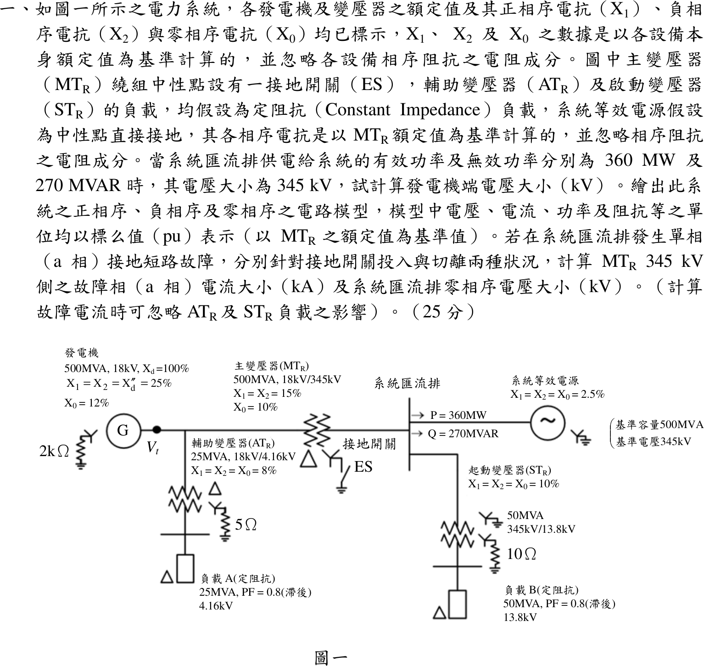

# 104 年電力系統第 1 題｜序網路與接地開關單線接地故障



## 已知與所求

基準取主變 \(MT_R\)：500 MVA、345 kV（發電機側 18 kV）。系統匯流排 345 kV，供給系統等效電源 \(360\ \mathrm{MW}+j270\ \mathrm{Mvar}\)。

| 設備 | 序電抗（各自額定為基準） | 接線 |
| --- | --- | --- |
| 發電機 500 MVA、18 kV | \(X_1=X_2=X_d''=25\%\)、\(X_0=12\%\) | 經 \(2\ \mathrm{k}\Omega\) 接地 |
| \(MT_R\) 500 MVA、18/345 kV | \(X_1=X_2=15\%\)、\(X_0=10\%\) | 發電機側 \(\Delta\)，345 kV 側 Y 經接地開關 ES |
| 系統等效電源 | \(X_1=X_2=X_0=2.5\%\)（500 MVA、345 kV） | Y 直接接地 |
| \(AT_R\) 25 MVA、\(ST_R\) 50 MVA（\(X=8\%,\,10\%\)） | 負載 A（25 MVA）、負載 B（50 MVA）皆 PF 0.8 滯後、定阻抗 | 接於發電機端／系統匯流排 |

求（一）發電機端電壓；（二）匯流排 a 相單線接地，ES 投入與切離時 345 kV 側故障相電流與匯流排零序電壓。假設：故障前匯流排電壓 \(1.0\) pu；故障計算依題意忽略 \(AT_R\)、\(ST_R\) 負載；各設備串聯電阻忽略。

## 考場標準作答

### （一）發電機端電壓

\(ST_R\) 與負載 B 接在系統匯流排上，由 \(MT_R\) 一併供電。負載 B 阻抗（500 MVA 基準）：
\[
Z_B=\Big[(0.8+j0.6)+j0.10\Big]\frac{500}{50}=8+j7\ \mathrm{pu},\qquad I_B=\frac{1}{8+j7}=0.0708-j0.0620
\]
送往系統的電流 \(I_{sys}=\left(\dfrac{360+j270}{500}\right)^*=0.72-j0.54\)，\(MT_R\) 電流 \(I=I_{sys}+I_B=0.7908-j0.6020\)。發電機端：
\[
V_t=1+j0.15\,I=1.0903+j0.1186,\quad |V_t|=1.0968\ \mathrm{pu}
\]
\[
\boxed{|V_t|=1.0968\times18=19.74\ \mathrm{kV}}
\]
負載 A 接在發電機端，不影響由匯流排倒推的 \(V_t\)。

### （二）序網路與故障計算

\(MT_R\) 發電機側為 \(\Delta\)，零序電流不進入發電機；ES 閉合時主變 345 kV 側才有零序接地支路 \(X_0=0.10\)。

正序（500 MVA 基準，pu；負序網路相同但無電源 \(E\)，且不含負載電流）：
```
E ─j0.25─ G ─ V_t(1.0968) ─j0.15(MT_R)─┬─ 系統匯流排 V=1.0∠0° ─ j0.025 ─ E_sys（S_sys=0.72+j0.54）
         │ I_MT=0.7908−j0.6020          │
         └─ j1.6(AT_R)─ 負載A 16+j12     └─ j1.0(ST_R)─ 負載B 8+j6，S_B=0.0708+j0.0619
```
零序（\(MT_R\) 發電機側 \(\Delta\)，零序電流不進入發電機）：
```
發電機 j0.12 + 3R_n(=3×3086≈9259)  ── 被 MT_R 的 Δ 隔離（不與匯流排相通）
母線 ─┬─ j0.025（系統）─ 地
      ├─ j0.10（MT_R）─ [ES] ─ 地      （ES 閉合才接地）
      ├─ j1.0(ST_R) ─ 3×26.25 ─ 開路於 Δ 負載（無零序路徑）
      └─ AT_R 經 Δ 隔離；其 Y 側 j1.6 ─ 3×144.5 ─ 開路於 Δ 負載
```
\(R_n\)：發電機 \(2\,\mathrm{k}\Omega/0.648=3086\)、\(AT_R\) \(5/0.0346=144.5\)、\(ST_R\) \(10/0.3809=26.25\ \mathrm{pu}\)。故障計算依題意忽略 \(AT_R\)、\(ST_R\)。
\[
Z_1=Z_2=0.025\parallel0.40=0.023529,\quad Z_0^{ES\,on}=0.025\parallel0.10=0.020,\quad Z_0^{ES\,off}=0.025
\]
\[
I_f=\frac{3(1.0)}{Z_1+Z_2+Z_0},\qquad I_b=\frac{500}{\sqrt3(345)}=0.83674\ \mathrm{kA},\qquad V_{0}=\frac{I_f}{3}Z_0
\]

- ES 投入：\(I_f=\dfrac{3}{0.067059}=44.74\) pu，\(V_0=14.91(0.020)=0.2982\) pu：
\[
\boxed{I_f=37.43\ \mathrm{kA},\qquad |V_0|=0.2982\times\tfrac{345}{\sqrt3}=59.4\ \mathrm{kV}}
\]
- ES 切離：\(I_f=\dfrac{3}{0.072059}=41.63\) pu，\(V_0=13.88(0.025)=0.3469\) pu：
\[
\boxed{I_f=34.84\ \mathrm{kA},\qquad |V_0|=0.3469\times\tfrac{345}{\sqrt3}=69.1\ \mathrm{kV}}
\]

## 驗算

用相域轉換：三序電流相等 \(I_{a0}=I_{a1}=I_{a2}\)，\(I_b=I_c=0\)，\(I_a=I_{a0}+I_{a1}+I_{a2}=3I_{a1}\)，與上式相同；\(V_{a0}=-Z_0I_{a0}\) 的大小同上。ES 切離後零序阻抗變大，故障電流變小、零序電壓變大，方向合理。

## 失分點

- 求 \(V_t\) 時漏掉啟動變壓器負載 B（題目明示為定阻抗負載）會得 19.56 kV；負載 B 約 \(35\ \mathrm{MW}+j31\ \mathrm{Mvar}\)，需併入 \(MT_R\) 電流。
- 發電機側為 \(\Delta\)，發電機 \(X_0=12\%\) 與 \(2\ \mathrm{k}\Omega\) 接地電阻不入零序網；誤把它串入會讓零序阻抗錯誤。
- ES 投入才有 \(X_0=0.10\) 支路；切離時零序只剩系統 0.025。

## 條件與疑義

1. 題幹未明說 \(P,Q\) 是否含負載 B；本解依圖示讀為匯流排送往系統等效電源的功率，負載 B 另由主變供電。若不計負載 B，\(|V_t|=19.56\ \mathrm{kV}\)，故障部分不受影響。
2. 「345 kV 側之故障相電流」取故障點總電流。若指流過 \(MT_R\) 345 kV 繞組的 a 相電流，則 ES 投入約 3.96 kA、切離約 1.37 kA。
