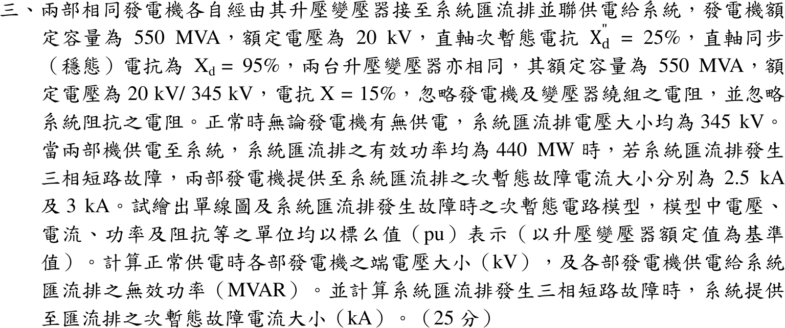

# 104 年電力系統第 3 題｜兩發電機並聯三相故障



## 已知與所求

兩部相同發電機各 550 MVA、20 kV，\(X_d''=25\%\)、\(X_d=95\%\)；各經 550 MVA、20/345 kV、\(X_T=15\%\) 升壓變壓器接至 345 kV 系統匯流排，忽略電阻。正常時匯流排電壓 345 kV；題面「兩部機組各自供電至系統匯流排之有效功率均為 440 MW」，匯流排三相短路時兩機的次暫態故障電流分別為 \(2.5\ \mathrm{kA}\)、\(3\ \mathrm{kA}\)。求單線圖與次暫態電路、正常時各機端電壓與送至匯流排的無效功率，以及匯流排故障時的次暫態故障電流。基準取升壓變壓器額定：\(S_b=550\) MVA，\(V_b=345\) kV（高壓側）、20 kV（低壓側）。

假設：「均為 440 MW」讀為每部機各 440 MW（\(P_i=0.8\) pu）；系統側阻抗未給，故「系統提供至匯流排的故障電流」取兩部機組貢獻之相量和。

## 考場標準作答

```
單線圖：  G1 ─ T1 ─┐
                    ├─ 345 kV 匯流排（三相故障點）
          G2 ─ T2 ─┘
次暫態電路（每機）： E'' ─ j0.25 ─ j0.15 ─ 匯流排（V_B=1∠0° pu，故障時 0）
```
\[
I_b=\frac{550}{\sqrt3(345)}=0.920413\ \mathrm{kA},\quad P_i=\frac{440}{550}=0.8\ \mathrm{pu},\quad X_\Sigma''=0.25+0.15=0.40\ \mathrm{pu}
\]

### 1. 故障電流反算 \(E''\)

匯流排短路時 \(V_B=0\)，\(|E_i''|=X_\Sigma''I_{f,i}/I_b\)：
\[
\boxed{|E_1''|=0.40\tfrac{2.5}{0.920413}=1.086468\ \mathrm{pu}},\qquad \boxed{|E_2''|=0.40\tfrac{3.0}{0.920413}=1.303762\ \mathrm{pu}}
\]

### 2. 預故障電流與功率平衡

設送入匯流排電流 \(I_i=0.8-jq_i\)，則 \(S_B=V_BI_i^*=0.8+jq_i\)（功率平衡），且 \(E_i''=V_B+jX_\Sigma''I_i=(1+0.4q_i)+j0.32\)。取正常小訊號穩定的低功角分支：
\[
q_i=\frac{\sqrt{|E_i''|^2-0.32^2}-1}{0.4}\;\Rightarrow\; q_1=0.095685,\ q_2=0.659702
\]
\[
\delta_1=\boxed{17.1295^\circ},\quad \delta_2=\boxed{14.2081^\circ}
\]
另一根 \(\delta>90^\circ\) 需吸收超過 2000 Mvar 且 \(dP/d\delta<0\)，不符正常小訊號穩定運轉，捨去。

### 3. 端電壓與無效功率

\(V_{t,i}=V_B+jX_TI_i\)：\(V_{t,1}=1.01435+j0.12\)、\(V_{t,2}=1.09896+j0.12\)：
\[
\boxed{|V_{t,1}|=1.021426\times20=20.4285\ \mathrm{kV}},\qquad \boxed{|V_{t,2}|=1.105488\times20=22.1098\ \mathrm{kV}}
\]
\[
\boxed{Q_{B,1}=0.095685(550)=52.6270\ \mathrm{Mvar}},\qquad \boxed{Q_{B,2}=0.659702(550)=362.8363\ \mathrm{Mvar}}
\]

### 4. 匯流排三相故障電流

\(I_{f,i}''=E_i''/j0.40\)：\(I_{f,1}''=0.8-j2.595685\)、\(I_{f,2}''=0.8-j3.159702\)，相量和 \(1.6-j5.755388\)：
\[
|I_f''|=5.973649(0.920413)=\boxed{5.4982\ \mathrm{kA}}\approx\boxed{5.5\text{ kA}}
\]

## 驗算

故障電流反算：由重建的 \(E_i''\) 除以 \(j0.40\)，大小乘 \(I_b\) 恰為 \(2.5\) 與 \(3.0\ \mathrm{kA}\)。另以功角公式檢查有功：\(P=\dfrac{|E_i''|V_B\sin\delta_i}{X_\Sigma''}\)，\(\dfrac{1.086468\sin17.1295^\circ}{0.40}=0.800\)、\(\dfrac{1.303762\sin14.2081^\circ}{0.40}=0.800\)，與 \(P_i=0.8\) pu 相符。

## 失分點

- 不可先假設 \(E''=1\) pu；題面給的 \(2.5/3.0\ \mathrm{kA}\) 正是反推各機 \(E''\) 的資料，也因此兩機的 \(Q\) 不同。
- \(P_i=0.8\) 是每部機各 440 MW 對 550 MVA 基準，不是兩部合計除以兩台。
- 最後是兩個故障電流相量相加（5.498 kA），不是代數相加；電流的相角不同。

## 條件與疑義

題幹未給系統等效阻抗，故「系統提供至匯流排之故障電流」只能取兩部機組貢獻之相量和；若題意另含系統側貢獻，須補系統阻抗後再加。
