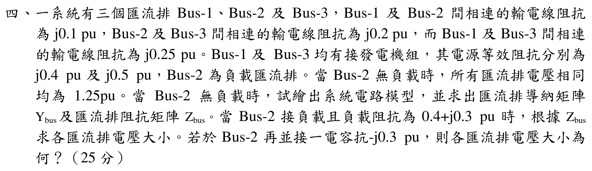

# 104 年電力系統第 4 題｜三匯流排 $Y_{bus}$、$Z_{bus}$ 與電容補償

## 題目與拓撲

Bus 1–2、Bus 2–3、Bus 1–3 的線路電抗分別為 $j0.1$、$j0.2$、$j0.25$ pu；Bus 1 與 Bus 3 各接一部電源等效電抗 $j0.4$、$j0.5$ pu。Bus 2 無負載時，三個匯流排電壓同相且皆為 $1.25$ pu。求 $Y_{bus}$、$Z_{bus}$，再求 Bus 2 接 $Z_L=0.4+j0.3$ pu 及並接電容抗 $-j0.3$ pu 時的各匯流排電壓大小。

## 1. 建立 $Y_{bus}$ 與 $Z_{bus}$

各線路導納為

$$
y_{12}=-j10,\qquad y_{23}=-j5,\qquad y_{13}=-j4.
$$

將兩部電源等效阻抗視為由 Bus 1、Bus 3 接至參考點的支路，

$$
y_{g1}=\frac1{j0.4}=-j2.5,
\qquad y_{g3}=\frac1{j0.5}=-j2.
$$

因此

$$
\boxed{
Y_{bus}=\begin{bmatrix}
-j16.5&j10&j4\\
j10&-j15&j5\\
j4&j5&-j11
\end{bmatrix}\ \mathrm{pu}}
$$

直接反矩陣（以同一 pu 基準）得

$$
\boxed{
Z_{bus}=Y_{bus}^{-1}=\begin{bmatrix}
j0.245614&j0.228070&j0.192982\\
j0.228070&j0.290351&j0.214912\\
j0.192982&j0.214912&j0.258772
\end{bmatrix}\ \mathrm{pu}}
$$

行和不必為零，因為 Bus 1、Bus 3 有接地的電源等效阻抗。

## 2. Bus 2 接 $Z_L=0.4+j0.3$ pu

無負載電壓皆為 $1.25$ pu，故 Bus 2 的 Thevenin 電壓 $V_{th,2}=1.25$ pu，且 $Z_{th,2}=Z_{22}=j0.290351$ pu。負載電流

$$
I_L=\frac{1.25}{0.4+j(0.3+0.290351)}
 =0.983257-j1.451166\ \mathrm{pu}.
$$

用 $V=V_{oc}-Z_{bus}(:,2)I_L$ 回代三個匯流排：

$$
\begin{aligned}
V_1&=0.919032-j0.224252,\\
V_2&=0.828653-j0.285489,\\
V_3&=0.938127-j0.211314.
\end{aligned}
$$

其電壓大小為

$$
\boxed{|V_1|=0.945996,\quad |V_2|=0.876453,\quad |V_3|=0.961631\ \mathrm{pu}}.
$$

## 3. Bus 2 並接 $-j0.3$ pu 電容抗

負載與電容的等效阻抗為

$$
Z_{L\parallel C}=\left(\frac1{0.4+j0.3}+\frac1{-j0.3}\right)^{-1}
 =0.225-j0.300\ \mathrm{pu}.
$$

因此

$$
I_{L\parallel C}=\frac{1.25}{0.225+j(0.290351-0.300)}
 =5.545357+j0.237813\ \mathrm{pu}.
$$

回代得

$$
\begin{aligned}
V_1&=1.304238-j1.264731,\\
V_2&=1.319049-j1.610099,\\
V_3&=1.301109-j1.191765,
\end{aligned}
$$

故

$$
\boxed{|V_1|=1.816750,\quad |V_2|=2.081420,\quad |V_3|=1.764423\ \mathrm{pu}}.
$$

電容的容抗幾乎抵銷 Bus 2 的 Thevenin 電抗（$0.300$ 對 $0.290351$），所以電壓大幅上升是並聯共振的物理結果；$1.08$ pu 並非由此題完整網路回代所得。

## 結論與校驗紀錄

- 已將所有三條線路及兩個電源等效支路納入 $Y_{bus}$，再以反矩陣取得 $Z_{bus}$。
- 兩種負載情境均以同一 $1.25$ pu 開路電壓及 Bus 2 Thevenin 等效回代，殘差小於 $10^{-12}$ pu。
- 原年度解答沿用不相容的 $Z_{bus}$ 數值並得到 $1.080$ pu；已修正為完整網路的 $2.081420$ pu（並列出三匯流排全部電壓），狀態升級為 `verified`。
