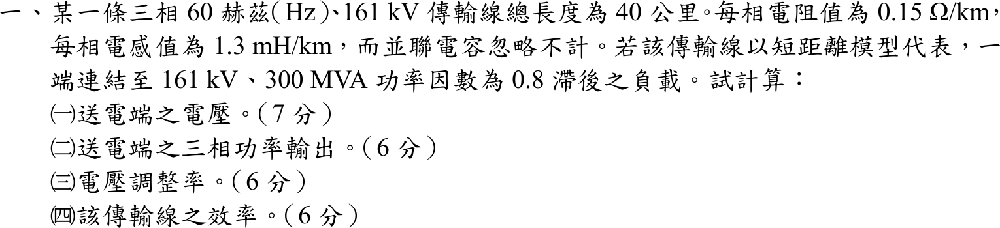

# 106 年電力系統第 1 題｜短線電壓調整率與效率

## 已知與所求

三相 60 Hz、161 kV 輸電線長 40 km，每相 \(0.15\ \Omega/\mathrm{km}\)、\(1.3\ \mathrm{mH/km}\)，並聯電容忽略（短線模型）；受電端接 161 kV、300 MVA、功因 0.8 落後的負載。求（一）送電端電壓；（二）送電端三相功率輸出；（三）電壓調整率；（四）傳輸效率。

## 考場標準作答

線路每相阻抗：
\[
R=0.15(40)=6.0\ \Omega,\qquad X=2\pi(60)(1.3\times10^{-3})(40)=19.604\ \Omega
\]
受電端（相電壓為參考）：
\[
V_R=\frac{161\,000}{\sqrt3}=92\,952\ \mathrm V,\qquad I=\frac{300\times10^6}{\sqrt3(161\,000)}\angle-36.87^\circ=1075.8\angle-36.87^\circ=860.6-j645.5\ \mathrm A
\]

### （一）送電端電壓

\[
V_S=V_R+(R+jX)I=92\,952+(17\,818+j12\,998)=110\,770+j12\,998\ \mathrm V
\]
\[
\boxed{V_S=111.53\angle6.69^\circ\ \mathrm{kV/相}},\qquad \boxed{V_{S,LL}=\sqrt3(111.53)=193.18\ \mathrm{kV}}
\]

### （二）送電端三相功率

線損 \(3I^2R=3(1075.8)^2(6)=20.83\) MW；負載 \(P_R=300(0.8)=240\) MW、\(Q_R=300(0.6)=180\) Mvar，線路電抗消耗 \(3I^2X=68.07\) Mvar：
\[
\boxed{P_S=240+20.83=260.83\ \mathrm{MW}},\qquad \boxed{Q_S=180+68.07=248.07\ \mathrm{Mvar}}
\]

### （三）電壓調整率

短線無並聯分路，無載時受電端電壓等於 \(V_S\)：
\[
\mathrm{VR}=\frac{|V_S|-|V_R|}{|V_R|}\times100\%=\frac{111.53-92.952}{92.952}\times100\%=\boxed{19.99\%}
\]

### （四）傳輸效率

\[
\eta=\frac{P_R}{P_S}\times100\%=\frac{240}{260.83}\times100\%=\boxed{92.01\%}
\]

## 驗算

以複功率回推電壓：\(|S_S|=\sqrt{260.83^2+248.07^2}=359.97\) MVA，
\[
V_{S,LL}=\frac{|S_S|}{\sqrt3\,|I|}=\frac{359.97\times10^6}{\sqrt3(1075.8)}=193.18\ \mathrm{kV}
\]
與相量法相同；\(P_S\) 亦等於 \(3\,\mathrm{Re}(V_SI^*)=260.83\) MW。

## 失分點

- \(X=\omega L\ell\) 要乘 40 km 並把 mH 換成 H：\(0.49009\ \Omega/\mathrm{km}\times40=19.604\ \Omega\)。
- 電壓調整率用相電壓比相電壓（或線電壓比線電壓）；以 193.18 kV 對 92.95 kV 比較會得 107.8%。
- 效率是有功比 \(P_R/P_S\)，不是視在功率比；送電端 \(Q_S\) 含線路電抗消耗，不可直接取負載 180 Mvar。
