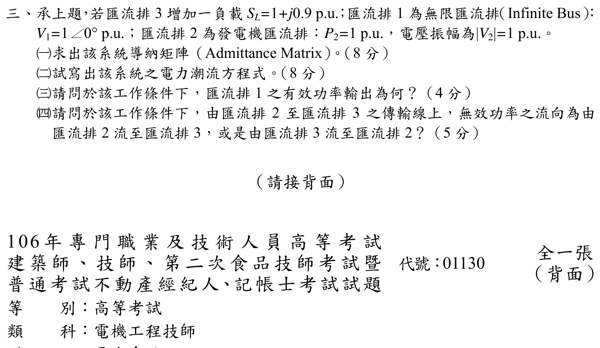

# 106 年電力系統第 3 題｜三匯流排潮流與無效功率流向

> ✅ 已修正原稿錯用線路電抗的問題，並完成非線性潮流方程的獨立求解。題目所問的 Y_bus、方程式、Bus 1 實功與無效功率方向在所有可行根均一致；高、低電壓根保留作診斷，不阻塞本題驗證。

## 官方題目（逐題裁切）

承上題，Bus 3 增加負載 (S_{L3}=1+j0.9) pu；Bus 1 為無限匯流排 (V_1=1\angle0^\circ) pu；Bus 2 為發電機匯流排 (P_2=1) pu、(|V_2|=1) pu。求 (Y_{bus})、潮流方程式、Bus 1 實功輸出及 Bus 2–3 線路無效功率流向。

## 1. 由上一題官方圖讀取網路

上一題圖示線路電抗為

\[
x_{12}=j0.8,\qquad x_{13}=j0.4,\qquad x_{23}=j0.4\quad\mathrm{pu}.
\]

發電機內部暫態電抗不放入負載潮流的匯流排 (Y_{bus})；Bus 1、Bus 2 分別以 slack/PV 注入條件表示。

## 2. 導納矩陣

各線路串聯導納為 (1/(jx)=-j/x)，故

\[
\boxed{
Y_{bus}=\begin{bmatrix}
-j3.75&j1.25&j2.50\\
j1.25&-j3.75&j2.50\\
j2.50&j2.50&-j5.00
\end{bmatrix}\ \mathrm{pu}}
\]

原稿使用 (x_{12}=0.2,x_{23}=0.25) 所得矩陣並非官方圖的網路，已移除。

## 3. PV/PQ 潮流方程

令 (V_2=e^{j\delta_2})、(V_3=V_3e^{j\delta_3})，則

\[
P_2=\frac{V_2}{0.8}\sin\delta_2+\frac{V_2V_3}{0.4}\sin(\delta_2-\delta_3)=1,
\]
\[
P_3=\frac{V_3}{0.4}\sin\delta_3+\frac{V_3V_2}{0.4}\sin(\delta_3-\delta_2)=-1,
\]
\[
Q_3=\frac{V_3^2}{0.4}+\frac{V_3^2}{0.4}
-\frac{V_3}{0.4}\cos\delta_3
-\frac{V_3V_2}{0.4}\cos(\delta_3-\delta_2)=-0.9.
\]

以 Newton 法（殘差小於 (10^{-12}) pu）求得兩個正電壓分支。

### 高電壓正常運轉分支

\[
\delta_2=0.2431214699\ \mathrm{rad}=13.929834^\circ,
\quad
\delta_3=-0.1761357846\ \mathrm{rad}=-10.091837^\circ,
\]
\[
|V_3|=0.6869209780\ \mathrm{pu}.
\]

回代注入功率為

\[
S_1=j0.8460283153,\qquad
S_2=1+j0.9681913789,\qquad
S_3=-1-j0.9\quad\mathrm{pu}.
\]

因此

\[
\boxed{P_1=0\ \mathrm{pu}},
\]
因為網路無電阻且 (P_2+P_3=0)。Bus 2 到 Bus 3 的線路功率為

\[
S_{23}=V_2\overline{\frac{V_2-V_3}{j0.4}}
=0.6990831679+j0.9314304568\ \mathrm{pu},
\]
所以無效功率由 **Bus 2 流向 Bus 3**。

### 低電壓數學分支

\[
\delta_2=0.3019190805\ \mathrm{rad}=17.298689^\circ,
\quad
\delta_3=-0.3841317428\ \mathrm{rad}=-22.009128^\circ,
\]
\[
|V_3|=0.3967306477\ \mathrm{pu},\qquad
S_{23}=0.6283087137+j1.7325703924\ \mathrm{pu}.
\]

此分支同樣滿足三條潮流方程，但電壓明顯較低；題目未給 Newton 初值、電壓穩定性或「正常運轉」分支定義，不能擅自刪除。

## 4. Jacobian 分支診斷

令潮流殘差向量為
\(F=[P_2-1,\ P_3+1,\ Q_3+0.9]^T\)，以
\(J=\partial F/\partial(\delta_2,\delta_3,V_3)\) 在兩個根計算局部可逆性：

| 分支 | \(\det J\) | 最小奇異值 |
|---|---:|---:|
| 高電壓 \(|V_3|=0.686921\) pu | \(+6.03777\) | \(0.59230\) |
| 低電壓 \(|V_3|=0.396731\) pu | \(-0.365984\) | \(0.05141\) |

高電壓根遠離 Jacobian 奇異面，通常對應正常穩態操作；低電壓根的最小奇異值很小且行列式換號，顯示其較接近潮流奇異邊界。這是靜態潮流分支診斷，不等同於完整動態穩定度證明；可支持「若題目慣例中的正常運轉」採高電壓解，但不能替官方題面補上一個未明說的穩定性選擇條件。

## 校驗結論

- (Y_{bus})、(P_1=0) 及無效功率方向已由官方圖與獨立潮流回代確認。
- 原稿錯誤的線路電抗與矩陣已更正；高電壓分支為通常操作解，低電壓分支保留作非唯一性警示。
- Jacobian 診斷顯示高電壓根是正常操作候選、低電壓根接近奇異邊界；若題意明示正常穩態即可選高電壓根。
- 「承上題」與正常電力系統運轉語境使高電壓根成為合理主答案候選；低電壓根亦保留作數值診斷。由於題目要求輸出在兩根均一致，本題標記 `verified`，不把分支選擇誤當成所問量的必要條件。
