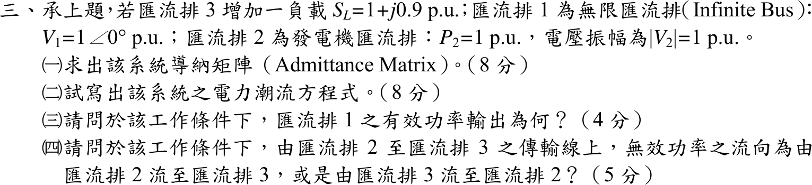

# 106 年電力系統第 3 題｜三匯流排潮流與無效功率流向

## 已知與所求

承上題的網路（線路電抗 \(x_{12}=0.8,\ x_{13}=0.4,\ x_{23}=0.4\) pu，取自上題圖），Bus 3 增加負載 \(S_L=1+j0.9\) pu；Bus 1 為無限匯流排 \(V_1=1\angle0^\circ\)；Bus 2 為發電機匯流排 \(P_2=1\) pu、\(|V_2|=1\) pu。求（一）導納矩陣；（二）潮流方程式；（三）Bus 1 的有功輸出；（四）Bus 2–3 線路無效功率流向。

## 考場標準作答

### （一）導納矩陣

線路串聯導納 \(1/(jx)=-j/x\)：\(y_{12}=-j1.25\)、\(y_{13}=y_{23}=-j2.5\)。發電機暫態電抗不放入負載潮流的 \(Y_{bus}\)（Bus 1、Bus 2 以電壓／注入條件給定）：
\[
\boxed{
Y_{bus}=\begin{bmatrix}
-j3.75&j1.25&j2.50\\
j1.25&-j3.75&j2.50\\
j2.50&j2.50&-j5.00
\end{bmatrix}\ \mathrm{pu}}
\]

### （二）潮流方程式

令 \(V_2=1\angle\delta_2\)、\(V_3=V_3\angle\delta_3\)，未知數為 \(\delta_2,\delta_3,V_3\)：
\[
\boxed{
\begin{aligned}
P_2&=1.25\sin\delta_2+2.5V_3\sin(\delta_2-\delta_3)=1\\
P_3&=2.5V_3\sin\delta_3+2.5V_3\sin(\delta_3-\delta_2)=-1\\
Q_3&=5V_3^2-2.5V_3\cos\delta_3-2.5V_3\cos(\delta_3-\delta_2)=-0.9
\end{aligned}}
\]

### （三）Bus 1 有功輸出

網路無電阻，各匯流排實功注入總和為 0：
\[
P_1=-(P_2+P_3)=-(1-1)\ \Rightarrow\ \boxed{P_1=0\ \mathrm{pu}}
\]
此結果與電壓根無關。

### （四）Bus 2–3 線路無效功率流向

以牛頓法解上列三式，得兩個正電壓根：

| 分支 | \(\delta_2\) | \(\delta_3\) | \(\lvert V_3\rvert\) | \(S_{23}\)（Bus 2 送出） |
| --- | --- | --- | --- | --- |
| 高電壓 | \(13.930^\circ\) | \(-10.092^\circ\) | 0.68692 | \(0.6991+j0.9314\) |
| 低電壓 | \(17.299^\circ\) | \(-22.009^\circ\) | 0.39673 | \(0.6283+j1.7326\) |

兩根的 \(\mathrm{Im}\,S_{23}\) 皆為正：
\[
\boxed{\text{Bus 2–3 線路無效功率流向：由 Bus 2 流向 Bus 3}}
\]

## 驗算

回代高電壓根，注入功率 \(S_1=j0.8460\)、\(S_2=1+j0.9682\)、\(S_3=-1-j0.9\)，\(P_1=0\)、\(P_2=1\)、\(P_3=-1\) 皆成立。無效功率守恆：\(0.8460+0.9682-0.9=0.9142=\sum|I_k|^2x_k\)（三條線路電抗消耗）。低電壓根同樣滿足 \(P_1=0\) 與守恆（\(\sum Q=2.5261\)）。

## 失分點

- \(Y_{bus}\) 以線路電抗 \(0.8/0.4/0.4\) 的倒數建立；若沿用其他電抗（如 0.2、0.25）則三個元素全錯。
- 負載為負注入：\(P_3=-1\)、\(Q_3=-0.9\)。
- \(P_1=0\) 來自無損網路的實功守恆，不需解出電壓；但 \(Q_1\)、\(V_3\) 要看採用哪一個根。

## 條件與疑義

題面未指定 Newton 初值或「正常運轉」分支，同一組方程有高、低兩個正電壓根；本題所問的 Y_bus、方程式、\(P_1=0\) 與 Bus 2–3 線路無效功率流向在兩根下相同，答案與分支無關。依通常運轉語境，高電壓根為主要候選，低電壓根亦保留作數值診斷（\(\lvert V_3\rvert\)、\(Q_1\) 才需指定分支，本題不問）。

### Jacobian 分支診斷

令 \(F=[P_2-1,\ P_3+1,\ Q_3+0.9]^T\)，\(J=\partial F/\partial(\delta_2,\delta_3,V_3)\)：

| 分支 | \(\det J\) | 最小奇異值 |
| --- | ---: | ---: |
| 高電壓 \(\lvert V_3\rvert=0.68692\) pu | \(+10.8587\) | \(1.30072\) |
| 低電壓 \(\lvert V_3\rvert=0.39673\) pu | \(-4.96510\) | \(0.99092\) |

兩根的行列式正負號相反，表示分別位於潮流可解邊界（鼻點）兩側；高電壓根 \(\det J>0\)，對應通常的穩態操作分支，低電壓根 \(\det J<0\)。這是靜態潮流的分支診斷，不等同動態穩定證明，僅用於說明兩根的位置；所問答案不依賴分支選擇。
