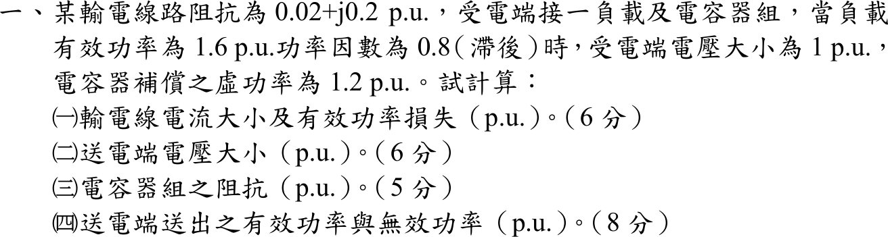

# 107 年電力系統第 1 題｜輸電線並聯電容補償

## 已知與所求

線路阻抗 \(0.02+j0.2\) pu；受電端負載 \(P=1.6\) pu、功因 0.8 落後，受電端電壓 \(|V_R|=1\) pu，電容器組補償虛功 \(Q_C=1.2\) pu（與負載並聯於受電端）。求（一）線路電流與有功損失；（二）送電端電壓；（三）電容器組阻抗；（四）送電端送出之 \(P\)、\(Q\)。

## 考場標準作答

負載 \(Q_L=1.6\tan(\cos^{-1}0.8)=1.2\) pu，故線路受電端淨功率 \(S_R=1.6+j(1.2-1.2)=1.6\) pu。取 \(V_R=1\angle0^\circ\)。

### （一）線路電流與損失

\[
I=\Big(\frac{S_R}{V_R}\Big)^*=1.6\angle0^\circ,\qquad \boxed{|I|=1.6\ \mathrm{pu}}
\]
\[
\boxed{P_{loss}=I^2R=1.6^2(0.02)=0.0512\ \mathrm{pu}}
\]

### （二）送電端電壓

\[
V_S=V_R+IZ=1+1.6(0.02+j0.2)=1.032+j0.32=1.0805\angle17.23^\circ,\qquad \boxed{|V_S|=1.0805\ \mathrm{pu}}
\]

### （三）電容器組阻抗

\[
Z_C=\frac{|V_R|^2}{(-jQ_C)^*}=\frac{1}{j1.2}=\boxed{-j0.8333\ \mathrm{pu}}
\]

### （四）送電端功率

\[
S_S=V_SI^*=(1.032+j0.32)(1.6)=1.6512+j0.5120
\]
\[
\boxed{P_S=1.6512\ \mathrm{pu}},\qquad \boxed{Q_S=0.5120\ \mathrm{pu}\ (\text{送出，感性})}
\]

## 驗算

功率守恆：\(S_S=S_{load}+S_C+I^2Z=(1.6+j1.2)+(-j1.2)+(0.0512+j0.512)\)，實部 \(1.6512\)、虛部 \(0.512\)，與 \(V_SI^*\) 相同。線路無效功率消耗 \(I^2X=2.56(0.2)=0.512\) pu，即 \(Q_S\) 全部消耗在線路電抗上。

## 失分點

- 電容器與負載並聯在受電端，線路電流看到的是淨功率 \(1.6+j0\)，不是 \(1.6+j1.2\)；用負載視在功率 2.0 pu 算電流會得 \(I=2\)、損失 0.08。
- \(Z_C=-jV_R^2/Q_C\) 為容抗（負虛數）；寫成 \(+j0.8333\) 即成電感。
- 送電端電壓用 \(V_R+IZ\) 的複數和再取模，不能只加 \(IR\)。
