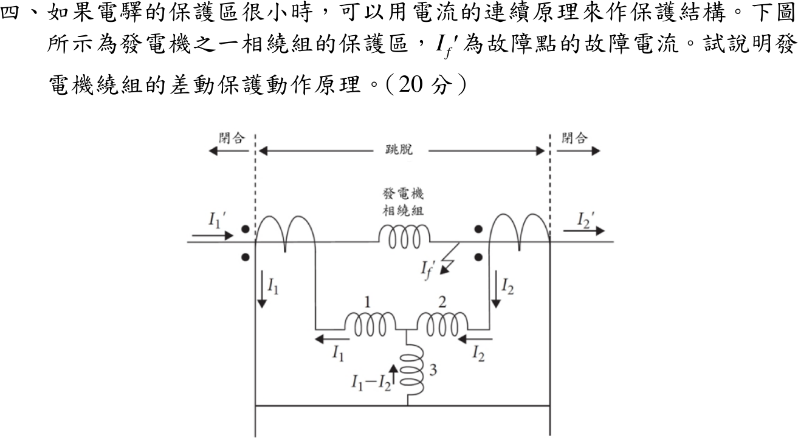

# 108 年電力系統第 4 題｜發電機繞組差動電驛保護

## 已知與所求

保護區很小時可用電流連續原理（KCL）構成保護。圖中發電機一相繞組兩端各接一具 CT；\(I_1',I_2'\) 為繞組兩端的一次電流，\(I_1,I_2\) 為 CT 二次電流，線圈 1、2 為抑制線圈，線圈 3 為動作線圈，流過 \(I_1-I_2\)；\(I_f'\) 為保護區內的故障電流。虛線之間為「跳脫」區，兩側為「閉合」（不動作）區。說明發電機繞組差動保護的動作原理。

## 考場標準作答

### 1. 保護區與接線

兩具 CT 的位置劃定保護區（兩虛線之間）。二次側依極性接成環流式：兩側電流在抑制線圈 1、2 中同向流通，動作線圈 3 接在其中點，流過兩者之差 \(I_1-I_2\)。

### 2. 正常運轉與區外故障（不動作）

保護區內無故障時，流入繞組的電流等於流出的電流，\(I_1'=I_2'\)，經同比 CT 後
\[
I_1=I_2\ \Rightarrow\ I_{op}=I_1-I_2=0
\]
動作線圈無電流；區外故障雖有大穿越電流，兩端電流仍相等，抑制線圈 1、2 產生穩定的抑制力矩，電驛不動作，斷路器維持閉合。

### 3. 區內故障（跳脫）

故障點在兩 CT 之間，KCL 給出 \(I_1'=I_2'+I_f'\)，兩端電流不再相等（單側饋入時 \(I_2'=0\)，雙側饋入時 \(I_2'\) 反向）：
\[
I_{op}=I_1-I_2\propto I_f'\neq0
\]
差流流過動作線圈 3，產生動作力矩；超過抑制力矩時電驛動作，跳脫發電機兩側斷路器並滅磁。

### 4. 動作判據

為容許 CT 比差、飽和誤差，採百分比差動特性（\(K\) 為斜率設定，另可加最小動作電流）：
\[
\boxed{|I_1-I_2|>K\,\frac{|I_1|+|I_2|}{2}}
\]
左側為動作量，右側為抑制量；穿越電流愈大，抑制量愈大。

## 驗算

用假設數值（非題目所給）檢查判據，取 \(K=0.2\)：

| 狀況 | \(I_1\) | \(I_2\) | 動作量 | 抑制量 | 比值 | 結果 |
| --- | --- | --- | --- | --- | --- | --- |
| 區外故障，CT 理想 | 10 | 10 | 0 | 10 | 0 | 不動作 |
| 區外故障，CT 差 5% | 10 | 9.5 | 0.5 | 9.75 | 0.051 | 不動作 |
| 區內故障，單側饋入 | 10 | 0 | 10 | 5 | 2.0 | 動作 |
| 區內故障，雙側饋入 | 6 | \(-4\) | 10 | 5 | 2.0 | 動作 |

各情況與 KCL 預測一致（區內動作量即為 \(I_f'\) 折算值）。

## 失分點

- 差動保護比較的是兩端電流之「差」，不是電流大小：區外大穿越電流下 \(I_1=I_2\)，動作量為 0，不會誤跳。
- 線圈 3（動作）接在中點流 \(I_1-I_2\)，線圈 1、2 為抑制；功能不可對調，也要說明 CT 極性使穿越電流在動作線圈中抵消。
- 題目沒有給 CT 變比、斜率或整定值，不可編造數值門檻；判據只寫符號式。
