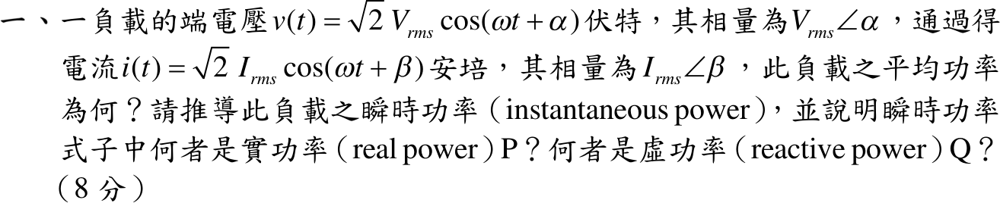

# 109 年電力系統第 1 題｜瞬時功率與實功／虛功

## 考場標準作答

\(v=\sqrt2V\cos(\omega t+\alpha)\)、\(i=\sqrt2I\cos(\omega t+\beta)\)（\(V,I\) 為有效值），令 \(\theta=\alpha-\beta\)。積化和差：
\[
p(t)=vi=VI\cos\theta+VI\cos(2\omega t+\alpha+\beta)
\]
將 \(2\omega t+\alpha+\beta=2(\omega t+\alpha)-\theta\) 展開：
\[
\boxed{p(t)=\underbrace{VI\cos\theta}_{P}\,[1+\cos2(\omega t+\alpha)]+\underbrace{VI\sin\theta}_{Q}\,\sin2(\omega t+\alpha)}
\]
雙倍頻項一週期平均為零，故平均功率
\[
\boxed{P=\frac1T\int_0^Tp\,dt=V_{rms}I_{rms}\cos(\alpha-\beta)\ \mathrm W}
\]
- 第一項 \(P[1+\cos2(\omega t+\alpha)]\) 恆不為負，平均值為 \(P\)：**實功率**，負載淨吸收的能量速率。
- 第二項 \(Q\sin2(\omega t+\alpha)\) 平均為零，其振幅 \(\boxed{Q=V_{rms}I_{rms}\sin(\alpha-\beta)\ \mathrm{var}}\)：**虛功率**，電源與 L／C 儲能間往返交換。

## 驗算

複功率 \(S=\mathbf V\mathbf I^*=VI\angle(\alpha-\beta)=VI\cos\theta+jVI\sin\theta\)，實部、虛部恰為上式 \(P\)、\(Q\)；\(\theta>0\)（電流落後）時 \(Q>0\)，負載吸收虛功。
