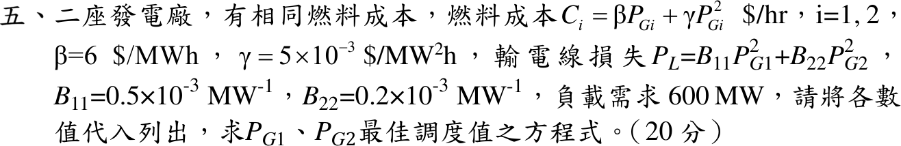

# 109 年電力系統第 5 題｜含輸電損失的經濟調度

## 已知與所求

\(C_i=\beta P_{Gi}+\gamma P_{Gi}^2\)（\(\$/\mathrm h\)），\(\beta=6\ \$/\mathrm{MWh}\)、\(\gamma=5\times10^{-3}\ \$/\mathrm{MW^2h}\)；\(P_L=B_{11}P_{G1}^2+B_{22}P_{G2}^2\)，\(B_{11}=0.5\times10^{-3}\)、\(B_{22}=0.2\times10^{-3}\ \mathrm{MW^{-1}}\)；\(P_D=600\) MW。代入數值列出求 \(P_{G1}\)、\(P_{G2}\) 最佳調度的方程式。

## 考場標準作答

拉格朗日函數 \(\mathcal L=C_1+C_2+\lambda(P_D+P_L-P_{G1}-P_{G2})\)，\(\partial\mathcal L/\partial P_{Gi}=0\)：
\[
\frac{dC_i}{dP_{Gi}}=\lambda\Big(1-\frac{\partial P_L}{\partial P_{Gi}}\Big),\qquad
\frac{dC_i}{dP_{Gi}}=6+0.01P_{Gi},\quad
\frac{\partial P_L}{\partial P_{G1}}=0.001P_{G1},\quad
\frac{\partial P_L}{\partial P_{G2}}=0.0004P_{G2}
\]
協調方程與功率平衡：
\[
\boxed{\frac{6+0.01P_{G1}}{1-0.001P_{G1}}=\frac{6+0.01P_{G2}}{1-0.0004P_{G2}}=\lambda}
\]
\[
\boxed{P_{G1}+P_{G2}=600+0.0005P_{G1}^2+0.0002P_{G2}^2\ \ (\mathrm{MW})}
\]
解出：由協調式 \(P_{G1}=\dfrac{\lambda-6}{0.01+0.001\lambda}\)、\(P_{G2}=\dfrac{\lambda-6}{0.01+0.0004\lambda}\)，代入功率平衡對 \(\lambda\) 疊代：
\[
\boxed{\lambda=11.888\ \$/\mathrm{MWh},\quad P_{G1}=269.00\ \mathrm{MW},\quad P_{G2}=399.03\ \mathrm{MW}}
\]
（\(P_L=68.02\) MW。）

## 驗算

以未四捨五入值驗證：\(P_{G1}=268.9957\)、\(P_{G2}=399.0284\) 時兩懲罰因數為 \(L_1=1/(1-0.26900)=1.36798\)、\(L_2=1/(1-0.15961)=1.18992\)，\(L_1(8.6900)=L_2(9.9903)=11.8877\)；功率平衡 \(668.0241=600+36.1793+31.8447\)。表列兩位小數時兩側會差 0.01 MW，屬獨立四捨五入誤差。

## 失分點

- 協調式是 \(IC_i/(1-\partial P_L/\partial P_{Gi})\)；寫成 \(IC_i(1-\partial P_L/\partial P_{Gi})=\lambda\) 會使損失大的機組反而多發電。
- \(\partial P_L/\partial P_{G1}=2B_{11}P_{G1}=0.001P_{G1}\)，漏乘 2 是常見錯誤。
- 功率平衡要含 \(P_L\)；只寫 \(P_{G1}+P_{G2}=600\) 為無損調度。
