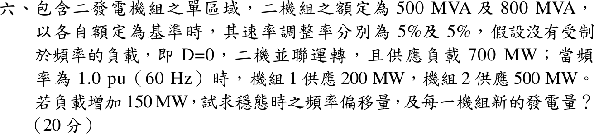

# 109 年電力系統第 6 題｜負載頻率控制與穩態頻率偏差

## 已知與所求

單區域兩機組 500 MVA、800 MVA，各以自身額定為基準的速率調整率 \(R=5\%\)；\(D=0\)；60 Hz 時機組 1 供 200 MW、機組 2 供 500 MW（共 700 MW）。負載增加 150 MW，求穩態頻率偏移及兩機組新發電量。

## 考場標準作答

各機組頻率響應（MW/Hz）\(\beta_i=S_i/(R_if_0)\)：
\[
\beta_1=\frac{500}{0.05(60)}=166.67,\qquad \beta_2=\frac{800}{0.05(60)}=266.67,\qquad \beta=\beta_1+\beta_2+D=433.33\ \mathrm{MW/Hz}
\]
\[
\boxed{\Delta f=-\frac{\Delta P_L}{\beta}=-\frac{150}{433.33}=-0.3462\ \mathrm{Hz}\ \ (f=59.654\ \mathrm{Hz})}
\]
\[
\Delta P_1=-\beta_1\Delta f=57.69\ \mathrm{MW},\qquad \Delta P_2=-\beta_2\Delta f=92.31\ \mathrm{MW}
\]
\[
\boxed{P_1=200+57.69=257.69\ \mathrm{MW}},\qquad \boxed{P_2=500+92.31=592.31\ \mathrm{MW}}
\]

## 驗算

改用 1000 MVA 共同基準：\(R_1=0.05(1000/500)=0.1\)、\(R_2=0.05(1000/800)=0.0625\) pu，\(\Delta f=-0.15/(10+16)=-0.0057692\) pu \(=-0.3462\) Hz，相同。兩機增量比 \(57.69:92.31=500:800\)（同 \(R\) 時依額定容量分攤），且 \(257.69+592.31=850=700+150\) MW。

## 失分點

- \(R=5\%\) 是以各自額定為基準，須先換成 MW/Hz（或同一基準）再相加，不能直接把兩個 0.05 並聯。
- 負載增加使頻率下降，\(\Delta f\) 為負；兩機出力依容量比分攤，不是依原出力 200:500。
