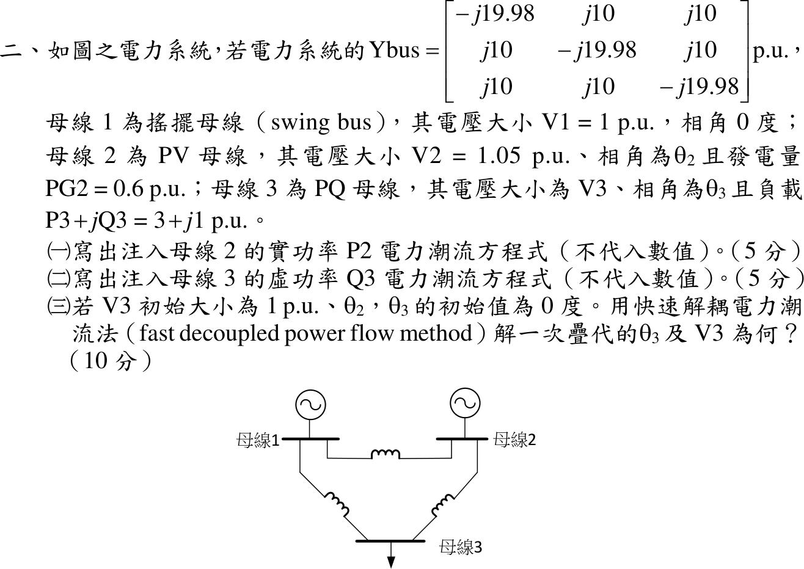

# 110 年電力系統第 2 題｜三匯流排快速解耦電力潮流

## 已知與所求

\(Y_{bus}\)：對角 \(-j19.98\)、非對角 \(j10\) pu（\(G=0\)，\(B_{ii}=-19.98\)、\(B_{ik}=10\)）。母線 1 搖擺 \(1\angle0^\circ\)；母線 2 PV，\(|V_2|=1.05\)、\(P_{G2}=0.6\)；母線 3 PQ，負載 \(3+j1\) pu。求（一）\(P_2\) 潮流方程；（二）\(Q_3\) 潮流方程（皆不代數值）；（三）\(V_3=1\)、\(\theta_2=\theta_3=0\) 起始，快速解耦法一次疊代的 \(\theta_3\)、\(V_3\)。

## 考場標準作答

令 \(Y_{ik}=|Y_{ik}|\angle\gamma_{ik}=G_{ik}+jB_{ik}\)。

### （一）\(P_2\)

\[
\boxed{P_2=\sum_{k=1}^{3}|V_2||V_k||Y_{2k}|\cos(\gamma_{2k}-\theta_2+\theta_k)=|V_2|\sum_{k=1}^{3}|V_k|\big[G_{2k}\cos\theta_{2k}+B_{2k}\sin\theta_{2k}\big]}
\]
（\(\theta_{2k}=\theta_2-\theta_k\)；本題 \(G=0\)，即 \(P_2=|V_2||V_1|B_{21}\sin\theta_{21}+|V_2||V_3|B_{23}\sin\theta_{23}\)。）

### （二）\(Q_3\)

\[
\boxed{Q_3=-\sum_{k=1}^{3}|V_3||V_k||Y_{3k}|\sin(\gamma_{3k}-\theta_3+\theta_k)=|V_3|\sum_{k=1}^{3}|V_k|\big[G_{3k}\sin\theta_{3k}-B_{3k}\cos\theta_{3k}\big]}
\]
（本題即 \(Q_3=-|V_3||V_1|B_{31}\cos\theta_{31}-|V_3||V_2|B_{32}\cos\theta_{32}-|V_3|^2B_{33}\)。）

### （三）快速解耦一次疊代

平坦起始的計算值：\(P_2=P_3=0\)；\(Q_3=-(10\cdot1+10\cdot1.05-19.98\cdot1)=-0.52\)。不平衡量：
\[
\Delta P_2=0.6,\quad \Delta P_3=-3,\quad \Delta Q_3=-1-(-0.52)=-0.48
\]
\(B'=-\mathrm{Im}\,Y\)（去搖擺母線）、\(B''=-B_{33}\)，解 \(\Delta P/|V|=B'\Delta\theta\)、\(\Delta Q/|V|=B''\Delta|V|\)：
\[
\begin{bmatrix}19.98&-10\\-10&19.98\end{bmatrix}
\begin{bmatrix}\Delta\theta_2\\\Delta\theta_3\end{bmatrix}=
\begin{bmatrix}0.6/1.05\\-3/1\end{bmatrix}
\Rightarrow
\Delta\theta_2=\frac{19.98(0.57143)-30}{299.2}=-0.06211,\quad
\Delta\theta_3=\frac{5.7143-59.94}{299.2}=-0.18123\ \mathrm{rad}
\]
\[
\boxed{\theta_3^{(1)}=-0.18123\ \mathrm{rad}=-10.38^\circ}
\]
\[
\Delta|V_3|=\frac{-0.48/1}{19.98}=-0.02402,\qquad \boxed{|V_3|^{(1)}=0.9760\ \mathrm{pu}}
\]

## 驗算

回代 \(B'\)：\(19.98(-0.06211)-10(-0.18123)=0.5714\)、\(-10(-0.06211)+19.98(-0.18123)=-3.000\)，與右側一致。另以完整 Newton–Raphson 從同一起點走一步得 \(\theta_3=-10.14^\circ\)、\(|V_3|=0.9753\)，與解耦結果差 \(0.24^\circ\)、\(0.0007\) pu，屬解耦近似的合理差距。

## 失分點

- \(Q_3\) 的計算值含自導納項 \(-|V_3|^2B_{33}=+19.98\)，漏掉會得 \(\Delta Q_3=-1+20.5\) 而方向全錯。
- \(B'\) 的符號：\(\Delta P/|V|=-B\Delta\theta\)，取 \(-\mathrm{Im}\,Y\) 為正定矩陣；直接用 \(\mathrm{Im}\,Y\) 會使 \(\theta_3\) 變號。
- 母線 2 為 PV，不列 \(\Delta Q_2\) 方程，\(B''\) 只剩 \(1\times1\) 的 \(19.98\)。
