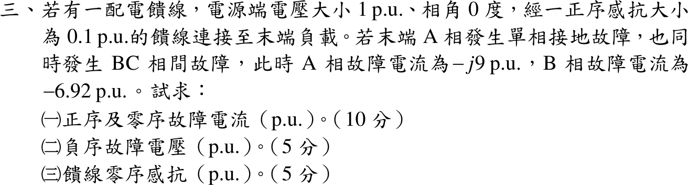

# 110 年電力系統第 3 題｜同時故障對稱成分分析

## 已知與所求

電源 \(1\angle0^\circ\) pu，經正序感抗 \(X_1=0.1\) pu 的饋線接末端負載。末端 A 相接地，同時 BC 相間故障；\(I_a=-j9\)、\(I_b=-6.92\) pu。求（一）正序、零序故障電流；（二）負序故障電壓；（三）饋線零序感抗。題目未給負序感抗。

## 考場標準作答

故障邊界：A 相接地 \(V_a=0\)；BC 金屬相間短路（不接地）\(V_b=V_c\)、\(I_b+I_c=0\Rightarrow I_c=+6.92\) pu。

### （一）正序與零序電流

\(a=1\angle120^\circ\)，\(a-a^2=j\sqrt3\)：
\[
\boxed{I_{a0}=\frac{I_a+I_b+I_c}{3}=\frac{-j9}{3}=-j3.00\ \mathrm{pu}}
\]
\[
\boxed{I_{a1}=\frac{I_a+aI_b+a^2I_c}{3}=\frac{-j9-j6.92\sqrt3}{3}=-j6.995\ \mathrm{pu}\approx-j7\ \mathrm{pu}}
\]
（負序 \(I_{a2}=\dfrac{-j9+j6.92\sqrt3}{3}=+j0.995\) pu，供後兩小題使用。）

### （二）負序故障電壓

\(V_b-V_c=(a^2-a)(V_{a1}-V_{a2})=0\Rightarrow V_{a2}=V_{a1}\)。正序網路：
\[
V_{a1}=E-jX_1I_{a1}=1-(j0.1)(-j6.995)=0.3005\ \mathrm{pu}
\]
\[
\boxed{V_{a2}=V_{a1}=0.3005\ \mathrm{pu}\approx0.30\ \mathrm{pu}}
\]

### （三）饋線零序感抗

\(V_a=V_{a0}+V_{a1}+V_{a2}=0\Rightarrow V_{a0}=-2(0.3005)=-0.6009\) pu。零序網路 \(V_{a0}=-jX_0I_{a0}=-jX_0(-j3)=-3X_0\)：
\[
\boxed{X_0=\frac{0.6009}{3}=0.2003\ \mathrm{pu}\approx0.20\ \mathrm{pu}}
\]

## 驗算

以 \(V_{012}=(-0.6009,\,0.3005,\,0.3005)\)、\(I_{012}=(-j3,\,-j6.995,\,j0.995)\) 反轉換回相量：\(V_a=0\)、\(V_b=V_c=V_{a0}+(a^2+a)V_{a1}=-0.6009-0.3005=-0.901\) pu、\(I_a=-j9\)、\(I_b=-6.92=-I_c\)，三個故障條件全部成立。隱含負序阻抗 \(-V_{a2}/I_{a2}=j0.302\) pu，與 \(I_1\approx-j7,\ I_2\approx j1,\ I_0=-j3\) 搭配 \(X_1=0.1,\ X_2\approx0.3,\ X_0\approx0.2\) 的整數設計一致（\(6.92\approx4\sqrt3\)）。

## 失分點

- 漏用 BC 相間短路的電壓條件 \(V_b=V_c\)，另假設 \(X_2=X_1=0.1\) 會得 \(V_{a2}=0.10\)、\(X_0=0.133\)，同時違反 \(V_b=V_c\)。
- BC 故障不接地，\(I_c=-I_b=+6.92\)；若把 \(I_c\) 當未知或取 \(-6.92\)，\(I_0\) 會錯。
- \(a^2-a=-j\sqrt3\) 的符號決定 \(I_{a1}\)、\(I_{a2}\) 哪個大；記反會把正、負序對調。
