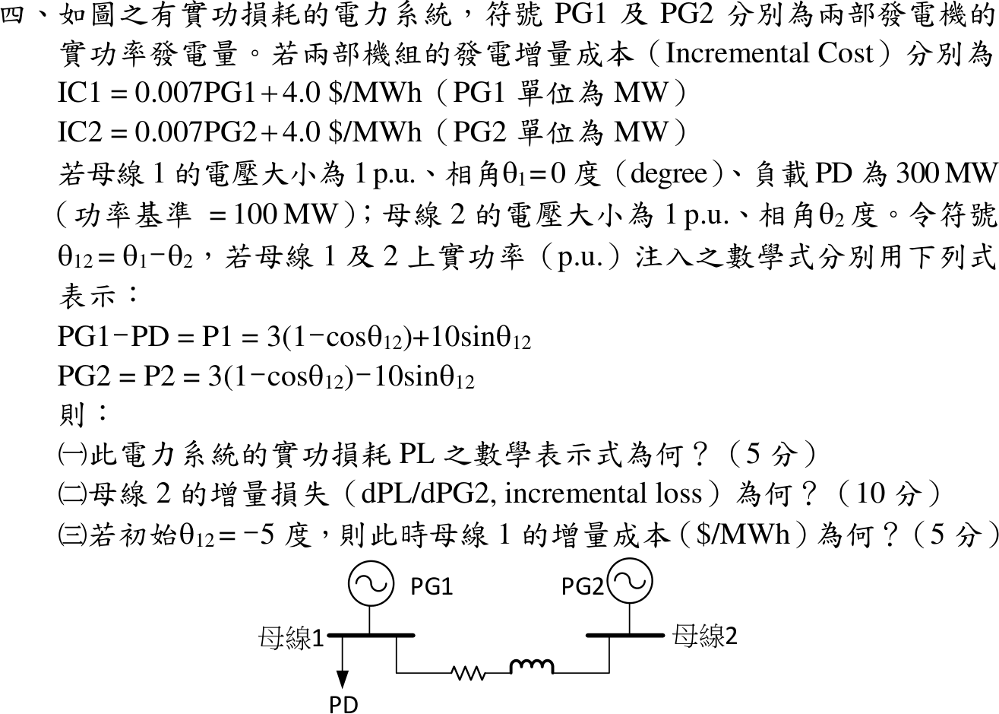

# 110 年電力系統第 4 題｜含線路損耗的經濟調度與增量損失

## 已知與所求

\(IC_1=0.007P_{G1}+4.0\)、\(IC_2=0.007P_{G2}+4.0\)（\(\$/\mathrm{MWh}\)，\(P\) 以 MW 計）。母線 1：\(1\angle0^\circ\)，負載 \(P_D=300\) MW（基準 100 MW）；母線 2：\(1\angle\theta_2\)，\(\theta_{12}=\theta_1-\theta_2\)。
\[
P_{G1}-P_D=P_1=3(1-\cos\theta_{12})+10\sin\theta_{12},\qquad P_{G2}=P_2=3(1-\cos\theta_{12})-10\sin\theta_{12}\ (\mathrm{pu})
\]
求（一）\(P_L\)；（二）\(dP_L/dP_{G2}\)；（三）\(\theta_{12}=-5^\circ\) 時母線 1 的增量成本。

## 考場標準作答

### （一）實功損耗

損耗等於兩母線注入功率之和：
\[
\boxed{P_L=P_1+P_2=6(1-\cos\theta_{12})\ \mathrm{pu}}
\]

### （二）母線 2 增量損失

母線 1 為參考（搖擺）母線，\(P_{G2}\) 只經 \(\theta_{12}\) 改變 \(P_L\)，鏈鎖律：
\[
\boxed{\frac{dP_L}{dP_{G2}}=\frac{dP_L/d\theta_{12}}{dP_2/d\theta_{12}}=\frac{6\sin\theta_{12}}{3\sin\theta_{12}-10\cos\theta_{12}}}
\]
（\(\theta_{12}=-5^\circ\) 時為 \(\dfrac{-0.52293}{-0.26147-9.96195}=0.05115\)。）

### （三）母線 1 增量成本

\[
P_1=3(1-\cos5^\circ)+10\sin(-5^\circ)=0.011416-0.871557=-0.86014\ \mathrm{pu}
\]
\[
P_{G1}=P_D+P_1=3-0.86014=2.13986\ \mathrm{pu}=213.99\ \mathrm{MW}
\]
\[
\boxed{IC_1=0.007(213.99)+4.0=5.498\ \$/\mathrm{MWh}}
\]

## 驗算

數值微分：\(\theta_{12}=-5^\circ\pm10^{-6}\) rad 時 \(\Delta P_L/\Delta P_{G2}=0.05115\)，與（二）解析值相同。功率平衡：\(P_{G2}=0.88297\) pu，\(P_{G1}+P_{G2}=2.13986+0.88297=3.02283=P_D+P_L\)，而 \(P_L=6(1-\cos5^\circ)=0.02283\) pu。

## 失分點

- \(P_L\) 是 \(P_1+P_2\)（注入功率和），不是 \(P_{G1}+P_{G2}\)；後者還含 300 MW 負載。
- 增量損失要對 \(P_{G2}\) 微分，須除以 \(dP_2/d\theta_{12}\)；只寫 \(dP_L/d\theta_{12}=6\sin\theta_{12}\) 單位不對。
- \(P_1\) 已扣除負載，\(P_{G1}=P_D+P_1\)；直接用 \(P_1\) 換 MW 會得負出力。
