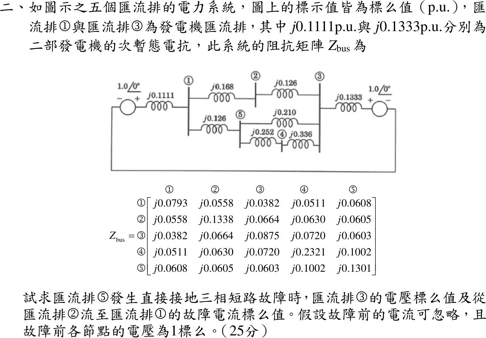

# 111 年第 2 題｜五匯流排三相短路之故障電壓與線路電流

## 已知與所求

五匯流排系統，標示值皆為 pu；匯流排 1、3 經次暫態電抗 \(j0.1111\)、\(j0.1333\) 接 \(1.0\angle0^\circ\) 電源。線路：1–2 \(j0.168\)、2–3 \(j0.126\)、1–5 \(j0.126\)、5–3 \(j0.210\)、5–4 \(j0.252\)、4–3 \(j0.336\)。題給 \(Z_{bus}\) 第 5 行：\(Z_{15}=j0.0608\)、\(Z_{25}=j0.0605\)、\(Z_{35}=j0.0603\)、\(Z_{45}=j0.1002\)、\(Z_{55}=j0.1301\)。故障前電流忽略、各節點 1 pu。匯流排 5 直接接地三相短路，求 \(V_3\) 與由 2 流至 1 的故障電流。

## 考場標準作答

\(Z_f=0\)，故障電流：
\[
I_f=\frac{V_5^{(0)}}{Z_{55}}=\frac{1}{j0.1301}=-j7.6864\ \mathrm{pu}
\]
各匯流排故障後電壓 \(V_i=1-Z_{i5}I_f=1-\dfrac{Z_{i5}}{Z_{55}}\)：
\[
\boxed{V_3=1-\frac{0.0603}{0.1301}=0.53651\angle0^\circ\ \mathrm{pu}}
\]
\[
V_1=1-\frac{0.0608}{0.1301}=0.532667,\qquad V_2=1-\frac{0.0605}{0.1301}=0.534973\ \mathrm{pu}
\]
線路 2→1 電流：
\[
\boxed{I_{2\to1}=\frac{V_2-V_1}{j0.168}=\frac{0.0023059}{j0.168}=-j0.01373\ \mathrm{pu}}
\]

## 驗算

由單線圖自行組 \(Y_{bus}\)（兩發電機電抗接地）再求反矩陣，所得 \(Z_{bus}\) 與題給值在第四位小數內一致，\(V_3\) 差 \(<5\times10^{-4}\)；且匯流排 5 的 KCL：三條線路流入電流之和 \((V_1-V_5)/j0.126+(V_3-V_5)/j0.210+(V_4-V_5)/j0.252=I_f\) 成立（\(V_5=0\)）。

## 失分點

- \(Z_{bus}\) 已含發電機次暫態電抗，故障電流直接用 \(1/Z_{55}\)，不可再串入 \(j0.1111\)、\(j0.1333\)。
- \(V_i=1-Z_{i5}I_f\) 中 \(j\cdot(-j)=+1\)，扣除量為正，誤寫成 \(1+0.4635\) 會得 1.46 pu。
- 方向指定 2→1，用 \(V_2-V_1\)；寫成 \(V_1-V_2\) 符號相反。
